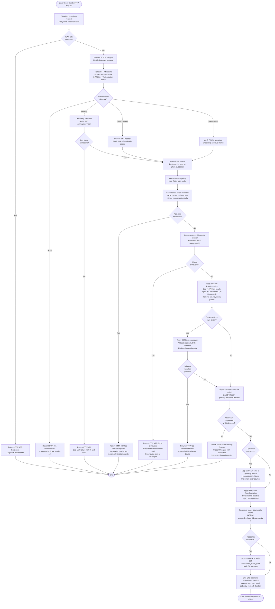
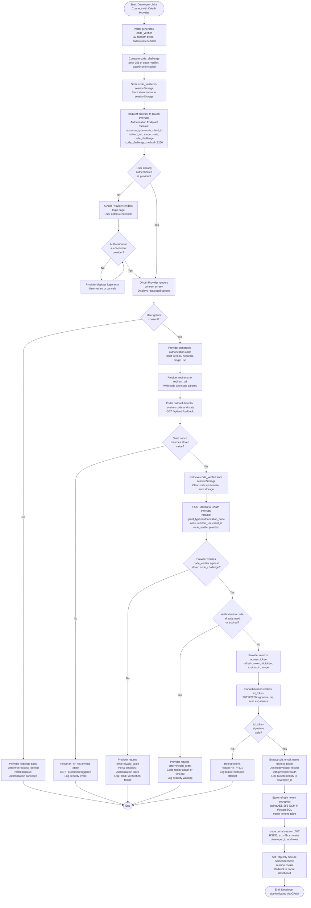
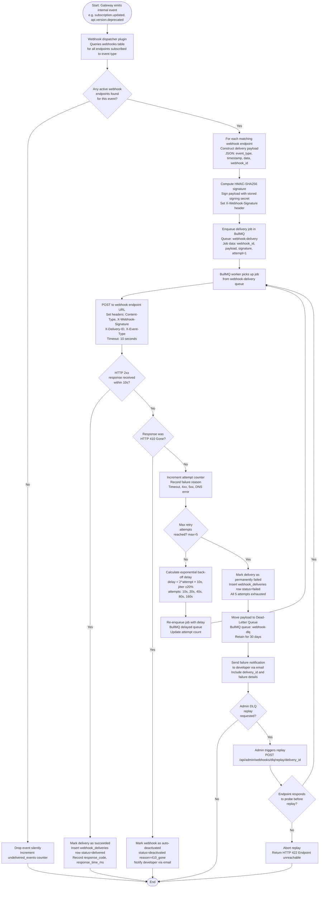
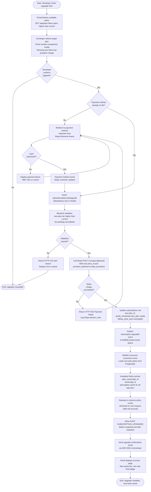

# Activity Diagrams — API Gateway and Developer Portal

## Overview

This document presents five detailed activity diagrams modelling the primary process flows within the API Gateway and Developer Portal system. Each diagram is rendered using Mermaid `flowchart TD` syntax with decision diamonds for conditional branches, parallelism notes where concurrent processing occurs, and explicit error/exception paths. Together these diagrams cover the end-to-end lifecycle of API request processing, developer self-service onboarding, OAuth 2.0 authorization, webhook delivery, and API version deprecation.

The diagrams reference the Node.js 20 / Fastify gateway runtime, the Next.js 14 developer portal, PostgreSQL 15, Redis 7, BullMQ, and AWS infrastructure components (ECS Fargate, CloudFront, WAF, SES, S3). Authentication mechanisms modelled include HMAC-SHA256 API keys, OAuth 2.0 with PKCE, and RS256-signed JWTs.

---

## Activity 1: Inbound API Request Processing

This activity models the complete lifecycle of an HTTP request from the moment it reaches the CloudFront distribution through authentication, rate limiting, quota enforcement, request transformation, upstream routing, response transformation, and telemetry emission.

---

## Activity 2: Developer Registration & API Key Provisioning

This activity models the complete self-service onboarding flow: from portal sign-up through email verification, application creation, plan subscription, and API key generation.

```mermaid
flowchart TD
    A([Start: Developer Opens Registration Page]) --> B[Developer enters name, email\npassword, accepts ToS]
    B --> C{Client-side\nvalidation\npassed?}
    C -- No --> D[Display field-level\nvalidation errors\nHighlight failing fields]
    D --> B
    C -- Yes --> E[POST /api/auth/register\nover TLS to Next.js API route]
    E --> F{Email already\nregistered?}
    F -- Yes --> G[Return HTTP 409\nDisplay: Account already exists\nOffer Sign In link]
    G --> ZZ([End])
    F -- No --> H[Hash password with bcrypt cost=12\nInsert developer row status=pending_verification]
    H --> I[Generate 256-bit HMAC-SHA256\nemail verification token\nStore in Redis EX 86400]
    I --> J[Call AWS SES SendEmail\nDispatch verification link]
    J --> K{SES dispatch\nsucceeded?}
    K -- No --> L[Enqueue retry job in BullMQ\nShow warning: resend link available]
    L --> M[Display: Check your inbox page]
    K -- Yes --> M
    M --> N[Developer clicks verification link\nin email client]
    N --> O[GET /api/auth/verify-email?token=X\nGateway API route handler]
    O --> P{Token found\nin Redis and\nnot expired?}
    P -- No --> Q[Return HTTP 410 Token Expired\nOffer resend verification email]
    Q --> ZZ
    P -- Yes --> R[Update developer status=active\nDelete token from Redis\nRecord email_verified_at timestamp]
    R --> S[Redirect to portal dashboard\nDisplay welcome banner]
    S --> T[Developer clicks New Application\nFills name, description, environment]
    T --> U{Application\nlimit reached\nfor plan?}
    U -- Yes --> V[Return HTTP 403 App Limit Exceeded\nDisplay upgrade prompt]
    V --> ZZ
    U -- No --> W[POST /api/apps\nInsert application row status=active\nWrite AUDIT APP_CREATED]
    W --> X[Developer selects subscription plan\nFree / Pro / Business / Enterprise]
    X --> Y{Paid plan\nselected?}
    Y -- Yes --> Z[Redirect to payment flow\nCollect card via Stripe Elements]
    Z --> AA{Payment\nauthorized?}
    AA -- No --> AB[Display payment failure\nOffer retry or choose free plan]
    AB --> X
    AA -- Yes --> AC[Create Stripe subscription\nInsert subscriptions row status=active]
    Y -- No --> AC
    AC --> AD[Publish subscription.created event\nto BullMQ gateway-config queue]
    AD --> AE[Gateway config consumer\nInvalidates Redis plan cache for app_id]
    AE --> AF[Developer clicks Generate API Key\nSelects key name and expiry optional]
    AF --> AG[POST /api/apps/app_id/keys\nGenerate 32-byte random key\nCompute HMAC-SHA256 hash\nInsert api_keys row]
    AG --> AH[Return plaintext key ONCE in response\nDisplay one-time disclosure modal]
    AH --> AI[Developer copies key to clipboard\nKey stored only as hash in DB henceforth]
    AI --> AJ([End: Developer ready to make API calls])
```

---

## Activity 3: OAuth 2.0 Authorization Code Flow (PKCE)

This activity models the full RFC 7636 Authorization Code + PKCE flow used when a developer connects a third-party OAuth provider or when an External Client authenticates users via the portal's OAuth integration.

---

## Activity 4: Webhook Delivery Pipeline

This activity models the end-to-end webhook delivery pipeline: from event emission in the gateway through BullMQ queuing, delivery attempts, exponential back-off retries, and dead-letter queue handling.

---

## Activity 5: API Version Deprecation Workflow

This activity models the formal process of deprecating an API version: from the API Provider's deprecation request through sunset-period traffic monitoring, developer migration tracking, canary traffic migration, and final version retirement.

```mermaid
flowchart TD
    A([Start: API Provider initiates deprecation\nfor existing API version]) --> B[API Provider opens Admin Console\nNavigates to APIs > Version > Deprecate]
    B --> C[Provider fills deprecation form:\nSunset date minimum 90 days from today\nMigration guide URL\nSuccessor version ID\nReason for deprecation]
    C --> D{Successor\nversion\nexists and\nis active?}
    D -- No --> E[Return error: Successor version required\nbefore deprecation can be initiated]
    E --> B
    D -- Yes --> F{Sunset date\ngreater than\n90 days from today?}
    F -- No --> G[Return error: Minimum 90-day sunset\nperiod not satisfied]
    G --> B
    F -- Yes --> H[Update api_versions row\nstatus=deprecated\ndeprecated_at=NOW\nsunset_at=provided_date]
    H --> I[Add Deprecation headers to all route responses\nDeprecation: date as RFC 7231 timestamp\nSunset: sunset_date as RFC 7231 timestamp\nLink: migration guide URL]
    I --> J[Query subscribers table\nfor all active subscribers\nof deprecated version]
    J --> K[Send initial deprecation notice\nvia AWS SES to all subscribers\nInclude migration guide and sunset date]
    K --> L[Schedule 60-day reminder job\nin BullMQ scheduler queue\nSchedule 30-day final notice job]
    L --> M[Monitor traffic split dashboard\nDeprecated vs successor version]
    M --> N{60-day\nremainder\njob fires?}
    N -- Yes --> O[Send 60-day reminder email\nto subscribers still on deprecated version\nHighlight breaking changes]
    O --> P{30-day\nfinal notice\njob fires?}
    P -- Yes --> Q[Send 30-day final notice\nto remaining subscribers\nInclude escalation contact]
    Q --> R{API Provider\nconfigures canary\nauto-migration?}
    N -- No --> R
    R -- Yes --> S[Enable canary migration policy\nBegin routing 5% of deprecated traffic\nto successor version]
    S --> T{Error rate\non canary\nabove threshold 1%?}
    T -- Yes --> U[Pause canary migration\nAlert API Provider\nRevert to 0% canary split]
    U --> S
    T -- No --> V[Gradually increase canary split\n5% > 25% > 50% > 75% > 100%\nOver 14-day ramp period]
    V --> W{Sunset date\nreached?}
    R -- No --> W
    W -- No --> M
    W -- Yes --> X{Any active\nsubscribers still\non deprecated version?}
    X -- Yes --> Y[Force-migrate remaining subscribers\nBlock API key usage on deprecated version\nReturn HTTP 410 Gone with migration URL]
    Y --> Z[Deactivate deprecated version route\nUpdate api_versions status=retired\nRemove from gateway route registry]
    X -- No --> Z
    Z --> AA[Publish route.retired event to BullMQ\nGateway config consumer removes route\nfrom in-memory registry]
    AA --> AB[Archive OpenAPI spec to S3\ns3://api-specs/archive/version_id/]
    AB --> AC[Write AUDIT VERSION_RETIRED entry\nRecord final traffic stats snapshot]
    AC --> AD([End: API version fully retired])
```

---

## Activity 6: Subscription Plan Upgrade (Supplementary Flow)

This activity supplements the BPMN diagram in `bpmn-swimlane-diagram.md` by modelling the portal-side decision logic and gateway policy hot-reload steps during a subscription plan upgrade.

---

## State Transitions Summary

The following table summarises the key state machines and their transitions across all six activity flows.

| Entity | Initial State | Intermediate States | Terminal States | Trigger for Transition |
|--------|--------------|---------------------|-----------------|------------------------|
| **Developer Account** | `pending_verification` | `active`, `suspended` | `deleted` | Email verification, Admin suspension, GDPR erasure |
| **Application** | `active` | `suspended` | `deleted` | Plan violation, Admin action, Developer deletion |
| **API Key** | `active` | `rotated`, `suspended` | `revoked` | Developer rotation, Security event, Plan cancellation |
| **Subscription** | `trialing` | `active`, `past_due` | `cancelled`, `expired` | Payment, Cancellation, Plan downgrade, Expiry |
| **Webhook Endpoint** | `unverified` | `active`, `failing` | `deactivated` | Probe success, Delivery failure, HTTP 410 received |
| **Webhook Delivery** | `queued` | `in_flight`, `retrying` | `delivered`, `failed` | Worker pick-up, 2xx response, Max retries exhausted |
| **API Version** | `draft` | `active`, `deprecated` | `retired` | Admin approval, Deprecation notice, Sunset date reached |
| **Rate Limit Window** | `fresh` | `within_limit`, `burst_active` | `exceeded` | First request in window, Burst threshold, Hard limit hit |
| **OAuth Token** | `issued` | `refreshed`, `revoked` | `expired` | Refresh grant, Revocation endpoint call, `exp` timestamp |
| **Circuit Breaker** | `closed` | `half_open` | `open` | Failure threshold exceeded, Probe success/failure |
| **WAF Request Inspection** | `pending` | `inspecting` | `allowed`, `blocked` | WAF rule match, No matching rule found |
| **API Request** | `received` | `authenticated`, `rate_limited`, `transforming`, `routing` | `responded`, `rejected` | Each pipeline stage completion or failure |
| **PKCE Auth Code** | `issued` | — | `consumed`, `expired` | Successful token exchange, 60-second TTL elapsed, Code replay attempt |
| **Gateway Route** | `draft` | `active`, `degraded` | `retired` | Admin activation, Upstream health failure, Version retirement |
| **BullMQ Job** | `waiting` | `active`, `delayed` | `completed`, `failed` | Worker pickup, Retry delay, Max attempts, 2xx delivery |

---

## Operational Policy Addendum

### API Governance Policies

1. **Request Pipeline Integrity**: All inbound requests must traverse the complete Fastify plugin chain (WAF → Auth → Rate Limit → Quota → Transform → Route → Transform Response) without any plugin being skippable at runtime. Plugin bypass at any stage is treated as a P0 security incident. Plugins are registered as mandatory lifecycle hooks with no opt-out path per route.
2. **Authentication Scheme Enforcement by Route**: Each gateway route must declare exactly one or more permitted authentication schemes. Routes with no authentication scheme configured are automatically blocked from receiving traffic and flagged in the Admin Console as misconfigured. Wildcard anonymous access must be explicitly approved by an Admin.
3. **Transformation Rule Audit**: All changes to request and response transformation rules are recorded in the `audit_log` table with `before` and `after` snapshots. Transformation rules may not be modified in production by non-Admin roles. A staging dry-run must be executed and reviewed before production transformation rules are activated.
4. **Version Deprecation Lead Time**: No API version may be deprecated with fewer than 90 days of advance notice. Emergency deprecations for critical security vulnerabilities may proceed with a 7-day window, but require CISO sign-off and immediate email notification to all active subscribers.

### Developer Data Privacy Policies

1. **Request Body Logging Prohibition**: Gateway plugins must not log raw request or response bodies to any persistent log store. Only metadata (method, path, status code, latency, developer_id, app_id, route_id) is logged. Body content is permissible only in temporary in-memory debug traces that are never persisted, and only when explicitly enabled by an Admin for a maximum duration of 15 minutes.
2. **OAuth Token Storage**: Refresh tokens obtained during the OAuth flow are stored encrypted at rest using AES-256-GCM with a key stored in AWS KMS. Refresh tokens are never logged. Access tokens are held in short-lived Redis sessions with TTLs matching the `expires_in` value and are not written to PostgreSQL.
3. **Analytics Data Retention**: Aggregated per-route and per-developer metrics are retained for 13 months in the analytics store. Raw OpenTelemetry spans are retained for 30 days in Jaeger. Prometheus metrics series are retained for 15 days in the Prometheus instance and 13 months in long-term storage (Thanos or Cortex).
4. **Webhook Payload Security**: Webhook payloads must not include API key values, plaintext secrets, or payment card data. If an event payload would naturally contain such data, the field must be masked (e.g., `card_last_four` instead of full PAN) before the payload is serialised for delivery.

### Monetization and Quota Policies

1. **Quota Enforcement Accuracy**: The Redis quota counter is the authoritative source for real-time quota enforcement. In the event of a Redis failure causing quota counters to be temporarily unavailable, the gateway applies a fail-open policy allowing up to 1,000 requests per application before halting. Usage reconciliation is performed against PostgreSQL within 5 minutes of Redis restoration.
2. **Billing Cycle Alignment**: Usage data exported to the billing service (Stripe) for metered billing must reflect counters captured at 23:59:59 UTC on the last day of the billing period. A scheduled Lambda function performs the snapshot and submits it as a Stripe usage record before the billing cycle closes.
3. **SLA Credit Issuance**: When the gateway availability SLA (99.95% monthly uptime) is breached, affected developers are entitled to a pro-rated service credit calculated as: `credit = (monthly_subscription_cost × downtime_minutes) / total_minutes_in_month`. Credits are issued automatically as Stripe balance credits within 5 business days of the incident's root-cause analysis publication.
4. **Free Tier Rate Limit Non-Negotiability**: The free tier rate limit (10 req/s, 1,000 req/day) is enforced at the gateway level and cannot be increased by customer service without an account upgrade. Requests to increase free tier limits are redirected to the plan upgrade flow in the developer portal.

### System Availability and SLA Policies

1. **Gateway Availability SLA**: The API gateway commits to 99.95% monthly uptime measured by Route 53 health check polling at 10-second intervals against the primary gateway endpoint. Planned maintenance windows are excluded from availability calculations, provided they are announced at least 48 hours in advance and do not collectively exceed 4 hours per calendar month.
2. **Activity Pipeline Latency Budgets**: The gateway inbound pipeline (auth + rate limit + quota + transform) must complete within 50 ms P99. Upstream routing timeout defaults to 30 seconds per route, configurable down to 5 seconds or up to 120 seconds. Webhook delivery workers must process each delivery attempt within 10 seconds before marking it as timed out.
3. **Webhook Delivery SLA**: The webhook delivery system commits to delivering events to healthy endpoints within 30 seconds of event emission for 99% of events. The BullMQ worker pool is sized to process a minimum of 500 concurrent delivery attempts without queue depth exceeding 10,000 unprocessed jobs under normal load.
4. **Dead-Letter Queue Retention**: Webhook payloads in the dead-letter queue are retained for 30 days from the date of final delivery failure. After 30 days, payloads are permanently deleted. Admins may trigger DLQ replay at any time within the retention window. Developers are notified via email when their webhook endpoint has entries in the DLQ.
5. **Canary Traffic Migration SLA**: During API version migration with automated canary routing enabled, traffic increments from 5% to 100% over a minimum 14-day ramp period. Each increment step (5% → 25% → 50% → 75% → 100%) is gated by an error rate check: if the successor version error rate exceeds 1% for any 5-minute window, the migration is automatically paused and the on-call engineer is alerted.
6. **Plan Upgrade Propagation SLA**: New plan policies (rate limits, quota) must be active on the gateway within 60 seconds of a subscription upgrade being confirmed in the portal. If BullMQ event processing lag causes propagation to exceed 90 seconds, a P2 alert fires. Developers receive an in-portal notification that the upgrade is pending propagation if they return to the portal within the window.
7. **OAuth PKCE Enforcement**: All OAuth 2.0 authorization flows initiated from the developer portal or SDK clients must use the Authorization Code grant with PKCE (RFC 7636, S256 method). Implicit grant and Resource Owner Password Credentials grant are disabled at the authorization server level and may not be re-enabled without CISO sign-off.
8. **Activity Diagram Change Control**: Changes to any gateway plugin pipeline ordering or webhook retry parameters require a documented Architecture Decision Record (ADR) to be filed in the project repository before the change is merged. ADRs must be reviewed and approved by at least two platform engineers and one security engineer.
