# BPMN Swimlane Diagrams — API Gateway and Developer Portal

## Overview

This document presents four BPMN-style swimlane process diagrams that model the key cross-functional workflows in the API Gateway and Developer Portal system. Each diagram is rendered as a Mermaid `flowchart LR` (left-to-right) with `subgraph` blocks representing swimlanes for each participant (actor or system component).

**BPMN Notation Conventions Used:**

| Symbol | Mermaid Representation | BPMN Equivalent |
|--------|----------------------|-----------------|
| Start Event | `S([●])` — filled circle | Thin-border circle |
| End Event | `E([■])` — filled square label | Thick-border circle |
| Task | `T[Task Name]` — rectangle | Rounded rectangle |
| Gateway (XOR) | `G{Decision?}` — diamond | Gateway with X |
| Gateway (AND/Parallel) | `P{Parallel}` — diamond | Gateway with + |
| Intermediate Event | `IE([~Event~])` — stadium shape | Double-border circle |
| Data Store | `DS[(Store Name)]` — cylinder | Cylinder |
| Message Flow | `-->` with dashed where cross-lane | Dashed arrow |
| Sequence Flow | `-->` within lane | Solid arrow |

All diagrams model real business processes using the Node.js 20 / Fastify gateway, Next.js 14 portal, PostgreSQL 15, Redis 7, BullMQ, and AWS infrastructure. Cross-lane message flows are indicated by comments. Each diagram includes error paths and compensation flows.

---

## Process 1: API Request Lifecycle

This swimlane models the end-to-end lifecycle of a single API request across all system components: from the external client through CloudFront and WAF, the Fastify gateway auth and rate-limit pipeline, authentication service, rate limiter, upstream service, and analytics pipeline.

```mermaid
flowchart LR
    subgraph CLIENT["External Client"]
        C1([Start])
        C2[Prepare HTTP request\nSet Authorization header\nX-API-Key or Bearer token]
        C3{Received\nresponse?}
        C4[Process 2xx response\nParse response body]
        C5[Handle 4xx or 5xx error\nLog error, apply retry logic]
        C6([End])
    end

    subgraph GATEWAY["Gateway — Fastify ECS Fargate"]
        G1[Receive request from CloudFront\nRoute matching via route registry]
        G2[Invoke Auth Plugin\nonRequest lifecycle hook]
        G3{Auth\npassed?}
        G4[Return 401 or 403\nSet WWW-Authenticate]
        G5[Inject authContext\ndeveloper_id, plan_id, scopes]
        G6[Invoke Rate Limit Plugin\nRedis sliding window check]
        G7{Rate limit\nor quota\nexceeded?}
        G8[Return 429 Too Many Requests\nSet Retry-After header]
        G9[Apply Request Transformation\nStrip secrets, inject trace headers]
        G10[Dispatch to Upstream\nundici HTTP client]
        G11{Upstream\nresponse\nreceived?}
        G12[Return 504 Timeout]
        G13[Apply Response Transformation\nStrip internal headers]
        G14[Return response to CloudFront]
    end

    subgraph AUTH["Auth Service — Redis + PostgreSQL"]
        A1[Receive credential hash lookup]
        A2[(Redis: auth:apikey:hash)]
        A3{Cache\nhit?}
        A4[(PostgreSQL: api_keys table)]
        A5[Return identity payload\ndeveloper_id, app_id, plan_id]
        A6[Write to Redis cache EX 300]
        A7[Return 401 credential invalid]
    end

    subgraph RATELIMIT["Rate Limiter — Redis Lua Scripts"]
        R1[Receive plan_id and developer_id]
        R2[Execute Lua script\nINCR per-second counter\nINCR per-minute counter]
        R3[(Redis: rl:s:dev:route:ts\nrl:m:dev:route:ts)]
        R4{Both counters\nwithin limits?}
        R5[Return ALLOW\nWith remaining counts]
        R6[Return DENY\nWith retry_after_seconds]
    end

    subgraph UPSTREAM["Upstream Service"]
        U1[Receive transformed request\nX-Consumer-ID, X-Request-ID present]
        U2[Process business logic]
        U3{Processing\nsucceeded?}
        U4[Return 2xx with response body]
        U5[Return 4xx or 5xx error]
    end

    subgraph ANALYTICS["Analytics Pipeline — OTel + Prometheus"]
        AN1[Receive OTel span from gateway]
        AN2[Record metrics:\ngateway_requests_total\ngateway_request_duration_seconds]
        AN3[(Prometheus TSDB)]
        AN4[Forward span to Jaeger\nfor distributed tracing]
        AN5[Increment Redis usage counters\nusage:dev_id:yearmonth]
    end

    C1 --> C2
    C2 --> G1
    G1 --> G2
    G2 --> A1
    A1 --> A2
    A2 --> A3
    A3 -- Miss --> A4
    A4 --> A6
    A6 --> A2
    A3 -- Hit --> A5
    A4 -- Not found --> A7
    A7 --> G3
    A5 --> G3
    G3 -- No --> G4
    G4 --> C3
    G3 -- Yes --> G5
    G5 --> G6
    G6 --> R1
    R1 --> R2
    R2 --> R3
    R3 --> R4
    R4 -- Yes --> R5
    R4 -- No --> R6
    R5 --> G7
    R6 --> G7
    G7 -- Exceeded --> G8
    G8 --> C3
    G7 -- OK --> G9
    G9 --> G10
    G10 --> U1
    U1 --> U2
    U2 --> U3
    U3 -- Yes --> U4
    U3 -- No --> U5
    U4 --> G11
    U5 --> G11
    G11 -- Timeout --> G12
    G12 --> C3
    G11 -- Received --> G13
    G13 --> G14
    G14 --> C3
    G14 --> AN1
    AN1 --> AN2
    AN2 --> AN3
    AN1 --> AN4
    AN1 --> AN5
    C3 -- 2xx --> C4
    C3 -- 4xx/5xx --> C5
    C4 --> C6
    C5 --> C6
```



---

## Process 2: Developer Onboarding Process

This swimlane models the complete developer onboarding journey: from initial portal visit through registration, email verification, plan selection, payment processing, application creation, and API key provisioning.

```mermaid
flowchart LR
    subgraph DEV["Developer"]
        D1([Start:\nVisit portal])
        D2[Open /register page\nFill registration form]
        D3{Receive\nverification\nemail?]
        D4[Click email verification link]
        D5[Browse API catalog\nSelect desired plan]
        D6{Free plan\nor paid?]
        D7[Enter payment details\nStripe Elements iframe]
        D8[Create Application\nFill name and description]
        D9[Generate API Key\nCopy key from one-time modal]
        D10([End:\nReady to integrate])
    end

    subgraph PORTAL["Developer Portal — Next.js 14"]
        P1[Render registration form\nCSRF token injected]
        P2[POST /api/auth/register\nValidate email uniqueness\nHash password bcrypt cost=12]
        P3[Insert developer row\nstatus=pending_verification\nPostgreSQL]
        P4[Generate HMAC-SHA256\nverification token\nStore in Redis EX 86400]
        P5[Receive verified status\nRedirect to dashboard]
        P6[Display plan comparison page\nFetch plans from PostgreSQL]
        P7[POST /api/subscriptions\nCreate subscription record]
        P8[POST /api/apps\nCreate application record\nWrite audit log]
        P9[POST /api/apps/id/keys\nGenerate key, hash, insert row\nReturn plaintext once]
    end

    subgraph EMAIL["Email Service — AWS SES"]
        E1[Receive SendEmail request\nTemplate: email-verification]
        E2{SES dispatch\nsucceeded?}
        E3[Email delivered to developer inbox]
        E4[Enqueue retry in BullMQ\nwith exponential back-off]
    end

    subgraph GWADMIN["Gateway Admin — Config Service"]
        GA1[Receive subscription.created event\nfrom BullMQ]
        GA2[Load plan policy from PostgreSQL\nrate_limit_policies table]
        GA3[Invalidate Redis plan cache\nplan_cache:plan_id]
        GA4[Log config update event\naudit_log table]
    end

    subgraph BILLING["Billing Service — Stripe"]
        B1[Receive create subscription request\nStripe API POST /v1/subscriptions]
        B2{Payment\nauthorized?}
        B3[Create subscription\nstatus=trialing or active\nReturn stripe_subscription_id]
        B4[Return payment failure\ndecline_code]
    end

    D1 --> P1
    P1 --> D2
    D2 --> P2
    P2 --> P3
    P3 --> P4
    P4 --> E1
    E1 --> E2
    E2 -- Yes --> E3
    E2 -- No --> E4
    E4 --> E1
    E3 --> D3
    D3 -- Yes --> D4
    D4 --> P5
    P5 --> D5
    D5 --> P6
    P6 --> D6
    D6 -- Paid --> D7
    D7 --> B1
    B1 --> B2
    B2 -- Yes --> B3
    B3 --> P7
    B2 -- No --> B4
    B4 --> D7
    D6 -- Free --> P7
    P7 --> GA1
    GA1 --> GA2
    GA2 --> GA3
    GA3 --> GA4
    P7 --> D8
    D8 --> P8
    P8 --> D9
    D9 --> P9
    P9 --> D10
```

---

## Process 3: Subscription Plan Upgrade

This swimlane models the subscription upgrade process including entitlement validation, proration billing, gateway policy hot-reload, and cross-service notification.

```mermaid
flowchart LR
    subgraph DEV["Developer"]
        D1([Start:\nDecide to upgrade plan])
        D2[Navigate to Plans page\nSelect higher-tier plan]
        D3{Review upgrade\nsummary modal}
        D4[Confirm upgrade]
        D5{Payment method\non file?}
        D6[Add payment method\nStripe Elements]
        D7[Receive upgrade confirmation\nNew limits displayed]
        D8([End:\nUpgraded plan active])
    end

    subgraph PORTAL["Developer Portal — Next.js 14"]
        P1[Render plan comparison\nHighlight current plan]
        P2[Compute proration amount\nRemaining days in billing cycle]
        P3[Display upgrade modal\nNew limits, proration charge, effective date]
        P4[POST /api/subscriptions/id/upgrade\nValidate: new plan higher tier\nCheck payment method exists]
        P5[Update subscriptions row\nnew plan_id, effective_immediately=true]
        P6[Update quota_remaining in Redis\nquota:app_id = new_plan_quota]
        P7[Publish subscription.upgraded event\nto BullMQ portal-events queue]
        P8[Render success page\nShow new rate limits and quota]
    end

    subgraph BILLING["Billing Service — Stripe"]
        B1[Receive upgrade request\nStripe POST /v1/subscriptions/id\nwith new price_id]
        B2[Calculate proration\nbased on billing cycle position]
        B3{Charge\nauthorized?}
        B4[Issue prorated charge\nUpdate subscription to new plan]
        B5[Return updated subscription object]
        B6[Return payment failure\nDecline code]
    end

    subgraph GWCONFIG["Gateway Config — BullMQ Consumer"]
        G1[Consume subscription.upgraded event]
        G2[Load new plan rate-limit policy\nfrom PostgreSQL rate_limit_policies]
        G3[Invalidate Redis caches:\nplan_cache:plan_id\nquota:app_id\nauth:apikey cache for app]
        G4[Trigger gateway in-memory\npolicy cache refresh\nTTL set to 0]
        G5[Write AUDIT SUBSCRIPTION_UPGRADED\nactor_id, old_plan, new_plan, timestamp]
    end

    subgraph NOTIFY["Notification Service — SES + BullMQ"]
        N1[Consume subscription.upgraded event]
        N2[Compose upgrade confirmation email\nTemplate: plan-upgrade-confirmation]
        N3[Send via AWS SES\nTo developer email address]
        N4[Log notification_sent event]
    end

    D1 --> P1
    P1 --> D2
    D2 --> P2
    P2 --> P3
    P3 --> D3
    D3 --> D4
    D4 --> D5
    D5 -- No --> D6
    D6 --> P4
    D5 -- Yes --> P4
    P4 --> B1
    B1 --> B2
    B2 --> B3
    B3 -- Yes --> B4
    B4 --> B5
    B5 --> P5
    B3 -- No --> B6
    B6 --> D6
    P5 --> P6
    P6 --> P7
    P7 --> G1
    G1 --> G2
    G2 --> G3
    G3 --> G4
    G4 --> G5
    P7 --> N1
    N1 --> N2
    N2 --> N3
    N3 --> N4
    P5 --> P8
    P8 --> D7
    D7 --> D8
```



---

## Process 4: Incident Response & API Gateway Incident

This swimlane models the end-to-end incident response process for an API gateway P0/P1 incident: from automated monitoring detection through alert routing, on-call acknowledgement, diagnosis and remediation in the admin console, and stakeholder communication.

```mermaid
flowchart LR
    subgraph MONITOR["Monitoring — Prometheus + CloudWatch"]
        M1([Start:\nPrometheus scrapes metrics\nevery 15 seconds])
        M2[Evaluate alerting rules\ngateway_availability\nerror_rate\np99_latency]
        M3{Alert condition\nmet? threshold\nexceeded for 2min}
        M4[Fire alert to Alertmanager\nWith labels: severity, route, region]
        M5[Continue normal monitoring\nNo action required]
    end

    subgraph ALERTMGR["AlertManager — Prometheus AlertManager"]
        AM1[Receive alert from Prometheus]
        AM2[Apply routing rules\nMatch severity and team labels]
        AM3{Severity\nP0 or P1?}
        AM4[Route to PagerDuty\nTrigger P0 high-urgency incident]
        AM5[Route to Slack channel\n#api-gateway-alerts\nP1 medium urgency]
        AM6[Deduplicate and group\nrelated alerts into one incident]
        AM7[Send resolution notification\nwhen alert clears]
    end

    subgraph ONCALL["On-Call Engineer"]
        OC1[Receive PagerDuty page\nor Slack alert]
        OC2[Acknowledge incident\nwithin 5 minutes P0]
        OC3[Open Admin Console\nReview real-time metrics]
        OC4[Identify root cause:\nDeploy issue, upstream down\nRedis failure, traffic spike]
        OC5{Root cause\nidentified?}
        OC6[Apply remediation:\nRollback ECS task def\nScale out Fargate tasks\nFlush Redis cache\nEnable circuit breaker]
        OC7[Escalate to Senior Engineer\nor Platform Lead]
        OC8{Incident\nresolved?}
        OC9[Write incident timeline\nPost to status page]
        OC10([End:\nPublish RCA within 5 business days])
    end

    subgraph ADMINCONSOLE["Admin Console — Next.js 14 + PostgreSQL"]
        AC1[Display incident dashboard\nLive error rate, latency, availability]
        AC2[Show ECS task health\nFargate service status]
        AC3[Enable maintenance mode\nReturn 503 with Retry-After]
        AC4[Trigger ECS rolling deploy\nor force new task definition]
        AC5[Disable affected route\ntemporarily via gateway config]
        AC6[Record incident actions\nin audit_log table]
        AC7[Display resolution metrics\nerror rate returning to baseline]
    end

    subgraph COMMS["Communication Channel — Status Page + Slack + SES"]
        CO1[Create incident on status page\nstatuspage.io or Atlassian\nstatus=investigating]
        CO2[Post Slack message\n#api-status channel\nAffected services and impact summary]
        CO3[Send email notification\nto subscribed developers\nvia AWS SES bulk send]
        CO4[Update status page\nstatus=identified, update posted]
        CO5[Update status page\nstatus=monitoring after fix]
        CO6[Resolve incident on status page\nstatus=resolved\nPost final update]
    end

    M1 --> M2
    M2 --> M3
    M3 -- No --> M5
    M5 --> M1
    M3 -- Yes --> M4
    M4 --> AM1
    AM1 --> AM2
    AM2 --> AM3
    AM3 -- P0 --> AM4
    AM3 -- P1 --> AM5
    AM4 --> OC1
    AM5 --> OC1
    AM6 --> OC1
    OC1 --> OC2
    OC2 --> CO1
    CO1 --> CO2
    CO2 --> CO3
    OC2 --> OC3
    OC3 --> AC1
    AC1 --> AC2
    OC3 --> OC4
    OC4 --> OC5
    OC5 -- No --> OC7
    OC7 --> OC4
    OC5 -- Yes --> OC6
    OC6 --> AC3
    OC6 --> AC4
    OC6 --> AC5
    AC4 --> AC6
    AC5 --> AC6
    AC6 --> OC8
    OC8 -- No --> OC3
    OC8 -- Yes --> AC7
    AC7 --> CO4
    CO4 --> CO5
    CO5 --> OC9
    OC9 --> CO6
    AM7 --> CO6
    CO6 --> OC10
```



---

## Process Metrics

The following table documents cycle time, SLA targets, and identified bottlenecks for each BPMN process.

| Process | Typical Cycle Time | P99 Cycle Time | SLA Target | Primary Bottleneck | Mitigation Strategy |
|---------|-------------------|----------------|------------|-------------------|---------------------|
| **API Request Lifecycle** | 8–25 ms gateway overhead | < 50 ms (gateway only) | P99 ≤ 50 ms gateway-added latency | Redis auth cache miss causing PostgreSQL lookup (adds ~15 ms) | Pre-warm cache at gateway startup; 5-min TTL with background refresh |
| **Developer Onboarding** | 5–15 minutes (end-to-end including email) | 30 minutes if SES delays occur | Email verification within 2 minutes; key provisioning within 30 seconds | AWS SES email delivery latency during high-volume sends | Dedicated sending IP; SES reputation monitoring; BullMQ retry for failed sends |
| **Subscription Plan Upgrade** | 3–8 seconds (portal interaction to gateway hot-reload) | 30 seconds including BullMQ processing | Policy effective within 60 seconds of confirmation | Stripe API latency during payment authorization (~1–2 seconds) | Async Stripe webhook confirmation; optimistic UI update after portal confirmation |
| **Incident Response (P0)** | 15–30 minutes (detection to mitigation) | 60 minutes for complex infrastructure issues | Acknowledge ≤ 5 min; Mitigate ≤ 30 min; RCA ≤ 5 business days | Alert fatigue causing delayed acknowledgement; slow root-cause identification | PagerDuty escalation policy; pre-written runbooks; admin console incident dashboard |

---

## Cross-Lane Interaction Summary

| Source Lane | Target Lane | Interaction Type | Data Exchanged |
|-------------|-------------|-----------------|----------------|
| External Client | Gateway | Sequence Flow | HTTP request with auth credentials |
| Gateway | Auth Service | Message Flow (sync) | Credential hash for lookup |
| Gateway | Rate Limiter | Message Flow (sync) | `developer_id`, `route_id`, `plan_id` |
| Gateway | Upstream Service | Message Flow (sync) | Transformed HTTP request |
| Gateway | Analytics Pipeline | Message Flow (async) | OTel span, Prometheus metrics increment |
| Developer | Developer Portal | Sequence Flow | Form submissions, API calls |
| Developer Portal | Email Service | Message Flow (async) | Email request payload |
| Developer Portal | Billing Service | Message Flow (sync) | Subscription create/update request |
| Developer Portal | Gateway Config | Message Flow (async via BullMQ) | `subscription.created` / `subscription.upgraded` event |
| Gateway Config | Redis | Sequence Flow | Cache invalidation commands |
| Monitoring | AlertManager | Message Flow (async) | Prometheus alert with labels |
| AlertManager | On-Call Engineer | Message Flow (async) | PagerDuty incident or Slack alert |
| On-Call Engineer | Admin Console | Sequence Flow | Remediation actions |
| Admin Console | Gateway | Message Flow (sync) | Route disable, maintenance mode toggle |
| Admin Console | Communication Channel | Message Flow (async) | Incident status updates |

---

## Operational Policy Addendum

### API Governance Policies

1. **Request Lifecycle Pipeline Completeness**: Every API request processed by the gateway must pass through all mandatory pipeline stages — WAF inspection, authentication, rate limiting, quota enforcement, request transformation, upstream routing, response transformation, and telemetry emission — in a fixed, non-configurable order. Any attempt to short-circuit the pipeline via route configuration overrides requires Admin approval and is audited.
2. **Upstream Health Gating**: A gateway route may not be activated or remain active if the upstream service fails three consecutive health-check probes within a 30-second window. The route is automatically placed in `health_status = degraded` state, and the Admin Console raises a P1 alert. Requests to degraded routes are rejected with HTTP 503 until the upstream health is restored.
3. **Configuration Change Propagation SLA**: Changes to gateway route configuration, rate-limit policies, WAF rules, or subscription plan definitions must propagate to all active Fargate task instances within 60 seconds of being committed to PostgreSQL. The BullMQ config event queue is monitored; if processing lag exceeds 60 seconds, an alert fires and the on-call engineer is paged.
4. **API Incident Communication Mandate**: Any P0 or P1 API gateway incident must result in a public status page update within 10 minutes of incident acknowledgement, and affected developers must receive an email notification within 15 minutes. Post-incident, a root-cause analysis document must be published to the status page within 5 business days and retained for 12 months.

### Developer Data Privacy Policies

1. **Payment Data Isolation**: No payment card data, bank account details, or Stripe customer tokens may be stored in the API Gateway or Developer Portal's own databases. All payment data is handled exclusively by the PCI-DSS-compliant Stripe service. The portal stores only the Stripe `customer_id` and `subscription_id` as opaque references.
2. **Incident Log Sanitisation**: During incident response activities, log entries and diagnostic traces accessed by on-call engineers must be reviewed to ensure no API keys, OAuth tokens, or PII are present in exported logs. If sensitive data is found in logs, a data exposure sub-incident is opened immediately and the GDPR Data Protection Officer is notified within 72 hours as required by Article 33 GDPR.
3. **Developer Notification Data Minimisation**: Emails sent by the notification service to developers must contain only the minimum information necessary for the notification purpose. Subscription upgrade emails must not include full card details, full plan pricing history, or other developers' information. Template changes must undergo a privacy review before deployment.
4. **Onboarding Data Retention During Abandonment**: If a developer begins registration but does not complete email verification within 48 hours, the `pending_verification` account record and the associated Redis verification token are automatically purged. No marketing follow-up may be sent to unverified email addresses.

### Monetization and Quota Policies

1. **Proration Billing Accuracy**: Subscription upgrades mid-billing-cycle must result in an immediate proration charge calculated to the nearest hour. The proration calculation is performed by Stripe and validated against the Developer Portal's computed estimate before the charge is confirmed. Discrepancies greater than $0.01 trigger an automated billing reconciliation alert.
2. **Downgrade Effective Date Policy**: Subscription downgrades always take effect on the first day of the next billing cycle. During the remainder of the current cycle, the developer retains the higher-tier rate limits and quota. Developers must be clearly notified of this policy in the downgrade confirmation UI before proceeding.
3. **Plan Upgrade Idempotency**: The subscription upgrade API endpoint must be idempotent. If the same upgrade request is submitted multiple times within a 60-second window (e.g., due to network retry), only one charge is issued and one subscription update is applied. Idempotency is enforced using Stripe's `idempotency_key` header set to a hash of `developer_id + plan_id + timestamp_minute`.
4. **Revenue Recognition Alignment**: Subscription revenue is recognized on a straight-line basis over the billing period. Any credits issued due to SLA breaches are applied as balance reductions in Stripe and reported in the monthly revenue reconciliation report generated by the Analyst dashboard.

### System Availability and SLA Policies

1. **Multi-AZ Deployment Requirement**: All stateful components — PostgreSQL (RDS Multi-AZ), Redis (ElastiCache with automatic failover), and BullMQ workers (ECS Fargate across three AZs) — must be deployed in active-standby or active-active configurations across a minimum of three AWS Availability Zones within the primary region. Single-AZ deployments are not permitted in any production environment.
2. **Incident Response SLA Tiers**: P0 incidents (complete gateway unavailability, confirmed data breach) require acknowledgement within 5 minutes and mitigation within 30 minutes. P1 incidents (elevated error rates > 5%, P99 latency > 500 ms for 5+ minutes) require acknowledgement within 15 minutes and mitigation within 2 hours. P2 incidents (non-critical degradation) require acknowledgement within 1 hour and resolution within 24 hours.
3. **Gateway Scale-Out Policy**: When ECS Fargate CPU utilisation exceeds 70% for 3 consecutive 1-minute periods, or when request queue depth exceeds 500 pending requests, the auto-scaling policy must trigger a scale-out event within 2 minutes, adding a minimum of 2 additional task replicas. The maximum task count must be sufficient to handle 3× the current peak traffic without manual intervention.
4. **Disaster Recovery Testing Cadence**: A full DR failover exercise must be conducted at minimum once per quarter in a production-equivalent staging environment. The exercise must validate the RTO of 15 minutes and RPO of 1 minute for RDS and ElastiCache failover, ECS service recovery, and DNS failover via Route 53 health checks. Results must be documented and reviewed by the platform team before the next quarter's exercise.
