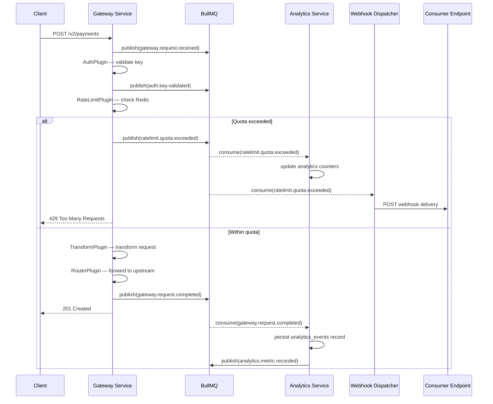

# Event Catalog — API Gateway and Developer Portal

## Overview

The API Gateway and Developer Portal platform uses an event-driven architecture for analytics ingestion, webhook delivery, and asynchronous notifications. This catalog is the authoritative reference for all domain events produced and consumed by the platform.

Events are published to **BullMQ** queues backed by **Redis 7** and consumed by dedicated worker services. External consumers receive events via the webhook delivery pipeline. Internal services consume events for analytics aggregation, alerting, and audit logging.

---

## Event Standards

### Naming Convention

Events follow the dot-notation pattern: `{domain}.{resource}.{action}`

| Component | Description | Example |
|-----------|-------------|---------|
| Domain | Top-level domain area | `gateway`, `auth`, `ratelimit`, `consumer`, `webhook`, `api`, `analytics`, `alert`, `admin` |
| Resource | Entity affected | `request`, `key`, `quota`, `webhook`, `version`, `metric`, `plugin` |
| Action | Past-tense verb | `received`, `completed`, `validated`, `rejected`, `exceeded`, `registered`, `upgraded`, `attempted`, `failed`, `deprecated`, `retired`, `recorded`, `breached`, `configured` |

### Schema Format

All events use a consistent envelope schema:

```json
{
  "id": "uuid-v4",
  "type": "gateway.request.completed",
  "version": "1.0",
  "timestamp": "2024-06-10T10:30:00.000Z",
  "traceId": "4bf92f3577b34da6a3ce929d0e0e4736",
  "source": "gateway-service",
  "data": { ... }
}
```

### Versioning Approach

- Event schemas are versioned using the `version` field (semver).
- Additive changes (new optional fields) are non-breaking and increment the minor version.
- Breaking changes (removed fields, type changes) require a major version bump and dual-publishing period of 30 days.
- Consumers must ignore unknown fields (forward compatibility).

---

## Event Inventory

| Event ID | Event Name | Domain | Producer | Consumers | Trigger | Schema Version |
|----------|------------|--------|----------|-----------|---------|----------------|
| EVT-001 | `gateway.request.received` | Gateway Core | gateway-service | analytics-service, audit-service | Inbound request passes initial parse | 1.0 |
| EVT-002 | `gateway.request.completed` | Gateway Core | gateway-service | analytics-service, webhook-dispatcher | Request fully processed and response sent | 1.2 |
| EVT-003 | `auth.key.validated` | Auth | gateway-service | analytics-service | API key passes HMAC validation | 1.0 |
| EVT-004 | `auth.key.rejected` | Auth | gateway-service | analytics-service, alert-service | API key fails validation | 1.1 |
| EVT-005 | `ratelimit.quota.exceeded` | Rate Limiting | gateway-service | analytics-service, webhook-dispatcher, alert-service | Consumer exceeds rate limit | 1.0 |
| EVT-006 | `ratelimit.quota.warning` | Rate Limiting | gateway-service | analytics-service, webhook-dispatcher | Consumer reaches 80% of quota | 1.0 |
| EVT-007 | `consumer.registered` | Consumer | portal-service | email-service, analytics-service | New consumer completes registration | 1.0 |
| EVT-008 | `consumer.plan.upgraded` | Consumer | portal-service | gateway-config-service, billing-service | Consumer upgrades subscription plan | 1.1 |
| EVT-009 | `consumer.plan.downgraded` | Consumer | portal-service | gateway-config-service, billing-service | Consumer downgrades subscription plan | 1.0 |
| EVT-010 | `webhook.delivery.attempted` | Webhooks | webhook-dispatcher | analytics-service, audit-service | Webhook delivery attempt made | 1.0 |
| EVT-011 | `webhook.delivery.failed` | Webhooks | webhook-dispatcher | analytics-service, alert-service | Webhook delivery attempt fails | 1.0 |
| EVT-012 | `webhook.delivery.dead_lettered` | Webhooks | webhook-dispatcher | admin-service, alert-service | Webhook exhausts all retry attempts | 1.0 |
| EVT-013 | `api.version.deprecated` | Versioning | admin-service | notification-service, portal-service | Admin marks API version as deprecated | 1.0 |
| EVT-014 | `api.version.retired` | Versioning | admin-service | gateway-service, notification-service | API version reaches sunset date | 1.0 |
| EVT-015 | `analytics.metric.recorded` | Analytics | analytics-service | dashboard-service, alert-service | Aggregated metric written to time series | 1.0 |
| EVT-016 | `alert.threshold.breached` | Alerting | analytics-service | notification-service, pagerduty-integration | Alert rule threshold exceeded | 1.1 |
| EVT-017 | `admin.plugin.configured` | Admin | admin-service | gateway-service, audit-service | Plugin configuration changed | 1.0 |
| EVT-018 | `auth.oauth.token.issued` | Auth | auth-service | analytics-service, audit-service | OAuth access token successfully issued | 1.0 |
| EVT-019 | `auth.oauth.token.revoked` | Auth | auth-service | gateway-service, analytics-service | OAuth token revoked | 1.0 |
| EVT-020 | `consumer.key.revoked` | Consumer | admin-service | gateway-service, email-service | API key manually revoked by admin | 1.0 |

---

## Detailed Event Specifications

### EVT-001: `gateway.request.received`

**Description**: Published when the gateway receives and successfully parses an inbound HTTP request, before any auth or routing processing.

**Trigger**: Fastify `onRequest` hook.

**BullMQ Queue**: `analytics-ingestion`

**Payload Schema**:

```json
{
  "id": "f47ac10b-58cc-4372-a567-0e02b2c3d479",
  "type": "gateway.request.received",
  "version": "1.0",
  "timestamp": "2024-06-10T10:30:00.123Z",
  "traceId": "4bf92f3577b34da6a3ce929d0e0e4736",
  "source": "gateway-service",
  "data": {
    "requestId": "req_a1b2c3d4",
    "method": "POST",
    "path": "/v2/payments",
    "query": "currency=USD",
    "ipAddress": "203.0.113.1",
    "userAgent": "curl/7.86.0",
    "contentType": "application/json",
    "contentLength": 512,
    "gatewayInstanceId": "ecs-task-0e1f2a3b",
    "receivedAt": "2024-06-10T10:30:00.120Z"
  }
}
```

**Notes**: Does not include request body (for PII safety). `contentLength` may be null for streaming requests.

---

### EVT-002: `gateway.request.completed`

**Description**: Published after the full request-response cycle completes and the response is sent to the client.

**Trigger**: Fastify `onResponse` hook.

**BullMQ Queue**: `analytics-ingestion`, `webhook-events`

**Payload Schema**:

```json
{
  "id": "a3b4c5d6-e7f8-9012-bcde-f01234567890",
  "type": "gateway.request.completed",
  "version": "1.2",
  "timestamp": "2024-06-10T10:30:00.170Z",
  "traceId": "4bf92f3577b34da6a3ce929d0e0e4736",
  "source": "gateway-service",
  "data": {
    "requestId": "req_a1b2c3d4",
    "consumerId": "a1b2c3d4-e5f6-7890-abcd-ef1234567890",
    "applicationId": "b2c3d4e5-f6a7-8901-bcde-f12345678901",
    "apiKeyId": "c3d4e5f6-a7b8-9012-cdef-123456789012",
    "routeId": "e5f6a7b8-b9c0-1234-def0-234567890123",
    "method": "POST",
    "path": "/v2/payments",
    "statusCode": 201,
    "upstreamStatusCode": 201,
    "latencyMs": 47,
    "upstreamLatencyMs": 38,
    "gatewayOverheadMs": 9,
    "requestSizeBytes": 512,
    "responseSizeBytes": 1024,
    "authMethod": "api_key",
    "rateLimitRemaining": 953,
    "ipAddress": "203.0.113.1",
    "geoCountry": "US",
    "completedAt": "2024-06-10T10:30:00.167Z"
  }
}
```

---

### EVT-003: `auth.key.validated`

**Description**: Published when an API key passes HMAC-SHA256 validation and the associated consumer is identified.

**Trigger**: `AuthPlugin.execute()` success path.

**BullMQ Queue**: `analytics-ingestion`

**Payload Schema**:

```json
{
  "id": "b4c5d6e7-f8a9-0123-cdef-456789012345",
  "type": "auth.key.validated",
  "version": "1.0",
  "timestamp": "2024-06-10T10:30:00.130Z",
  "traceId": "4bf92f3577b34da6a3ce929d0e0e4736",
  "source": "gateway-service",
  "data": {
    "requestId": "req_a1b2c3d4",
    "apiKeyId": "c3d4e5f6-a7b8-9012-cdef-123456789012",
    "apiKeyPrefix": "agw_pk_",
    "consumerId": "a1b2c3d4-e5f6-7890-abcd-ef1234567890",
    "planId": "d4e5f6a7-b8c9-0123-def0-567890123456",
    "cacheHit": true,
    "validatedAt": "2024-06-10T10:30:00.128Z"
  }
}
```

---

### EVT-004: `auth.key.rejected`

**Description**: Published when an API key fails validation (invalid signature, expired, revoked, or not found).

**Trigger**: `AuthPlugin.execute()` failure path.

**BullMQ Queue**: `analytics-ingestion`, `alert-events`

**Payload Schema**:

```json
{
  "id": "c5d6e7f8-a9b0-1234-def0-567890123456",
  "type": "auth.key.rejected",
  "version": "1.1",
  "timestamp": "2024-06-10T10:30:00.125Z",
  "traceId": "5cf93f4688c45eb7b4de030e1f1f5847",
  "source": "gateway-service",
  "data": {
    "requestId": "req_b2c3d4e5",
    "apiKeyPrefix": "agw_pk_",
    "rejectionReason": "HMAC_SIGNATURE_INVALID",
    "ipAddress": "198.51.100.42",
    "userAgent": "python-requests/2.31.0",
    "consecutiveFailures": 3,
    "rejectedAt": "2024-06-10T10:30:00.123Z"
  }
}
```

**Rejection Reasons**: `KEY_NOT_FOUND`, `HMAC_SIGNATURE_INVALID`, `KEY_EXPIRED`, `KEY_REVOKED`, `KEY_SUSPENDED`, `MISSING_SCOPE`, `PLAN_SUSPENDED`.

---

### EVT-005: `ratelimit.quota.exceeded`

**Description**: Published when a consumer's request is rejected due to rate limit or quota exhaustion.

**Trigger**: `RateLimitPlugin.execute()` → limit exceeded branch.

**BullMQ Queue**: `analytics-ingestion`, `webhook-events`, `alert-events`

**Payload Schema**:

```json
{
  "id": "d6e7f8a9-b0c1-2345-ef01-678901234567",
  "type": "ratelimit.quota.exceeded",
  "version": "1.0",
  "timestamp": "2024-06-10T10:30:00.135Z",
  "traceId": "6de04f5799d56fc8c5ef141f202f6958",
  "source": "gateway-service",
  "data": {
    "requestId": "req_c3d4e5f6",
    "consumerId": "a1b2c3d4-e5f6-7890-abcd-ef1234567890",
    "apiKeyId": "c3d4e5f6-a7b8-9012-cdef-123456789012",
    "policyId": "f6a7b8c9-d0e1-2345-fab0-789012345678",
    "limitType": "requests_per_minute",
    "limit": 1000,
    "windowSizeSeconds": 60,
    "currentCount": 1001,
    "retryAfterSeconds": 43,
    "keyBy": "api_key",
    "resetAt": "2024-06-10T10:31:00.000Z"
  }
}
```

---

### EVT-006: `ratelimit.quota.warning`

**Description**: Published when a consumer reaches 80% of their rate limit or monthly quota. Enables proactive developer notification.

**Trigger**: `RateLimitPlugin` after successful request when utilisation >= 80%.

**BullMQ Queue**: `analytics-ingestion`, `webhook-events`

**Payload Schema**:

```json
{
  "id": "e7f8a9b0-c1d2-3456-f012-789012345678",
  "type": "ratelimit.quota.warning",
  "version": "1.0",
  "timestamp": "2024-06-10T10:30:00.140Z",
  "traceId": "7ef15a6800e67fd9d6f0252a313a7069",
  "source": "gateway-service",
  "data": {
    "consumerId": "a1b2c3d4-e5f6-7890-abcd-ef1234567890",
    "apiKeyId": "c3d4e5f6-a7b8-9012-cdef-123456789012",
    "quotaType": "requests_per_month",
    "limit": 10000000,
    "currentUsage": 8150000,
    "utilisationPercent": 81.5,
    "resetAt": "2024-07-01T00:00:00.000Z"
  }
}
```

---

### EVT-007: `consumer.registered`

**Description**: Published when a new consumer completes registration (email verified).

**Trigger**: Email verification confirmed in portal-service.

**BullMQ Queue**: `notification-events`, `analytics-ingestion`

**Payload Schema**:

```json
{
  "id": "f8a9b0c1-d2e3-4567-0123-890123456789",
  "type": "consumer.registered",
  "version": "1.0",
  "timestamp": "2024-06-10T09:00:00.000Z",
  "traceId": "8f026b791f78aeaa e7a1363b424b817a",
  "source": "portal-service",
  "data": {
    "consumerId": "a1b2c3d4-e5f6-7890-abcd-ef1234567890",
    "name": "Acme Corp",
    "email": "admin@acme.com",
    "tier": "free",
    "planId": "d4e5f6a7-b8c9-0123-def0-567890123456",
    "registeredAt": "2024-06-10T09:00:00.000Z"
  }
}
```

---

### EVT-008: `consumer.plan.upgraded`

**Description**: Published when a consumer upgrades to a higher subscription plan.

**Trigger**: Billing confirmation webhook from Stripe, processed by portal-service.

**BullMQ Queue**: `config-updates`, `analytics-ingestion`, `notification-events`

**Payload Schema**:

```json
{
  "id": "a9b0c1d2-e3f4-5678-1234-901234567890",
  "type": "consumer.plan.upgraded",
  "version": "1.1",
  "timestamp": "2024-06-01T14:00:00.000Z",
  "traceId": "9a137c8020879bbb f8b2474c535c9280",
  "source": "portal-service",
  "data": {
    "consumerId": "a1b2c3d4-e5f6-7890-abcd-ef1234567890",
    "previousPlanId": "d4e5f6a7-b8c9-0123-def0-567890123456",
    "previousPlanName": "Free",
    "newPlanId": "e5f6a7b8-c9d0-1234-ef01-678901234567",
    "newPlanName": "Pro",
    "effectiveAt": "2024-06-01T14:00:00.000Z",
    "stripeSubscriptionId": "sub_1OxYz...",
    "billedImmediately": false
  }
}
```

---

### EVT-009: `webhook.delivery.attempted`

**Description**: Published after each webhook delivery attempt, whether successful or failed.

**Trigger**: `WebhookDispatcher` after HTTP call to consumer endpoint.

**BullMQ Queue**: `analytics-ingestion`, `audit-events`

**Payload Schema**:

```json
{
  "id": "b0c1d2e3-f4a5-6789-2345-012345678901",
  "type": "webhook.delivery.attempted",
  "version": "1.0",
  "timestamp": "2024-06-10T08:00:01.000Z",
  "traceId": "0b248d9131980ccc 09c3585d646da391",
  "source": "webhook-dispatcher",
  "data": {
    "deliveryId": "d0e1f2a3-b4c5-6789-def0-234567890123",
    "subscriptionId": "c9d0e1f2-a3b4-5678-cdef-123456789012",
    "consumerId": "a1b2c3d4-e5f6-7890-abcd-ef1234567890",
    "eventType": "ratelimit.quota.exceeded",
    "eventId": "e1f2a3b4-c5d6-7890-ef01-345678901234",
    "targetUrl": "https://acme.com/webhooks/gateway",
    "attemptNumber": 1,
    "httpStatusCode": 200,
    "durationMs": 142,
    "success": true,
    "attemptedAt": "2024-06-10T08:00:01.000Z"
  }
}
```

---

### EVT-010: `webhook.delivery.failed`

**Description**: Published when an individual webhook delivery attempt fails.

**Trigger**: `WebhookDispatcher` on non-2xx response or connection timeout.

**BullMQ Queue**: `analytics-ingestion`, `alert-events`

**Payload Schema**:

```json
{
  "id": "c1d2e3f4-a5b6-7890-3456-123456789012",
  "type": "webhook.delivery.failed",
  "version": "1.0",
  "timestamp": "2024-06-10T08:05:32.000Z",
  "traceId": "1c359ea242a91ddd 1ad4696e757eb4a2",
  "source": "webhook-dispatcher",
  "data": {
    "deliveryId": "d0e1f2a3-b4c5-6789-def0-234567890123",
    "subscriptionId": "c9d0e1f2-a3b4-5678-cdef-123456789012",
    "consumerId": "a1b2c3d4-e5f6-7890-abcd-ef1234567890",
    "eventType": "ratelimit.quota.exceeded",
    "targetUrl": "https://acme.com/webhooks/gateway",
    "attemptNumber": 2,
    "httpStatusCode": 503,
    "errorType": "HTTP_ERROR",
    "errorMessage": "Service Unavailable",
    "durationMs": 30012,
    "nextRetryAt": "2024-06-10T08:05:36.000Z",
    "nextRetryDelaySecs": 4,
    "remainingAttempts": 3,
    "failedAt": "2024-06-10T08:05:32.000Z"
  }
}
```

---

### EVT-011: `api.version.deprecated`

**Description**: Published when an admin marks an API version as deprecated with a future sunset date.

**Trigger**: Admin Console PUT /v1/api-versions/{id}/deprecate.

**BullMQ Queue**: `notification-events`, `config-updates`

**Payload Schema**:

```json
{
  "id": "d2e3f4a5-b6c7-8901-4567-234567890123",
  "type": "api.version.deprecated",
  "version": "1.0",
  "timestamp": "2024-05-01T09:00:00.000Z",
  "traceId": "2d46af5353ba2eee 2be5707f868fc5b3",
  "source": "admin-service",
  "data": {
    "versionId": "e1f2a3b4-c5d6-7890-ef01-345678901234",
    "routeId": "e5f6a7b8-b9c0-1234-def0-234567890123",
    "routeName": "payments-api",
    "version": "v1",
    "deprecatedAt": "2024-05-01T09:00:00.000Z",
    "sunsetAt": "2024-11-01T00:00:00.000Z",
    "successorVersion": "v2",
    "migrationGuideUrl": "https://docs.example.com/migrate-v2",
    "deprecatedBy": "admin@example.com",
    "affectedConsumerCount": 142
  }
}
```

---

### EVT-012: `api.version.retired`

**Description**: Published when a deprecated API version reaches its sunset date and is deactivated.

**Trigger**: Scheduled cron job in admin-service checking `api_versions.sunset_at`.

**BullMQ Queue**: `config-updates`, `notification-events`

**Payload Schema**:

```json
{
  "id": "e3f4a5b6-c7d8-9012-5678-345678901234",
  "type": "api.version.retired",
  "version": "1.0",
  "timestamp": "2024-11-01T00:00:00.000Z",
  "traceId": "3e57ba6464cb3fff 3cf681808979d6c4",
  "source": "admin-service",
  "data": {
    "versionId": "e1f2a3b4-c5d6-7890-ef01-345678901234",
    "routeId": "e5f6a7b8-b9c0-1234-def0-234567890123",
    "routeName": "payments-api",
    "version": "v1",
    "retiredAt": "2024-11-01T00:00:00.000Z",
    "deprecatedAt": "2024-05-01T09:00:00.000Z",
    "httpStatusOnAccess": 410,
    "consumersMigrated": 138,
    "consumersStillOnVersion": 4
  }
}
```

---

### EVT-013: `analytics.metric.recorded`

**Description**: Published by the analytics service after aggregating raw events into time-series metrics.

**Trigger**: Analytics aggregation job running every 60 seconds.

**BullMQ Queue**: `dashboard-updates`, `alert-evaluation`

**Payload Schema**:

```json
{
  "id": "f4a5b6c7-d8e9-0123-6789-456789012345",
  "type": "analytics.metric.recorded",
  "version": "1.0",
  "timestamp": "2024-06-10T10:31:00.000Z",
  "traceId": "4f68cb7575dc40a0 4da792919a8ae7d5",
  "source": "analytics-service",
  "data": {
    "metricName": "gateway.requests.per_minute",
    "dimensions": {
      "routeId": "e5f6a7b8-b9c0-1234-def0-234567890123",
      "statusClass": "2xx"
    },
    "windowStart": "2024-06-10T10:30:00.000Z",
    "windowEnd": "2024-06-10T10:31:00.000Z",
    "value": 8342,
    "unit": "requests",
    "aggregationType": "count"
  }
}
```

---

### EVT-014: `alert.threshold.breached`

**Description**: Published when a monitored metric exceeds a configured alert threshold.

**Trigger**: `AlertEvaluator` component after each analytics metric recording.

**BullMQ Queue**: `notification-events`, `pagerduty-events`

**Payload Schema**:

```json
{
  "id": "a5b6c7d8-e9f0-1234-7890-567890123456",
  "type": "alert.threshold.breached",
  "version": "1.1",
  "timestamp": "2024-06-10T10:31:00.100Z",
  "traceId": "5a79dc8686ed51b1 5eb8a3a2ab9bf8e6",
  "source": "analytics-service",
  "data": {
    "alertRuleId": "b6c7d8e9-f0a1-2345-8901-678901234567",
    "alertRuleName": "High Error Rate — Payments API",
    "metricName": "gateway.requests.error_rate",
    "threshold": 0.05,
    "currentValue": 0.12,
    "severity": "critical",
    "dimensions": {
      "routeId": "e5f6a7b8-b9c0-1234-def0-234567890123"
    },
    "breachedAt": "2024-06-10T10:31:00.000Z",
    "consecutiveBreaches": 3,
    "silenceUntil": null
  }
}
```

---

### EVT-015: `admin.plugin.configured`

**Description**: Published when an admin updates plugin configuration for a route or global scope.

**Trigger**: Admin Console POST/PUT /v1/routes/{id}/plugins.

**BullMQ Queue**: `config-updates`, `audit-events`

**Payload Schema**:

```json
{
  "id": "b6c7d8e9-f0a1-2345-8901-678901234567",
  "type": "admin.plugin.configured",
  "version": "1.0",
  "timestamp": "2024-06-05T11:00:00.000Z",
  "traceId": "6b80ed9797fe62c2 6fc9b4b3bc0ca9f7",
  "source": "admin-service",
  "data": {
    "pluginId": "a3b4c5d6-e7f8-9012-abcd-789012345678",
    "pluginName": "rate-limit",
    "routeId": "e5f6a7b8-b9c0-1234-def0-234567890123",
    "changeType": "update",
    "previousConfig": {
      "limit": 500,
      "windowSizeSeconds": 60
    },
    "newConfig": {
      "limit": 1000,
      "windowSizeSeconds": 60,
      "burstLimit": 200
    },
    "configuredBy": "admin@example.com",
    "configuredAt": "2024-06-05T11:00:00.000Z"
  }
}
```

---

## Event Flows

The following sequence diagram shows the primary event chain for an authenticated API request:



---

## Dead Letter Queue Policy

| Queue | DLQ Name | Max Retries | DLQ Retention | Alerting Threshold |
|-------|----------|-------------|---------------|-------------------|
| `analytics-ingestion` | `analytics-ingestion-dlq` | 3 | 7 days | >100 messages |
| `webhook-events` | `webhook-events-dlq` | 5 | 30 days | >10 messages |
| `notification-events` | `notification-events-dlq` | 3 | 3 days | >50 messages |
| `config-updates` | `config-updates-dlq` | 5 | 14 days | >5 messages |
| `audit-events` | `audit-events-dlq` | 5 | 90 days | >1 message |
| `alert-events` | `alert-events-dlq` | 3 | 7 days | >1 message |

**DLQ Processing**: A daily cron job reviews DLQ contents. Engineering on-call is notified via PagerDuty when DLQ thresholds are breached. Manual replay tooling is available via Admin Console → System → DLQ Replay.

**DLQ Replay**: All DLQ jobs include sufficient context in their payload to be safely replayed. Replay is idempotent for analytics (duplicate events are deduplicated by event ID) and webhook delivery (duplicate delivery attempts are checked against `webhook_deliveries.event_id`).

---

## Operational Policy Addendum

### API Governance Policies

1. **Event Schema Ownership**: Each event schema is owned by the producing service team. Schema changes must be reviewed by consuming service teams before merging.
2. **Breaking Change Moratorium**: No breaking changes may be made to event schemas during the 30 days preceding a major release. All breaking changes must go through a dual-publish period where both old and new schema versions are published concurrently.
3. **Event Retention in BullMQ**: Completed jobs are retained in BullMQ for 24 hours for debugging. Failed jobs are moved to DLQ after exhausting retries and retained per the DLQ retention policy above.
4. **New Event Registration**: New events must be registered in this catalog before the code implementing them is merged to the main branch. The event catalog is treated as a contract, not documentation-after-the-fact.

### Developer Data Privacy Policies

1. **PII in Payloads**: Event payloads must not include raw API key values, passwords, or payment card numbers. `ip_address` is permitted in events but must be omitted from webhook deliveries to external consumer endpoints.
2. **Consumer Webhook Payloads**: Webhook payloads delivered to consumer endpoints must be reviewed for PII before any new event type is added to the webhook-events queue. The data.consumerId is always included for correlation but request body contents are never included.
3. **Analytics Event Masking**: In staging and development environments, the `ipAddress` and `userAgent` fields in all events are automatically replaced with synthetic values by the analytics service before persistence.
4. **Audit Event Immutability**: Audit events consumed from `audit-events` must be written as append-only records. No update or delete operations are permitted on persisted audit data.

### Monetization and Quota Policies

1. **Quota Warning Threshold**: The `ratelimit.quota.warning` event fires at 80% utilisation. This threshold is configurable per plan in `subscription_plans.features.quota_warning_percent` but defaults to 80%.
2. **Overage Tracking**: Requests that exceed quota but are allowed under a paid overage policy are flagged with `data.overageCharged: true` in the `gateway.request.completed` event for billing reconciliation.
3. **Plan Upgrade Propagation**: On receipt of `consumer.plan.upgraded`, the gateway-config-service must update Redis-cached rate limit policies within 5 seconds. No new key generation is permitted against the old plan after this window.
4. **Revenue-Critical Events**: `consumer.plan.upgraded`, `consumer.plan.downgraded`, and `consumer.registered` events are classified as revenue-critical. They use a dedicated BullMQ queue with priority 10 (highest) and minimum 5 retry attempts.

### System Availability and SLA Policies

1. **Event Delivery SLA**: Analytics events must be ingested within 30 seconds of occurrence under normal load. This is a soft SLA — brief BullMQ queue buildups during traffic spikes are acceptable.
2. **Webhook Delivery SLA**: First webhook delivery attempt must occur within 10 seconds of the triggering event. Total delivery time (including retries) must not exceed 24 hours before dead-lettering.
3. **Alert Propagation SLA**: `alert.threshold.breached` events must be delivered to the notification service within 60 seconds of threshold breach detection. PagerDuty escalation must fire within 5 minutes for Critical-severity alerts.
4. **BullMQ High Availability**: The Redis cluster backing BullMQ must maintain 99.9% availability. A Redis failover exceeding 30 seconds triggers an automatic circuit breaker in the gateway that continues processing requests but buffers analytics events in local memory (up to 10,000 events) until queue connectivity is restored.
