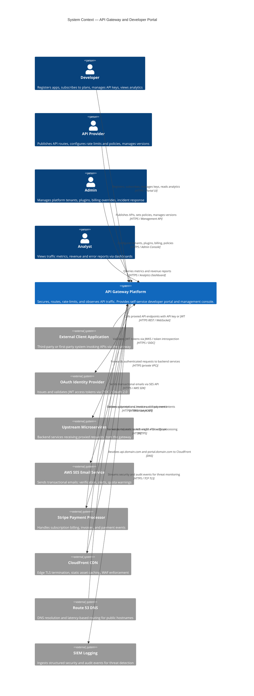

# System Context Diagram — API Gateway and Developer Portal

## Overview

This document defines the system boundary for the **API Gateway and Developer Portal** platform. The platform exposes a unified surface for API Providers to publish, secure, and monetise APIs, and for Developers to discover, subscribe, and consume them.

**Inside the system boundary:**
- API Gateway service (Node.js 20 + Fastify) — request routing, authentication, rate limiting, plugin execution, response transformation
- Developer Portal web application (Next.js 14 + TypeScript) — self-service registration, API catalogue, subscription management, analytics dashboards
- Admin Console (embedded in the Portal) — tenant management, policy configuration, audit log review
- PostgreSQL 15 database cluster — persistent state for consumers, API definitions, subscriptions, analytics aggregates, audit logs
- Redis 7 cluster — API key token cache, rate-limit counters, plugin state, session tokens
- BullMQ worker fleet — webhook dispatch, async analytics writes, plan enforcement jobs, alert evaluation
- OpenTelemetry collector — trace and metric aggregation pipeline
- Prometheus + Grafana stack — internal observability
- Jaeger — distributed tracing backend

**Outside the system boundary (external actors and systems):**
- Developers, API Providers, Admins, Analysts (human users)
- External Client Applications (calling systems)
- OAuth 2.0 Identity Provider
- Upstream Microservices (backend APIs being proxied)
- AWS SES (transactional email)
- Stripe (subscription billing)
- CloudFront CDN (edge caching and TLS termination)
- Route 53 DNS (name resolution)
- SIEM Logging (security event ingestion)

---

## External Actors and Systems

| # | Entity | Type | Description | Interface |
|---|--------|------|-------------|-----------|
| 1 | Developer | Person | Software engineer or organisation that registers, subscribes to plans, obtains API keys, and consumes proxied APIs | HTTPS — Developer Portal UI; REST API (portal-api) |
| 2 | API Provider | Person | Internal or partner team that registers API routes, sets rate-limit policies, and publishes documentation | HTTPS — Admin / Provider Console UI; REST API (management-api) |
| 3 | Admin | Person | Platform operator who manages tenants, plugin configuration, billing overrides, and incident response | HTTPS — Admin Console UI |
| 4 | Analyst | Person | Business or operational analyst who queries traffic metrics, revenue reports, and error-rate dashboards | HTTPS — Analytics Dashboard (read-only role) |
| 5 | External Client Application | System | Any third-party or first-party application that invokes a proxied API endpoint via the gateway | HTTPS REST / WebSocket — gateway ingress (api.domain.com) |
| 6 | OAuth Identity Provider | System | External OIDC-compliant IdP (e.g., Auth0, Okta, or AWS Cognito) that issues JWT access tokens for OAuth 2.0 flows | HTTPS — OIDC discovery endpoint; JWKS URI; token introspection endpoint |
| 7 | Upstream Microservices | System | Backend services owned by API Providers that the gateway proxies requests to after authentication and rate limiting | HTTPS (internal) — service mesh or private VPC endpoints |
| 8 | AWS SES Email Service | System | AWS Simple Email Service used to send account-verification emails, webhook failure alerts, quota-warning notifications, and billing receipts | AWS SDK over HTTPS — SES API v2 |
| 9 | Stripe Payment Processor | System | Payment gateway used to manage subscription plan billing, invoice creation, failed-payment retries, and revenue recognition | HTTPS REST — Stripe API v2; Stripe Webhooks (inbound) |
| 10 | CloudFront CDN | System | AWS CloudFront distribution that terminates TLS at edge, caches portal static assets, and forwards dynamic requests to origin ALB | HTTPS — ALB origin; S3 origin for static assets |
| 11 | Route 53 DNS | System | AWS Route 53 for DNS resolution of public hostnames (api.domain.com, portal.domain.com) with latency-based routing and health checks | AWS DNS protocol — Route 53 hosted zones |
| 12 | SIEM Logging | System | External SIEM (e.g., Splunk or AWS Security Hub) that ingests structured security events for threat detection and compliance | HTTPS / TCP TLS — log forwarding agent; CloudWatch Logs subscription filter |

---

## System Context Diagram

---

## Context Relationships Table

| # | From | To | Direction | Data Exchanged | Protocol | Auth Mechanism |
|---|------|----|-----------|---------------|----------|---------------|
| 1 | Developer | Platform | Inbound | Registration data, API key requests, subscription selections, analytics queries | HTTPS | Session JWT (portal auth) |
| 2 | API Provider | Platform | Inbound | Route definitions, plugin config, rate-limit policies, API documentation | HTTPS | Session JWT + RBAC (provider role) |
| 3 | Admin | Platform | Inbound | Tenant config, plugin lifecycle commands, billing overrides, policy changes | HTTPS | Session JWT + RBAC (admin role) |
| 4 | Analyst | Platform | Inbound | Metric query parameters, date-range filters | HTTPS | Session JWT + RBAC (analyst role) |
| 5 | External Client Application | Platform | Inbound | API request headers, body, query params | HTTPS REST / WS | API key (HMAC-SHA256) or JWT |
| 6 | Platform | Upstream Microservices | Outbound | Forwarded request with enrichment headers (X-Consumer-ID, X-API-Key-ID, X-Rate-Limit-Remaining) | HTTPS (mTLS optional) | Internal service token or mTLS cert |
| 7 | Platform | OAuth Identity Provider | Outbound | JWT token for JWKS validation or introspection request | HTTPS | None (public JWKS); client_credentials for introspection |
| 8 | OAuth Identity Provider | Platform | Inbound | JWKS public keys, introspection responses | HTTPS | Mutual — client_id / client_secret |
| 9 | Platform | AWS SES | Outbound | Email recipient, subject, HTML/text body, template data | HTTPS / AWS SDK | AWS IAM role (ECS task role) |
| 10 | Platform | Stripe | Outbound | Customer ID, plan price ID, invoice creation, payment intent | HTTPS / Stripe API | Stripe secret API key (env secret) |
| 11 | Stripe | Platform | Inbound | payment_intent.succeeded, invoice.paid, customer.subscription.deleted events | HTTPS Webhook POST | Stripe-Signature HMAC verification |
| 12 | CloudFront | Platform | Inbound | Proxied HTTPS requests with CloudFront headers | HTTPS | CloudFront custom origin header (shared secret) |
| 13 | Platform | CloudFront | Outbound | Cache invalidation requests, static asset uploads to S3 | HTTPS / AWS SDK | AWS IAM role |
| 14 | Route 53 | Platform | External | DNS A/AAAA/ALIAS records pointing to CloudFront distributions | DNS / AWS Route 53 | AWS IAM (Route 53 hosted zone policy) |
| 15 | Platform | SIEM | Outbound | Structured JSON security events: auth failures, rate-limit breaches, admin actions, anomaly detections | HTTPS / TCP TLS | API token or AWS CloudWatch subscription filter |

---

## Integration Points

### 1. OAuth Identity Provider

**Purpose:** Validates Developer- and application-supplied JWTs before proxying requests.

**Integration mechanism:** On gateway startup, the OIDC discovery document is fetched from the configured issuer URL. JWKS keys are cached in Redis with a 15-minute TTL. Each request bearing a `Bearer` token triggers local JWT signature verification using the cached JWKS. For opaque tokens, the gateway calls the token introspection endpoint.

**SLA dependency:** JWKS endpoint must be available during the cache refresh window. If the JWKS endpoint is unreachable at refresh time, the gateway serves requests using the cached JWKS for up to 60 minutes before failing closed.

**Failure handling:** If JWKS cache expires and the IdP is unreachable, the gateway returns `503 Service Unavailable` with `X-Auth-Error: jwks_unavailable`. Circuit breaker is opened after 5 consecutive failures within 30 seconds. A Prometheus alert fires after 2 minutes of continuous failure.

---

### 2. Upstream Microservices

**Purpose:** Each registered API route maps to one or more upstream targets. The gateway performs health-checked round-robin across healthy targets.

**Integration mechanism:** Active health checks poll `GET /health` on each upstream every 10 seconds with a 3-second timeout. Passive health checks demote a target after 3 consecutive 5xx responses within a 60-second window.

**SLA dependency:** Upstream services are expected to maintain 99.5% availability. Gateway SLA is bound by upstream SLA for proxied routes.

**Failure handling:** On upstream failure, the gateway returns `502 Bad Gateway` with structured error body. If a fallback plugin is configured on the route, it returns the cached last-good response or a static fallback payload. Errors are emitted as `gateway.request.completed` events with `upstream_status: error`.

---

### 3. Stripe Payment Processor

**Purpose:** Manages subscription lifecycle — plan activation, billing cycles, dunning, and cancellation.

**Integration mechanism:** When a Developer upgrades or downgrades a plan, the Portal backend calls Stripe's Subscription API to create or update the subscription object. Stripe delivers webhook events (`invoice.paid`, `customer.subscription.deleted`, `invoice.payment_failed`) to the platform's webhook receiver endpoint. Each inbound webhook is verified using the `Stripe-Signature` HMAC header with the signing secret stored in AWS Secrets Manager.

**SLA dependency:** Plan quota is activated immediately upon Stripe `invoice.paid` event receipt. If the webhook is delayed, the Developer retains their existing quota tier until event delivery (Stripe guarantees delivery within 24 hours with retries).

**Failure handling:** Failed webhook signature verification results in `400 Bad Request` and a SIEM security event. Idempotency keys are used for all Stripe API calls. A BullMQ retry job is queued for any Stripe API call that returns a 5xx response, with exponential backoff up to 6 retries.

---

### 4. AWS SES Email Service

**Purpose:** Delivers transactional emails including account verification, password reset, quota-warning alerts, webhook failure digests, and billing receipts.

**Integration mechanism:** The platform calls SES API v2 `SendEmail` via the AWS SDK using the ECS task IAM role. All outbound emails use a verified sending domain with DKIM and SPF records configured in Route 53.

**SLA dependency:** SES delivery is asynchronous. The platform does not block user-facing operations on email delivery. Bounce and complaint notifications are received via SES SNS topics and written to the database to suppress future sends.

**Failure handling:** SDK call failures are retried with exponential backoff up to 3 times. If SES is unreachable, the email payload is queued in BullMQ for deferred delivery. Email delivery failures beyond 3 retries are logged as `notification.delivery.failed` events and surfaced in the Admin Console.

---

### 5. SIEM Logging

**Purpose:** Streams structured security events for real-time threat detection, compliance audit trails, and incident forensics.

**Integration mechanism:** The platform writes structured security events (authentication failures, rate-limit breaches, admin privilege escalations, anomalous traffic patterns) to a CloudWatch Log Group. A CloudWatch subscription filter forwards the log stream to the SIEM ingestion endpoint in near-real-time.

**SLA dependency:** Security event delivery has a target latency of under 60 seconds from event occurrence to SIEM ingestion. SIEM is treated as a best-effort sink — gateway availability is never blocked on SIEM availability.

**Failure handling:** If the CloudWatch log stream is unavailable, the gateway buffers events in-process for up to 30 seconds before writing to the database as a fallback audit store. The SIEM operator is responsible for reprocessing events from the fallback store during recovery.

---

## Security Boundary Notes

1. **TLS everywhere:** All external communication is TLS 1.2 minimum; TLS 1.3 is preferred and enforced at the CloudFront edge. Internal VPC traffic between gateway and upstream microservices uses TLS with optional mTLS for services that support it.

2. **WAF at the edge:** AWS WAF rules on the CloudFront distribution block OWASP Top 10 attack patterns, enforce geo-restrictions where required, and apply rate-based rules to prevent L7 DDoS before requests reach the gateway.

3. **Secrets management:** All secrets (API keys, Stripe keys, database passwords, OAuth client secrets) are stored in AWS Secrets Manager and injected into the ECS task as environment variables at launch. Secrets are never logged or included in error responses.

4. **API key isolation:** API keys are stored in PostgreSQL as `SHA-256(key_prefix + key_secret)` hashes. The plaintext key is shown to the Developer exactly once at creation time. Redis caches a mapping of `key_hash → consumer_id + plan_metadata` with a configurable TTL (default: 300 seconds) to avoid database lookups on every request.

5. **Network segmentation:** The API Gateway fleet, portal backend, database, and Redis cluster each run in separate VPC security groups. The gateway security group only accepts inbound traffic from the ALB. The database security group only accepts inbound traffic from the gateway and worker security groups on port 5432.

6. **Zero-trust enrichment headers:** The gateway strips any incoming `X-Consumer-*`, `X-API-Key-*`, or `X-Rate-Limit-*` headers from external requests before forwarding to upstream services, and re-inserts authoritative values after authentication.

7. **Audit trail:** All Admin and API Provider actions that mutate system state are written to the `AuditLog` table with actor identity, timestamp, IP address, changed entity, before/after values, and a unique idempotency trace ID.

8. **DDoS protection:** AWS Shield Standard is active on all CloudFront distributions. Rate-based WAF rules block IPs exceeding 2,000 requests per 5 minutes at the edge, independent of gateway-level rate limiting.

---

## Operational Policy Addendum

### API Governance Policies

1. **Policy AGP-001 — API Publication Approval:** No API route may be published to the production gateway without completing a Provider-submitted governance checklist that includes: defined rate-limit policy, assigned subscription tier, at least one OpenAPI 3.0 specification document, and Admin approval. APIs that fail the checklist are held in `PENDING_REVIEW` status and cannot receive live traffic.

2. **Policy AGP-002 — External System Integration Review:** Any new external system integration (IdP, payment processor, SIEM, or third-party analytics sink) must be reviewed and approved by the Platform Security team before configuration in production. The integration must document data flows, authentication mechanisms, and failure modes in the system context diagram before promotion.

3. **Policy AGP-003 — Upstream Health Check Mandate:** Every registered API route must have an upstream health check configured with a maximum timeout of 5 seconds and a minimum check interval of 30 seconds. Routes with consistently unhealthy upstreams (more than 50% health-check failures over a 10-minute window) are automatically suspended and the responsible API Provider is notified via email.

4. **Policy AGP-004 — Breaking Change Prohibition on Live Routes:** API Providers must not apply breaking changes (field removal, type change, endpoint removal, authentication scheme change) to a route version that has active consumer subscriptions. Breaking changes require creating a new API version, a 90-day deprecation notice period, and migration guides published in the Developer Portal before the old version is retired.

---

### Developer Data Privacy Policies

1. **Policy DDP-001 — PII Minimisation in Logs:** The gateway must not log request or response bodies for API routes that are tagged with the `contains-pii` classification. For routes without this tag, request bodies larger than 4 KB are truncated before logging. IP addresses in access logs are pseudonymised by masking the last octet before storage.

2. **Policy DDP-002 — Developer Account Data Retention:** Developer personal data (name, email, company, usage history) is retained for the duration of the account plus 90 days post-deletion. After the retention window, all PII fields are overwritten with anonymised values. Aggregate analytics records are retained indefinitely without PII linkage.

3. **Policy DDP-003 — GDPR Right to Erasure:** When a Developer submits a data-erasure request, the platform must complete the erasure workflow within 30 days. Erasure includes: replacing PII fields with anonymised tokens in PostgreSQL, purging Developer session tokens from Redis, removing email addresses from the SES suppression list, and confirming deletion to the Stripe customer record. Audit log entries are retained but the actor identity is anonymised.

4. **Policy DDP-004 — Cross-Border Data Transfer Restriction:** Developer personal data must be stored exclusively in the primary AWS region (eu-west-1 for EU deployments; us-east-1 for US deployments). Read replicas and backups must remain within the same AWS geography unless an explicit data transfer agreement is in place and documented in the system's data processing register.

---

### Monetization and Quota Policies

1. **Policy MQP-001 — Quota Enforcement Timing:** Rate-limit quotas are enforced in real time using Redis atomic counter increments. Plan quota changes (upgrades or downgrades) take effect within 60 seconds of the `consumer.plan.upgraded` or `consumer.plan.downgraded` event being processed by the BullMQ worker. There is no grace period for downgrades.

2. **Policy MQP-002 — Overage Billing:** For plans with metered overage billing enabled, overage usage is calculated at the end of each billing cycle and submitted to Stripe as a usage record. Overage charges are capped at 200% of the base plan price unless the Consumer has opted into an uncapped overage agreement in writing.

3. **Policy MQP-003 — Free-Tier Abuse Prevention:** Free-tier API keys may not be shared across multiple applications or organisations. The platform monitors for anomalous key-sharing patterns (multiple source IPs, unusual geographic distribution, or usage patterns inconsistent with a single application) and may suspend keys pending Developer verification.

4. **Policy MQP-004 — Revenue Recognition Accuracy:** Platform revenue data exported to financial reporting systems must reconcile with Stripe invoice records within 0.1% variance. Discrepancies exceeding this threshold must be investigated within one business day and resolved within five business days. A monthly reconciliation report is generated automatically and delivered to the Finance team.

---

### System Availability and SLA Policies

1. **Policy SAP-001 — Gateway Availability Target:** The API Gateway must maintain 99.95% monthly uptime for all routes on paid subscription plans, measured as the percentage of minutes in the month during which the gateway successfully processes at least one request per minute. Scheduled maintenance windows of up to 30 minutes per month are excluded from uptime calculations, provided they are communicated at least 72 hours in advance.

2. **Policy SAP-002 — Portal Availability Target:** The Developer Portal must maintain 99.9% monthly uptime for read operations (API catalogue, documentation, analytics dashboards). Write operations (registration, key creation, subscription changes) must maintain 99.5% availability. Planned deployments using blue-green or canary strategies must not cause more than 30 seconds of request-error elevation.

3. **Policy SAP-003 — Incident Response SLA:** Severity-1 incidents (full gateway unavailability or complete authentication failure) must be acknowledged within 5 minutes of alert firing and have an incident commander assigned within 15 minutes. A post-incident review (PIR) must be published in the Developer Portal status page within 5 business days, including root cause, timeline, corrective actions, and prevention measures.

4. **Policy SAP-004 — Backup and Recovery Objectives:** The PostgreSQL RDS primary instance must be backed up with a daily automated snapshot retained for 35 days and point-in-time recovery (PITR) enabled with a 5-minute granularity. Recovery Point Objective (RPO) is 5 minutes; Recovery Time Objective (RTO) for the database tier is 30 minutes. Redis ElastiCache cluster data is treated as ephemeral; cache warm-up procedures must complete within 5 minutes of a cluster restart.
