# Use-Case Diagram — API Gateway and Developer Portal

## Overview

This document captures the complete use-case model for the API Gateway and Developer Portal system. The system mediates all traffic between external API consumers and upstream microservices while providing a self-service portal for developers to discover, subscribe to, and manage API access. The gateway enforces authentication, authorization, rate limiting, quota enforcement, request/response transformation, and caching as a transparent intermediary. The developer portal exposes a fully featured web interface (Next.js 14 App Router) backed by a PostgreSQL 15 database, Redis 7 cache, and BullMQ task queue.

Use cases span ten core domains: **Gateway Core**, **Authentication & Authorization**, **Rate Limiting & Quotas**, **Request/Response Transformation**, **Developer Portal**, **Analytics & Observability**, **Subscription Plans**, **Webhook Management**, **API Versioning**, and **Admin Console**. Together these domains support four primary human actors — API Provider, Developer, Admin, and Analyst — and three system actors — External Client, OAuth Provider, and Upstream Service.

---

## Actors

| Actor | Type | Role Description |
|-------|------|-----------------|
| **API Provider** | Primary Human | Publishes APIs to the catalog, defines upstream routes, manages API versions, configures rate-limit policies per route, and owns the full lifecycle of each API product from publication through retirement. |
| **Developer** | Primary Human | Self-registers on the developer portal, creates applications, generates and rotates API keys, subscribes to plans, browses the API catalog, reads documentation, registers webhooks, and initiates OAuth authorization flows. |
| **Admin** | Primary Human | Manages platform-wide configuration including gateway routes, WAF rules, subscription plan definitions, user roles, SLA policies, and audit log access. Holds elevated privileges over all other human roles. |
| **Analyst** | Primary Human | Reads usage dashboards, drills into per-API and per-developer traffic metrics, generates downloadable usage reports, and monitors error-rate and latency SLA compliance. Read-only access to production data. |
| **External Client** | Primary System | Machine actor — a mobile app, server-side application, CLI tool, or IoT device — that sends authenticated HTTP requests to the gateway runtime endpoint. Identified by an API key, OAuth access token, or signed JWT. |
| **OAuth Provider** | Secondary System | External identity provider (Google, GitHub, Okta, or custom OIDC-compliant provider) that participates in the Authorization Code + PKCE flow. Responsible for issuing authorization codes and exchanging them for access and refresh tokens. |
| **Upstream Service** | Secondary System | Backend microservice or third-party API registered as a route target. Receives transformed, authenticated, and validated requests from the gateway and returns responses that are subsequently transformed before delivery to the External Client. |

---

## Use Case Inventory

| ID | Use Case Name | Primary Actor |
|----|---------------|---------------|
| UC-001 | Register Developer Account | Developer |
| UC-002 | Verify Email Address | Developer |
| UC-003 | Create Application | Developer |
| UC-004 | Generate API Key | Developer |
| UC-005 | Rotate API Key | Developer |
| UC-006 | Revoke API Key | Developer |
| UC-007 | Subscribe to API Plan | Developer |
| UC-008 | Upgrade Subscription Plan | Developer |
| UC-009 | Downgrade Subscription Plan | Developer |
| UC-010 | View API Catalog | Developer |
| UC-011 | Read API Documentation | Developer |
| UC-012 | Submit API Request | External Client |
| UC-013 | Authenticate via API Key (HMAC-SHA256) | External Client |
| UC-014 | Authenticate via OAuth 2.0 Access Token | External Client |
| UC-015 | Authenticate via JWT (RS256) | External Client |
| UC-016 | Enforce Rate Limit (per-second / per-minute) | Gateway Core |
| UC-017 | Enforce Monthly Quota | Gateway Core |
| UC-018 | Transform Inbound Request Payload | Gateway Core |
| UC-019 | Transform Outbound Response Payload | Gateway Core |
| UC-020 | Route Request to Upstream Service | Gateway Core |
| UC-021 | Cache Upstream Response | Gateway Core |
| UC-022 | Register Webhook Endpoint | Developer |
| UC-023 | Deliver Webhook Event | Gateway Core |
| UC-024 | Retry Failed Webhook Delivery | Gateway Core |
| UC-025 | Manage Dead-Letter Queue for Webhooks | Admin |
| UC-026 | Publish New API Version | API Provider |
| UC-027 | Deprecate API Version | API Provider |
| UC-028 | Migrate Traffic Between API Versions | API Provider |
| UC-029 | Retire Sunset API Version | API Provider |
| UC-030 | View Analytics Dashboard | Analyst |
| UC-031 | Generate Usage Report | Analyst |
| UC-032 | Monitor Error Rates and Latency | Analyst |
| UC-033 | Configure Rate Limit Policy | Admin |
| UC-034 | Manage Subscription Plan Definitions | Admin |
| UC-035 | Manage Users and Roles | Admin |
| UC-036 | Configure Gateway Routes | Admin |
| UC-037 | View Audit Logs | Admin |
| UC-038 | Configure WAF Rules | Admin |
| UC-039 | Initiate OAuth Authorization Code Flow | Developer |
| UC-040 | Exchange Authorization Code for Token | External Client |

---

## Diagram

```mermaid
flowchart TD
    devActor["👤 Developer"]
    ecActor["🖥 External Client"]
    apActor["👤 API Provider"]
    admActor["👤 Admin"]
    anaActor["👤 Analyst"]
    oapActor["🔐 OAuth Provider"]
    upsActor["⚙ Upstream Service"]

    subgraph PortalDomain["Developer Portal"]
        UC001([Register Account])
        UC002([Verify Email])
        UC003([Create Application])
        UC010([View API Catalog])
        UC011([Read API Docs])
        UC039([Initiate OAuth Flow])
    end

    subgraph KeyMgmt["API Key Management"]
        UC004([Generate API Key])
        UC005([Rotate API Key])
        UC006([Revoke API Key])
    end

    subgraph SubscriptionDomain["Subscription & Plans"]
        UC007([Subscribe to Plan])
        UC008([Upgrade Plan])
        UC009([Downgrade Plan])
        UC034([Manage Plan Definitions])
    end

    subgraph AuthDomain["Authentication & Authorization"]
        UC013([Auth via API Key])
        UC014([Auth via OAuth 2.0])
        UC015([Auth via JWT])
        UC040([Exchange Auth Code])
    end

    subgraph GatewayCore["Gateway Core"]
        UC012([Submit API Request])
        UC016([Enforce Rate Limit])
        UC017([Enforce Quota])
        UC018([Transform Request])
        UC019([Transform Response])
        UC020([Route to Upstream])
        UC021([Cache Response])
    end

    subgraph WebhookDomain["Webhook Management"]
        UC022([Register Webhook])
        UC023([Deliver Webhook Event])
        UC024([Retry Failed Webhook])
        UC025([Manage Dead-Letter Queue])
    end

    subgraph VersioningDomain["API Versioning"]
        UC026([Publish API Version])
        UC027([Deprecate API Version])
        UC028([Migrate Traffic])
        UC029([Retire API Version])
    end

    subgraph ObservabilityDomain["Analytics & Observability"]
        UC030([View Analytics Dashboard])
        UC031([Generate Usage Report])
        UC032([Monitor Error Rates])
    end

    subgraph AdminDomain["Admin Console"]
        UC033([Configure Rate Limit Policy])
        UC035([Manage Users & Roles])
        UC036([Configure Gateway Routes])
        UC037([View Audit Logs])
        UC038([Configure WAF Rules])
    end

    %% Developer associations
    devActor --> UC001
    devActor --> UC003
    devActor --> UC004
    devActor --> UC005
    devActor --> UC006
    devActor --> UC007
    devActor --> UC008
    devActor --> UC009
    devActor --> UC010
    devActor --> UC011
    devActor --> UC022
    devActor --> UC039

    %% External Client associations
    ecActor --> UC012
    ecActor --> UC013
    ecActor --> UC014
    ecActor --> UC015
    ecActor --> UC040

    %% API Provider associations
    apActor --> UC026
    apActor --> UC027
    apActor --> UC028
    apActor --> UC029

    %% Admin associations
    admActor --> UC033
    admActor --> UC034
    admActor --> UC035
    admActor --> UC036
    admActor --> UC037
    admActor --> UC038
    admActor --> UC025

    %% Analyst associations
    anaActor --> UC030
    anaActor --> UC031
    anaActor --> UC032

    %% Gateway processing chain
    UC012 -->|includes| UC013
    UC012 -->|includes| UC016
    UC012 -->|includes| UC017
    UC012 -->|includes| UC018
    UC012 -->|includes| UC020
    UC020 -->|includes| UC019
    UC020 --> upsActor
    UC021 -.->|extends| UC020

    %% Auth chain
    UC014 --> oapActor
    UC040 --> oapActor
    UC039 --> oapActor

    %% Include relationships
    UC001 -.->|includes| UC002
    UC004 -.->|includes| UC007
    UC023 -.->|includes| UC024
    UC026 -.->|includes| UC036
```

---

## Use Case Groupings

| UC ID | Use Case Name | Domain | Primary Actor |
|-------|---------------|--------|---------------|
| UC-001 | Register Developer Account | Developer Portal | Developer |
| UC-002 | Verify Email Address | Developer Portal | Developer |
| UC-003 | Create Application | Developer Portal | Developer |
| UC-004 | Generate API Key | API Key Management | Developer |
| UC-005 | Rotate API Key | API Key Management | Developer |
| UC-006 | Revoke API Key | API Key Management | Developer |
| UC-007 | Subscribe to API Plan | Subscription Plans | Developer |
| UC-008 | Upgrade Subscription Plan | Subscription Plans | Developer |
| UC-009 | Downgrade Subscription Plan | Subscription Plans | Developer |
| UC-010 | View API Catalog | Developer Portal | Developer |
| UC-011 | Read API Documentation | Developer Portal | Developer |
| UC-012 | Submit API Request | Gateway Core | External Client |
| UC-013 | Authenticate via API Key | Auth & Authorization | External Client |
| UC-014 | Authenticate via OAuth 2.0 | Auth & Authorization | External Client |
| UC-015 | Authenticate via JWT | Auth & Authorization | External Client |
| UC-016 | Enforce Rate Limit | Rate Limiting & Quotas | Gateway Core |
| UC-017 | Enforce Monthly Quota | Rate Limiting & Quotas | Gateway Core |
| UC-018 | Transform Inbound Request | Request/Response Transformation | Gateway Core |
| UC-019 | Transform Outbound Response | Request/Response Transformation | Gateway Core |
| UC-020 | Route Request to Upstream | Gateway Core | Gateway Core |
| UC-021 | Cache Upstream Response | Gateway Core | Gateway Core |
| UC-022 | Register Webhook Endpoint | Webhook Management | Developer |
| UC-023 | Deliver Webhook Event | Webhook Management | Gateway Core |
| UC-024 | Retry Failed Webhook Delivery | Webhook Management | Gateway Core |
| UC-025 | Manage Dead-Letter Queue | Webhook Management | Admin |
| UC-026 | Publish New API Version | API Versioning | API Provider |
| UC-027 | Deprecate API Version | API Versioning | API Provider |
| UC-028 | Migrate Traffic Between Versions | API Versioning | API Provider |
| UC-029 | Retire Sunset API Version | API Versioning | API Provider |
| UC-030 | View Analytics Dashboard | Analytics & Observability | Analyst |
| UC-031 | Generate Usage Report | Analytics & Observability | Analyst |
| UC-032 | Monitor Error Rates and Latency | Analytics & Observability | Analyst |
| UC-033 | Configure Rate Limit Policy | Admin Console | Admin |
| UC-034 | Manage Subscription Plan Definitions | Admin Console | Admin |
| UC-035 | Manage Users and Roles | Admin Console | Admin |
| UC-036 | Configure Gateway Routes | Admin Console | Admin |
| UC-037 | View Audit Logs | Admin Console | Admin |
| UC-038 | Configure WAF Rules | Admin Console | Admin |
| UC-039 | Initiate OAuth Authorization Code Flow | Auth & Authorization | Developer |
| UC-040 | Exchange Authorization Code for Token | Auth & Authorization | External Client |

---

## Dependencies and Includes

### `<<include>>` Relationships

`<<include>>` denotes mandatory behaviour that is always executed as part of the base use case. The included use case is never optional and represents a factored-out sub-flow.

| Base Use Case | Included Use Case | Rationale |
|---------------|-------------------|-----------|
| UC-001 Register Developer Account | UC-002 Verify Email Address | Account activation always requires email verification before the account becomes active. |
| UC-004 Generate API Key | UC-007 Subscribe to API Plan | A key can only be issued after the developer's application is bound to an active plan subscription. |
| UC-012 Submit API Request | UC-013 / UC-014 / UC-015 Authenticate | Every inbound request must pass an authentication check; the gateway selects the appropriate auth method based on the `Authorization` header scheme. |
| UC-012 Submit API Request | UC-016 Enforce Rate Limit | Rate limiting is applied to every authenticated request regardless of plan tier. |
| UC-012 Submit API Request | UC-017 Enforce Quota | Monthly quota is decremented on every successful request for plans with quota policies enabled. |
| UC-012 Submit API Request | UC-018 Transform Inbound Request | Header injection, payload validation, and schema normalization are always applied before upstream dispatch. |
| UC-020 Route Request to Upstream | UC-019 Transform Outbound Response | Response header stripping, payload normalisation, and error mapping are always applied after the upstream reply. |
| UC-023 Deliver Webhook Event | UC-024 Retry Failed Webhook | Any non-2xx delivery response immediately enqueues a retry job in BullMQ with exponential back-off. |
| UC-026 Publish New API Version | UC-036 Configure Gateway Routes | Publishing a new version always creates or updates the route configuration in the gateway's PostgreSQL route registry. |
| UC-040 Exchange Authorization Code | UC-014 Authenticate via OAuth 2.0 | The code exchange is a sub-step within the broader OAuth 2.0 token issuance flow. |

### `<<extend>>` Relationships

`<<extend>>` denotes optional or conditional behaviour that extends a base use case only when a specific extension point condition is met.

| Base Use Case | Extending Use Case | Extension Condition |
|---------------|--------------------|---------------------|
| UC-020 Route Request to Upstream | UC-021 Cache Response | Upstream response carries a `Cache-Control: max-age` directive and the route has caching enabled in gateway config. |
| UC-016 Enforce Rate Limit | UC-017 Enforce Quota | Extension point triggered when the developer's subscription plan includes a `monthly_quota` policy greater than zero. |
| UC-027 Deprecate API Version | UC-028 Migrate Traffic | Traffic migration is optionally initiated when the API Provider enables an automated canary migration policy on the deprecated version. |
| UC-012 Submit API Request | UC-038 Configure WAF Rules | WAF inspection is triggered when a Fastify WAF plugin flags the request against AWS WAF rule groups applied at the CloudFront distribution. |
| UC-030 View Analytics Dashboard | UC-031 Generate Usage Report | Report export is triggered only when the Analyst selects the export action; it is not part of normal dashboard rendering. |
| UC-007 Subscribe to API Plan | UC-008 Upgrade Subscription Plan | Upgrade flow is conditionally invoked when the Developer selects a plan of higher tier than the currently active subscription. |
| UC-008 Upgrade Subscription Plan | UC-009 Downgrade Subscription Plan | Downgrade flow is triggered when the Developer selects a plan of lower tier; restricted to end-of-billing-cycle execution. |
| UC-023 Deliver Webhook Event | UC-025 Manage Dead-Letter Queue | The dead-letter queue extension fires after all configured retry attempts are exhausted without a successful delivery acknowledgement. |

---

## Operational Policy Addendum

### API Governance Policies

1. **API Publication Standard**: All APIs published through the portal must include an OpenAPI 3.1 specification with all endpoints, schemas, and error codes documented; at least one working code sample in each of three supported SDK languages; a changelog entry describing the change from the previous version; and a defined deprecation timeline. No route is made publicly visible in the catalog until all four artefacts pass automated validation.
2. **Version Lifecycle Mandate**: API versions must remain active for a minimum of 12 months after a successor version is published and approved. Deprecation notices must be sent to all active subscribers no fewer than 90 days before the announced sunset date, with follow-up reminders at the 60-day and 30-day marks.
3. **Breaking Change Classification**: Any modification that removes an endpoint, alters required request parameters, changes HTTP response status codes, removes or renames response fields, or alters authentication scheme requirements is classified as a breaking change. Breaking changes must always be introduced under a new major semantic version; they are never permitted in minor or patch releases.
4. **Route Ownership Enforcement**: Each API route registered in the gateway must have exactly one designated API Provider owner recorded in the admin console. Routes with no assigned owner for more than 30 consecutive days are automatically flagged for review and placed in a read-only state pending reassignment or deactivation.
5. **Security Review Gate**: APIs that expose personally identifiable information, financial transaction data, or healthcare records must pass a mandatory security review by a qualified reviewer and receive explicit Admin approval before publication, irrespective of whether automated validation has passed.

### Developer Data Privacy Policies

1. **Minimal Data Collection**: The developer portal collects only the data necessary for account management, billing, and API access: specifically, email address, display name, billing details (tokenized via a PCI-DSS-compliant processor), and per-request usage telemetry. No behavioral browsing data, session recordings, or third-party tracking scripts are permitted on portal pages.
2. **API Key Storage Security**: All API keys are stored exclusively as HMAC-SHA256 hashes in PostgreSQL. The plaintext key is returned exactly once at generation time over TLS and is never stored, logged, or included in any audit record. Only the first 8-character prefix is retained in the clear for identification purposes in the admin console.
3. **Log Anonymization Schedule**: Request logs written to the analytics pipeline must have IPv4 addresses truncated to a /24 CIDR block and IPv6 addresses truncated to a /48 prefix within 24 hours of ingestion via a scheduled Lambda function. Full IP addresses are retained exclusively in raw CloudFront access logs for a maximum of 7 days for security forensics.
4. **Right to Erasure**: Upon a verified account deletion request, all developer PII — including name, email, billing history, and application metadata — must be purged within 30 days. API call records are anonymized by replacing the developer identifier with a cryptographic tombstone UUID to preserve the integrity of aggregate analytics without retaining personal linkage.
5. **Cross-Border Data Restrictions**: Developer PII is stored exclusively in the primary AWS region designated at account creation time. Replication to disaster-recovery secondary regions is restricted to anonymized aggregate metrics only, unless the developer provides explicit, granular consent for cross-border PII replication during account registration.

### Monetization and Quota Policies

1. **Quota Reset Schedule**: API call quotas reset at 00:00 UTC on the first day of each calendar month for all subscription plans. Unused quota does not roll over to the following billing period under any plan tier, including paid enterprise tiers.
2. **Overage Handling**: When a developer's monthly quota is fully exhausted, subsequent requests are rejected with HTTP 429 and a `Retry-After` header set to the ISO 8601 timestamp of the next quota reset. Overage capacity blocks may be purchased on-demand through the developer portal in increments of 10,000 calls billed immediately at the overage rate defined in the active plan.
3. **Plan Downgrade Restriction**: Subscription downgrades take effect at the end of the current billing cycle and are not applied immediately. Immediate downgrades are not permitted if the developer's current-month usage already exceeds the monthly quota of the target plan; the developer must wait until the next cycle when usage resets below the target limit.
4. **Free Tier Abuse Prevention**: Accounts on the free tier are limited to a maximum of one application and one active API key. Programmatic or manual creation of multiple free-tier accounts by the same legal entity, email domain, or payment instrument constitutes a terms-of-service violation and will result in suspension of all associated accounts and rate-limiting at the IP level pending review.

### System Availability and SLA Policies

1. **Gateway Availability SLA**: The API gateway commits to 99.95% monthly uptime as measured by Route 53 health check polling at 10-second intervals against the primary gateway endpoint. Planned maintenance windows are excluded from availability calculations, provided they are announced at least 48 hours in advance and do not collectively exceed 4 hours per calendar month.
2. **Latency SLA**: The gateway must process, authenticate, transform, and forward requests to upstream services within a P99 added-latency budget of 50 ms (gateway-only overhead, excluding upstream service response time), measured over any rolling 5-minute window under normal traffic conditions. Breach of this SLA for more than 3 consecutive minutes constitutes a P1 incident.
3. **Incident Escalation Timeline**: P0 incidents (complete gateway unavailability or confirmed security breach) must be acknowledged by an on-call engineer within 5 minutes of alert firing, mitigated within 30 minutes, and have a detailed root-cause analysis document published to the status page within 5 business days of resolution.
4. **Disaster Recovery Objectives**: The system must achieve a Recovery Time Objective (RTO) of 15 minutes and a Recovery Point Objective (RPO) of 1 minute using RDS Multi-AZ automated failover, ElastiCache replication groups with automatic failover enabled, and ECS Fargate service definitions deployed across a minimum of three Availability Zones within the primary region.
