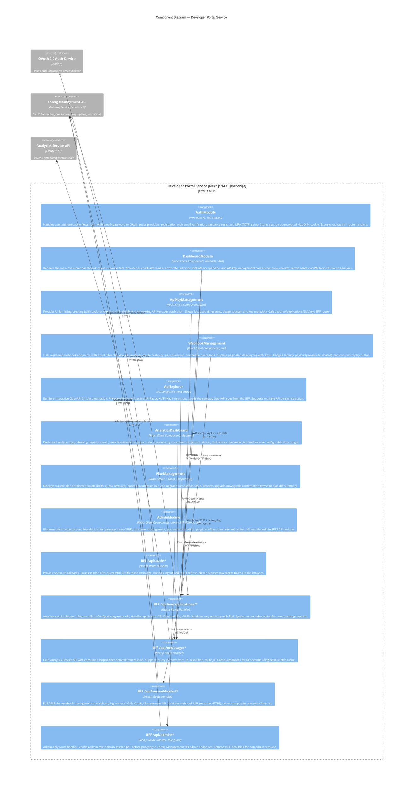
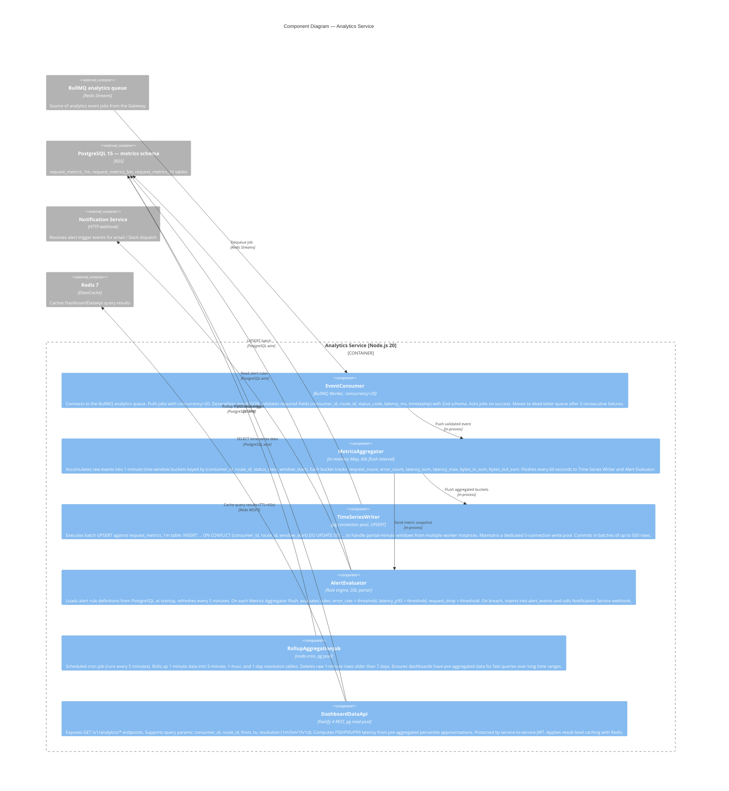
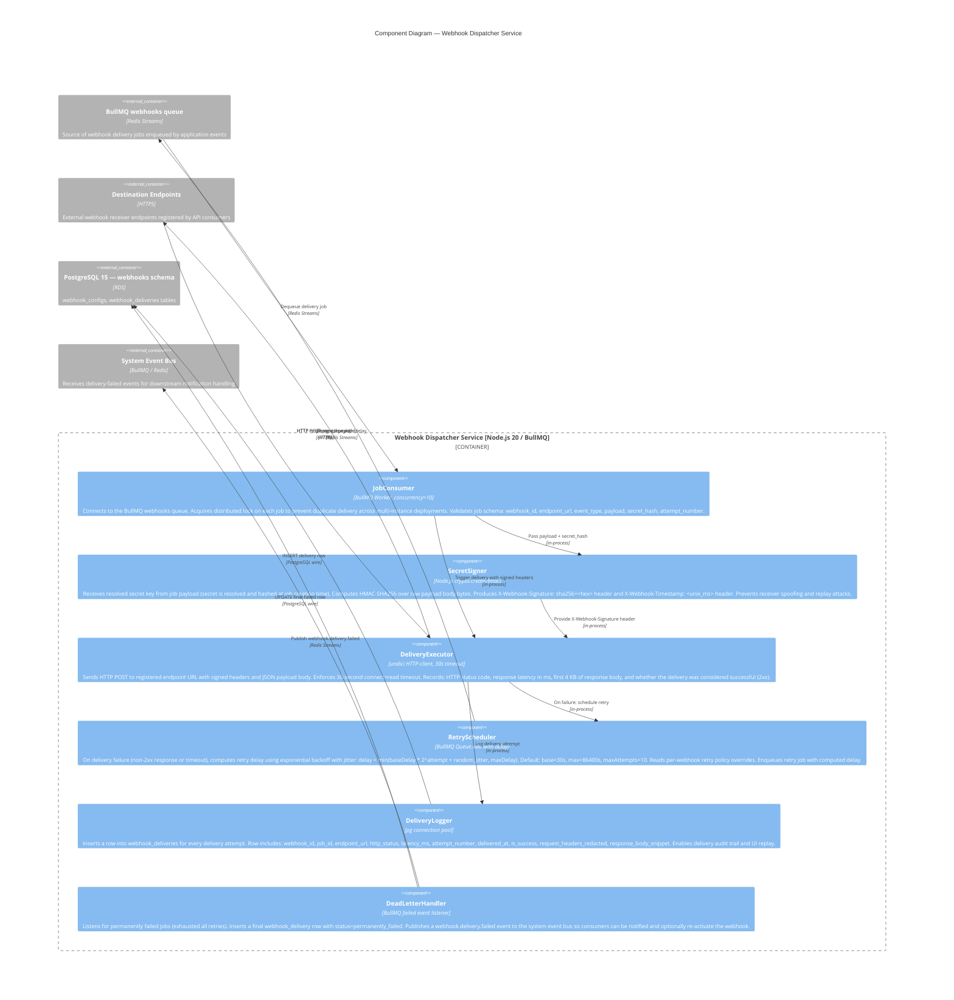

# C4 Model — Component Diagrams (Level 3)

## Overview

This document contains **C4 Level 3 — Component Diagrams** for the API Gateway and Developer Portal system. Level 3 zooms inside each container (established at Level 2) to show the major structural building blocks and their interactions.

### C4 Level Recap

| Level | Scope | Audience |
|---|---|---|
| L1 — System Context | Whole system + external actors | Everyone |
| L2 — Container | Deployable units (services, DBs) | Architects, Dev Leads |
| **L3 — Component** | **Internal components of each container** | **Developers** |
| L4 — Code | Classes, files, functions | Developers (optional) |

### Diagram Notation

The Mermaid C4Component diagrams below use the standard C4 notation conventions:

- **Component** — a named, well-defined block of functionality inside a container
- **ComponentDb** — a data-store component inside a container
- **Container_Boundary** — visual boundary grouping components of one container
- **Rel** — a directed relationship with a label describing the interface and protocol
- **Component_Ext / Container_Ext** — external components or containers referenced by this diagram

All components shown are co-deployed within their container and communicate in-process unless a protocol is explicitly annotated on the relationship.

---

## API Gateway Service

The API Gateway Service is built on **Node.js 20 + Fastify**. Its internal architecture uses the Fastify plugin system to compose orthogonal concerns (auth, rate limiting, transformation, routing, observability) into a deterministic processing pipeline.

```mermaid
C4Component
    title Component Diagram — API Gateway Service

    Container_Boundary(gw, "API Gateway Service [Node.js 20 / Fastify]") {
        Component(rr, "RequestRouter", "Fastify Routing Tree", "Matches incoming HTTP request path, method, and API version prefix to a registered RouteDefinition. Attaches route metadata and matched upstream group to the Fastify request context.")

        Component(pcm, "PluginChainManager", "fastify-plugin Registry", "Resolves plugin dependency graph at startup via topological sort. Registers plugins in correct order. Executes ordered pre-handler, handler, and post-handler chain for every request. Supports per-route plugin enable/disable.")

        Component(apk, "ApiKeyAuthComponent", "Node.js crypto, ioredis", "Extracts X-API-Key header. Computes HMAC-SHA256 prefix, performs O(1) Redis lookup, then constant-time comparison of full key hash. Attaches consumer_id and plan_id to request context on success.")

        Component(jwt, "JwtAuthComponent", "jose library, RS256/ES256", "Validates JWT Bearer token. Fetches JWKS from configured endpoint (cached). Verifies signature, expiry, issuer, and audience claims. Extracts consumer identity and scopes from token payload.")

        Component(oac, "OAuthComponent", "Token Introspection, RFC 7662", "Validates OAuth 2.0 access tokens via introspection endpoint or local JWT verification for tokens issued by the internal auth server. Caches introspection results in Redis with TTL equal to token remaining lifetime.")

        Component(swrl, "SlidingWindowRateLimiter", "ioredis, Lua atomic script", "Implements Redis-backed sliding-window rate limit per (consumer_id, route_id, window_size). Atomic Lua script prevents race conditions. Writes X-RateLimit-Limit, X-RateLimit-Remaining, X-RateLimit-Reset response headers. Returns HTTP 429 on breach.")

        Component(tbrl, "TokenBucketRateLimiter", "ioredis, Lua atomic script", "Alternative rate-limit strategy implementing token bucket algorithm. Used for burst-tolerant plans. Refills at configured tokens-per-second rate. Shares same header contract as SlidingWindowRateLimiter.")

        Component(reqt, "RequestTransformer", "fast-json-stringify, header map", "Applies declarative transformation rules to inbound request: add/remove/rename headers, JSON body field mapping, static header injection, payload size enforcement. Rules loaded from Config Loader cache.")

        Component(rest, "ResponseTransformer", "fast-json-stringify, header map", "Applies declarative transformation rules to outbound response: strip internal headers, add CORS headers, rename body fields, inject response metadata. Runs in post-handler Fastify hook.")

        Component(ulb, "UpstreamLoadBalancer", "undici HTTP client, WRR algorithm", "Maintains a live pool of upstream targets per route. Performs passive health tracking (failure-count threshold) and active health pings. Supports round-robin, weighted round-robin, and least-active-connections algorithms. Enforces upstream connection limits and timeout.")

        Component(ae, "AnalyticsEmitter", "BullMQ Queue, ioredis", "Registered as Fastify onResponse hook. Serialises analytics event (consumer_id, route_id, status_code, latency_ms, bytes_in, bytes_out, timestamp) and enqueues on BullMQ analytics queue. Non-blocking — failure logged but never surfaces to caller.")

        Component(cc, "ConfigCacheComponent", "pg pool, ioredis, Redis Pub/Sub", "Loads route definitions, consumer records, plugin configuration, and plan quotas from PostgreSQL on cache miss. Stores results in Redis with tiered TTLs. Subscribes to config-change Pub/Sub channel for proactive invalidation. Serves all other components.")

        Component(hce, "HealthCheckEndpoint", "Fastify route plugin", "Exposes GET /healthz/live (process alive), GET /healthz/ready (DB + Redis reachable), GET /healthz/deep (upstream probes included). Used by ECS health check, ALB target health, and external uptime monitors.")
    }

    Container_Ext(redis, "Redis 7", "ElastiCache", "Stores rate-limit counters, config cache, OAuth token cache, and upstream health state")
    Container_Ext(pg, "PostgreSQL 15", "RDS", "Authoritative store for route config, consumer records, API keys, plan definitions")
    Container_Ext(bullmq_q, "BullMQ analytics queue", "Redis Streams", "Durable queue for fire-and-forget analytics events")
    Container_Ext(upstream, "Upstream Services", "HTTP/HTTPS", "Backend services proxied by the gateway")
    Container_Ext(jwks, "JWKS Endpoint", "HTTPS", "Public key set endpoint for JWT signature verification")
    Container_Ext(introspect, "OAuth Introspection Endpoint", "HTTPS", "RFC 7662 token introspection for OAuth 2.0 access tokens")

    Rel(rr, pcm, "Passes route_context", "in-process")
    Rel(pcm, apk, "Invokes (auth strategy = api_key)", "in-process")
    Rel(pcm, jwt, "Invokes (auth strategy = jwt)", "in-process")
    Rel(pcm, oac, "Invokes (auth strategy = oauth2)", "in-process")
    Rel(pcm, swrl, "Invokes rate-limiter", "in-process")
    Rel(pcm, tbrl, "Invokes rate-limiter (burst plans)", "in-process")
    Rel(pcm, reqt, "Invokes pre-handler", "in-process")
    Rel(pcm, rest, "Invokes post-handler", "in-process")
    Rel(pcm, ulb, "Invokes proxy handler", "in-process")
    Rel(pcm, ae, "Invokes onResponse hook", "in-process")
    Rel(pcm, cc, "Loads plugin config at boot", "in-process")

    Rel(apk, redis, "HMAC key lookup + compare", "Redis RESP3")
    Rel(apk, cc, "Reads consumer record", "in-process")
    Rel(jwt, jwks, "Fetches public JWKS (cached)", "HTTPS")
    Rel(oac, introspect, "Token introspection call", "HTTPS")
    Rel(oac, redis, "Caches introspection result", "Redis RESP3")

    Rel(swrl, redis, "Atomic Lua sliding-window counter", "Redis RESP3")
    Rel(swrl, cc, "Reads quota from plan config", "in-process")
    Rel(tbrl, redis, "Atomic Lua token-bucket state", "Redis RESP3")
    Rel(tbrl, cc, "Reads burst quota from plan config", "in-process")

    Rel(reqt, cc, "Reads transform rules", "in-process")
    Rel(rest, cc, "Reads transform rules", "in-process")

    Rel(ulb, upstream, "Proxied HTTP/HTTPS request", "HTTP 1.1 / HTTP 2")
    Rel(ulb, redis, "Reads/writes upstream health state", "Redis RESP3")
    Rel(ulb, cc, "Reads upstream target list", "in-process")

    Rel(ae, bullmq_q, "Enqueues analytics event job", "Redis Streams")

    Rel(cc, redis, "Cache read/write (tiered TTL)", "Redis RESP3")
    Rel(cc, pg, "Config SQL SELECT on cache miss", "PostgreSQL wire")

    Rel(hce, redis, "PING liveness check", "Redis RESP3")
    Rel(hce, pg, "SELECT 1 readiness check", "PostgreSQL wire")
    Rel(hce, upstream, "HTTP probe (deep check)", "HTTP")
```

---

## Developer Portal Service

The Developer Portal is a **Next.js 14 App Router** application deployed on ECS Fargate. It uses the Backend-for-Frontend pattern where Next.js Route Handlers hold session credentials server-side and call downstream services on behalf of the authenticated user.

---

## Analytics Service

The Analytics Service is a **Node.js 20 BullMQ worker** with an embedded Fastify REST server. It decouples analytics processing from the gateway's request path and provides a queryable metrics API to the Developer Portal.

---

## Webhook Dispatcher Service

The Webhook Dispatcher is a **Node.js 20 BullMQ worker** that provides reliable, signed, at-least-once delivery of webhook events to registered consumer endpoints with exponential backoff retry.

---

## Component Descriptions Table

Complete reference of all components across all containers.

| ID | Name | Container | Technology | Responsibility |
|---|---|---|---|---|
| GW-01 | RequestRouter | API Gateway | Fastify routing tree | Matches path/method/version to RouteDefinition; attaches to request context |
| GW-02 | PluginChainManager | API Gateway | fastify-plugin registry | Topological plugin load; ordered chain execution per request |
| GW-03 | ApiKeyAuthComponent | API Gateway | Node.js crypto, ioredis | HMAC-SHA256 API key validation; attaches consumer identity |
| GW-04 | JwtAuthComponent | API Gateway | jose, RS256/ES256 | JWT Bearer validation against JWKS; extracts claims |
| GW-05 | OAuthComponent | API Gateway | RFC 7662 introspection | OAuth 2.0 access token validation; Redis-cached introspection |
| GW-06 | SlidingWindowRateLimiter | API Gateway | ioredis, Lua script | Atomic sliding-window counter per consumer+route; HTTP 429 on breach |
| GW-07 | TokenBucketRateLimiter | API Gateway | ioredis, Lua script | Token bucket for burst-tolerant plans; same header contract |
| GW-08 | RequestTransformer | API Gateway | fast-json-stringify | Declarative inbound header + body transformation |
| GW-09 | ResponseTransformer | API Gateway | fast-json-stringify | Declarative outbound header + body transformation |
| GW-10 | UpstreamLoadBalancer | API Gateway | undici, WRR algorithm | Multi-target proxy with health-check-aware load balancing |
| GW-11 | AnalyticsEmitter | API Gateway | BullMQ Queue, ioredis | Fire-and-forget analytics event enqueue in onResponse hook |
| GW-12 | ConfigCacheComponent | API Gateway | pg pool, ioredis, Pub/Sub | Tiered config cache with proactive Redis Pub/Sub invalidation |
| GW-13 | HealthCheckEndpoint | API Gateway | Fastify route plugin | /healthz/live, /healthz/ready, /healthz/deep endpoints |
| PO-01 | AuthModule | Developer Portal | next-auth v5, JWT cookie | Login, register, MFA, password-reset; HttpOnly session cookie |
| PO-02 | DashboardModule | Developer Portal | React, Recharts, SWR | Request metrics tiles, time-series charts, key management cards |
| PO-03 | ApiKeyManagement | Developer Portal | React, Zod | API key list, create, revoke with expiry + IP allowlist support |
| PO-04 | WebhookManagement | Developer Portal | React, Zod | Webhook CRUD, delivery log, test-ping, replay |
| PO-05 | ApiExplorer | Developer Portal | @stoplight/elements | Interactive OpenAPI 3.1 docs with live try-it-out |
| PO-06 | AnalyticsDashboard | Developer Portal | React, Recharts | Deep analytics page with percentile charts and time-range selection |
| PO-07 | PlanManagement | Developer Portal | React Server+Client | Plan entitlement view, quota bars, upgrade comparison table |
| PO-08 | AdminModule | Developer Portal | React, admin role guard | Admin UI for routes, consumers, plans, plugins, alerts |
| PO-09 | BFF /api/auth/* | Developer Portal | Next.js Route Handler | next-auth callbacks; token exchange; session lifecycle |
| PO-10 | BFF /api/me/applications/* | Developer Portal | Next.js Route Handler | Consumer + key CRUD via Config Management API |
| PO-11 | BFF /api/me/usage/* | Developer Portal | Next.js Route Handler | Analytics queries via Analytics Service API (consumer-scoped) |
| PO-12 | BFF /api/me/webhooks/* | Developer Portal | Next.js Route Handler | Webhook CRUD via Config Management API |
| PO-13 | BFF /api/admin/* | Developer Portal | Next.js Route Handler | Admin ops via Config Management API (admin role guard) |
| AN-01 | EventConsumer | Analytics Service | BullMQ Worker | Dequeue + validate analytics events; ack/dead-letter |
| AN-02 | MetricsAggregator | Analytics Service | In-memory Map, 60s flush | 1-minute bucket aggregation; flush to writer + evaluator |
| AN-03 | TimeSeriesWriter | Analytics Service | pg pool, UPSERT | Batch UPSERT to request_metrics_1m |
| AN-04 | AlertEvaluator | Analytics Service | Rule DSL, pg pool | Threshold rule evaluation; alert_events insert; notification dispatch |
| AN-05 | RollupAggregationJob | Analytics Service | node-cron, pg pool | 5m/1h/1d rollup cron; 7-day 1m retention prune |
| AN-06 | DashboardDataApi | Analytics Service | Fastify REST, pg pool | /v1/analytics/* API with time-range + resolution query params |
| WD-01 | JobConsumer | Webhook Dispatcher | BullMQ Worker | Dequeue delivery jobs with distributed lock; schema validation |
| WD-02 | SecretSigner | Webhook Dispatcher | crypto.createHmac | X-Webhook-Signature + X-Webhook-Timestamp header generation |
| WD-03 | DeliveryExecutor | Webhook Dispatcher | undici, 30s timeout | HTTP POST to endpoint; captures status, latency, response snippet |
| WD-04 | RetryScheduler | Webhook Dispatcher | BullMQ Queue.add delay | Exponential backoff retry scheduling; per-webhook policy overrides |
| WD-05 | DeliveryLogger | Webhook Dispatcher | pg pool | Full delivery audit log; INSERT per attempt |
| WD-06 | DeadLetterHandler | Webhook Dispatcher | BullMQ failed listener | Permanently-failed job handling; webhook.delivery.failed event |

---

## Key Component Interactions

### Scenario 1 — Authenticated API Request (API Key, Rate Limited)

1. An HTTP request arrives at the Gateway. **RequestRouter** (GW-01) matches the path `/v1/orders` to a `RouteDefinition` with auth strategy `api_key` and rate limit plan `standard_1000rpm`.
2. **PluginChainManager** (GW-02) reads the plugin chain for this route from **ConfigCacheComponent** (GW-12) and executes plugins in order.
3. **ApiKeyAuthComponent** (GW-03) extracts the `X-API-Key` header, computes the HMAC prefix, performs an O(1) Redis lookup on the hashed key index, and does a constant-time comparison. On success, it attaches `consumer_id=cns_abc123` and `plan_id=plan_std` to the request context.
4. **SlidingWindowRateLimiter** (GW-06) executes an atomic Lua script against Redis, incrementing the sliding-window counter for `cns_abc123:route_orders:1000rpm`. Quota is 1000 RPM; current count is 342. Writes `X-RateLimit-Remaining: 658` to the response. Allows the request.
5. **RequestTransformer** (GW-08) adds `X-Consumer-ID: cns_abc123` and removes the internal `X-Internal-Auth` header per the route's transform rules.
6. **UpstreamLoadBalancer** (GW-10) selects a healthy upstream target using weighted round-robin and proxies the request via `undici`.
7. **ResponseTransformer** (GW-09) strips internal headers from the upstream response and adds `X-Request-ID`.
8. **AnalyticsEmitter** (GW-11) fires a BullMQ job with `{consumer_id, route_id, status: 200, latency_ms: 48, bytes_in: 0, bytes_out: 1240}` asynchronously.

### Scenario 2 — Rate Limit Breach

Steps 1–4 occur as above. At step 4, the sliding-window counter is at 1000/1000. The Lua script returns a `limited=true` signal. **SlidingWindowRateLimiter** (GW-06) writes `X-RateLimit-Remaining: 0`, `Retry-After: 12` headers and returns `HTTP 429 Too Many Requests` with a standard error body. The **AnalyticsEmitter** (GW-11) still fires, recording the 429 status for quota-breach analytics.

### Scenario 3 — Developer Registers and Creates API Key

1. User submits the registration form in **AuthModule** (PO-01). The **BFF /api/auth/*** (PO-09) route handler calls the OAuth 2.0 Auth Service to create a user account and issue tokens. A session cookie is set.
2. The user navigates to **ApiKeyManagement** (PO-03) on the Dashboard. The component calls **BFF /api/me/applications/** (PO-10).
3. The BFF route handler attaches the session Bearer token, calls the Config Management API `POST /v1/me/applications`, which creates a consumer record in PostgreSQL via **ConfigCacheComponent** (GW-12).
4. The user creates an API key. The BFF calls `POST /v1/me/applications/{id}/keys`. The Config Management API generates a random 32-byte key, computes its HMAC-SHA256 hash, stores the hash in the `api_keys` table, and returns the plaintext key once (only visible at creation time).
5. **ConfigCacheComponent** (GW-12) receives a Redis Pub/Sub `config.invalidated` message for the consumer's key cache entry and evicts the stale entry.

### Scenario 4 — Analytics Event Processing

1. **AnalyticsEmitter** (GW-11) enqueues 1,000 events per minute to the BullMQ analytics queue during a peak traffic period.
2. **EventConsumer** (AN-01) dequeues events with concurrency=20, validates each event, and pushes it to **MetricsAggregator** (AN-02).
3. **MetricsAggregator** (AN-02) accumulates events into 1-minute buckets. After 60 seconds, it flushes all buckets to **TimeSeriesWriter** (AN-03) and **AlertEvaluator** (AN-04).
4. **TimeSeriesWriter** (AN-03) executes a batch UPSERT of 450 aggregated rows (45 consumer+route combinations × some routes with multiple status classes) into `request_metrics_1m`.
5. **AlertEvaluator** (AN-04) checks the flush snapshot against all active alert rules. The rule `error_rate(consumer=cns_xyz, route=payments) > 0.10` triggers because 11.2% of payment requests returned 5xx. It inserts an `alert_events` row and calls the Notification Service webhook.

### Scenario 5 — Webhook Delivery with Retry

1. A platform event `api_key.created` is published to the BullMQ webhooks queue for consumer `cns_abc123`, which has a registered webhook endpoint `https://example.com/hooks/gateway` subscribed to this event type.
2. **JobConsumer** (WD-01) dequeues the job and acquires a distributed lock to prevent duplicate delivery.
3. **SecretSigner** (WD-02) computes `X-Webhook-Signature: sha256=<hex>` using the stored secret hash.
4. **DeliveryExecutor** (WD-03) sends `HTTP POST https://example.com/hooks/gateway` with the signed headers and JSON payload. The endpoint returns `HTTP 503 Service Unavailable`.
5. **DeliveryLogger** (WD-05) inserts a delivery row with `http_status=503, is_success=false, attempt_number=1`.
6. **RetryScheduler** (WD-04) schedules a retry job with delay = `30s * 2^0 + jitter = ~32s`.
7. On the second attempt, the endpoint returns `HTTP 200 OK`. **DeliveryLogger** (WD-05) records the successful delivery. No further retry is scheduled.

---

## Cross-Container Component Relationships

The table below summarises the cross-container calls between components of different services.

| From Component | To Component | Interface | Protocol | Notes |
|---|---|---|---|---|
| GW-11 AnalyticsEmitter | AN-01 EventConsumer | BullMQ job enqueue | Redis Streams | Decoupled via queue; no direct in-process call |
| PO-09 BFF /api/auth/* | OAuth 2.0 Auth Service | Token exchange, refresh, revoke | HTTPS REST | next-auth adapter |
| PO-10 BFF /api/me/applications/* | GW-12 ConfigCacheComponent (via Mgmt API) | Consumer + key CRUD | HTTPS REST | Mgmt API is the public interface; ConfigCacheComponent invalidates on write |
| PO-11 BFF /api/me/usage/* | AN-06 DashboardDataApi | Analytics time-series queries | HTTPS REST | Consumer-scoped filter derived from session |
| PO-12 BFF /api/me/webhooks/* | GW-12 ConfigCacheComponent (via Mgmt API) | Webhook CRUD | HTTPS REST | Webhook config stored in PostgreSQL |
| Mgmt API (write path) | GW-12 ConfigCacheComponent | Cache invalidation | Redis Pub/Sub | Config change publishes `config.invalidated` channel message |
| Platform event publisher | WD-01 JobConsumer | Webhook delivery job | Redis Streams (BullMQ) | System events enqueued when api_key.created, quota.breach, etc. fire |
