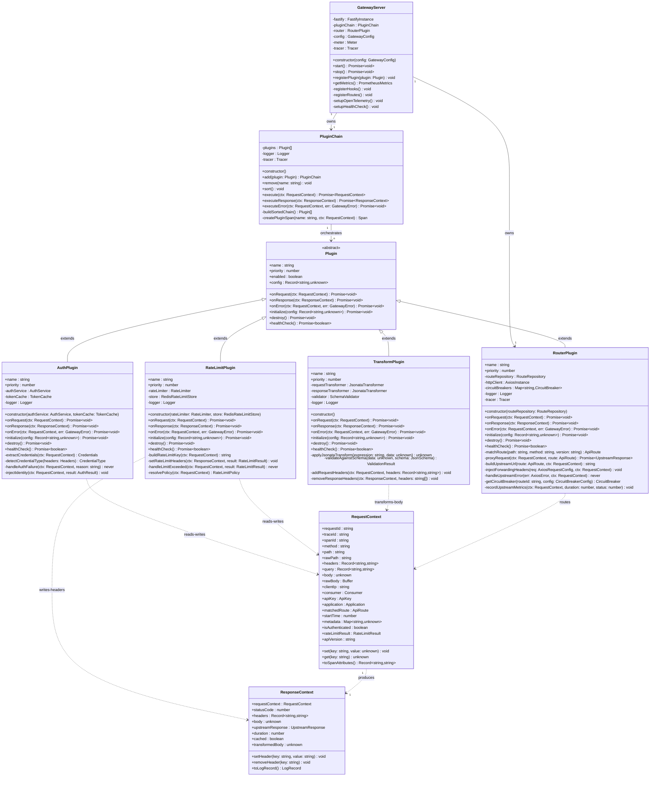
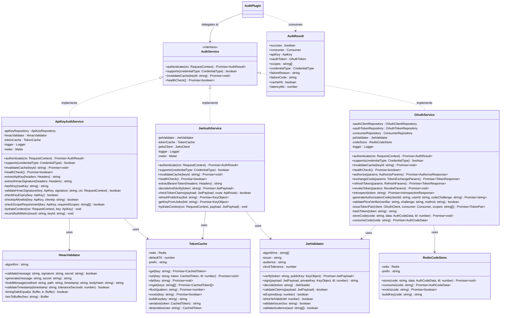
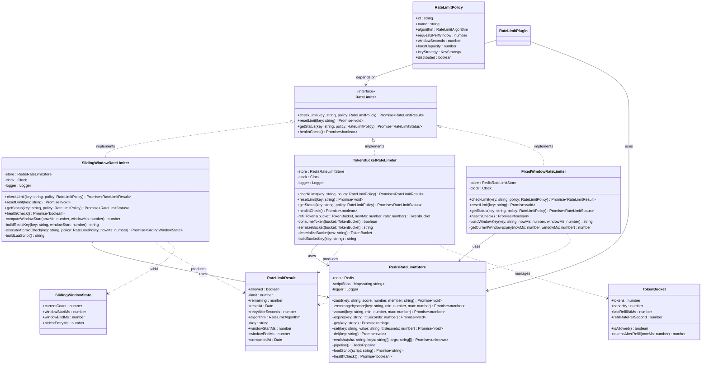

# Class Diagram

## 1. Overview of Object-Oriented Design

This document describes the object-oriented architecture of the API Gateway (Node.js 20 + Fastify) and
the Developer Portal (Next.js 14 + TypeScript). The design adheres to the following principles:

- **Single Responsibility**: Every class has one primary reason to change.
- **Open/Closed**: Gateway behaviour is extended by adding new Plugin implementations, not by modifying
  the PluginChain orchestrator.
- **Liskov Substitution**: All concrete AuthService and RateLimiter strategies are interchangeable
  through their interfaces.
- **Interface Segregation**: Thin interfaces (AuthService, RateLimiter, Repository) expose only the
  methods consumers require.
- **Dependency Inversion**: High-level modules (GatewayServer, AuthPlugin) depend on abstractions,
  not on concrete Redis or PostgreSQL clients.

### Design Patterns Applied

| Pattern                  | Where Applied                                              |
|--------------------------|------------------------------------------------------------|
| Plugin / Chain of Resp.  | PluginChain orchestrating Auth, RateLimit, Transform, Route|
| Strategy                 | AuthService, RateLimiter — selectable at construction time |
| Repository               | All database access isolated behind Repository interfaces  |
| Proxy                    | RouterPlugin forwards requests to upstream services        |
| Template Method          | Plugin abstract base class defines hook lifecycle          |
| Decorator                | AuthPlugin, RateLimitPlugin, TransformPlugin wrap context  |
| Factory                  | PluginFactory builds plugin instances from DB config       |
| Circuit Breaker          | RouterPlugin wraps upstream calls via Opossum              |
| Cache-Aside              | TokenCache, RouteRepository use Redis as L1 cache          |

### Namespace Layout

| Namespace        | Description                                                       |
|------------------|-------------------------------------------------------------------|
| `@gateway/core`  | GatewayServer, PluginChain, Plugin base, request/response context |
| `@gateway/auth`  | AuthPlugin, ApiKeyAuthService, JwtAuthService, OAuthService       |
| `@gateway/rl`    | RateLimitPlugin, SlidingWindowRateLimiter, TokenBucketRateLimiter |
| `@gateway/proxy` | RouterPlugin, CircuitBreaker, UpstreamClient                      |
| `@portal/api`    | Next.js API route handlers                                        |
| `@shared/repo`   | Repository interfaces and PostgreSQL implementations              |
| `@shared/domain` | Domain value objects and DTOs                                     |

---

## 2. Gateway Core Classes

---

## 3. Authentication Classes

---

## 4. Rate Limiting Classes

---

## 5. Repository Layer

```mermaid
classDiagram
    class Repository~T~ {
        <<interface>>
        +findById(id: string) Promise~T~
        +findMany(filter: Partial~T~, pagination: Pagination) Promise~PageResult~T~~
        +create(data: CreateDto~T~) Promise~T~
        +update(id: string, data: Partial~T~) Promise~T~
        +delete(id: string) Promise~boolean~
        +count(filter: Partial~T~) Promise~number~
    }

    class ApiKeyRepository {
        -db : Pool
        -readDb : Pool
        -cache : KeyValueCache
        -logger : Logger
        +findById(id: string) Promise~ApiKey~
        +findMany(filter: Partial~ApiKey~, pagination: Pagination) Promise~PageResult~ApiKey~~
        +create(data: CreateApiKeyDto) Promise~ApiKey~
        +update(id: string, data: Partial~ApiKey~) Promise~ApiKey~
        +delete(id: string) Promise~boolean~
        +count(filter: Partial~ApiKey~) Promise~number~
        +findByKeyHash(hash: string) Promise~ApiKey~
        +findByPrefix(prefix: string) Promise~ApiKey[]~
        +findActiveByApplication(appId: string) Promise~ApiKey[]~
        +incrementUsageCount(id: string) Promise~void~
        +updateLastUsed(id: string, usedAt: Date) Promise~void~
        +revokeKey(id: string, reason: string) Promise~void~
        +expireOverdueKeys() Promise~number~
        -cacheKey(hash: string) ApiKey
        -invalidateCache(id: string) Promise~void~
    }

    class ConsumerRepository {
        -db : Pool
        -logger : Logger
        +findById(id: string) Promise~Consumer~
        +findMany(filter: Partial~Consumer~, pagination: Pagination) Promise~PageResult~Consumer~~
        +create(data: CreateConsumerDto) Promise~Consumer~
        +update(id: string, data: Partial~Consumer~) Promise~Consumer~
        +delete(id: string) Promise~boolean~
        +count(filter: Partial~Consumer~) Promise~number~
        +findByEmail(email: string) Promise~Consumer~
        +softDelete(id: string) Promise~boolean~
        +verifyEmail(id: string, verifiedAt: Date) Promise~void~
        +updateLastLogin(id: string, loginAt: Date) Promise~void~
        +updatePassword(id: string, passwordHash: string) Promise~void~
    }

    class ApplicationRepository {
        -db : Pool
        -logger : Logger
        +findById(id: string) Promise~Application~
        +findMany(filter: Partial~Application~, pagination: Pagination) Promise~PageResult~Application~~
        +create(data: CreateApplicationDto) Promise~Application~
        +update(id: string, data: Partial~Application~) Promise~Application~
        +delete(id: string) Promise~boolean~
        +count(filter: Partial~Application~) Promise~number~
        +findByConsumer(consumerId: string) Promise~Application[]~
        +countByConsumer(consumerId: string) Promise~number~
        +findWithPlan(id: string) Promise~ApplicationWithPlan~
    }

    class RouteRepository {
        -db : Pool
        -cache : KeyValueCache
        -logger : Logger
        +findById(id: string) Promise~ApiRoute~
        +findMany(filter: Partial~ApiRoute~, pagination: Pagination) Promise~PageResult~ApiRoute~~
        +create(data: CreateRouteDto) Promise~ApiRoute~
        +update(id: string, data: Partial~ApiRoute~) Promise~ApiRoute~
        +delete(id: string) Promise~boolean~
        +count(filter: Partial~ApiRoute~) Promise~number~
        +findActiveByVersion(versionId: string) Promise~ApiRoute[]~
        +findWithPlugins(id: string) Promise~RouteWithPlugins~
        +loadRoutingTable(versionId: string) Promise~RoutingTable~
        +invalidateCache(versionId: string) Promise~void~
    }

    class OAuthClientRepository {
        -db : Pool
        -logger : Logger
        +findById(id: string) Promise~OAuthClient~
        +findMany(filter: Partial~OAuthClient~, pagination: Pagination) Promise~PageResult~OAuthClient~~
        +create(data: CreateOAuthClientDto) Promise~OAuthClient~
        +update(id: string, data: Partial~OAuthClient~) Promise~OAuthClient~
        +delete(id: string) Promise~boolean~
        +count(filter: Partial~OAuthClient~) Promise~number~
        +findByClientId(clientId: string) Promise~OAuthClient~
        +findByApplication(appId: string) Promise~OAuthClient[]~
    }

    class OAuthTokenRepository {
        -db : Pool
        -logger : Logger
        +findById(id: string) Promise~OAuthToken~
        +findMany(filter: Partial~OAuthToken~, pagination: Pagination) Promise~PageResult~OAuthToken~~
        +create(data: CreateOAuthTokenDto) Promise~OAuthToken~
        +update(id: string, data: Partial~OAuthToken~) Promise~OAuthToken~
        +delete(id: string) Promise~boolean~
        +count(filter: Partial~OAuthToken~) Promise~number~
        +findByAccessTokenHash(hash: string) Promise~OAuthToken~
        +findByRefreshTokenHash(hash: string) Promise~OAuthToken~
        +revokeByClientAndConsumer(clientId: string, consumerId: string) Promise~number~
        +revokeToken(id: string, reason: string) Promise~void~
        +cleanExpiredTokens() Promise~number~
    }

    class WebhookSubscriptionRepository {
        -db : Pool
        -logger : Logger
        +findById(id: string) Promise~WebhookSubscription~
        +findMany(filter: Partial~WebhookSubscription~, pagination: Pagination) Promise~PageResult~WebhookSubscription~~
        +create(data: CreateWebhookDto) Promise~WebhookSubscription~
        +update(id: string, data: Partial~WebhookSubscription~) Promise~WebhookSubscription~
        +delete(id: string) Promise~boolean~
        +count(filter: Partial~WebhookSubscription~) Promise~number~
        +findByEventType(eventType: string) Promise~WebhookSubscription[]~
        +findActiveByApplication(appId: string) Promise~WebhookSubscription[]~
        +findFailingSubscriptions() Promise~WebhookSubscription[]~
        +incrementFailureCount(id: string) Promise~void~
        +resetFailureCount(id: string) Promise~void~
        +suspend(id: string) Promise~void~
    }

    class WebhookDeliveryRepository {
        -db : Pool
        -logger : Logger
        +findById(id: string) Promise~WebhookDelivery~
        +findMany(filter: Partial~WebhookDelivery~, pagination: Pagination) Promise~PageResult~WebhookDelivery~~
        +create(data: CreateDeliveryDto) Promise~WebhookDelivery~
        +update(id: string, data: Partial~WebhookDelivery~) Promise~WebhookDelivery~
        +delete(id: string) Promise~boolean~
        +count(filter: Partial~WebhookDelivery~) Promise~number~
        +findPendingRetries(beforeAt: Date, limit: number) Promise~WebhookDelivery[]~
        +markDelivered(id: string, deliveredAt: Date) Promise~void~
        +markFailed(id: string, errorMessage: string) Promise~void~
        +scheduleRetry(id: string, nextRetryAt: Date, attemptNumber: number) Promise~void~
        +deadLetter(id: string) Promise~void~
    }

    class AnalyticsRepository {
        -db : Pool
        -writeDb : Pool
        -logger : Logger
        +findById(id: string) Promise~AnalyticsEvent~
        +findMany(filter: Partial~AnalyticsEvent~, pagination: Pagination) Promise~PageResult~AnalyticsEvent~~
        +create(data: CreateAnalyticsDto) Promise~AnalyticsEvent~
        +update(id: string, data: Partial~AnalyticsEvent~) Promise~AnalyticsEvent~
        +delete(id: string) Promise~boolean~
        +count(filter: Partial~AnalyticsEvent~) Promise~number~
        +batchInsert(events: CreateAnalyticsDto[]) Promise~void~
        +findHourlySummary(appId: string, from: Date, to: Date) Promise~HourlySummary[]~
        +findRouteMetrics(routeId: string, window: TimeWindow) Promise~RouteMetrics~
        +findErrorRates(appId: string, window: TimeWindow) Promise~ErrorRateData~
        +findTopRoutes(appId: string, limit: number) Promise~RouteRanking[]~
        +findLatencyPercentiles(routeId: string, window: TimeWindow) Promise~LatencyStats~
    }

    Repository       <|..      ApiKeyRepository               : implements
    Repository       <|..      ConsumerRepository             : implements
    Repository       <|..      ApplicationRepository          : implements
    Repository       <|..      RouteRepository                : implements
    Repository       <|..      OAuthClientRepository          : implements
    Repository       <|..      OAuthTokenRepository           : implements
    Repository       <|..      WebhookSubscriptionRepository  : implements
    Repository       <|..      WebhookDeliveryRepository      : implements
    Repository       <|..      AnalyticsRepository            : implements
    ApiKeyAuthService      --> ApiKeyRepository               : depends on
    OAuthService           --> OAuthClientRepository          : depends on
    OAuthService           --> OAuthTokenRepository           : depends on
    RouterPlugin           --> RouteRepository                : depends on
```

---

## 6. Class Responsibility Summary

| Class                            | Pattern                     | Primary Responsibility                                                 |
|----------------------------------|-----------------------------|------------------------------------------------------------------------|
| `GatewayServer`                  | Facade                      | Bootstrap Fastify, wire plugins, expose start/stop/metrics             |
| `PluginChain`                    | Chain of Responsibility     | Sort plugins by priority and execute in order, propagate errors        |
| `Plugin`                         | Template Method             | Define onRequest/onResponse/onError lifecycle hooks                    |
| `AuthPlugin`                     | Strategy + Decorator        | Detect credential type, delegate to AuthService, inject identity       |
| `RateLimitPlugin`                | Decorator                   | Enforce rate limits, set X-RateLimit-* headers, reject excess traffic  |
| `TransformPlugin`                | Decorator                   | Apply JSONata transforms to request/response bodies                    |
| `RouterPlugin`                   | Proxy                       | Match routes, proxy to upstream, apply circuit breakers                |
| `RequestContext`                 | Context / Value Object      | Carry mutable per-request state through the entire plugin chain        |
| `ResponseContext`                | Context / Value Object      | Carry mutable per-response state through the plugin chain              |
| `ApiKeyAuthService`              | Strategy                    | HMAC-SHA256 API key authentication with Redis cache                    |
| `JwtAuthService`                 | Strategy                    | RS256 JWT verification with JWKS key rotation                          |
| `OAuthService`                   | Strategy + Service          | Full OAuth 2.0 server: authorize, token exchange, refresh, revoke      |
| `HmacValidator`                  | Utility                     | Timing-safe HMAC-SHA256 generation and constant-time comparison        |
| `JwtValidator`                   | Utility                     | JWT signing, verification, and claims validation                       |
| `TokenCache`                     | Cache-Aside                 | Redis-backed token caching with TTL and prefix namespacing             |
| `RedisCodeStore`                 | Store                       | Short-lived authorization code storage for OAuth PKCE flow             |
| `SlidingWindowRateLimiter`       | Strategy                    | Atomic Redis sorted-set sliding-window counter                         |
| `TokenBucketRateLimiter`         | Strategy                    | Redis-backed token bucket with configurable refill rate                |
| `FixedWindowRateLimiter`         | Strategy                    | Simple fixed-window counter using Redis INCR + EXPIRE                  |
| `RedisRateLimitStore`            | Adapter                     | Redis command abstraction for rate limit operations with Lua scripts    |
| `RateLimitResult`                | Value Object                | Immutable result of a rate limit check including headers values        |
| `TokenBucket`                    | Value Object                | Bucket state serialized to/from Redis                                  |
| `ApiKeyRepository`               | Repository                  | CRUD + cache invalidation for api_keys table                           |
| `ConsumerRepository`             | Repository                  | CRUD for consumers with soft-delete and email verification             |
| `ApplicationRepository`          | Repository                  | CRUD for applications with consumer-scoped queries                     |
| `RouteRepository`                | Repository                  | Route loading with plugin hydration and routing table cache            |
| `OAuthClientRepository`          | Repository                  | OAuth 2.0 client CRUD                                                  |
| `OAuthTokenRepository`           | Repository                  | Token lifecycle: create, revoke, cleanup expired                       |
| `WebhookSubscriptionRepository`  | Repository                  | Webhook CRUD with failure-count tracking and suspension                |
| `WebhookDeliveryRepository`      | Repository                  | Delivery attempt CRUD with retry scheduling and dead-lettering         |
| `AnalyticsRepository`            | Repository                  | High-throughput batch insert and time-series aggregation queries       |
