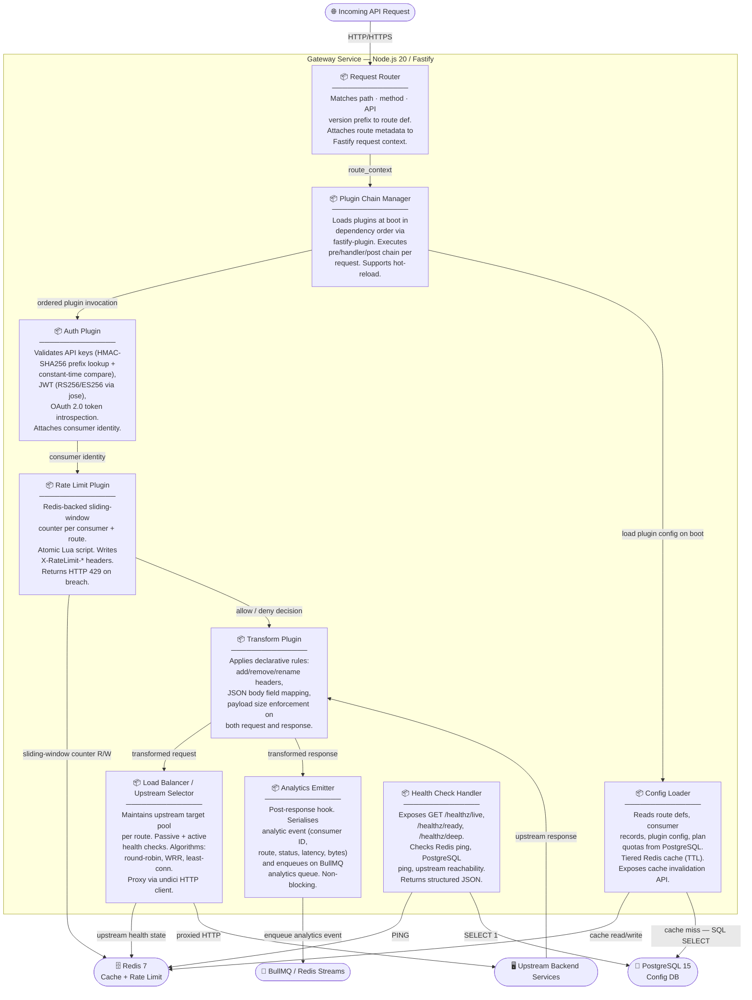
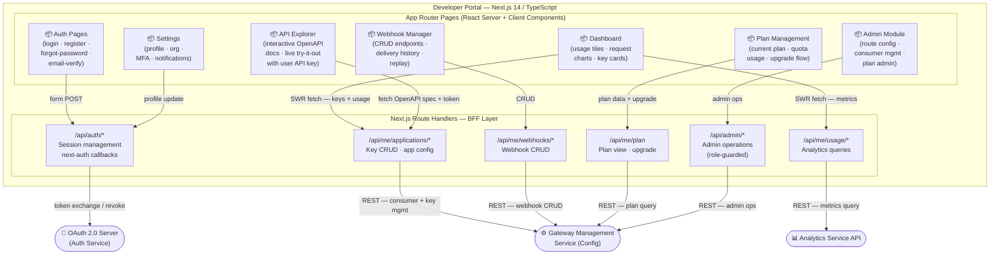
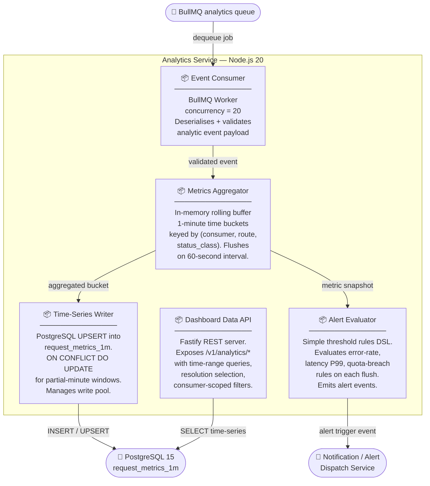
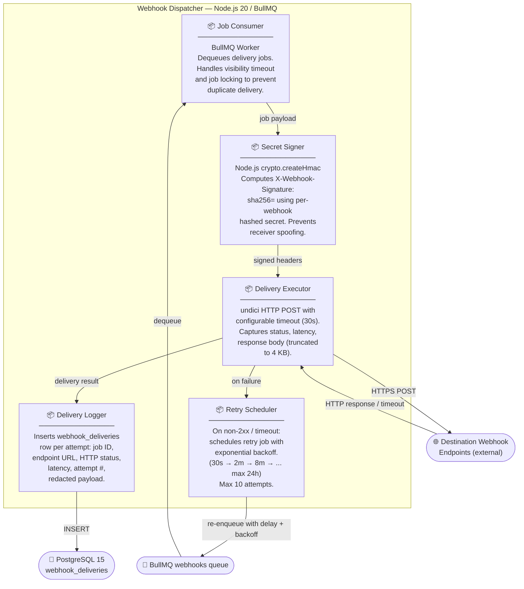

# Component Diagram — API Gateway and Developer Portal

## Overview

This document presents a **component-level (C4 Level 3) decomposition** of the API Gateway and Developer Portal system. Building on the container-level view, each container is expanded into its internal components — cohesive, deployable units of implementation with well-defined responsibilities and interfaces.

The system is organised into four containers:

| Container | Runtime | Primary Role |
|---|---|---|
| **Gateway Service** | Node.js 20 + Fastify | Runtime reverse proxy — auth, rate-limit, transform, forward |
| **Developer Portal** | Next.js 14 App Router + TypeScript | Self-service web app for API consumers and admins |
| **Analytics Service** | Node.js 20 + BullMQ Worker | Consumes telemetry events, aggregates metrics, serves analytics API |
| **Webhook Dispatcher** | Node.js 20 + BullMQ Worker | Delivers webhook events to registered endpoints with retry logic |

Each container is decomposed below. Mermaid diagrams use `flowchart` notation with component subgraphs; relationship labels describe the interface or protocol used.

---

## Gateway Service Components

The Gateway Service is a Node.js 20 application built on the **Fastify plugin architecture**. Every cross-cutting concern is encapsulated as a Fastify plugin registered with `fastify-plugin`. The Plugin Chain Manager composes and sequences these plugins at startup based on per-route configuration loaded from PostgreSQL (with Redis caching).

### Gateway Component Descriptions

| Component | Technology | Responsibility |
|---|---|---|
| **Request Router** | Fastify routing tree | Matches incoming HTTP request by path, method, and API version prefix (`/v1/`, `/v2/`). Attaches a `routeDefinition` object to the Fastify request context for downstream plugins. |
| **Plugin Chain Manager** | `fastify-plugin`, plugin registry | Resolves plugin dependency graph at startup and registers plugins in correct order. For each request, executes the configured pre-handler → handler → post-handler chain. Supports runtime plugin enable/disable per route without service restart. |
| **Auth Plugin** | `jose`, Node.js `crypto` | Three auth sub-strategies composed in sequence: (1) API key — HMAC-SHA256 prefix lookup in Redis then constant-time string comparison; (2) JWT — verifies signature against JWKS endpoint, validates `exp`, `iss`, `aud`; (3) OAuth 2.0 — token introspection call or local JWT verification. Attaches `req.consumer` on success. |
| **Rate Limit Plugin** | `ioredis`, Lua atomic script | Implements sliding-window rate limiting. The Lua script atomically increments a sorted-set counter keyed by `consumer:route:window`. Reads quota from Config Loader. Emits `X-RateLimit-Limit`, `X-RateLimit-Remaining`, `X-RateLimit-Reset` headers. Returns HTTP 429 with `Retry-After` when quota is exhausted. |
| **Transform Plugin** | `fast-json-stringify`, header map | Applies declarative transformation rules stored in route config. Supports: header add/remove/rename, body field include/exclude/rename, static value injection, payload size cap. Applied symmetrically to both inbound request and outbound response. |
| **Load Balancer / Upstream Selector** | `undici` HTTP/1.1+2 client | Maintains a live pool of upstream targets per route. Passive health tracking via failure-count threshold. Active health pings on configurable interval. Selection algorithms: round-robin (default), weighted round-robin, least-active-connections. Enforces upstream timeout and connection limits. |
| **Analytics Emitter** | BullMQ `Queue`, `ioredis` | Registered as a Fastify `onResponse` hook. Serialises a structured event payload and `queue.add()`s it to the `analytics` BullMQ queue asynchronously. Does not await the result — failure is logged but never propagates to the request response. |
| **Config Loader** | `pg` connection pool, `ioredis` | Central configuration cache. On miss, executes parameterised SQL against the `gateway_config` schema. Stores results in Redis with TTL (5 min for routes, 1 min for consumers). Exposes `invalidate(key)` called on config-change events received via Redis Pub/Sub. |
| **Health Check Handler** | Fastify route plugin | Three endpoints at `/healthz/live` (always 200 if process is up), `/healthz/ready` (200 only if DB and Redis are reachable), `/healthz/deep` (includes upstream reachability checks). Used by ECS health check and load balancer target health. |

---

## Developer Portal Components

The Developer Portal is a **Next.js 14 App Router** application written in TypeScript, deployed to AWS ECS Fargate (SSR) with static assets cached on CloudFront. It uses the **Backend for Frontend (BFF)** pattern via Next.js Route Handlers that hold the session token server-side, preventing token leakage to browser JavaScript.

### Developer Portal Component Descriptions

| Component | Technology | Responsibility |
|---|---|---|
| **Auth Pages** | Next.js Server Components, `next-auth` v5 | Renders login (email/password + OAuth social), registration with email verification, password reset, and MFA setup flows. Session stored as HttpOnly JWT cookie via `next-auth`. |
| **Dashboard** | React Client Components, Recharts, SWR | Displays top-level metrics (total requests, error rate, active keys), time-series charts for request volume and latency, and API key management cards with copy/revoke actions. |
| **API Explorer** | `@stoplight/elements` React component | Embeds interactive OpenAPI 3.1 documentation. Pre-populates the user's active API key as the `X-API-Key` header in the try-it-out panel. Loads spec from the BFF which retrieves it from the Gateway Management API. |
| **Webhook Manager** | React Client Components, Zod forms | Lists registered webhook endpoints with event filter chips. Supports create, test-ping, pause, and delete. Displays a paginated delivery log with HTTP status, latency, payload preview, and one-click replay. |
| **Plan Management** | React Server + Client Components | Reads current plan entitlements and quota consumption. Renders upgrade comparison table. Integrates with payment provider via BFF. |
| **Settings** | Next.js Server Components | Manages user profile (name, email, avatar), organisation settings, team member invitations, MFA (TOTP QR enrolment), and notification preferences. |
| **Admin Module** | React Client Components, role-guarded (`admin` JWT claim) | Provides a UI for platform administrators to manage gateway routes, consumers, plan definitions, and system alerts. Mirrors the Admin API without requiring direct DB access. |
| **BFF Route Handlers** | Next.js App Router Route Handlers | Thin orchestration layer. Reads session from `next-auth`, attaches `Authorization: Bearer <service_token>` to downstream calls, validates input with Zod, calls Config/Analytics services, and normalises responses. Implements server-side caching with `next/cache` where appropriate. |

---

## Analytics Service Components

The Analytics Service is a **Node.js 20 worker** that consumes BullMQ analytics events, aggregates them into 1-minute time-series buckets, persists them to PostgreSQL, evaluates alert thresholds, and serves aggregated data via a Fastify REST API.

### Analytics Service Component Descriptions

| Component | Technology | Responsibility |
|---|---|---|
| **Event Consumer** | BullMQ `Worker`, `ioredis` | Consumes jobs from the `analytics` queue with concurrency=20. Handles backpressure via BullMQ rate-limit options. Deserialises event JSON, validates required fields, and passes valid events to the Metrics Aggregator. Acks jobs on success; moves failed jobs to the dead-letter queue after 3 retries. |
| **Metrics Aggregator** | In-memory `Map` with flush interval | Accumulates raw events into 1-minute buckets. Each bucket entry tracks: `request_count`, `error_count`, `latency_sum`, `latency_max`, `bytes_in_sum`, `bytes_out_sum` per `(consumer_id, route_id, status_class)` key. Flushes to Time-Series Writer and Alert Evaluator every 60 seconds. |
| **Time-Series Writer** | `pg` connection pool | Executes batch UPSERT against `request_metrics_1m`. Uses `INSERT ... ON CONFLICT (consumer_id, route_id, window_start) DO UPDATE` to correctly merge partial windows from multiple worker instances. Manages a dedicated write pool of 5 connections. |
| **Alert Evaluator** | Rule engine, `pg` alert rules table | Loads alert rule definitions from PostgreSQL on startup (and refreshes on interval). On each flush, evaluates rules (e.g., `error_rate > 0.05`, `latency_p99 > 2000`) against the latest metric snapshot. On rule breach, inserts an `alert_events` row and calls the Notification Service webhook. |
| **Dashboard Data API** | Fastify 4 REST, `pg` read pool | Serves aggregated metrics to the Developer Portal BFF. Supports query parameters: `from`, `to`, `resolution` (1m/5m/1h/1d), `consumer_id`, `route_id`. Computes P50/P95/P99 latency on read. Protected by service-to-service JWT. |

---

## Webhook Dispatcher Components

The Webhook Dispatcher is a **Node.js 20 BullMQ worker** that processes delivery jobs, signs payloads, executes HTTP POST deliveries with timeout enforcement, schedules retries with exponential backoff, and maintains a full delivery audit log.

### Webhook Dispatcher Component Descriptions

| Component | Technology | Responsibility |
|---|---|---|
| **Job Consumer** | BullMQ `Worker`, `ioredis` | Pulls delivery jobs from the `webhooks` queue. Uses BullMQ's distributed locking to prevent duplicate delivery across multiple worker instances. Validates job payload schema before proceeding. |
| **Secret Signer** | Node.js `crypto.createHmac('sha256', secret)` | Reads the webhook's hashed secret key from the job payload (resolved at job creation time to avoid DB lookup on hot path). Computes an HMAC-SHA256 signature over the serialised payload body. Injects `X-Webhook-Signature: sha256=<hex>` and `X-Webhook-Timestamp: <unix_ms>` headers. |
| **Delivery Executor** | `undici.request`, configurable timeout | Sends HTTP POST to the registered endpoint URL. Enforces a 30-second connect+read timeout. Captures: HTTP status code, response latency (ms), first 4 KB of response body. Treats any non-2xx response or network error as a failure. |
| **Retry Scheduler** | BullMQ `Queue.add` with `delay` option | On delivery failure, computes retry delay using exponential backoff with jitter: `min(baseDelay * 2^attempt + jitter, maxDelay)`. Reads per-webhook `maxRetries` and `retryPolicy` from the job metadata. Marks job as permanently failed after `maxRetries` exhausted; emits a `webhook.delivery.failed` event. |
| **Delivery Logger** | `pg` connection pool | Inserts a row into `webhook_deliveries` for every delivery attempt. Stores: `webhook_id`, `job_id`, `endpoint_url`, `http_status`, `latency_ms`, `attempt_number`, `request_headers` (redacted secrets), `response_body_snippet`, `delivered_at`. Enables audit trail and UI replay. |

---

## Component Interface Catalog

Full catalogue of interfaces provided and required by every component across all service containers.

| Component | Provides Interface | Requires Interface | Protocol / Transport |
|---|---|---|---|
| **Request Router** | `route_context` object on Fastify request | Fastify lifecycle hooks | Fastify in-process |
| **Plugin Chain Manager** | Ordered plugin invocation per request | `route_context`; plugin registry from Config Loader | Fastify in-process |
| **Auth Plugin** | `req.consumer` identity; HTTP 401 on reject | Redis key lookup; JWKS HTTP endpoint; OAuth introspection endpoint | Redis RESP; HTTPS |
| **Rate Limit Plugin** | `X-RateLimit-*` headers; HTTP 429 on breach | Redis atomic Lua script; quota from Config Loader | Redis RESP |
| **Transform Plugin** | Transformed Fastify request/reply objects | Transformation rules from Config Loader | In-process |
| **Load Balancer** | Proxied HTTP response from upstream | Upstream target list from Config Loader; health state from Redis | Redis RESP; HTTP/1.1+2 |
| **Analytics Emitter** | Fire-and-forget BullMQ job enqueue | BullMQ queue client; `ioredis` connection | Redis RESP |
| **Config Loader** | Route defs, consumer records, plugin config, plan quotas | PostgreSQL read pool; Redis cache; Redis Pub/Sub invalidation | PostgreSQL wire; Redis RESP |
| **Health Check Handler** | `GET /healthz/*` JSON responses | Redis PING; PostgreSQL `SELECT 1`; upstream HTTP probe | HTTP; Redis RESP; PostgreSQL wire |
| **Auth Pages** | Login/register/session HTTP pages; session cookie | `next-auth` provider config; OAuth token endpoint | HTTPS |
| **Dashboard** | Usage dashboard React UI | BFF Route Handlers (SWR); Auth session | HTTP/JSON |
| **API Explorer** | Interactive OpenAPI React UI; live API calls | OpenAPI spec from BFF; user API key from session | HTTPS |
| **Webhook Manager** | Webhook CRUD UI; delivery history UI | BFF Route Handlers | HTTP/JSON |
| **Plan Management** | Plan view/upgrade React UI | BFF Route Handlers; payment provider SDK | HTTPS |
| **Settings** | Settings/profile React UI | BFF Route Handlers; `next-auth` session | HTTP/JSON |
| **Admin Module** | Admin operations React UI | BFF Route Handlers (admin-scoped); `admin` JWT claim | HTTP/JSON |
| **BFF Route Handlers** | JSON REST API for portal pages | Config Management API; Analytics API; OAuth server; `next-auth` session | HTTPS |
| **Event Consumer** | Validated analytics event structs | BullMQ `analytics` queue; `ioredis` | Redis RESP |
| **Metrics Aggregator** | Flushed metric bucket maps | In-process from Event Consumer; 60 s interval timer | In-process |
| **Time-Series Writer** | Persisted `request_metrics_1m` rows | PostgreSQL write pool | PostgreSQL wire |
| **Alert Evaluator** | Alert trigger events to Notification Service | Metric snapshots from Metrics Aggregator; alert rules from PostgreSQL | In-process; PostgreSQL wire |
| **Dashboard Data API** | `GET /v1/analytics/*` REST endpoints | PostgreSQL read pool; service-to-service JWT | HTTP/JSON; PostgreSQL wire |
| **Job Consumer** | Validated delivery job structs | BullMQ `webhooks` queue; `ioredis` | Redis RESP |
| **Delivery Executor** | HTTP POST result (status, latency, body snippet) | Signed headers from Secret Signer; `undici` HTTP client | HTTPS |
| **Retry Scheduler** | Delayed retry BullMQ job | BullMQ queue client; retry policy from job metadata | Redis RESP |
| **Secret Signer** | `X-Webhook-Signature` + `X-Webhook-Timestamp` headers | Webhook secret from job payload (`crypto.createHmac`) | In-process |
| **Delivery Logger** | `webhook_deliveries` table row | PostgreSQL write pool | PostgreSQL wire |

---

## Component Dependencies Matrix

### Gateway Service Dependencies

A **●** indicates that the row component directly calls or depends on the column component at runtime.

|  | Req Router | Plugin Chain Mgr | Auth Plugin | Rate Limit | Transform | Load Balancer | Analytics Emitter | Config Loader | Health Check |
|---|:---:|:---:|:---:|:---:|:---:|:---:|:---:|:---:|:---:|
| **Request Router** | — | ● | | | | | | | |
| **Plugin Chain Mgr** | | — | ● | ● | ● | ● | ● | ● | |
| **Auth Plugin** | | | — | | | | | ● | |
| **Rate Limit Plugin** | | | | — | | | | ● | |
| **Transform Plugin** | | | | | — | | | ● | |
| **Load Balancer** | | | | | | — | | ● | |
| **Analytics Emitter** | | | | | | | — | | |
| **Config Loader** | | | | | | | | — | |
| **Health Check** | | | | | | | | ● | — |

### Analytics Service Dependencies

|  | Event Consumer | Metrics Aggregator | Time-Series Writer | Alert Evaluator | Dashboard Data API |
|---|:---:|:---:|:---:|:---:|:---:|
| **Event Consumer** | — | ● | | | |
| **Metrics Aggregator** | | — | ● | ● | |
| **Time-Series Writer** | | | — | | |
| **Alert Evaluator** | | | | — | |
| **Dashboard Data API** | | | | | — |

### Webhook Dispatcher Dependencies

|  | Job Consumer | Delivery Executor | Retry Scheduler | Secret Signer | Delivery Logger |
|---|:---:|:---:|:---:|:---:|:---:|
| **Job Consumer** | — | ● | | ● | |
| **Delivery Executor** | | — | ● | | ● |
| **Retry Scheduler** | | | — | | |
| **Secret Signer** | | | | — | |
| **Delivery Logger** | | | | | — |

---

## Design Decisions

### Fastify Plugin Isolation
Each Gateway concern is an independent Fastify plugin. This ensures concerns are testable in isolation, plugin execution order is deterministic and configurable per route, and plugins can be toggled without code changes. The Plugin Chain Manager resolves dependency order using a topological sort of plugin metadata.

### Redis as Dual-Purpose Store
Redis 7 serves both the config cache and the rate-limit counter store. Logical databases are separated (DB 0: config cache, DB 1: rate-limit counters) to prevent key collisions and allow independent TTL policies. The sliding-window rate-limit is implemented as an atomic Lua script to guarantee correct behaviour under concurrent requests from multiple gateway nodes.

### BullMQ for Async Decoupling
Analytics event emission and webhook delivery are fully decoupled from the synchronous request path via BullMQ queues. This guarantees zero impact on gateway request latency from analytics or webhook failures. BullMQ provides job visibility, delayed jobs, dead-letter queues, and per-queue concurrency controls out of the box on top of Redis Streams.

### Next.js BFF Pattern
The Developer Portal uses Next.js Route Handlers as a BFF layer. The session token is stored exclusively in a server-side HttpOnly cookie and is never sent to browser JavaScript. BFF handlers attach service-to-service tokens before calling downstream APIs, implement Zod input validation, and apply server-side response caching where data is not user-specific.

### PostgreSQL Time-Series for Analytics
Rather than introducing a dedicated time-series database, analytics metrics are stored in a PostgreSQL 15 `request_metrics_1m` table with a composite primary key of `(consumer_id, route_id, window_start)`. PostgreSQL's `BRIN` index provides efficient range scans over time-ordered data. Data is rolled up from 1-minute to 5-minute, 1-hour, and 1-day resolutions by a scheduled aggregation job, with older granular rows deleted to control storage.
