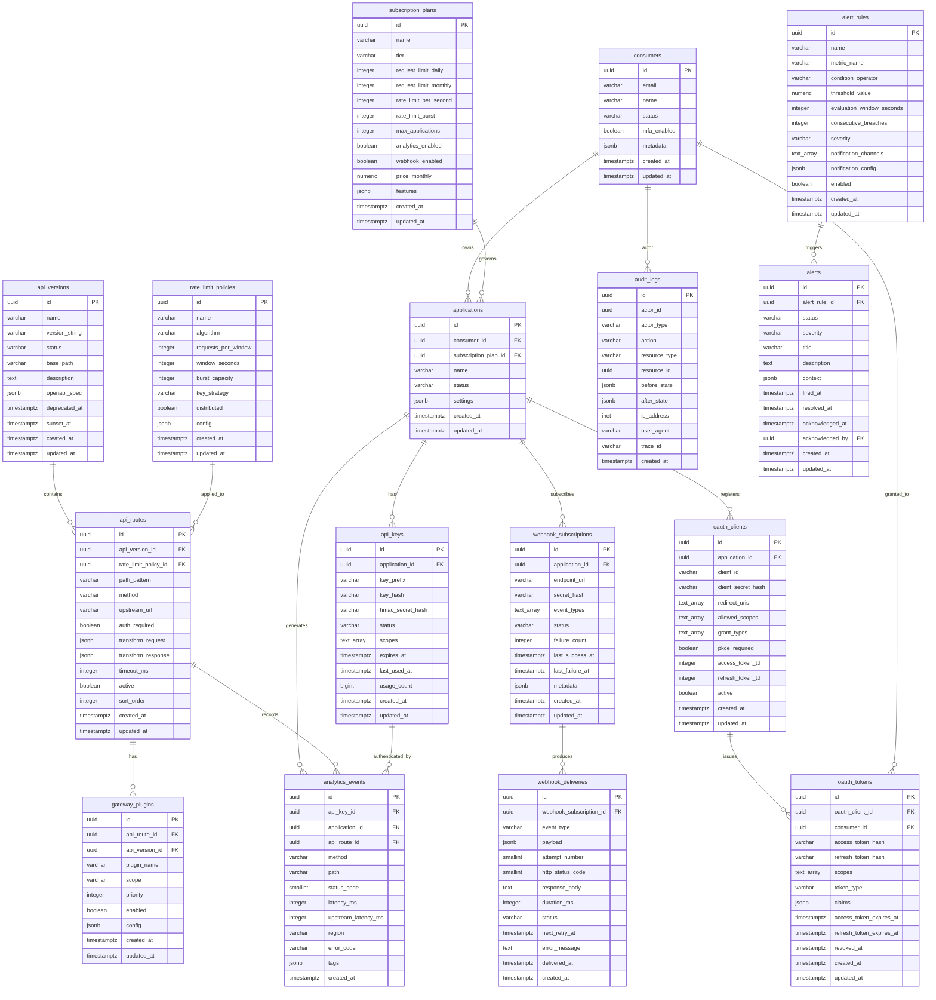

# ERD and Database Schema

## 1. Overview

This document defines the complete PostgreSQL 15 relational schema for the API Gateway and Developer
Portal platform. The schema is normalized to third normal form (3NF) with selective denormalization for
high-frequency read paths. All tables use UUID primary keys generated via `gen_random_uuid()` and include
`created_at` / `updated_at` audit timestamps managed through triggers.

The schema is organized into five logical domains:

| Domain             | Tables                                                                        |
|--------------------|-------------------------------------------------------------------------------|
| Identity & Access  | consumers, applications, api_keys, oauth_clients, oauth_tokens                |
| Gateway Config     | api_routes, gateway_plugins, api_versions                                     |
| Policy             | subscription_plans, rate_limit_policies                                       |
| Events & Webhooks  | webhook_subscriptions, webhook_deliveries, analytics_events, audit_logs       |
| Alerting           | alerts, alert_rules                                                           |

PostgreSQL 15 features leveraged:

- **Range partitioning** on `analytics_events` by calendar month and `audit_logs` by quarter.
- **JSONB** columns with GIN indexes for flexible plugin configuration and metadata storage.
- **Check constraints** enforcing enumeration domains without separate lookup tables.
- **Partial indexes** to accelerate common filtered queries (e.g. active API keys only).
- **pg_partman** extension for automated partition pre-creation.
- **pg_cron** extension for scheduled maintenance jobs.
- **Materialized views** refreshed every 5 minutes for dashboard analytics aggregations.

---

## 2. ERD Diagram



---

## 3. Table Definitions

### 3.1 consumers

```sql
CREATE TABLE consumers (
    id                  UUID            PRIMARY KEY DEFAULT gen_random_uuid(),
    email               VARCHAR(320)    NOT NULL,
    name                VARCHAR(255)    NOT NULL,
    status              VARCHAR(32)     NOT NULL DEFAULT 'registered'
                            CHECK (status IN (
                                'registered','email_verified','active',
                                'suspended','deactivated','deleted'
                            )),
    password_hash       VARCHAR(255),
    email_verified_at   TIMESTAMPTZ,
    last_login_at       TIMESTAMPTZ,
    mfa_enabled         BOOLEAN         NOT NULL DEFAULT FALSE,
    mfa_secret_enc      TEXT,
    metadata            JSONB           NOT NULL DEFAULT '{}',
    deleted_at          TIMESTAMPTZ,
    created_at          TIMESTAMPTZ     NOT NULL DEFAULT NOW(),
    updated_at          TIMESTAMPTZ     NOT NULL DEFAULT NOW(),
    CONSTRAINT consumers_email_unique UNIQUE (email)
);

COMMENT ON TABLE  consumers                IS 'Developer portal user accounts — humans or organizations that consume the API.';
COMMENT ON COLUMN consumers.id             IS 'UUID PK generated via gen_random_uuid().';
COMMENT ON COLUMN consumers.email          IS 'Unique email used for login (RFC 5321 max 320 chars).';
COMMENT ON COLUMN consumers.status         IS 'Lifecycle: registered -> email_verified -> active -> suspended/deactivated/deleted.';
COMMENT ON COLUMN consumers.password_hash  IS 'Argon2id hash of consumer password. NULL when using SSO-only.';
COMMENT ON COLUMN consumers.mfa_secret_enc IS 'AES-256-GCM encrypted TOTP secret. NULL when MFA is disabled.';
COMMENT ON COLUMN consumers.metadata       IS 'Arbitrary key-value extensibility bag, e.g. {"company":"Acme"}.';
COMMENT ON COLUMN consumers.deleted_at     IS 'Soft-delete timestamp. Non-NULL means logically deleted.';
```

### 3.2 subscription_plans

```sql
CREATE TABLE subscription_plans (
    id                      UUID            PRIMARY KEY DEFAULT gen_random_uuid(),
    name                    VARCHAR(100)    NOT NULL,
    tier                    VARCHAR(32)     NOT NULL
                                CHECK (tier IN ('free','starter','growth','enterprise','custom')),
    request_limit_daily     INTEGER         NOT NULL DEFAULT 0
                                CHECK (request_limit_daily >= 0),
    request_limit_monthly   INTEGER         NOT NULL DEFAULT 0
                                CHECK (request_limit_monthly >= 0),
    rate_limit_per_second   INTEGER         NOT NULL DEFAULT 10
                                CHECK (rate_limit_per_second > 0),
    rate_limit_burst        INTEGER         NOT NULL DEFAULT 20
                                CHECK (rate_limit_burst > 0),
    max_applications        INTEGER         NOT NULL DEFAULT 1
                                CHECK (max_applications > 0),
    analytics_enabled       BOOLEAN         NOT NULL DEFAULT FALSE,
    webhook_enabled         BOOLEAN         NOT NULL DEFAULT FALSE,
    custom_domain_enabled   BOOLEAN         NOT NULL DEFAULT FALSE,
    sla_uptime_percent      NUMERIC(5,2)    CHECK (sla_uptime_percent BETWEEN 0 AND 100),
    price_monthly           NUMERIC(10,2)   NOT NULL DEFAULT 0.00,
    features                JSONB           NOT NULL DEFAULT '{}',
    active                  BOOLEAN         NOT NULL DEFAULT TRUE,
    created_at              TIMESTAMPTZ     NOT NULL DEFAULT NOW(),
    updated_at              TIMESTAMPTZ     NOT NULL DEFAULT NOW(),
    CONSTRAINT subscription_plans_name_unique UNIQUE (name)
);

COMMENT ON TABLE  subscription_plans                       IS 'Billing tiers governing feature access, rate limits, and quotas per application.';
COMMENT ON COLUMN subscription_plans.tier                  IS 'Canonical tier: free | starter | growth | enterprise | custom.';
COMMENT ON COLUMN subscription_plans.request_limit_daily   IS 'Max API calls per calendar day. 0 means unlimited.';
COMMENT ON COLUMN subscription_plans.request_limit_monthly IS 'Max API calls per calendar month. 0 means unlimited.';
COMMENT ON COLUMN subscription_plans.rate_limit_per_second IS 'Sustained request rate cap in RPS.';
COMMENT ON COLUMN subscription_plans.rate_limit_burst      IS 'Token-bucket burst capacity above sustained rate.';
COMMENT ON COLUMN subscription_plans.features              IS 'Feature flags map, e.g. {"priority_support":true}.';
```

### 3.3 applications

```sql
CREATE TABLE applications (
    id                      UUID            PRIMARY KEY DEFAULT gen_random_uuid(),
    consumer_id             UUID            NOT NULL
                                REFERENCES consumers(id) ON DELETE CASCADE,
    subscription_plan_id    UUID            NOT NULL
                                REFERENCES subscription_plans(id),
    name                    VARCHAR(255)    NOT NULL,
    description             TEXT,
    status                  VARCHAR(32)     NOT NULL DEFAULT 'active'
                                CHECK (status IN ('active','suspended','deleted')),
    homepage_url            VARCHAR(2048),
    callback_urls           TEXT[]          NOT NULL DEFAULT '{}',
    settings                JSONB           NOT NULL DEFAULT '{}',
    deleted_at              TIMESTAMPTZ,
    created_at              TIMESTAMPTZ     NOT NULL DEFAULT NOW(),
    updated_at              TIMESTAMPTZ     NOT NULL DEFAULT NOW(),
    CONSTRAINT applications_consumer_name_unique UNIQUE (consumer_id, name)
);

COMMENT ON TABLE  applications                      IS 'Logical application entity owned by a consumer. Scopes API keys, OAuth clients, and quotas.';
COMMENT ON COLUMN applications.consumer_id          IS 'Owning consumer. Cascade-deletes when consumer is removed.';
COMMENT ON COLUMN applications.subscription_plan_id IS 'Plan governing this application rate limits and feature access.';
COMMENT ON COLUMN applications.callback_urls        IS 'Allowlisted OAuth redirect URIs.';
COMMENT ON COLUMN applications.settings             IS 'App-level settings, e.g. {"ip_allowlist":["203.0.113.0/24"]}.';
```

### 3.4 api_keys

```sql
CREATE TABLE api_keys (
    id                  UUID            PRIMARY KEY DEFAULT gen_random_uuid(),
    application_id      UUID            NOT NULL
                            REFERENCES applications(id) ON DELETE CASCADE,
    name                VARCHAR(100)    NOT NULL,
    key_prefix          VARCHAR(16)     NOT NULL,
    key_hash            VARCHAR(128)    NOT NULL,
    hmac_secret_hash    VARCHAR(128)    NOT NULL,
    status              VARCHAR(32)     NOT NULL DEFAULT 'active'
                            CHECK (status IN ('pending','active','suspended','revoked','expired')),
    scopes              VARCHAR(64)[]   NOT NULL DEFAULT '{}',
    allowed_ips         INET[]          NOT NULL DEFAULT '{}',
    expires_at          TIMESTAMPTZ,
    last_used_at        TIMESTAMPTZ,
    usage_count         BIGINT          NOT NULL DEFAULT 0,
    revoked_at          TIMESTAMPTZ,
    revoke_reason       VARCHAR(255),
    created_at          TIMESTAMPTZ     NOT NULL DEFAULT NOW(),
    updated_at          TIMESTAMPTZ     NOT NULL DEFAULT NOW(),
    CONSTRAINT api_keys_prefix_hash_unique UNIQUE (key_prefix, key_hash)
);

COMMENT ON TABLE  api_keys                   IS 'HMAC-SHA256 API keys issued to applications. Raw key value never stored.';
COMMENT ON COLUMN api_keys.key_prefix        IS 'Public prefix shown in UI, e.g. "gw_live_abc123".';
COMMENT ON COLUMN api_keys.key_hash          IS 'SHA-256 hash of the full key. Used for O(1) lookup on inbound requests.';
COMMENT ON COLUMN api_keys.hmac_secret_hash  IS 'Argon2id hash of per-key HMAC signing secret.';
COMMENT ON COLUMN api_keys.scopes            IS 'Granted OAuth-style scopes array, e.g. ARRAY[''read:data'',''write:data''].';
COMMENT ON COLUMN api_keys.allowed_ips       IS 'IP allowlist. Empty array means no IP restriction.';
COMMENT ON COLUMN api_keys.expires_at        IS 'NULL means the key does not expire.';
COMMENT ON COLUMN api_keys.usage_count       IS 'Approximate counter updated via periodic batch flush from Redis.';
```

### 3.5 rate_limit_policies

```sql
CREATE TABLE rate_limit_policies (
    id                  UUID            PRIMARY KEY DEFAULT gen_random_uuid(),
    name                VARCHAR(100)    NOT NULL,
    algorithm           VARCHAR(32)     NOT NULL DEFAULT 'sliding_window'
                            CHECK (algorithm IN (
                                'sliding_window','token_bucket','fixed_window','leaky_bucket'
                            )),
    requests_per_window INTEGER         NOT NULL CHECK (requests_per_window > 0),
    window_seconds      INTEGER         NOT NULL CHECK (window_seconds > 0),
    burst_capacity      INTEGER         NOT NULL DEFAULT 0 CHECK (burst_capacity >= 0),
    key_strategy        VARCHAR(32)     NOT NULL DEFAULT 'api_key'
                            CHECK (key_strategy IN (
                                'api_key','consumer','application','ip','global'
                            )),
    distributed         BOOLEAN         NOT NULL DEFAULT TRUE,
    response_headers    BOOLEAN         NOT NULL DEFAULT TRUE,
    config              JSONB           NOT NULL DEFAULT '{}',
    created_at          TIMESTAMPTZ     NOT NULL DEFAULT NOW(),
    updated_at          TIMESTAMPTZ     NOT NULL DEFAULT NOW(),
    CONSTRAINT rate_limit_policies_name_unique UNIQUE (name)
);

COMMENT ON TABLE  rate_limit_policies              IS 'Reusable rate limit policy definitions attached to routes.';
COMMENT ON COLUMN rate_limit_policies.algorithm    IS 'Counting algorithm: sliding_window | token_bucket | fixed_window | leaky_bucket.';
COMMENT ON COLUMN rate_limit_policies.key_strategy IS 'Counter dimension: api_key | consumer | application | ip | global.';
COMMENT ON COLUMN rate_limit_policies.distributed  IS 'When TRUE, uses Redis for cross-node counter synchronization.';
COMMENT ON COLUMN rate_limit_policies.response_headers IS 'When TRUE, injects X-RateLimit-* response headers.';
```

### 3.6 api_versions

```sql
CREATE TABLE api_versions (
    id              UUID            PRIMARY KEY DEFAULT gen_random_uuid(),
    name            VARCHAR(100)    NOT NULL,
    version_string  VARCHAR(32)     NOT NULL,
    status          VARCHAR(32)     NOT NULL DEFAULT 'draft'
                        CHECK (status IN ('draft','active','deprecated','sunset','retired')),
    base_path       VARCHAR(255)    NOT NULL,
    description     TEXT,
    openapi_spec    JSONB,
    deprecated_at   TIMESTAMPTZ,
    sunset_at       TIMESTAMPTZ,
    created_at      TIMESTAMPTZ     NOT NULL DEFAULT NOW(),
    updated_at      TIMESTAMPTZ     NOT NULL DEFAULT NOW(),
    CONSTRAINT api_versions_base_path_unique UNIQUE (base_path)
);

COMMENT ON TABLE  api_versions                IS 'Versioned API surface definitions. Each version has its own independent route set.';
COMMENT ON COLUMN api_versions.version_string IS 'Semantic version string, e.g. "v1", "v2.1", "2024-01-01".';
COMMENT ON COLUMN api_versions.base_path      IS 'URL base path prefix, e.g. "/api/v1". Must be globally unique.';
COMMENT ON COLUMN api_versions.openapi_spec   IS 'Full OpenAPI 3.1 specification stored as JSONB for portal rendering.';
COMMENT ON COLUMN api_versions.deprecated_at  IS 'Timestamp when this version entered the deprecated state.';
COMMENT ON COLUMN api_versions.sunset_at      IS 'Scheduled date after which version will be retired and traffic refused.';
```

### 3.7 api_routes

```sql
CREATE TABLE api_routes (
    id                      UUID            PRIMARY KEY DEFAULT gen_random_uuid(),
    api_version_id          UUID            NOT NULL
                                REFERENCES api_versions(id) ON DELETE CASCADE,
    rate_limit_policy_id    UUID
                                REFERENCES rate_limit_policies(id),
    name                    VARCHAR(100)    NOT NULL,
    path_pattern            VARCHAR(1024)   NOT NULL,
    method                  VARCHAR(10)     NOT NULL
                                CHECK (method IN (
                                    'GET','POST','PUT','PATCH','DELETE','HEAD','OPTIONS','ANY'
                                )),
    upstream_url            VARCHAR(2048)   NOT NULL,
    strip_path_prefix       VARCHAR(255),
    auth_required           BOOLEAN         NOT NULL DEFAULT TRUE,
    transform_request       JSONB           NOT NULL DEFAULT '{}',
    transform_response      JSONB           NOT NULL DEFAULT '{}',
    timeout_ms              INTEGER         NOT NULL DEFAULT 30000 CHECK (timeout_ms > 0),
    retry_count             INTEGER         NOT NULL DEFAULT 0    CHECK (retry_count >= 0),
    circuit_breaker_config  JSONB           NOT NULL DEFAULT '{}',
    active                  BOOLEAN         NOT NULL DEFAULT TRUE,
    sort_order              INTEGER         NOT NULL DEFAULT 0,
    created_at              TIMESTAMPTZ     NOT NULL DEFAULT NOW(),
    updated_at              TIMESTAMPTZ     NOT NULL DEFAULT NOW(),
    CONSTRAINT api_routes_version_path_method_unique
        UNIQUE (api_version_id, path_pattern, method)
);

COMMENT ON TABLE  api_routes                        IS 'Routable endpoints within an API version with upstream proxy configuration.';
COMMENT ON COLUMN api_routes.path_pattern           IS 'Express-style path pattern with params, e.g. "/users/:userId/orders".';
COMMENT ON COLUMN api_routes.method                 IS 'HTTP method or ANY to match all verbs.';
COMMENT ON COLUMN api_routes.upstream_url           IS 'Full upstream base URL including scheme and host.';
COMMENT ON COLUMN api_routes.strip_path_prefix      IS 'Path segment stripped before forwarding to upstream.';
COMMENT ON COLUMN api_routes.transform_request      IS 'JSONata transform spec applied to request body before forwarding.';
COMMENT ON COLUMN api_routes.transform_response     IS 'JSONata transform spec applied to response body before returning.';
COMMENT ON COLUMN api_routes.circuit_breaker_config IS 'Opossum settings, e.g. {"threshold":50,"timeout":10000,"resetTimeout":30000}.';
```

### 3.8 gateway_plugins

```sql
CREATE TABLE gateway_plugins (
    id              UUID            PRIMARY KEY DEFAULT gen_random_uuid(),
    api_route_id    UUID            REFERENCES api_routes(id)   ON DELETE CASCADE,
    api_version_id  UUID            REFERENCES api_versions(id) ON DELETE CASCADE,
    plugin_name     VARCHAR(100)    NOT NULL,
    scope           VARCHAR(32)     NOT NULL DEFAULT 'route'
                        CHECK (scope IN ('global','version','route')),
    priority        INTEGER         NOT NULL DEFAULT 100,
    enabled         BOOLEAN         NOT NULL DEFAULT TRUE,
    config          JSONB           NOT NULL DEFAULT '{}',
    created_at      TIMESTAMPTZ     NOT NULL DEFAULT NOW(),
    updated_at      TIMESTAMPTZ     NOT NULL DEFAULT NOW(),
    CONSTRAINT gateway_plugins_route_name_unique UNIQUE (api_route_id, plugin_name)
);

COMMENT ON TABLE  gateway_plugins             IS 'Plugin instances attached to global, API version, or route scope.';
COMMENT ON COLUMN gateway_plugins.plugin_name IS 'Registered plugin identifier, e.g. "cors","request-logger","ip-filter".';
COMMENT ON COLUMN gateway_plugins.scope       IS 'Inheritance scope: global > version > route. Higher scope runs first by priority.';
COMMENT ON COLUMN gateway_plugins.priority    IS 'Execution order within scope. Lower integer = higher priority (runs first).';
COMMENT ON COLUMN gateway_plugins.config      IS 'Plugin-specific JSON config validated against plugin schema at registration.';
```

### 3.9 oauth_clients

```sql
CREATE TABLE oauth_clients (
    id                          UUID            PRIMARY KEY DEFAULT gen_random_uuid(),
    application_id              UUID            NOT NULL
                                    REFERENCES applications(id) ON DELETE CASCADE,
    client_id                   VARCHAR(64)     NOT NULL,
    client_secret_hash          VARCHAR(255)    NOT NULL,
    client_name                 VARCHAR(255)    NOT NULL,
    redirect_uris               TEXT[]          NOT NULL DEFAULT '{}',
    allowed_scopes              VARCHAR(64)[]   NOT NULL DEFAULT '{}',
    grant_types                 VARCHAR(32)[]   NOT NULL DEFAULT '{authorization_code}',
    pkce_required               BOOLEAN         NOT NULL DEFAULT TRUE,
    token_endpoint_auth_method  VARCHAR(32)     NOT NULL DEFAULT 'client_secret_basic'
                                    CHECK (token_endpoint_auth_method IN (
                                        'client_secret_basic','client_secret_post',
                                        'private_key_jwt','none'
                                    )),
    access_token_ttl            INTEGER         NOT NULL DEFAULT 3600
                                    CHECK (access_token_ttl > 0),
    refresh_token_ttl           INTEGER         NOT NULL DEFAULT 2592000
                                    CHECK (refresh_token_ttl > 0),
    active                      BOOLEAN         NOT NULL DEFAULT TRUE,
    created_at                  TIMESTAMPTZ     NOT NULL DEFAULT NOW(),
    updated_at                  TIMESTAMPTZ     NOT NULL DEFAULT NOW(),
    CONSTRAINT oauth_clients_client_id_unique UNIQUE (client_id)
);

COMMENT ON TABLE  oauth_clients                            IS 'OAuth 2.0 client registrations linked to applications (RFC 6749).';
COMMENT ON COLUMN oauth_clients.client_id                  IS 'Public OAuth 2.0 client identifier (RFC 6749 section 2.2).';
COMMENT ON COLUMN oauth_clients.client_secret_hash         IS 'Argon2id hash of client secret. Never stored in plaintext.';
COMMENT ON COLUMN oauth_clients.pkce_required              IS 'Enforce PKCE (RFC 7636) for all authorization code flows.';
COMMENT ON COLUMN oauth_clients.access_token_ttl           IS 'Access token lifetime in seconds. Default 1 hour (3600).';
COMMENT ON COLUMN oauth_clients.refresh_token_ttl          IS 'Refresh token lifetime in seconds. Default 30 days (2592000).';
```

### 3.10 oauth_tokens

```sql
CREATE TABLE oauth_tokens (
    id                          UUID            PRIMARY KEY DEFAULT gen_random_uuid(),
    oauth_client_id             UUID            NOT NULL
                                    REFERENCES oauth_clients(id) ON DELETE CASCADE,
    consumer_id                 UUID            REFERENCES consumers(id) ON DELETE SET NULL,
    access_token_hash           VARCHAR(128)    NOT NULL,
    refresh_token_hash          VARCHAR(128),
    scopes                      VARCHAR(64)[]   NOT NULL DEFAULT '{}',
    token_type                  VARCHAR(16)     NOT NULL DEFAULT 'Bearer',
    claims                      JSONB           NOT NULL DEFAULT '{}',
    access_token_expires_at     TIMESTAMPTZ     NOT NULL,
    refresh_token_expires_at    TIMESTAMPTZ,
    revoked_at                  TIMESTAMPTZ,
    revoke_reason               VARCHAR(255),
    created_at                  TIMESTAMPTZ     NOT NULL DEFAULT NOW(),
    updated_at                  TIMESTAMPTZ     NOT NULL DEFAULT NOW(),
    CONSTRAINT oauth_tokens_access_hash_unique UNIQUE (access_token_hash)
);

COMMENT ON TABLE  oauth_tokens                        IS 'Issued OAuth 2.0 access and refresh tokens. Raw token values never stored.';
COMMENT ON COLUMN oauth_tokens.access_token_hash      IS 'SHA-256 hash of opaque access token string.';
COMMENT ON COLUMN oauth_tokens.refresh_token_hash     IS 'SHA-256 hash of refresh token. NULL for grant types without refresh.';
COMMENT ON COLUMN oauth_tokens.claims                 IS 'Additional JWT claims payload, e.g. {"roles":["admin"]}.';
COMMENT ON COLUMN oauth_tokens.revoked_at             IS 'Non-NULL when token was explicitly revoked before natural expiry.';
```

### 3.11 webhook_subscriptions

```sql
CREATE TABLE webhook_subscriptions (
    id                  UUID            PRIMARY KEY DEFAULT gen_random_uuid(),
    application_id      UUID            NOT NULL
                            REFERENCES applications(id) ON DELETE CASCADE,
    endpoint_url        VARCHAR(2048)   NOT NULL,
    secret_hash         VARCHAR(128)    NOT NULL,
    event_types         VARCHAR(64)[]   NOT NULL,
    status              VARCHAR(32)     NOT NULL DEFAULT 'active'
                            CHECK (status IN (
                                'created','active','failing','suspended','reactivated','disabled'
                            )),
    failure_count       INTEGER         NOT NULL DEFAULT 0,
    max_failures        INTEGER         NOT NULL DEFAULT 5,
    last_success_at     TIMESTAMPTZ,
    last_failure_at     TIMESTAMPTZ,
    timeout_ms          INTEGER         NOT NULL DEFAULT 10000,
    retry_enabled       BOOLEAN         NOT NULL DEFAULT TRUE,
    metadata            JSONB           NOT NULL DEFAULT '{}',
    created_at          TIMESTAMPTZ     NOT NULL DEFAULT NOW(),
    updated_at          TIMESTAMPTZ     NOT NULL DEFAULT NOW()
);

COMMENT ON TABLE  webhook_subscriptions               IS 'Consumer-registered HTTP webhook endpoints receiving gateway events.';
COMMENT ON COLUMN webhook_subscriptions.secret_hash   IS 'Argon2id hash of shared HMAC signing secret for delivery verification.';
COMMENT ON COLUMN webhook_subscriptions.event_types   IS 'Subscribed event type slugs, e.g. ARRAY[''api.request.completed'',''quota.exceeded''].';
COMMENT ON COLUMN webhook_subscriptions.failure_count IS 'Consecutive delivery failures. Resets to 0 on successful delivery.';
COMMENT ON COLUMN webhook_subscriptions.max_failures  IS 'Threshold triggering automatic suspension when reached.';
```

### 3.12 webhook_deliveries

```sql
CREATE TABLE webhook_deliveries (
    id                          UUID            PRIMARY KEY DEFAULT gen_random_uuid(),
    webhook_subscription_id     UUID            NOT NULL
                                    REFERENCES webhook_subscriptions(id) ON DELETE CASCADE,
    event_type                  VARCHAR(64)     NOT NULL,
    payload                     JSONB           NOT NULL,
    attempt_number              SMALLINT        NOT NULL DEFAULT 1
                                    CHECK (attempt_number BETWEEN 1 AND 10),
    http_status_code            SMALLINT,
    response_body               TEXT,
    duration_ms                 INTEGER,
    status                      VARCHAR(32)     NOT NULL DEFAULT 'queued'
                                    CHECK (status IN (
                                        'queued','delivering','delivered',
                                        'failed','retrying','dead_lettered'
                                    )),
    next_retry_at               TIMESTAMPTZ,
    error_message               TEXT,
    delivered_at                TIMESTAMPTZ,
    created_at                  TIMESTAMPTZ     NOT NULL DEFAULT NOW()
);

COMMENT ON TABLE  webhook_deliveries                  IS 'Individual delivery attempts for webhook events including full retry history.';
COMMENT ON COLUMN webhook_deliveries.attempt_number   IS 'Monotonic counter starting at 1. Max 5 before dead-lettering.';
COMMENT ON COLUMN webhook_deliveries.http_status_code IS 'HTTP response status code from subscriber endpoint.';
COMMENT ON COLUMN webhook_deliveries.next_retry_at    IS 'Scheduled retry time via exponential backoff: delay = 2^(n-1) seconds.';
COMMENT ON COLUMN webhook_deliveries.status           IS 'queued -> delivering -> delivered|failed -> retrying -> dead_lettered.';
```

### 3.13 analytics_events (Partitioned by Month)

```sql
CREATE TABLE analytics_events (
    id                      UUID            NOT NULL DEFAULT gen_random_uuid(),
    api_key_id              UUID            REFERENCES api_keys(id)     ON DELETE SET NULL,
    application_id          UUID            NOT NULL
                                REFERENCES applications(id) ON DELETE CASCADE,
    api_route_id            UUID            REFERENCES api_routes(id)   ON DELETE SET NULL,
    consumer_id             UUID,
    method                  VARCHAR(10)     NOT NULL,
    path                    VARCHAR(2048)   NOT NULL,
    status_code             SMALLINT        NOT NULL,
    request_size_bytes      INTEGER         NOT NULL DEFAULT 0,
    response_size_bytes     INTEGER         NOT NULL DEFAULT 0,
    latency_ms              INTEGER         NOT NULL,
    upstream_latency_ms     INTEGER,
    region                  VARCHAR(32),
    gateway_node_id         VARCHAR(64),
    error_code              VARCHAR(64),
    tags                    JSONB           NOT NULL DEFAULT '{}',
    created_at              TIMESTAMPTZ     NOT NULL DEFAULT NOW(),
    PRIMARY KEY (id, created_at)
) PARTITION BY RANGE (created_at);

COMMENT ON TABLE  analytics_events                     IS 'Immutable per-request analytics log. Monthly range-partitioned for efficient pruning.';
COMMENT ON COLUMN analytics_events.latency_ms          IS 'Total gateway-observed latency including upstream call.';
COMMENT ON COLUMN analytics_events.upstream_latency_ms IS 'Time spent waiting for upstream response only (excludes gateway overhead).';
COMMENT ON COLUMN analytics_events.gateway_node_id     IS 'ECS task ID of the gateway node that processed the request.';
COMMENT ON COLUMN analytics_events.tags                IS 'Key-value tags injected by plugins for dashboard filtering.';

CREATE TABLE analytics_events_2025_01 PARTITION OF analytics_events
    FOR VALUES FROM ('2025-01-01') TO ('2025-02-01');
CREATE TABLE analytics_events_2025_02 PARTITION OF analytics_events
    FOR VALUES FROM ('2025-02-01') TO ('2025-03-01');
CREATE TABLE analytics_events_2025_03 PARTITION OF analytics_events
    FOR VALUES FROM ('2025-03-01') TO ('2025-04-01');
CREATE TABLE analytics_events_2025_04 PARTITION OF analytics_events
    FOR VALUES FROM ('2025-04-01') TO ('2025-05-01');
CREATE TABLE analytics_events_2025_05 PARTITION OF analytics_events
    FOR VALUES FROM ('2025-05-01') TO ('2025-06-01');
CREATE TABLE analytics_events_2025_06 PARTITION OF analytics_events
    FOR VALUES FROM ('2025-06-01') TO ('2025-07-01');
CREATE TABLE analytics_events_2025_07 PARTITION OF analytics_events
    FOR VALUES FROM ('2025-07-01') TO ('2025-08-01');
CREATE TABLE analytics_events_2025_08 PARTITION OF analytics_events
    FOR VALUES FROM ('2025-08-01') TO ('2025-09-01');
CREATE TABLE analytics_events_2025_09 PARTITION OF analytics_events
    FOR VALUES FROM ('2025-09-01') TO ('2025-10-01');
CREATE TABLE analytics_events_2025_10 PARTITION OF analytics_events
    FOR VALUES FROM ('2025-10-01') TO ('2025-11-01');
CREATE TABLE analytics_events_2025_11 PARTITION OF analytics_events
    FOR VALUES FROM ('2025-11-01') TO ('2025-12-01');
CREATE TABLE analytics_events_2025_12 PARTITION OF analytics_events
    FOR VALUES FROM ('2025-12-01') TO ('2026-01-01');
```

### 3.14 audit_logs (Partitioned by Quarter)

```sql
CREATE TABLE audit_logs (
    id              UUID            PRIMARY KEY DEFAULT gen_random_uuid(),
    actor_id        UUID,
    actor_type      VARCHAR(32)     NOT NULL DEFAULT 'consumer'
                        CHECK (actor_type IN ('consumer','system','admin','api_key')),
    action          VARCHAR(64)     NOT NULL,
    resource_type   VARCHAR(64)     NOT NULL,
    resource_id     UUID,
    before_state    JSONB,
    after_state     JSONB,
    ip_address      INET,
    user_agent      VARCHAR(512),
    trace_id        VARCHAR(64),
    created_at      TIMESTAMPTZ     NOT NULL DEFAULT NOW()
) PARTITION BY RANGE (created_at);

COMMENT ON TABLE  audit_logs              IS 'Immutable append-only audit trail of all state-changing operations.';
COMMENT ON COLUMN audit_logs.actor_type   IS 'Who performed the action: consumer | system | admin | api_key.';
COMMENT ON COLUMN audit_logs.action       IS 'Verb in SCREAMING_SNAKE_CASE, e.g. API_KEY_CREATED, PLAN_CHANGED.';
COMMENT ON COLUMN audit_logs.before_state IS 'JSON snapshot before the change. NULL for creates.';
COMMENT ON COLUMN audit_logs.after_state  IS 'JSON snapshot after the change. NULL for deletes.';
COMMENT ON COLUMN audit_logs.trace_id     IS 'OpenTelemetry trace ID for cross-system correlation.';

CREATE TABLE audit_logs_2025_q1 PARTITION OF audit_logs
    FOR VALUES FROM ('2025-01-01') TO ('2025-04-01');
CREATE TABLE audit_logs_2025_q2 PARTITION OF audit_logs
    FOR VALUES FROM ('2025-04-01') TO ('2025-07-01');
CREATE TABLE audit_logs_2025_q3 PARTITION OF audit_logs
    FOR VALUES FROM ('2025-07-01') TO ('2025-10-01');
CREATE TABLE audit_logs_2025_q4 PARTITION OF audit_logs
    FOR VALUES FROM ('2025-10-01') TO ('2026-01-01');
```

### 3.15 alert_rules

```sql
CREATE TABLE alert_rules (
    id                          UUID            PRIMARY KEY DEFAULT gen_random_uuid(),
    name                        VARCHAR(100)    NOT NULL,
    description                 TEXT,
    metric_name                 VARCHAR(128)    NOT NULL,
    condition_operator          VARCHAR(8)      NOT NULL
                                    CHECK (condition_operator IN ('>','>=','<','<=','==','!=')),
    threshold_value             NUMERIC(18,4)   NOT NULL,
    evaluation_window_seconds   INTEGER         NOT NULL DEFAULT 300
                                    CHECK (evaluation_window_seconds > 0),
    consecutive_breaches        INTEGER         NOT NULL DEFAULT 1
                                    CHECK (consecutive_breaches > 0),
    severity                    VARCHAR(16)     NOT NULL DEFAULT 'warning'
                                    CHECK (severity IN ('info','warning','critical','emergency')),
    notification_channels       VARCHAR(32)[]   NOT NULL DEFAULT '{}',
    notification_config         JSONB           NOT NULL DEFAULT '{}',
    cooldown_seconds            INTEGER         NOT NULL DEFAULT 600
                                    CHECK (cooldown_seconds >= 0),
    enabled                     BOOLEAN         NOT NULL DEFAULT TRUE,
    created_at                  TIMESTAMPTZ     NOT NULL DEFAULT NOW(),
    updated_at                  TIMESTAMPTZ     NOT NULL DEFAULT NOW(),
    CONSTRAINT alert_rules_name_unique UNIQUE (name)
);

COMMENT ON TABLE  alert_rules                          IS 'Threshold-based alerting rules evaluated continuously against Prometheus metrics.';
COMMENT ON COLUMN alert_rules.metric_name              IS 'Prometheus metric name, e.g. "gateway_request_error_rate".';
COMMENT ON COLUMN alert_rules.condition_operator       IS 'Comparison operator: > | >= | < | <= | == | !=.';
COMMENT ON COLUMN alert_rules.consecutive_breaches     IS 'Number of consecutive breaching evaluation windows before firing.';
COMMENT ON COLUMN alert_rules.cooldown_seconds         IS 'Minimum seconds between repeated firings for the same rule.';
COMMENT ON COLUMN alert_rules.notification_config      IS 'Channel config map, e.g. {"slack":{"channel":"#alerts"},"pagerduty":{"routing_key":"abc"}}.';
```

### 3.16 alerts

```sql
CREATE TABLE alerts (
    id                  UUID            PRIMARY KEY DEFAULT gen_random_uuid(),
    alert_rule_id       UUID            NOT NULL
                            REFERENCES alert_rules(id) ON DELETE CASCADE,
    status              VARCHAR(32)     NOT NULL DEFAULT 'firing'
                            CHECK (status IN ('firing','resolved','acknowledged','suppressed')),
    severity            VARCHAR(16)     NOT NULL,
    title               VARCHAR(255)    NOT NULL,
    description         TEXT,
    context             JSONB           NOT NULL DEFAULT '{}',
    fired_at            TIMESTAMPTZ     NOT NULL DEFAULT NOW(),
    resolved_at         TIMESTAMPTZ,
    acknowledged_at     TIMESTAMPTZ,
    acknowledged_by     UUID            REFERENCES consumers(id),
    suppressed_until    TIMESTAMPTZ,
    created_at          TIMESTAMPTZ     NOT NULL DEFAULT NOW(),
    updated_at          TIMESTAMPTZ     NOT NULL DEFAULT NOW()
);

COMMENT ON TABLE  alerts                  IS 'Fired alert instances. Lifecycle: firing -> resolved/acknowledged/suppressed.';
COMMENT ON COLUMN alerts.context          IS 'Metric snapshot at firing time, e.g. {"value":95.3,"route":"/api/v1/users"}.';
COMMENT ON COLUMN alerts.suppressed_until IS 'When set, notifications are muted until this timestamp (snooze feature).';
```

### 3.17 Updated-At Trigger (Applied to All Mutable Tables)

```sql
CREATE OR REPLACE FUNCTION set_updated_at()
RETURNS TRIGGER LANGUAGE plpgsql AS $$
BEGIN
    NEW.updated_at := NOW();
    RETURN NEW;
END;
$$;

CREATE TRIGGER consumers_updated_at
    BEFORE UPDATE ON consumers
    FOR EACH ROW EXECUTE FUNCTION set_updated_at();

CREATE TRIGGER subscription_plans_updated_at
    BEFORE UPDATE ON subscription_plans
    FOR EACH ROW EXECUTE FUNCTION set_updated_at();

CREATE TRIGGER applications_updated_at
    BEFORE UPDATE ON applications
    FOR EACH ROW EXECUTE FUNCTION set_updated_at();

CREATE TRIGGER api_keys_updated_at
    BEFORE UPDATE ON api_keys
    FOR EACH ROW EXECUTE FUNCTION set_updated_at();

CREATE TRIGGER rate_limit_policies_updated_at
    BEFORE UPDATE ON rate_limit_policies
    FOR EACH ROW EXECUTE FUNCTION set_updated_at();

CREATE TRIGGER api_versions_updated_at
    BEFORE UPDATE ON api_versions
    FOR EACH ROW EXECUTE FUNCTION set_updated_at();

CREATE TRIGGER api_routes_updated_at
    BEFORE UPDATE ON api_routes
    FOR EACH ROW EXECUTE FUNCTION set_updated_at();

CREATE TRIGGER gateway_plugins_updated_at
    BEFORE UPDATE ON gateway_plugins
    FOR EACH ROW EXECUTE FUNCTION set_updated_at();

CREATE TRIGGER oauth_clients_updated_at
    BEFORE UPDATE ON oauth_clients
    FOR EACH ROW EXECUTE FUNCTION set_updated_at();

CREATE TRIGGER oauth_tokens_updated_at
    BEFORE UPDATE ON oauth_tokens
    FOR EACH ROW EXECUTE FUNCTION set_updated_at();

CREATE TRIGGER webhook_subscriptions_updated_at
    BEFORE UPDATE ON webhook_subscriptions
    FOR EACH ROW EXECUTE FUNCTION set_updated_at();

CREATE TRIGGER alert_rules_updated_at
    BEFORE UPDATE ON alert_rules
    FOR EACH ROW EXECUTE FUNCTION set_updated_at();

CREATE TRIGGER alerts_updated_at
    BEFORE UPDATE ON alerts
    FOR EACH ROW EXECUTE FUNCTION set_updated_at();
```

---

## 4. Index Strategy

| Index Name                              | Table                    | Column(s)                                               | Type            | Purpose                                         |
|-----------------------------------------|--------------------------|---------------------------------------------------------|-----------------|-------------------------------------------------|
| `consumers_email_idx`                   | consumers                | email                                                   | B-tree          | Fast login lookup by email                      |
| `consumers_status_idx`                  | consumers                | status                                                  | B-tree          | Filter active/suspended consumers               |
| `applications_consumer_idx`             | applications             | consumer_id                                             | B-tree          | List all apps per consumer                      |
| `applications_plan_idx`                 | applications             | subscription_plan_id                                    | B-tree          | Find all apps on a plan                         |
| `api_keys_prefix_idx`                   | api_keys                 | key_prefix                                              | B-tree          | Gateway lookup first-pass                       |
| `api_keys_hash_idx`                     | api_keys                 | key_hash                                                | B-tree          | Gateway O(1) key validation                     |
| `api_keys_application_idx`              | api_keys                 | application_id                                          | B-tree          | List keys per application                       |
| `api_keys_active_partial_idx`           | api_keys                 | application_id WHERE status='active'                    | Partial B-tree  | Active-only key queries                         |
| `api_keys_expiry_idx`                   | api_keys                 | expires_at WHERE expires_at IS NOT NULL                 | Partial B-tree  | Expiry background job scanning                  |
| `oauth_clients_client_id_idx`           | oauth_clients            | client_id                                               | B-tree          | OAuth authorize endpoint lookup                 |
| `oauth_tokens_access_hash_idx`          | oauth_tokens             | access_token_hash                                       | B-tree          | Token introspection and validation              |
| `oauth_tokens_refresh_hash_idx`         | oauth_tokens             | refresh_token_hash WHERE refresh_token_hash IS NOT NULL | Partial B-tree  | Token refresh grant flow                        |
| `oauth_tokens_client_consumer_idx`      | oauth_tokens             | (oauth_client_id, consumer_id)                          | B-tree          | Revoke all tokens for a user+client pair        |
| `oauth_tokens_expiry_idx`               | oauth_tokens             | access_token_expires_at WHERE revoked_at IS NULL        | Partial B-tree  | Token cleanup background job                   |
| `api_versions_active_idx`               | api_versions             | status WHERE status != 'retired'                        | Partial B-tree  | Load active and deprecated versions             |
| `api_routes_version_idx`                | api_routes               | api_version_id                                          | B-tree          | Load all routes for a version                   |
| `api_routes_active_pattern_idx`         | api_routes               | (api_version_id, path_pattern) WHERE active=TRUE        | Partial B-tree  | Hot-path routing table                          |
| `gateway_plugins_route_idx`             | gateway_plugins          | api_route_id WHERE enabled=TRUE                         | Partial B-tree  | Plugin chain loading for a route                |
| `gateway_plugins_version_idx`           | gateway_plugins          | api_version_id WHERE enabled=TRUE                       | Partial B-tree  | Version-scoped plugin loading                   |
| `webhook_subscriptions_app_idx`         | webhook_subscriptions    | application_id                                          | B-tree          | Subscriptions per application                   |
| `webhook_subscriptions_event_gin_idx`   | webhook_subscriptions    | event_types                                             | GIN             | Match event type to active subscribers          |
| `webhook_subscriptions_failing_idx`     | webhook_subscriptions    | status WHERE status='failing'                           | Partial B-tree  | Recovery monitoring dashboard                   |
| `webhook_deliveries_sub_idx`            | webhook_deliveries       | webhook_subscription_id                                 | B-tree          | Delivery history per subscription               |
| `webhook_deliveries_retry_idx`          | webhook_deliveries       | next_retry_at WHERE status='retrying'                   | Partial B-tree  | BullMQ retry scheduler                          |
| `analytics_events_app_time_idx`         | analytics_events         | (application_id, created_at DESC)                       | B-tree          | Per-app analytics time-series queries           |
| `analytics_events_route_time_idx`       | analytics_events         | (api_route_id, created_at DESC)                         | B-tree          | Per-route metrics rollup                        |
| `analytics_events_status_time_idx`      | analytics_events         | (status_code, created_at DESC)                          | B-tree          | Error rate dashboard queries                    |
| `analytics_events_tags_gin_idx`         | analytics_events         | tags                                                    | GIN             | Tag-based filtering                             |
| `audit_logs_actor_idx`                  | audit_logs               | (actor_id, created_at DESC)                             | B-tree          | Actor activity timeline view                    |
| `audit_logs_resource_idx`               | audit_logs               | (resource_type, resource_id, created_at DESC)           | B-tree          | Resource-level change history                   |
| `alert_rules_metric_idx`                | alert_rules              | metric_name WHERE enabled=TRUE                          | Partial B-tree  | Evaluator metric lookup                         |
| `alerts_rule_status_idx`                | alerts                   | (alert_rule_id, status)                                 | B-tree          | Active alerts per rule                          |
| `alerts_firing_idx`                     | alerts                   | fired_at WHERE status='firing'                          | Partial B-tree  | On-call dashboard active alerts view            |

```sql
CREATE INDEX CONCURRENTLY api_keys_hash_idx
    ON api_keys (key_hash);

CREATE INDEX CONCURRENTLY api_keys_active_partial_idx
    ON api_keys (application_id)
    WHERE status = 'active';

CREATE INDEX CONCURRENTLY oauth_tokens_access_hash_idx
    ON oauth_tokens (access_token_hash);

CREATE INDEX CONCURRENTLY api_routes_active_pattern_idx
    ON api_routes (api_version_id, path_pattern)
    WHERE active = TRUE;

CREATE INDEX CONCURRENTLY webhook_subscriptions_event_gin_idx
    ON webhook_subscriptions USING GIN (event_types);

CREATE INDEX CONCURRENTLY analytics_events_tags_gin_idx
    ON analytics_events USING GIN (tags);

CREATE INDEX CONCURRENTLY analytics_events_app_time_idx
    ON analytics_events (application_id, created_at DESC);
```

---

## 5. Partitioning Strategy for analytics_events

### Rationale

The `analytics_events` table is the highest-volume write destination. A gateway processing 5,000 RPS
generates approximately 432 million rows per day. Monthly range partitioning provides:

1. **Partition pruning**: Queries scoped to a time range touch only the relevant child tables,
   eliminating full sequential scans on the parent.
2. **Instant archiving**: Detaching and dropping an old partition is O(1) versus a slow DELETE
   of millions of rows that would generate heavy WAL and block autovacuum.
3. **Parallel reads**: PostgreSQL 15 can parallelize reads across partitions on separate I/O channels.
4. **Tablespace tiering**: Hot partitions (current month) on NVMe-backed gp3; older partitions
   can be moved to HDD-backed tablespaces via ALTER TABLE ATTACH PARTITION.

### Partition Naming Convention

```
analytics_events_YYYY_MM
```

### Automated Partition Pre-Creation via pg_partman

```sql
CREATE EXTENSION IF NOT EXISTS pg_partman;

SELECT partman.create_parent(
    p_parent_table   => 'public.analytics_events',
    p_control        => 'created_at',
    p_type           => 'range',
    p_interval       => 'monthly',
    p_premake        => 3
);

SELECT cron.schedule(
    'partman-maintenance',
    '0 * * * *',
    'SELECT partman.run_maintenance(''public.analytics_events'')'
);
```

### Retention Policy

| Age          | Storage Tier       | Action                                                       |
|--------------|--------------------|--------------------------------------------------------------|
| 0-3 months   | Hot (gp3 NVMe)     | Full indexes, active queries, aggressive autovacuum          |
| 3-12 months  | Warm (gp2 HDD)     | DETACH + move tablespace; archive to S3 Parquet via AWS DMS  |
| > 12 months  | Cold (S3 Glacier)  | Query via Amazon Athena; partition dropped from PostgreSQL   |

---

## 6. Migration Strategy

Migrations use 14-digit timestamps and are tracked in `schema_migrations`:

```sql
CREATE TABLE schema_migrations (
    version     VARCHAR(20)     PRIMARY KEY,
    applied_at  TIMESTAMPTZ     NOT NULL DEFAULT NOW(),
    description VARCHAR(255)
);
```

### Migration File Layout

```
db/
  migrations/
    20250101000000_create_extension_uuid.sql
    20250101000001_create_consumers.sql
    20250101000002_create_subscription_plans.sql
    20250101000003_create_applications.sql
    20250101000004_create_api_keys.sql
    20250101000005_create_rate_limit_policies.sql
    20250101000006_create_api_versions.sql
    20250101000007_create_api_routes.sql
    20250101000008_create_gateway_plugins.sql
    20250101000009_create_oauth_clients.sql
    20250101000010_create_oauth_tokens.sql
    20250101000011_create_webhook_subscriptions.sql
    20250101000012_create_webhook_deliveries.sql
    20250101000013_create_analytics_events_partitioned.sql
    20250101000014_create_audit_logs_partitioned.sql
    20250101000015_create_alert_rules.sql
    20250101000016_create_alerts.sql
    20250101000017_create_indexes.sql
    20250101000018_create_updated_at_triggers.sql
    20250101000019_install_pg_partman.sql
    20250101000020_install_pg_cron.sql
    20250101000021_schedule_maintenance_jobs.sql
    20250101000022_create_analytics_materialized_view.sql
    20250101000023_seed_default_subscription_plans.sql
    20250101000024_seed_default_rate_limit_policies.sql
```

### Migration Runner (TypeScript)

```typescript
// db/migrator.ts
import { Pool } from 'pg';
import { readdirSync, readFileSync } from 'fs';
import { join } from 'path';

async function runMigrations(pool: Pool): Promise<void> {
    await pool.query(`
        CREATE TABLE IF NOT EXISTS schema_migrations (
            version     VARCHAR(20) PRIMARY KEY,
            applied_at  TIMESTAMPTZ NOT NULL DEFAULT NOW(),
            description VARCHAR(255)
        )
    `);

    const applied = await pool.query<{ version: string }>(
        'SELECT version FROM schema_migrations ORDER BY version'
    );
    const appliedSet = new Set(applied.rows.map(r => r.version));

    const migrationDir = join(__dirname, 'migrations');
    const files = readdirSync(migrationDir)
        .filter(f => f.endsWith('.sql'))
        .sort();

    for (const file of files) {
        const version = file.split('_')[0];
        if (appliedSet.has(version)) continue;

        const sql = readFileSync(join(migrationDir, file), 'utf8');
        const description = file.replace(/^\d+_/, '').replace('.sql', '');

        const client = await pool.connect();
        try {
            await client.query('BEGIN');
            await client.query(sql);
            await client.query(
                'INSERT INTO schema_migrations (version, description) VALUES ($1, $2)',
                [version, description]
            );
            await client.query('COMMIT');
            console.log(`Applied: ${file}`);
        } catch (err) {
            await client.query('ROLLBACK');
            throw err;
        } finally {
            client.release();
        }
    }
}
```

---

## 7. Performance Considerations

### 7.1 PgBouncer Connection Pooling

```ini
# /etc/pgbouncer/pgbouncer.ini
[databases]
gateway   = host=rds-primary.cluster.us-east-1.rds.amazonaws.com  port=5432 dbname=gateway
analytics = host=rds-replica.cluster.us-east-1.rds.amazonaws.com  port=5432 dbname=gateway

[pgbouncer]
pool_mode            = transaction
max_client_conn      = 2000
default_pool_size    = 40
min_pool_size        = 10
reserve_pool_size    = 10
reserve_pool_timeout = 5
server_idle_timeout  = 600
client_idle_timeout  = 0
server_lifetime      = 3600
log_connections      = 0
log_disconnections   = 0
stats_period         = 60
```

| Component              | Pool Size         | Notes                                           |
|------------------------|-------------------|-------------------------------------------------|
| Gateway nodes (x10)    | 10 each = 100     | Transaction pool; queries complete in < 5 ms    |
| Portal API (x4)        | 15 each = 60      | Session pool acceptable; longer OLAP queries    |
| Analytics worker       | 5                 | Bulk INSERT via COPY; high-throughput writes     |
| Migration runner       | 1                 | Single connection at deploy time                |
| PgBouncer to RDS       | max 165 total     | RDS db.r6g.2xlarge supports ~500 connections    |

### 7.2 VACUUM Strategy

```sql
-- Aggressive autovacuum for highest-churn tables
ALTER TABLE analytics_events SET (
    autovacuum_vacuum_scale_factor  = 0.01,
    autovacuum_analyze_scale_factor = 0.005,
    autovacuum_vacuum_cost_delay    = 2
);

ALTER TABLE oauth_tokens SET (
    autovacuum_vacuum_scale_factor = 0.02,
    autovacuum_vacuum_threshold    = 100
);

ALTER TABLE api_keys SET (
    autovacuum_vacuum_scale_factor = 0.02
);

SELECT cron.schedule(
    'weekly-vacuum-analyze',
    '0 3 * * 0',
    'VACUUM ANALYZE consumers, applications, api_keys, oauth_clients, oauth_tokens'
);
```

### 7.3 Read Replicas

- **RDS Multi-AZ**: Synchronous standby for automatic failover (< 60 s RTO, near-zero RPO).
- **Read Replica**: Routes portal analytics and audit log queries away from the primary.
- **Connection routing**: Gateway always reads from primary to avoid replication lag on auth decisions.

```typescript
const db = {
    write : new Pool({ connectionString: process.env.DATABASE_URL }),
    read  : new Pool({ connectionString: process.env.DATABASE_READ_URL }),
};

// Critical gateway path: always primary (avoid replication lag for auth)
const key = await db.write.query(
    'SELECT * FROM api_keys WHERE key_hash = $1 AND status = $2',
    [hash, 'active']
);

// Portal analytics dashboard: read replica
const stats = await db.read.query(
    'SELECT * FROM analytics_hourly_summary WHERE application_id = $1',
    [appId]
);
```

### 7.4 Query Plan Pinning for Gateway Hot Path

```sql
CREATE EXTENSION IF NOT EXISTS pg_hint_plan;

/*+ IndexScan(api_keys api_keys_hash_idx) */
SELECT id, application_id, status, scopes, expires_at, hmac_secret_hash, allowed_ips
FROM   api_keys
WHERE  key_hash = $1
AND    status   = 'active';
```

### 7.5 Materialized View for Analytics Dashboard

```sql
CREATE MATERIALIZED VIEW analytics_hourly_summary AS
SELECT
    date_trunc('hour', created_at)                                             AS hour,
    application_id,
    api_route_id,
    COUNT(*)                                                                   AS request_count,
    AVG(latency_ms)                                                            AS avg_latency_ms,
    PERCENTILE_CONT(0.50) WITHIN GROUP (ORDER BY latency_ms)                   AS p50_latency_ms,
    PERCENTILE_CONT(0.95) WITHIN GROUP (ORDER BY latency_ms)                   AS p95_latency_ms,
    PERCENTILE_CONT(0.99) WITHIN GROUP (ORDER BY latency_ms)                   AS p99_latency_ms,
    SUM(CASE WHEN status_code >= 500 THEN 1 ELSE 0 END)                        AS error_5xx_count,
    SUM(CASE WHEN status_code >= 400
              AND status_code  < 500 THEN 1 ELSE 0 END)                        AS error_4xx_count,
    SUM(request_size_bytes)                                                    AS total_request_bytes,
    SUM(response_size_bytes)                                                   AS total_response_bytes
FROM  analytics_events
WHERE created_at >= NOW() - INTERVAL '7 days'
GROUP BY 1, 2, 3;

CREATE UNIQUE INDEX ON analytics_hourly_summary (hour, application_id, api_route_id);

SELECT cron.schedule(
    'refresh-analytics-summary',
    '*/5 * * * *',
    'REFRESH MATERIALIZED VIEW CONCURRENTLY analytics_hourly_summary'
);
```

### 7.6 Seed: Default Subscription Plans

```sql
INSERT INTO subscription_plans
    (name, tier, request_limit_daily, request_limit_monthly,
     rate_limit_per_second, rate_limit_burst, max_applications,
     analytics_enabled, webhook_enabled, price_monthly, features)
VALUES
    ('Free',       'free',       10000,    100000,    10,   20,   1, FALSE, FALSE,   0.00,
     '{"support":"community"}'),
    ('Starter',    'starter',    100000,   1000000,   50,  100,   3, TRUE,  FALSE,  29.00,
     '{"support":"email"}'),
    ('Growth',     'growth',     1000000,  10000000,  200, 400,  10, TRUE,  TRUE,   99.00,
     '{"support":"priority","sla":99.9}'),
    ('Enterprise', 'enterprise', 0,        0,         1000,2000, 50, TRUE,  TRUE,  499.00,
     '{"support":"dedicated","sla":99.99,"custom_domain":true}')
ON CONFLICT (name) DO NOTHING;
```
