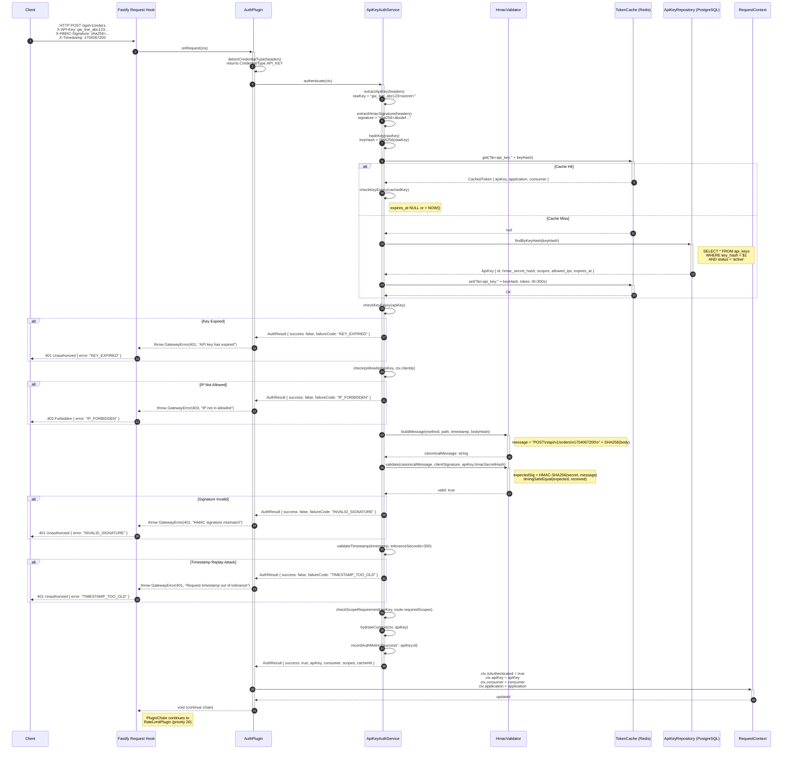
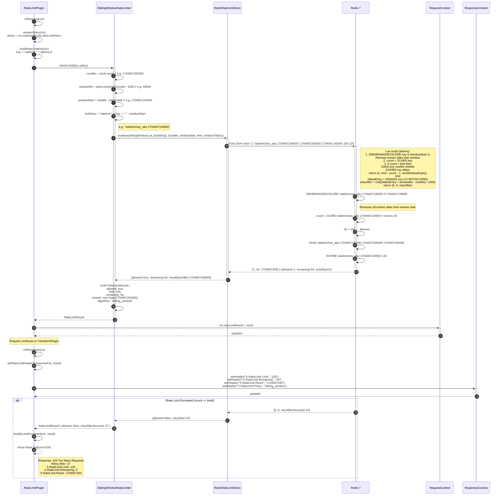
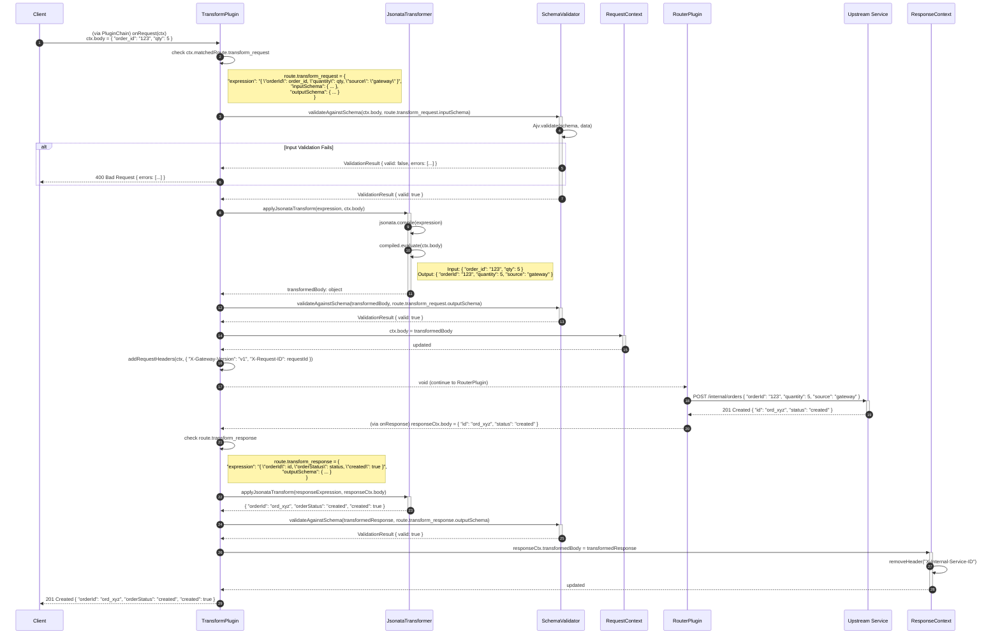
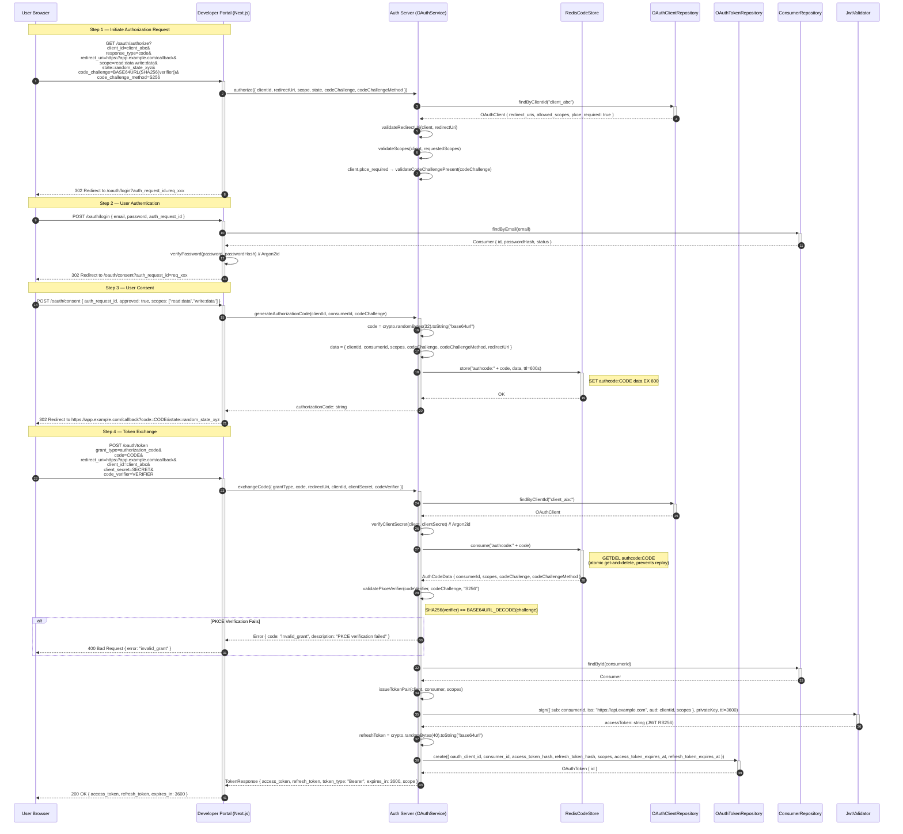
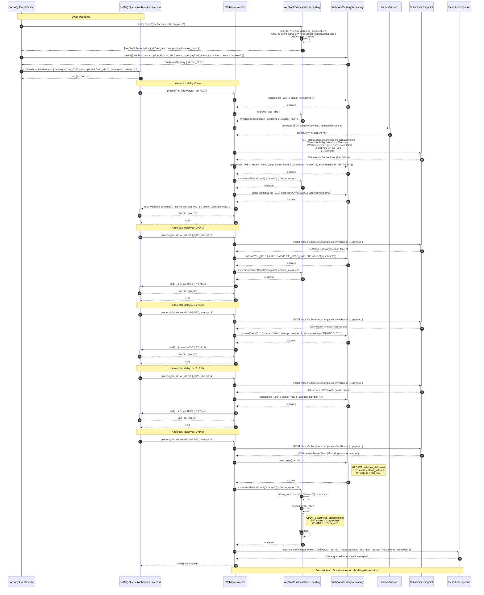
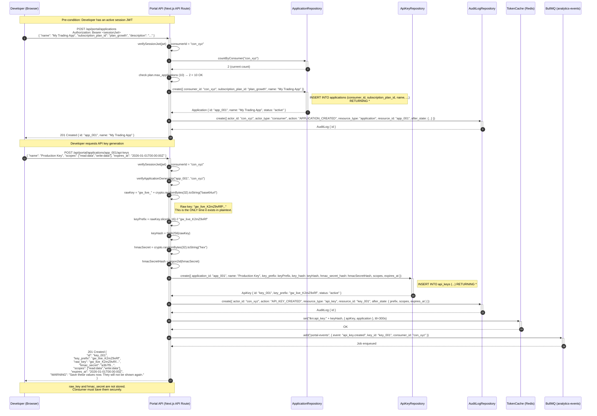
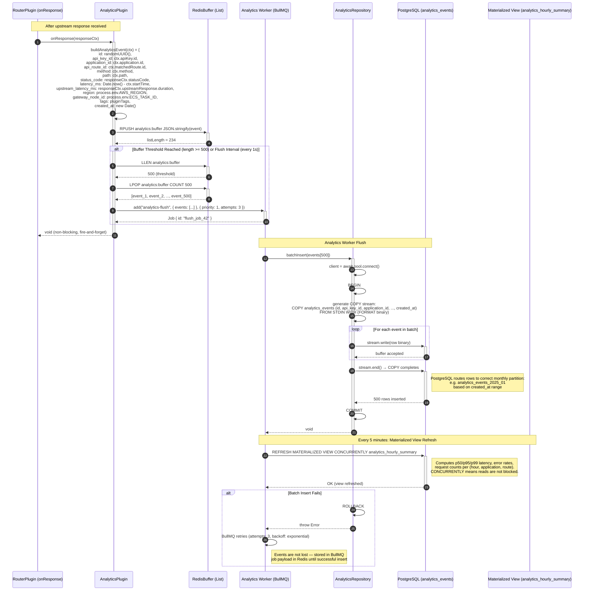

# Detailed Sequence Diagrams

## 1. Overview

This document contains seven detailed sequence diagrams describing the key runtime interactions within
the API Gateway and Developer Portal platform. Each diagram captures internal method-level calls,
Redis command sequences, database queries, and error branches.

| Diagram | Title                                                   |
|---------|---------------------------------------------------------|
| SD-001  | API Key HMAC-SHA256 Validation                          |
| SD-002  | Sliding Window Rate Limit with Redis                    |
| SD-003  | Request Body Transformation Pipeline                    |
| SD-004  | OAuth 2.0 Authorization Code with PKCE                 |
| SD-005  | Webhook Delivery with Exponential Backoff               |
| SD-006  | Developer Portal Create Application and Generate API Key|
| SD-007  | Real-Time Analytics Ingestion                           |

All diagrams use Mermaid `sequenceDiagram` syntax. Actors prefixed with `+` indicate activation bars.

---

## 2. SD-001: API Key HMAC-SHA256 Validation

This diagram shows the complete authentication flow when a client sends an API request signed with
HMAC-SHA256. The flow covers: credential extraction, cache lookup, database fallback, HMAC signature
verification, expiry and IP allowlist checks, and context hydration.



---

## 3. SD-002: Sliding Window Rate Limit with Redis

This diagram shows the exact Redis commands used in the sliding-window algorithm. Key naming convention:
`ratelimit:{keyId}:{windowStartMs}`. The implementation uses a Lua script for atomicity.



---

## 4. SD-003: Request Body Transformation Pipeline

This diagram shows the complete request and response transformation pipeline using JSONata expressions
and JSON Schema validation.



---

## 5. SD-004: OAuth 2.0 Authorization Code Flow with PKCE

Complete OAuth 2.0 authorization code flow (RFC 6749 + RFC 7636 PKCE). Covers the browser redirect,
code exchange, token issuance, and JWT signing.



---

## 6. SD-005: Webhook Delivery with Exponential Backoff

Full lifecycle of a webhook delivery from event emission through BullMQ, delivery attempt, failure
handling, exponential backoff retries (1 s, 2 s, 4 s, 8 s, 16 s), and dead-lettering after 5 failures.



---

## 7. SD-006: Developer Portal Create Application and Generate API Key

Full portal flow: consumer authenticates via session, creates an application, then generates an HMAC
API key. The raw key is returned exactly once and never persisted.



---

## 8. SD-007: Real-Time Analytics Ingestion

Gateway request completion triggers analytics event buffering in Redis, flushed by a BullMQ worker
to PostgreSQL via bulk COPY.



---

## 9. Error Propagation Patterns

| Error Code          | HTTP Status | Thrown By               | Propagated To   | Client Response Body                                          |
|---------------------|-------------|-------------------------|-----------------|---------------------------------------------------------------|
| `KEY_EXPIRED`       | 401         | ApiKeyAuthService       | AuthPlugin      | `{ "error": "KEY_EXPIRED", "message": "API key has expired" }`|
| `INVALID_SIGNATURE` | 401         | HmacValidator           | ApiKeyAuthService| `{ "error": "INVALID_SIGNATURE" }`                           |
| `TIMESTAMP_TOO_OLD` | 401         | HmacValidator           | ApiKeyAuthService| `{ "error": "TIMESTAMP_TOO_OLD", "tolerance": 300 }`         |
| `IP_FORBIDDEN`      | 403         | ApiKeyAuthService       | AuthPlugin      | `{ "error": "IP_FORBIDDEN", "ip": "1.2.3.4" }`               |
| `SCOPE_INSUFFICIENT`| 403         | ApiKeyAuthService       | AuthPlugin      | `{ "error": "SCOPE_INSUFFICIENT", "required": [...] }`        |
| `RATE_LIMIT_EXCEEDED`| 429        | SlidingWindowRateLimiter| RateLimitPlugin | `{ "error": "RATE_LIMIT_EXCEEDED", "retryAfter": 37 }`        |
| `TRANSFORM_FAILED`  | 400         | JsonataTransformer      | TransformPlugin | `{ "error": "TRANSFORM_FAILED", "details": "..." }`           |
| `SCHEMA_INVALID`    | 400         | SchemaValidator         | TransformPlugin | `{ "error": "SCHEMA_INVALID", "errors": [...] }`              |
| `ROUTE_NOT_FOUND`   | 404         | RouterPlugin            | PluginChain     | `{ "error": "ROUTE_NOT_FOUND" }`                              |
| `UPSTREAM_TIMEOUT`  | 504         | RouterPlugin            | PluginChain     | `{ "error": "UPSTREAM_TIMEOUT", "timeoutMs": 30000 }`         |
| `UPSTREAM_ERROR`    | 502         | RouterPlugin            | PluginChain     | `{ "error": "UPSTREAM_ERROR", "upstream_status": 500 }`       |
| `CIRCUIT_OPEN`      | 503         | CircuitBreaker          | RouterPlugin    | `{ "error": "CIRCUIT_OPEN", "route": "/api/v1/orders" }`      |
| `PKCE_FAILED`       | 400         | OAuthService            | Auth endpoint   | `{ "error": "invalid_grant", "description": "PKCE failed" }`  |
| `invalid_grant`     | 400         | OAuthService            | Token endpoint  | `{ "error": "invalid_grant" }`                                |
| `WEBHOOK_DEAD_LETTERED`| N/A     | WebhookWorker           | DLQ + Alerts    | (no client response; internal event)                          |

All errors are wrapped in a `GatewayError` class that carries:
- `statusCode: number` — HTTP status to return
- `errorCode: string` — machine-readable code for client handling
- `message: string` — human-readable description
- `traceId: string` — OpenTelemetry trace ID for log correlation
- `requestId: string` — unique per-request identifier

```typescript
// src/errors/GatewayError.ts
export class GatewayError extends Error {
    constructor(
        public readonly statusCode: number,
        public readonly errorCode: string,
        message: string,
        public readonly traceId?: string,
        public readonly requestId?: string,
        public readonly details?: unknown
    ) {
        super(message);
        this.name = 'GatewayError';
    }
}
```
