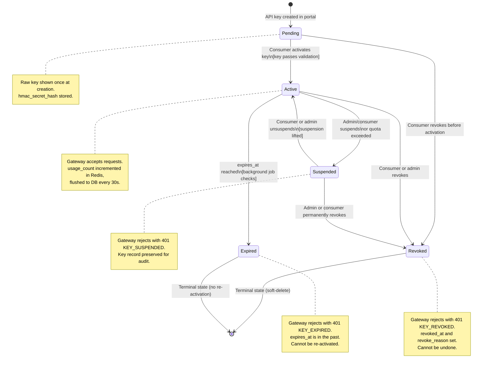
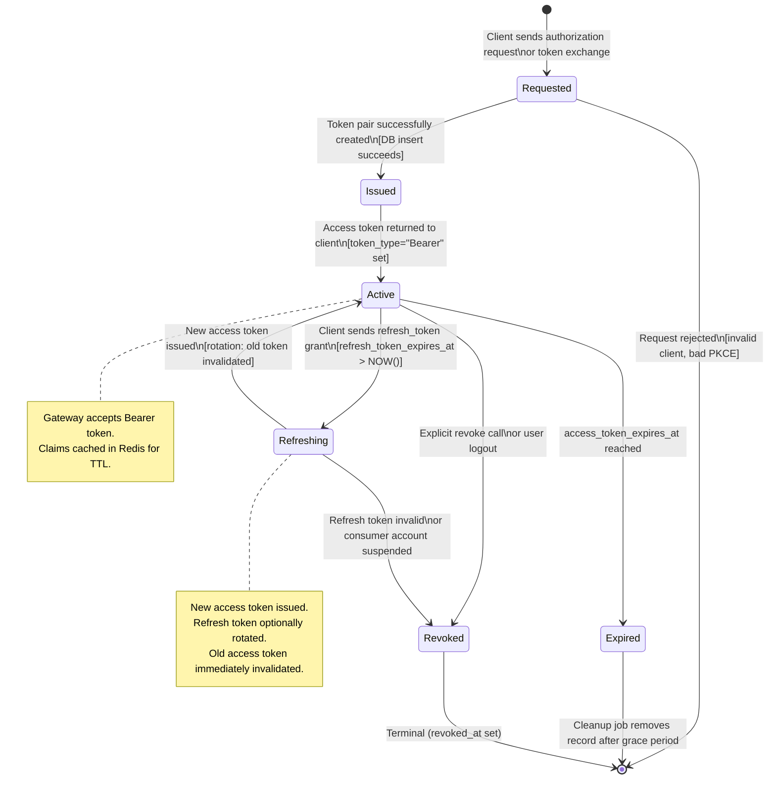
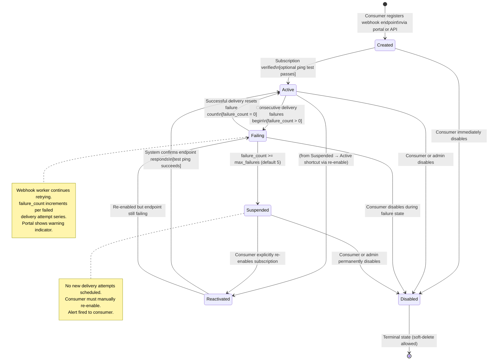
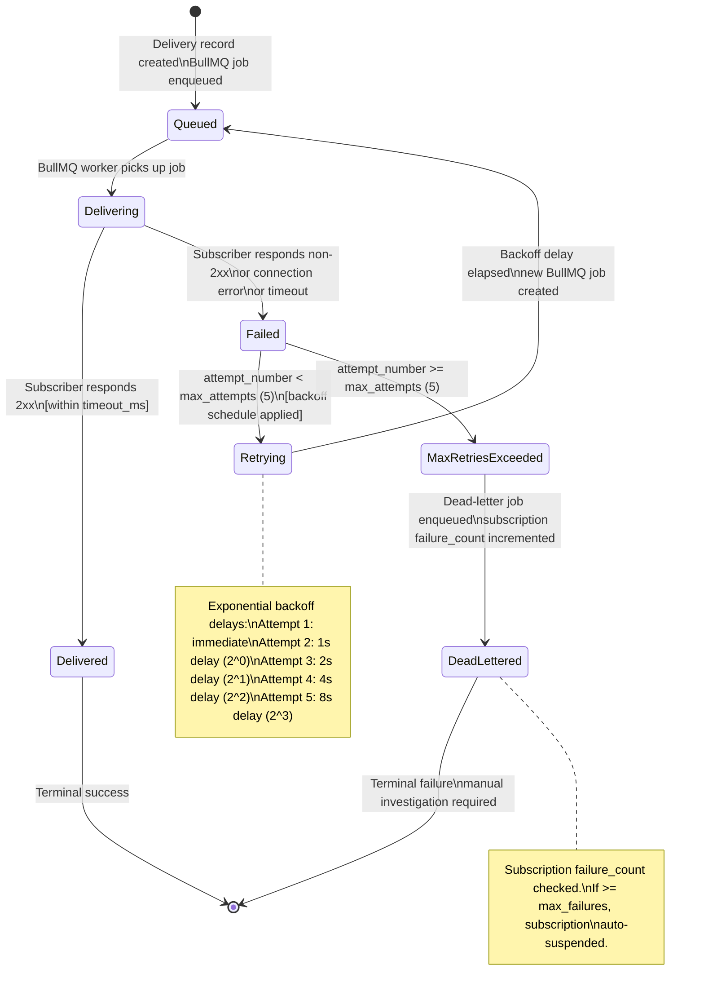
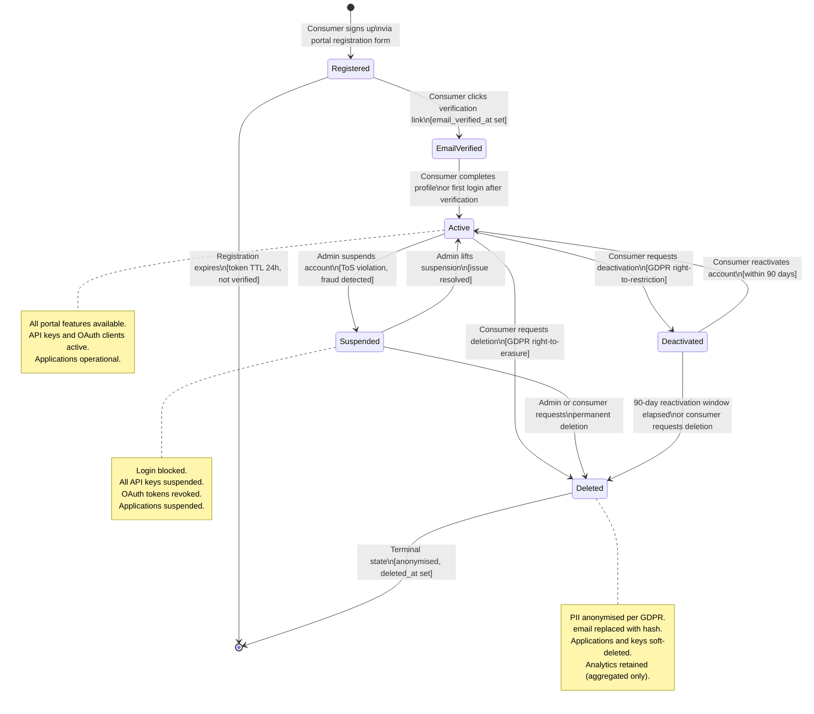

```mermaid
stateDiagram-v2
    [*] --> Draft : New API version created\nin portal

    Draft --> Active            : Admin publishes version\n[routes configured; openapi_spec set]
    Draft --> [*]               : Draft deleted before publish

    Active --> Deprecated       : New version becomes active;\nthis version marked deprecated\n[deprecated_at set]

    Deprecated --> Sunset       : sunset_at date reached\n[background scheduler fires]
    Deprecated --> Active       : Rollback — deprecation reversed\n[admin decision]

    Sunset --> Retired          : Grace period elapsed\n[sunset_at + 90 days]

    Retired --> [*]             : Traffic refused with 410 Gone.\nRoutes deactivated.

    note right of Draft
        Version exists but receives no traffic.
        Routes can be configured.
        openapi_spec can be edited.
    end note

    note right of Active
        Gateway routes traffic to this version.
        base_path registered in routing table.
    end note

    note right of Deprecated
        Traffic still accepted.
        Deprecation warning header added:
        Deprecation: true
        Sunset: <date>
    end note

    note right of Sunset
        Traffic still accepted but sunset notice prominent.
        Consumer notifications sent.
        30-day countdown to retirement.
    end note

    note right of Retired
        Gateway returns 410 Gone for all routes.
        OpenAPI spec archived.
        Partitioned analytics data retained.
    end note
```

# State Machine Diagrams

## 1. Overview

This document defines seven state machines that govern the lifecycle of the core entities in the
API Gateway and Developer Portal platform. Each state machine is presented as:

1. A Mermaid `stateDiagram-v2` diagram showing all states and transitions.
2. A State Transition Table listing every valid transition with its triggering event, optional
   guard condition, target state, and action executed on entry.
3. A State Invariants section describing properties that must hold true in each state.

The state machines are:

| ID     | Entity                    | States                                                     |
|--------|---------------------------|------------------------------------------------------------|
| SM-001 | API Key Lifecycle         | Pending, Active, Suspended, Revoked, Expired               |
| SM-002 | OAuth Token Lifecycle     | Requested, Issued, Active, Refreshing, Expired, Revoked    |
| SM-003 | API Request Processing    | Received → Completed + error states                        |
| SM-004 | Webhook Subscription      | Created, Active, Failing, Suspended, Reactivated, Disabled |
| SM-005 | Webhook Delivery Attempt  | Queued, Delivering, Delivered, Failed, Retrying, Dead      |
| SM-006 | API Version Lifecycle     | Draft, Active, Deprecated, Sunset, Retired                 |
| SM-007 | Consumer Account Lifecycle| Registered, EmailVerified, Active, Suspended, Deactivated  |

---

## 2. SM-001: API Key Lifecycle

### Diagram



### State Transition Table

| From State | Event / Trigger                         | Guard                                     | To State   | Action                                                          |
|------------|-----------------------------------------|-------------------------------------------|------------|-----------------------------------------------------------------|
| —          | `POST /api-keys` (portal)               | Consumer owns application                 | Pending    | Insert api_keys row; generate key + secret; emit KEY_CREATED   |
| Pending    | Consumer confirms activation            | Key not yet expired                       | Active     | SET status='active'; audit log API_KEY_ACTIVATED                |
| Pending    | Consumer revokes                        | —                                         | Revoked    | SET status='revoked', revoked_at=NOW(); audit log KEY_REVOKED   |
| Active     | `PATCH /api-keys/:id/suspend` (portal)  | Consumer owns key or admin                | Suspended  | SET status='suspended'; audit log KEY_SUSPENDED; invalidate cache|
| Active     | Quota exceeded event                    | Monthly request_count >= plan limit       | Suspended  | SET status='suspended'; emit QUOTA_EXCEEDED alert               |
| Active     | `DELETE /api-keys/:id` (portal)         | Consumer owns key or admin                | Revoked    | SET status='revoked', revoked_at, revoke_reason; invalidate cache|
| Active     | Background expiry job fires             | NOW() >= expires_at                       | Expired    | SET status='expired'; emit KEY_EXPIRED event; invalidate cache  |
| Suspended  | `PATCH /api-keys/:id/unsuspend`         | Consumer owns key or admin; not expired   | Active     | SET status='active'; audit log KEY_UNSUSPENDED; warm cache      |
| Suspended  | `DELETE /api-keys/:id`                  | Consumer owns key or admin                | Revoked    | SET status='revoked', revoked_at, revoke_reason; audit log      |
| Revoked    | (none)                                  | Terminal                                  | —          | No further transitions allowed                                  |
| Expired    | (none)                                  | Terminal                                  | —          | No further transitions allowed                                  |

### State Invariants

| State     | Invariants                                                                               |
|-----------|------------------------------------------------------------------------------------------|
| Pending   | `status='pending'`; `key_hash` and `hmac_secret_hash` set; `revoked_at IS NULL`          |
| Active    | `status='active'`; `expires_at IS NULL OR expires_at > NOW()`; `revoked_at IS NULL`      |
| Suspended | `status='suspended'`; `revoked_at IS NULL`; `expires_at IS NULL OR expires_at > NOW()`   |
| Revoked   | `status='revoked'`; `revoked_at IS NOT NULL`; `revoke_reason IS NOT NULL`                |
| Expired   | `status='expired'`; `expires_at IS NOT NULL AND expires_at <= NOW()`                     |

---

## 3. SM-002: OAuth Token Lifecycle

### Diagram



### State Transition Table

| From State | Event / Trigger                            | Guard                                         | To State   | Action                                                                   |
|------------|--------------------------------------------|-----------------------------------------------|------------|--------------------------------------------------------------------------|
| —          | `POST /oauth/token` (any grant type)       | Client credentials valid; scopes allowed      | Requested  | Validate client, scopes, PKCE; begin token issuance                     |
| Requested  | Token pair generated                       | DB insert succeeds                            | Issued     | Insert oauth_tokens; hash access + refresh tokens                        |
| Requested  | Validation fails                           | Bad client secret or PKCE mismatch            | [*]        | Return 400 invalid_grant; no DB record                                   |
| Issued     | Token returned to client                   | Access token payload assembled                | Active     | Return TokenResponse to client; cache access_token_hash in Redis         |
| Active     | Client sends `grant_type=refresh_token`    | refresh_token not expired, not revoked        | Refreshing | Begin new token issuance; invalidate old access token hash in cache      |
| Active     | Background cleanup job                     | access_token_expires_at <= NOW()              | Expired    | SET revoked_at=NULL (natural expiry); remove from Redis cache            |
| Active     | `POST /oauth/revoke`                       | Token belongs to requesting client            | Revoked    | SET revoked_at=NOW(), revoke_reason; invalidate cache; audit log         |
| Active     | Consumer account suspended                 | consumer.status = 'suspended'                 | Revoked    | Bulk revoke all consumer tokens; SET revoked_at; audit log               |
| Refreshing | New access token signed and stored         | DB update succeeds                            | Active     | New token in cache; old access_token_hash DEL from Redis                 |
| Refreshing | Refresh token expired or revoked           | refresh_token_expires_at <= NOW()             | Revoked    | SET revoked_at; return 400 invalid_grant to client                       |
| Expired    | Cleanup job (7-day grace period)           | created_at <= NOW() - INTERVAL '7 days'       | [*]        | DELETE row; metrics emitted                                              |
| Revoked    | (none)                                     | Terminal                                      | —          | No further transitions                                                   |

### State Invariants

| State      | Invariants                                                                                 |
|------------|--------------------------------------------------------------------------------------------|
| Requested  | No DB record yet; validation state in memory only                                          |
| Issued     | DB row exists; `revoked_at IS NULL`; `access_token_expires_at > NOW()`                    |
| Active     | `revoked_at IS NULL`; `access_token_expires_at > NOW()`; hash in Redis cache              |
| Refreshing | Old access token removed from cache; DB row still active during refresh operation          |
| Expired    | `access_token_expires_at <= NOW()`; `revoked_at IS NULL` (natural expiry)                  |
| Revoked    | `revoked_at IS NOT NULL`; token hash removed from Redis cache                              |

---

## 4. SM-003: API Request Processing

### Diagram

```mermaid
stateDiagram-v2
    [*] --> Received : Fastify receives HTTP request

    Received --> Authenticating   : PluginChain starts; AuthPlugin.onRequest()
    Received --> Rejected         : Pre-auth validation fails\n[malformed request, missing headers]

    Authenticating --> RateLimiting   : Auth succeeds\n[ctx.isAuthenticated = true]
    Authenticating --> AuthFailed     : Credentials invalid\n[INVALID_SIGNATURE, KEY_EXPIRED etc.]

    RateLimiting --> Transforming     : Rate limit check passes\n[result.allowed = true]
    RateLimiting --> RateLimitExceeded : Limit exceeded\n[result.allowed = false]

    Transforming --> Routing           : Request body transformed\n[JSONata applied; schema valid]
    Transforming --> TransformError    : Transform failed\n[JSONata error or schema violation]

    Routing --> AwaitingUpstream      : Route matched; proxy request sent
    Routing --> RouteNotFound         : No matching route found

    AwaitingUpstream --> TransformingResponse : Upstream responded\n[2xx, 3xx, 4xx, 5xx received]
    AwaitingUpstream --> Timeout              : Upstream timeout\n[timeout_ms exceeded]
    AwaitingUpstream --> UpstreamError        : Network error\n[circuit breaker open, DNS fail]

    TransformingResponse --> Completed        : Response transformed and returned
    TransformingResponse --> TransformError   : Response transform failed

    Completed --> [*]             : Response sent to client; analytics event emitted

    AuthFailed --> [*]            : 401 response sent; audit log written
    RateLimitExceeded --> [*]     : 429 response sent; X-RateLimit-* headers set
    TransformError --> [*]        : 400 response sent; error details in body
    RouteNotFound --> [*]         : 404 response sent
    Timeout --> [*]               : 504 response sent; upstream timeout recorded
    UpstreamError --> [*]         : 502 response sent; circuit breaker state updated
    Rejected --> [*]              : 400 response sent

    note right of AwaitingUpstream
        Circuit breaker monitors failures.
        On 50% error rate in 10s window,
        circuit trips to Open state.
        Requests fail-fast for 30s.
    end note
```

### State Transition Table

| From State           | Event / Trigger                             | Guard                                    | To State             | Action                                                        |
|----------------------|---------------------------------------------|------------------------------------------|----------------------|---------------------------------------------------------------|
| —                    | HTTP request arrives                        | —                                        | Received             | Assign requestId, traceId; start span; log request           |
| Received             | AuthPlugin.onRequest() called               | Request has required headers             | Authenticating       | Extract credentials; start auth span                         |
| Received             | Pre-auth validation                         | Malformed body or missing required header| Rejected             | Return 400; write audit log                                   |
| Authenticating       | Auth succeeds                               | Credentials valid; key/token active      | RateLimiting         | Hydrate ctx with identity; record cache hit/miss metric       |
| Authenticating       | Auth fails                                  | Invalid credentials                      | AuthFailed           | Return 401; write audit log; increment auth failure counter   |
| RateLimiting         | Rate limit check passes                     | result.allowed = true                    | Transforming         | Set X-RateLimit-* in response context; record remaining       |
| RateLimiting         | Rate limit exceeded                         | result.allowed = false                   | RateLimitExceeded    | Return 429 with Retry-After; increment rate_exceeded counter  |
| Transforming         | JSONata transform succeeds                  | Output schema valid                      | Routing              | Replace ctx.body with transformed body; add gateway headers   |
| Transforming         | JSONata expression fails                    | Expression error or schema violation     | TransformError       | Return 400 with validation errors                             |
| Routing              | Route matched in routing table              | Active route exists for path+method      | AwaitingUpstream     | Build upstream URL; inject tracing headers; send proxy req    |
| Routing              | No route matched                            | No entry in routing table                | RouteNotFound        | Return 404                                                    |
| AwaitingUpstream     | Upstream responds                           | HTTP response received (any status)      | TransformingResponse | Record upstream latency; set responseCtx.body                 |
| AwaitingUpstream     | Upstream does not respond in time           | elapsed >= route.timeout_ms              | Timeout              | Return 504; increment timeout counter; update circuit breaker |
| AwaitingUpstream     | Network error or circuit open               | ECONNREFUSED / circuit breaker open      | UpstreamError        | Return 502; update circuit breaker state                      |
| TransformingResponse | Response transform succeeds                 | —                                        | Completed            | Return transformed response; emit analytics event             |
| TransformingResponse | Response transform fails                    | —                                        | TransformError       | Return 500 or 502                                             |
| Completed            | Response sent                               | —                                        | [*]                  | Finish span; flush analytics buffer; update last_used_at      |

### State Invariants

| State                | Invariants                                                                           |
|----------------------|--------------------------------------------------------------------------------------|
| Received             | `ctx.requestId` set; `ctx.isAuthenticated = false`; `ctx.startTime` set             |
| Authenticating       | Credentials extracted; `ctx.isAuthenticated` still false until auth complete         |
| RateLimiting         | `ctx.isAuthenticated = true`; identity fields populated                              |
| Transforming         | Rate limit passed; `ctx.rateLimitResult.allowed = true`                              |
| Routing              | Request body in final transformed form                                               |
| AwaitingUpstream     | Upstream request sent; circuit breaker tracking in-flight request                   |
| TransformingResponse | `responseCtx.upstreamResponse` populated; upstream latency recorded                 |
| Completed            | `responseCtx.statusCode` set; analytics event emitted; span ended                   |

---

## 5. SM-004: Webhook Subscription Lifecycle

### Diagram



### State Transition Table

| From State  | Event / Trigger                              | Guard                                       | To State    | Action                                                             |
|-------------|----------------------------------------------|---------------------------------------------|-------------|--------------------------------------------------------------------|
| —           | `POST /webhook-subscriptions`                | Valid endpoint URL; application active      | Created     | Insert row; generate signing secret; status='created'             |
| Created     | Endpoint ping returns 2xx                    | Ping response within 5 s                    | Active      | SET status='active'; emit WEBHOOK_ACTIVATED                        |
| Created     | Consumer disables immediately                | —                                           | Disabled    | SET status='disabled'; audit log                                  |
| Active      | Delivery attempt fails                       | failure_count transitions from 0 to 1       | Failing     | SET status='failing'; increment failure_count                      |
| Active      | Consumer disables                            | —                                           | Disabled    | SET status='disabled'; cancel pending retries; audit log           |
| Failing     | Delivery attempt succeeds                    | HTTP 2xx from subscriber                    | Active      | SET status='active', failure_count=0; last_success_at=NOW()        |
| Failing     | failure_count reaches max_failures           | failure_count >= subscription.max_failures  | Suspended   | SET status='suspended'; fire WEBHOOK_SUSPENDED alert               |
| Failing     | Consumer disables                            | —                                           | Disabled    | SET status='disabled'; cancel retries; audit log                   |
| Suspended   | `PATCH /webhook-subscriptions/:id/enable`    | Consumer owns subscription                  | Reactivated | SET status='reactivated', failure_count=0                          |
| Suspended   | Consumer permanently disables                | —                                           | Disabled    | SET status='disabled'; audit log                                   |
| Reactivated | Test ping passes                             | HTTP 2xx within 5 s                         | Active      | SET status='active'; emit WEBHOOK_REACTIVATED                      |
| Reactivated | Test ping fails or next delivery fails       | HTTP non-2xx or timeout                     | Failing     | SET status='failing', failure_count=1                              |
| Disabled    | (none)                                       | Terminal                                    | —           | No further transitions                                            |

### State Invariants

| State       | Invariants                                                                                      |
|-------------|-------------------------------------------------------------------------------------------------|
| Created     | `status='created'`; `failure_count=0`; `last_success_at IS NULL`                               |
| Active      | `status='active'`; `failure_count=0`; endpoint receiving deliveries                            |
| Failing     | `status='failing'`; `0 < failure_count < max_failures`; retries still scheduled                |
| Suspended   | `status='suspended'`; `failure_count >= max_failures`; no retries in queue                     |
| Reactivated | `status='reactivated'`; `failure_count=0`; pending verification ping                           |
| Disabled    | `status='disabled'`; no deliveries attempted; can be soft-deleted                              |

---

## 6. SM-005: Webhook Delivery Attempt

### Diagram



### State Transition Table

| From State          | Event / Trigger                          | Guard                                  | To State            | Action                                                                     |
|---------------------|------------------------------------------|----------------------------------------|---------------------|----------------------------------------------------------------------------|
| —                   | Gateway emits webhook event              | Subscription active for event type     | Queued              | Insert webhook_deliveries row; BullMQ job added with delay=0               |
| Queued              | BullMQ worker processes job              | Worker has capacity                    | Delivering          | UPDATE status='delivering'; compute HMAC signature; HTTP POST              |
| Delivering          | Subscriber returns 2xx                  | HTTP status 200-299                    | Delivered           | UPDATE status='delivered', delivered_at, http_status_code; reset failures  |
| Delivering          | Subscriber returns non-2xx or timeout   | HTTP status >= 300 or timeout          | Failed              | UPDATE status='failed', http_status_code, error_message, duration_ms       |
| Failed              | Retry check                             | attempt_number < 5                     | Retrying            | Compute nextRetryAt = NOW() + 2^(n-1) seconds; UPDATE status='retrying'   |
| Failed              | Max attempts reached                    | attempt_number >= 5                    | MaxRetriesExceeded  | (intermediate state, immediate transition to DeadLettered)                 |
| Retrying            | Backoff timer fires                     | next_retry_at <= NOW()                 | Queued              | New BullMQ job added; attempt_number incremented in new delivery row       |
| MaxRetriesExceeded  | Dead-letter processing                  | —                                      | DeadLettered        | UPDATE status='dead_lettered'; DLQ job added; increment subscription failures|
| Delivered           | (none)                                  | Terminal                               | —                   | No further transitions                                                     |
| DeadLettered        | (none)                                  | Terminal                               | —                   | Ops team notified; manual retry via portal                                 |

### Backoff Schedule

| Attempt | Delay Formula | Delay  |
|---------|---------------|--------|
| 1       | 0 (immediate) | 0 ms   |
| 2       | 2^0 seconds   | 1 s    |
| 3       | 2^1 seconds   | 2 s    |
| 4       | 2^2 seconds   | 4 s    |
| 5       | 2^3 seconds   | 8 s    |

### State Invariants

| State               | Invariants                                                                              |
|---------------------|-----------------------------------------------------------------------------------------|
| Queued              | `status='queued'`; `attempt_number=1` (first attempt) or incremented for retry          |
| Delivering          | `status='delivering'`; HTTP request in flight; HMAC signature computed                 |
| Delivered           | `status='delivered'`; `http_status_code` 2xx; `delivered_at IS NOT NULL`               |
| Failed              | `status='failed'`; `http_status_code` non-2xx or null (timeout/network)                |
| Retrying            | `status='retrying'`; `next_retry_at IS NOT NULL`; `attempt_number < 5`                 |
| MaxRetriesExceeded  | `attempt_number = 5`; transition to DeadLettered is immediate                          |
| DeadLettered        | `status='dead_lettered'`; `attempt_number=5`; no further retry scheduled               |

---

## 7. SM-006: API Version Lifecycle

### Diagram



### State Transition Table

| From State  | Event / Trigger                            | Guard                                      | To State    | Action                                                               |
|-------------|--------------------------------------------|--------------------------------------------|-------------|----------------------------------------------------------------------|
| —           | `POST /api-versions` in portal             | Admin authenticated                        | Draft       | Insert api_versions row; status='draft'                             |
| Draft       | `POST /api-versions/:id/publish`           | Routes configured; openapi_spec present    | Active      | SET status='active'; register base_path in routing table; audit log  |
| Draft       | `DELETE /api-versions/:id`                 | No routes created yet                      | [*]         | Hard delete; no traffic impact                                       |
| Active      | New version published                      | Newer version goes Active                  | Deprecated  | SET status='deprecated', deprecated_at=NOW(); add Deprecation header |
| Active      | Admin manually deprecates                  | Admin decision                             | Deprecated  | SET status='deprecated', deprecated_at=NOW(); consumer notification  |
| Deprecated  | Admin reverses deprecation                 | No newer active version constraint         | Active      | SET status='active', deprecated_at=NULL; remove Deprecation header   |
| Deprecated  | `PATCH /api-versions/:id/sunset`           | sunset_at date set                         | Sunset      | SET status='sunset'; add Sunset header with date                     |
| Deprecated  | sunset_at reached via scheduler            | NOW() >= sunset_at                         | Sunset      | SET status='sunset'; fire SUNSET_REACHED alert; notify consumers     |
| Sunset      | 90-day grace period elapsed                | NOW() >= sunset_at + 90 days               | Retired     | SET status='retired'; deactivate all routes; return 410 for base_path|
| Retired     | (none)                                     | Terminal                                   | —           | No further transitions; archive openapi_spec                         |

### State Invariants

| State      | Invariants                                                                                |
|------------|-------------------------------------------------------------------------------------------|
| Draft      | `status='draft'`; `base_path` registered but not in active routing table                 |
| Active     | `status='active'`; `deprecated_at IS NULL`; `base_path` in routing table                 |
| Deprecated | `status='deprecated'`; `deprecated_at IS NOT NULL`; traffic still accepted               |
| Sunset     | `status='sunset'`; `sunset_at IS NOT NULL`; Sunset header injected into all responses    |
| Retired    | `status='retired'`; all routes `active=FALSE`; gateway returns 410 for all paths         |

---

## 8. SM-007: Consumer Account Lifecycle

### Diagram



### State Transition Table

| From State    | Event / Trigger                               | Guard                                           | To State      | Action                                                                  |
|---------------|-----------------------------------------------|-------------------------------------------------|---------------|-------------------------------------------------------------------------|
| —             | `POST /portal/register`                       | Valid email; not already registered             | Registered    | Insert consumer row; send verification email; status='registered'       |
| Registered    | Consumer clicks email verification link        | Token valid; not expired (24 h TTL)             | EmailVerified | SET status='email_verified', email_verified_at=NOW()                    |
| Registered    | Verification token expires                    | NOW() >= token_created_at + 24h; not verified   | [*]           | DELETE consumer row (or mark abandoned); send re-registration prompt    |
| EmailVerified | First login or profile completion             | Account not otherwise restricted                | Active        | SET status='active'; audit log CONSUMER_ACTIVATED                       |
| Active        | Admin issues suspension                       | Admin authenticated; reason provided            | Suspended     | SET status='suspended'; suspend all api_keys; revoke oauth_tokens        |
| Active        | Consumer requests deactivation                | Consumer authenticated; owns account            | Deactivated   | SET status='deactivated'; suspend api_keys; set 90-day deletion timer   |
| Active        | Consumer requests deletion (GDPR erasure)     | Consumer authenticated; confirmation provided   | Deleted       | SET status='deleted', deleted_at; anonymise PII; cascade soft-deletes   |
| Suspended     | Admin lifts suspension                        | Admin authenticated; reason provided            | Active        | SET status='active'; unsuspend api_keys; notify consumer                |
| Suspended     | Admin or consumer requests deletion           | Admin or consumer authenticated                 | Deleted       | SET status='deleted', deleted_at; anonymise PII; cascade soft-deletes   |
| Deactivated   | Consumer logs in within 90 days               | deleted_at IS NULL; within 90-day window        | Active        | SET status='active'; reactivate api_keys; clear deactivation timer      |
| Deactivated   | 90-day window lapses                          | NOW() >= deactivated_at + 90 days               | Deleted       | SET status='deleted', deleted_at; anonymise PII; cascade soft-deletes   |
| Deactivated   | Consumer requests deletion                    | Consumer authenticated                          | Deleted       | SET status='deleted', deleted_at; anonymise PII; cascade soft-deletes   |
| Deleted       | (none)                                        | Terminal                                        | —             | No further transitions; anonymisation complete                          |

### State Invariants

| State         | Invariants                                                                                 |
|---------------|--------------------------------------------------------------------------------------------|
| Registered    | `status='registered'`; `email_verified_at IS NULL`; `deleted_at IS NULL`                  |
| EmailVerified | `status='email_verified'`; `email_verified_at IS NOT NULL`                                |
| Active        | `status='active'`; `email_verified_at IS NOT NULL`; `deleted_at IS NULL`                  |
| Suspended     | `status='suspended'`; all api_keys have status='suspended'; oauth_tokens revoked           |
| Deactivated   | `status='deactivated'`; `deleted_at IS NULL`; api_keys suspended                          |
| Deleted       | `status='deleted'`; `deleted_at IS NOT NULL`; email anonymised; PII cleared               |

---

## 9. Cross-Cutting State Invariants

These invariants must hold at all times across related state machines:

| Rule | Description                                                                                        |
|------|----------------------------------------------------------------------------------------------------|
| I-1  | An `active` api_key can only belong to an `active` or `suspended` application.                     |
| I-2  | A `firing` alert must have `fired_at IS NOT NULL` and `resolved_at IS NULL`.                       |
| I-3  | A `dead_lettered` webhook_delivery must have `attempt_number = 5`.                                 |
| I-4  | A `revoked` oauth_token must have `revoked_at IS NOT NULL`.                                        |
| I-5  | A `retired` api_version must have all associated api_routes with `active = FALSE`.                 |
| I-6  | A `suspended` consumer must have all api_keys with `status = 'suspended'`.                        |
| I-7  | A `deleted` consumer must have `deleted_at IS NOT NULL` and `email` anonymised (no @ domain).     |
| I-8  | A `suspended` webhook_subscription must have `failure_count >= max_failures`.                     |
| I-9  | An analytics_event row must have `application_id` that exists in the applications table.           |
| I-10 | An audit_log row must be immutable — UPDATE and DELETE are prohibited by row-level security policy.|
