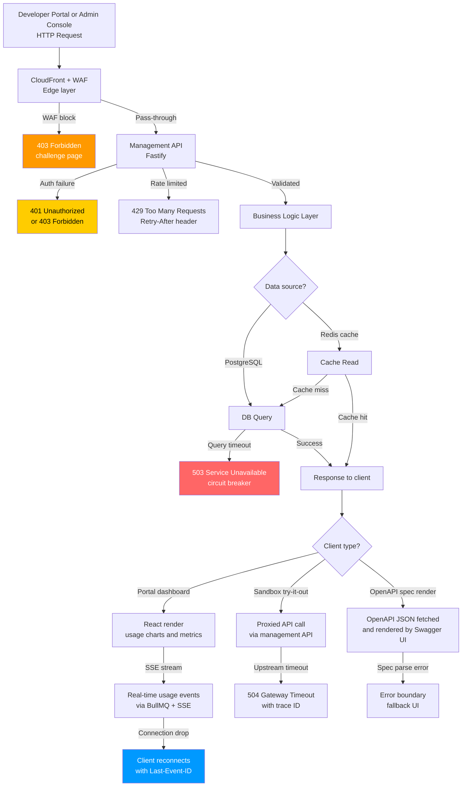

# Edge Cases: API and UI — API Gateway and Developer Portal

## Overview

This file documents edge cases in the API layer and Developer Portal UI of the **API Gateway and Developer Portal** system. The API layer covers the gateway's own management REST API (used by the Admin Console and the Developer Portal's backend), the OpenAPI documentation renderer, the interactive try-it-out sandbox, and the real-time usage dashboard UI. Failures in this layer degrade developer experience and operator visibility even when the core gateway proxy and routing subsystems are operating correctly.

The tech stack under analysis is:

- **Management API**: Node.js 20 + Fastify (same process as gateway, separate route prefix `/api/v1/`)
- **Developer Portal frontend**: Next.js 14 App Router, deployed on AWS ECS Fargate behind CloudFront
- **Admin Console**: React SPA served from the same Next.js deployment
- **Data stores**: PostgreSQL 15 (RDS) + Redis 7 (ElastiCache)
- **Real-time usage events**: BullMQ queues + Server-Sent Events (SSE)
- **Auth**: API Key HMAC-SHA256 for machine clients; OAuth 2.0 + JWT for portal users
- **Infrastructure**: AWS ECS Fargate, RDS, ElastiCache, CloudFront, Route 53, WAF, S3
- **Observability**: OpenTelemetry, Prometheus, Grafana, Jaeger

---

## Failure Detection and Recovery Flow

---

## EC-API-001 — Developer Submits Duplicate API Key Rotation Request

| Field | Detail |
|-------|--------|
| **Failure Mode** | A developer clicks "Rotate API Key" in the Developer Portal. The portal's React state briefly freezes (React hydration race condition under slow network) and the developer clicks the button a second time before the first request completes. Two `POST /api/v1/keys/{keyId}/rotate` requests arrive at the management API within milliseconds. Both requests pass authentication and reach the key rotation handler, which revokes the old key and generates a new one. If both requests execute concurrently, two new keys may be generated and the first new key immediately invalidated by the second rotation. |
| **Impact** | The developer's application code has already received the first new key from the first request's response and has started using it. The second rotation immediately revokes that key, causing the developer's production API calls to fail with `401 Unauthorized` within seconds of the key being issued. The developer must perform a third rotation to obtain a stable key. This creates a confusing and trust-damaging experience. |
| **Detection** | The key rotation endpoint enforces idempotency via an `Idempotency-Key` header requirement. The portal frontend generates a UUID v4 idempotency key at the moment the rotate button is enabled and attaches it to the request. If two requests arrive with the same idempotency key, the second returns the cached result of the first. A Prometheus counter `api_key_rotation_duplicate_total` is incremented when an idempotency cache hit is detected on the rotation endpoint. Alert if the counter exceeds 10 per hour. |
| **Mitigation** | The rotate button is disabled immediately on first click and displays a loading spinner. The idempotency key is stored in React component state and reused for any retry within the same component lifecycle. The management API caches rotation results in Redis for 24 hours keyed by `idempotency:{key}`. The second duplicate request returns HTTP 200 with the same new key from the cache rather than triggering a second rotation. |
| **Recovery** | If duplicate rotations do occur (due to a bug bypassing idempotency), the support team can reissue a key via the admin API (`POST /admin/api/v1/keys/{keyId}/reissue`) and notify the developer by email. The erroneous rotation events are retained in the audit log for the developer's security review. |
| **Prevention** | Require `Idempotency-Key` header for all write operations on the management API (enforced by a Fastify hook that returns `400 Bad Request` if the header is absent on mutating endpoints). Add integration tests asserting that concurrent rotation requests return identical responses. Apply a database-level advisory lock on the key record during rotation to prevent concurrent mutations even if idempotency caching fails. |

---

## EC-API-002 — Developer Portal Dashboard Shows Stale Usage Metrics

| Field | Detail |
|-------|--------|
| **Failure Mode** | The Developer Portal's usage dashboard displays per-endpoint request counts, error rates, and latency percentiles sourced from a time-series aggregation job that runs every 60 seconds. The aggregation Celery job (BullMQ worker in this stack) fails silently when PostgreSQL is briefly overloaded (query timeout > 30 seconds during the aggregation window). The Redis cache key for the usage metrics is not updated. The dashboard continues serving the last cached metric snapshot, which may be up to 10 minutes stale when the job fails multiple consecutive times. |
| **Impact** | Developers making rate-limit or quota decisions based on dashboard data see incorrect figures. A developer whose usage is approaching quota may not receive the early-warning indication and incurs overage charges without warning. An operator investigating an ongoing incident sees metric charts that appear flat and healthy despite active failures in the underlying system. Trust in the dashboard is eroded. |
| **Detection** | The aggregation job writes a `last_aggregated_at` timestamp to Redis alongside the metric payload. The management API includes a `data_freshness_seconds` field in every metrics API response. The portal frontend displays a "Data last updated: N minutes ago" indicator with a yellow warning banner when `data_freshness_seconds > 120`. A Prometheus gauge `metrics_aggregation_lag_seconds` alerts when it exceeds 180 seconds. |
| **Mitigation** | When the portal detects stale data, it shows a non-blocking banner: "Usage data may be delayed. Last updated: 4 minutes ago." The developer's quota consumption is always computed in real time from the authoritative rate-limiting Redis counters (not from the aggregation cache) to ensure hard quota enforcement is never affected by dashboard staleness. Operators can force an immediate aggregation run via the admin API `POST /admin/api/v1/metrics/refresh`. |
| **Recovery** | When the overloaded PostgreSQL query returns, the aggregation job resumes on its next scheduled interval. The cache is updated, the dashboard freshness indicator clears, and the banner is removed automatically. If the job has failed for more than 5 consecutive intervals, it emits a `CRITICAL` alert to PagerDuty. A dead-letter queue entry is created for each failed aggregation window so historical gaps can be backfilled. |
| **Prevention** | Set a strict `statement_timeout = 25s` for aggregation queries to prevent them from holding PostgreSQL connections beyond the 30-second job window. Use materialised views for the most expensive aggregation steps (request counts per route per day), refreshed incrementally. Add circuit-breaker logic to the aggregation job so that repeated failures trigger a reduced-frequency mode rather than continuous retries that compound the database load. |

---

## EC-API-003 — OpenAPI Spec Fails to Render in Developer Portal Sandbox

| Field | Detail |
|-------|--------|
| **Failure Mode** | A backend team publishes a new API version to the gateway catalogue. The published OpenAPI 3.1 spec contains a `$ref` loop (Schema A references Schema B which references Schema A), a missing `operationId`, or an unsupported extension keyword. When the Developer Portal fetches and passes the spec to the embedded Swagger UI component, the renderer either crashes with an unhandled JavaScript exception, renders a blank panel, or enters an infinite loop trying to resolve circular references, eventually crashing the browser tab. |
| **Impact** | Developers who navigate to the affected API's documentation page see a broken or blank UI. They cannot explore the API, use try-it-out, or download the spec without directly constructing the spec URL. Adoption of the affected API is blocked until the issue is resolved by the publishing team. If the broken spec is for a widely used internal API, multiple development teams are blocked simultaneously. |
| **Detection** | The portal wraps the Swagger UI component in a React error boundary. If the renderer throws during mount or update, the error boundary catches it and renders a fallback panel: "Documentation could not be rendered. Download the raw spec here: [link]." The error is reported to Sentry with the full stack trace and the spec URL. A `spec_render_failure` structured log event is emitted and counted by a Prometheus counter. API catalogue admins receive an email alert when a spec render failure rate exceeds 0 for any catalogue entry. |
| **Mitigation** | The API catalogue publishing workflow (`POST /admin/api/v1/catalogue`) runs the submitted spec through an OpenAPI validator (`@apidevtools/swagger-parser`) with circular reference resolution enabled before accepting the spec. If validation fails, the API returns `422 Unprocessable Entity` with a structured list of validation errors mapping line numbers to error descriptions. The spec is not published to the catalogue until it passes validation. |
| **Recovery** | If a broken spec was published before the validation gate was in place (or was introduced via a manual database edit), the Admin Console provides a "Re-validate and unpublish" action that removes the spec from the developer-visible catalogue while retaining it in the database with `status: draft`. The publishing team is notified by email with the specific validation error. |
| **Prevention** | Enforce OpenAPI 3.1 schema validation as a required CI check in the upstream service's CI/CD pipeline (using `spectral lint` or `vacuum`). Document the `operationId` uniqueness requirement and circular-reference prohibition in the Developer Portal's API publishing guide. Add a "preview" mode to the Admin Console that renders the spec in an isolated iframe before it is committed to the catalogue, enabling publishers to catch rendering issues before they affect developers. |

---

## EC-API-004 — Admin Console Bulk-Delete Triggers Accidental Mass Key Revocation

| Field | Detail |
|-------|--------|
| **Failure Mode** | An operator uses the Admin Console's key management table to select and delete expired keys. Due to a browser state bug (checkboxes remain checked after a pagination change), the operator inadvertently has active keys selected alongside expired ones when they click "Delete Selected." The management API receives a bulk-delete request containing both expired and active key IDs and processes all deletions atomically in a single database transaction. Active keys belonging to production applications are revoked without warning. |
| **Impact** | All API consumers whose keys were revoked immediately begin receiving `401 Unauthorized` responses. Depending on the number of affected keys, this may constitute a partial or full outage for all consumers of the platform. The keys cannot be restored from the database (they were hard-deleted). Affected developers must generate new keys and redeploy their applications. |
| **Detection** | The management API's bulk-delete endpoint validates that the request body contains only IDs that belong to keys with `status: expired` or `status: revoked`. If any supplied ID belongs to an `active` or `suspended` key, the entire request is rejected with `422 Unprocessable Entity` and a list of offending key IDs. A Prometheus counter `bulk_delete_active_key_attempt_total` is incremented for every rejected bulk-delete request. Alert if the counter exceeds 0. |
| **Mitigation** | Bulk-delete of active keys is blocked at the API level. The Admin Console additionally shows a confirmation modal before any bulk-delete action, listing the exact names of the keys to be deleted with their status badges highlighted. Keys selected from different pages are tracked in a persistent selection state that survives pagination, so operators can review the complete selection before confirming. |
| **Recovery** | Because active keys cannot be bulk-deleted (API enforces this), recovery from an accidental deletion of active keys is only possible if the deletion was performed via direct database access. In that case, the `api_keys` table's audit log (populated by PostgreSQL triggers into `api_key_audit_log`) retains the full key metadata, and a support engineer can reconstruct keys from the audit record and re-issue them with the same `key_prefix` (for developer convenience in identifying the key). |
| **Prevention** | Implement soft-delete for active keys: set `deleted_at` timestamp and `status: deleted` rather than performing a `DELETE` statement. Schedule a hard-deletion cron job that purges only keys where `status: deleted AND deleted_at < NOW() - INTERVAL '30 days'`. Add a 30-minute key-deletion grace period during which the admin can undo the deletion from the Admin Console. Log all bulk-delete operations to an immutable audit trail stored in S3 (Firehose-backed) with the operator identity, timestamp, and complete list of affected key IDs. |

---

## EC-API-005 — Real-Time Usage SSE Stream Disconnects Under High Load

| Field | Detail |
|-------|--------|
| **Failure Mode** | The Developer Portal dashboard subscribes to a Server-Sent Events endpoint (`GET /api/v1/usage/stream`) to receive live per-second request counts, error rates, and active connection counts. Under high gateway load (>5,000 RPS), the BullMQ worker that fans out usage events to all connected SSE clients processes events at a speed that saturates the Node.js event loop. The SSE response stream's write buffer fills up faster than the client reads it. Node.js's `stream.write()` returns `false` (backpressure), and if not handled, the stream silently drops events or terminates the connection with a `write after end` error. |
| **Impact** | Operators monitoring a live incident via the real-time dashboard see frozen or intermittently updating charts, making it difficult to assess whether mitigations are having effect. Developers tracking their live usage approaching quota thresholds lose real-time visibility. If the SSE connection terminates entirely, the portal falls back to polling every 30 seconds, which further degrades visibility during high-traffic events. |
| **Detection** | The SSE stream handler monitors the response stream's `drain` events and tracks buffer fill percentage. If the buffer exceeds 80% capacity, a `sse_backpressure_detected` metric is recorded and event delivery is temporarily paused (using the `drain` event to resume). If the connection must be closed due to unrecoverable backpressure, the server sends a structured SSE `error` event with code `STREAM_OVERFLOW` before closing. The client reconnects automatically using the `EventSource` API's built-in reconnection with the `Last-Event-ID` header. |
| **Mitigation** | The SSE endpoint implements explicit backpressure handling: the write loop suspends until the stream's internal buffer drains before emitting the next event batch. Usage events are batched into 1-second windows before being written to SSE clients (rather than per-event fan-out) to reduce write frequency. The maximum number of concurrent SSE connections per authenticated portal user is capped at 5 to prevent a single developer from consuming disproportionate server resources. |
| **Recovery** | On reconnection, the client sends the `Last-Event-ID` header containing the last received event sequence number. The SSE handler replays the last 60 seconds of events from the BullMQ event store buffer before resuming the live stream, ensuring no data gap appears in the dashboard charts. The portal frontend's chart component handles duplicate event IDs gracefully by deduplicating before rendering. |
| **Prevention** | Switch high-frequency usage metrics delivery to a WebSocket connection that supports bidirectional flow control, replacing SSE for the live-dashboard use case. Limit the real-time stream to aggregated 5-second windows (instead of 1-second) for standard developer users; only operators with the `GATEWAY_ADMIN` role receive 1-second granularity. Load-test the SSE infrastructure as part of the release pipeline using k6 to validate that 1,000 concurrent SSE clients can be served without backpressure under a 10,000 RPS gateway load. |

---

## EC-API-006 — Sandbox Try-It-Out Leaks Developer Credentials in Request Log

| Field | Detail |
|-------|--------|
| **Failure Mode** | The Developer Portal's "Try It Out" sandbox proxies test API calls through the management API to avoid CORS issues and to allow the portal to inject the developer's own API key into the request. The sandbox captures the full HTTP request and response for display in the portal's request history. If the developer's actual production API key is injected by the portal into the `Authorization` header of the sandbox call, and this header is included verbatim in the stored request log, the raw key value is persisted in the portal's PostgreSQL database and visible to other operators via the Admin Console's request log viewer. |
| **Impact** | A developer's production API key is exposed to all Admin Console users, violating the principle of least privilege and potentially enabling key theft. The exposed key can be used to make unlimited API calls (up to the plan quota) impersonating the developer. If the key has write access to backend APIs, data integrity may be compromised. This constitutes a serious security incident and potential regulatory violation under GDPR (if the key grants access to personal data). |
| **Detection** | The sandbox request logging pipeline applies a secrets-scrubbing filter before persisting any request/response record. The filter replaces the value of any header matching `Authorization`, `X-API-Key`, or `Api-Key` (case-insensitive) with `[REDACTED]` before the record is written to the database. A `sandbox_credential_scrub_applied` audit log entry is written for every record where scrubbing occurred, allowing auditors to verify the filter is functioning. Periodic log audits scan stored request logs for patterns matching API key formats (`sk_live_[a-zA-Z0-9]{40}`) and alert if any are found. |
| **Mitigation** | In the sandbox flow, the portal backend generates a short-lived (15-minute TTL) scoped sandbox token that is substituted for the developer's real API key in the proxied request. The sandbox token has `scope: sandbox` and is rate-limited to 100 requests per session. The real API key is never transmitted from the browser to the management API during sandbox use; only the server-side portal backend knows the mapping from sandbox token to real key. |
| **Recovery** | If a real key was stored in request logs before the scrubbing filter was in place, the affected records are identified via the audit scan, the key values are redacted in-place using a one-time migration, and the affected developers are notified to rotate their keys immediately. The Admin Console's request log viewer is restricted to operator roles only and does not expose raw header values for any record created before the scrubbing filter was activated. |
| **Prevention** | Apply the secrets-scrubbing filter at the earliest possible point in the request logging pipeline (Fastify hook, before any async I/O). Add a CI security test that creates a sandbox request containing a known sentinel value in the `Authorization` header and asserts that the persisted log record does not contain the sentinel value. Include API key format detection in the WAF managed rules to block any response body that contains a pattern matching the key format, providing a last-resort defence in depth. |

---

## EC-API-007 — Management API Returns 500 Due to Unhandled Schema Migration State

| Field | Detail |
|-------|--------|
| **Failure Mode** | During a rolling deployment, one ECS task runs the new application version (which expects a new PostgreSQL column `api_keys.rotation_count INTEGER DEFAULT 0`) while another task still runs the old version. A database migration that adds this column has been applied. The old application version receives a request to list API keys and selects all columns (`SELECT *`). The result set now includes the new `rotation_count` column, but the old version's TypeScript model does not have a `rotationCount` field. The deserialization layer in the old version throws an `UnknownFieldError` or silently omits the new field. In a stricter configuration, the ORM throws and the request returns `500 Internal Server Error`. |
| **Impact** | During the deployment window (typically 2–5 minutes), a subset of requests routed to the old-version ECS tasks fail with `500`. Developers and operators accessing the Admin Console or Developer Portal during this window see unexpected errors. The deployment appears broken, and operators may roll back unnecessarily. |
| **Detection** | The application's Fastify global error handler catches all unhandled errors, logs them as structured JSON with `error_type`, `trace_id`, and `request_path`, and returns a clean `{"error":"internal_error","traceId":"<id>"}` to the client rather than leaking a stack trace. Prometheus `http_requests_total{status="500"}` counter alerts when the error rate exceeds 1% for more than 60 seconds. Deployment health checks in the CI/CD pipeline verify the error rate immediately post-deploy. |
| **Mitigation** | The application uses an additive schema migration strategy: new columns always have default values and the old code path simply omits them from SELECT lists (explicit column projection instead of `SELECT *`). The TypeScript ORM models use `@Column({ nullable: true })` for all new fields added in rolling deploys, preventing hard errors when the field is present in the result set. |
| **Recovery** | If the 500 rate spikes during deployment, the ECS deployment is rolled back automatically if the rolling deployment health check (`healthCheckGracePeriodSeconds: 120`) detects unhealthy tasks. The old-version tasks continue serving traffic while the deployment issue is investigated. The migration is reverted via a compensating down-migration if the column addition caused incompatibility. |
| **Prevention** | Enforce the expand-contract pattern for all schema changes: add nullable columns (expand), deploy new code that reads and writes the column, backfill existing rows, add NOT NULL constraint (contract). Never use `SELECT *` in production query code — use explicit column lists in all ORM queries. Add a pre-deployment integration test that runs the old application version against the migrated schema to verify backward compatibility before the new version is deployed. |

---

## Summary Table

| EC ID | Area | Severity | Detection Method | Mitigation Strategy |
|---|---|---|---|---|
| EC-API-001 | Key rotation duplicate | High | Idempotency cache hit counter | Idempotency-Key enforcement; disabled button |
| EC-API-002 | Stale dashboard metrics | Medium | `data_freshness_seconds` field; Prometheus lag alert | Freshness banner; real-time quota from Redis |
| EC-API-003 | OpenAPI spec render failure | High | React error boundary; Sentry | Pre-publish spec validation via swagger-parser |
| EC-API-004 | Accidental mass key revocation | Critical | API rejects active-key bulk-delete | API-level guard; soft-delete; confirmation modal |
| EC-API-005 | SSE stream disconnect under load | Medium | SSE `STREAM_OVERFLOW` event; Prometheus | Backpressure handling; Last-Event-ID replay |
| EC-API-006 | Sandbox credential leak | Critical | Secrets-scrubbing filter; log audit scan | Scoped sandbox tokens; secrets scrubber |
| EC-API-007 | Schema migration 500 during deploy | Medium | Error rate alert; Fastify global error handler | Additive migrations; explicit column projection |
