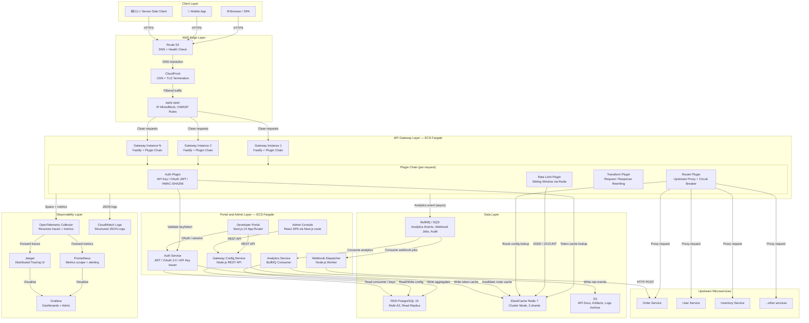

# Architecture Diagram — API Gateway and Developer Portal

---

## Overview

The API Gateway and Developer Portal is designed as an **event-driven microservices platform** hosted on AWS. It acts as the single entry point for all API consumers, enforcing authentication, rate limiting, request transformation, and observability while providing a self-service developer portal for API key provisioning, documentation browsing, and analytics dashboards.

The system follows a layered architecture where traffic enters through AWS edge infrastructure (Route 53 → CloudFront → WAF), passes through a horizontally-scalable Fastify-based gateway cluster running on ECS Fargate, and is routed to upstream microservices. All side-effect operations — analytics events, webhook deliveries, audit logs — are processed asynchronously via BullMQ queues to keep the hot path latency minimal.

The Developer Portal (Next.js 14 App Router) and Admin Console are served as separate containers, allowing the portal UI team to deploy independently from gateway core. PostgreSQL 15 on RDS Multi-AZ serves as the system of record; Redis 7 on ElastiCache handles token caching, rate-limit counters, and route configuration hot-path reads.

---

## Architecture Principles

1. **Zero-Trust Security** — Every request is authenticated and authorized regardless of network origin. No implicit trust is granted to internal services. All inter-service communication uses short-lived JWTs or mTLS.

2. **Plugin Extensibility** — The gateway is built on a Fastify plugin chain. Authentication, rate limiting, transformation, and routing are discrete plugins that can be enabled, disabled, or replaced per route without touching core gateway code.

3. **Horizontal Scalability** — Every stateless component (gateway, portal, config service) scales out via ECS Fargate auto-scaling. Shared state (rate-limit counters, token cache) lives exclusively in Redis, allowing any gateway instance to serve any request.

4. **Separation of Hot and Cold Paths** — The synchronous request path (auth → rate-limit → transform → proxy) reads from Redis for sub-millisecond lookups. Analytics writes, audit logging, and webhook delivery are queued asynchronously so they never block upstream response delivery.

5. **Immutable Infrastructure** — All containers are built as immutable Docker images tagged by Git SHA. Configuration is injected via AWS Secrets Manager and environment variables at deploy time. No SSH access to running containers.

6. **Observability by Default** — Every gateway request emits an OpenTelemetry span. Metrics are scraped by Prometheus and visualised in Grafana. Distributed traces flow to Jaeger. Structured JSON logs are shipped to CloudWatch Logs.

7. **API-First Design** — The Admin Console and Developer Portal interact with backend services exclusively through versioned REST APIs. No direct database access from UI containers.

8. **Graceful Degradation** — If Redis is temporarily unreachable, the gateway falls back to in-process token bucket counters and a local LRU cache for route configs, accepting a brief risk of over-serving rather than dropping all traffic. A circuit-breaker wraps each upstream service call.

---

## High-Level Architecture Diagram

---

## Component Inventory

| Component | Technology | Responsibility | Scaling Strategy |
|---|---|---|---|
| Route 53 | AWS Route 53 | DNS resolution, health-check-based failover | Managed, globally distributed |
| CloudFront | AWS CloudFront | TLS termination, edge caching of portal static assets, DDoS absorption | Managed, 400+ PoPs |
| WAF | AWS WAF v2 | OWASP Top-10 rules, IP rate limiting, geo-blocking, SQL-injection/XSS prevention | Managed, auto-scales |
| API Gateway Cluster | Node.js 20 + Fastify 4 on ECS Fargate | Single entry point for all API traffic; plugin chain for auth, rate-limit, transform, route | Horizontal — ECS auto-scaling on CPU >60% and P99 latency >200 ms |
| Auth Plugin | Node.js module (in-process) | HMAC-SHA256 API key validation, JWT Bearer token verification | Co-scales with gateway |
| Rate Limit Plugin | Node.js module + Redis Lua script | Sliding window counter per consumer per route | Co-scales with gateway; Redis cluster absorbs counter writes |
| Transform Plugin | Node.js module | Header injection/removal, body rewriting, protocol translation | Co-scales with gateway |
| Router Plugin | Node.js module + undici HTTP client | Upstream service proxy, circuit breaker, retry with backoff | Co-scales with gateway |
| Developer Portal | Next.js 14 + TypeScript on ECS Fargate | API documentation browser, key management, usage dashboard | Horizontal — ECS auto-scaling on CPU >70% |
| Admin Console | React SPA served via Next.js | Route management, plan management, consumer management | Co-scales with portal |
| Gateway Config Service | Node.js 20 + Fastify on ECS Fargate | CRUD for routes, plugins, plans, consumers; publishes cache-invalidation events | Horizontal — ECS auto-scaling |
| Auth Service | Node.js 20 on ECS Fargate | Issues/validates JWT, manages OAuth 2.0 flows, stores API key hashes | Horizontal — ECS auto-scaling |
| Analytics Service | Node.js 20 + BullMQ consumer on ECS Fargate | Consumes analytics events from queue, aggregates, writes to PostgreSQL and S3 | Horizontal — scale by queue backlog depth |
| Webhook Dispatcher | Node.js 20 worker on ECS Fargate | Dequeues webhook jobs, delivers HTTP POST with HMAC signature, implements retry | Horizontal — scale by webhook queue depth |
| RDS PostgreSQL 15 | AWS RDS Multi-AZ + 1 read replica | System of record: consumers, keys, plans, routes, analytics aggregates | Vertical for writes; read replica for analytics queries |
| ElastiCache Redis 7 | AWS ElastiCache Cluster Mode (3 shards, 1 replica each) | Rate-limit counters, token cache, route config hot cache, BullMQ broker | Add shards as memory/throughput grows |
| S3 | AWS S3 (Standard + Intelligent Tiering) | API documentation files, raw analytics event archive, artifact storage | Unlimited, managed |
| BullMQ Queue | BullMQ on Redis + SQS for durability | Analytics events, webhook delivery jobs, audit log events | Add workers; SQS as overflow |
| OpenTelemetry Collector | OTel Collector on ECS | Receives OTLP traces and metrics from all services; fans out to Prometheus and Jaeger | Horizontal |
| Prometheus | Prometheus on ECS | Scrapes metrics endpoints, stores time-series, evaluates alerting rules | Vertical + remote-write to Grafana Cloud |
| Grafana | Grafana on ECS | Dashboards for gateway throughput, error rate, latency, consumer usage | Single instance + HA replica |
| Jaeger | Jaeger on ECS | Distributed trace storage and UI | Elasticsearch backend for production |

---

## Key Design Decisions

| Decision | Options Considered | Choice | Rationale |
|---|---|---|---|
| Gateway runtime | Kong (Lua), Envoy (C++), custom Node.js/Fastify | **Custom Node.js 20 + Fastify plugin chain** | Full TypeScript ecosystem, team expertise, plugin API matches domain model, no license cost, easy OpenTelemetry integration |
| Rate limit storage | In-process counters, PostgreSQL, Redis | **Redis 7 cluster with Lua sliding-window script** | Sub-millisecond latency, atomic Lua scripts avoid race conditions, Redis cluster survives single-node failure |
| API key auth scheme | Plain bearer token, HMAC-SHA256 signature, mTLS | **HMAC-SHA256 with timestamp + nonce** | Replay attack prevention via nonce+timestamp, no certificate management burden for external consumers |
| Portal framework | CRA, Remix, Next.js 14 App Router | **Next.js 14 App Router** | Server Components reduce bundle size for docs-heavy pages, ISR for API reference pages, same TypeScript codebase as services |
| Async event transport | Kafka, SQS, RabbitMQ, BullMQ on Redis | **BullMQ on Redis (primary) + SQS (overflow)** | BullMQ runs on existing Redis cluster, low operational overhead, priority queues built-in; SQS used as durability backstop |
| Database | MySQL 8, CockroachDB, PostgreSQL 15 | **PostgreSQL 15 on RDS Multi-AZ** | JSONB for plugin config, window functions for analytics, strong consistency, AWS managed, team familiarity |
| Deployment platform | EKS Kubernetes, ECS Fargate, Lambda | **ECS Fargate** | No node management, cost scales to zero on non-peak, sufficient for expected traffic, simpler operational model than K8s |
| Observability stack | Datadog (SaaS), New Relic, self-hosted OTel | **OpenTelemetry + Prometheus + Grafana + Jaeger** | Vendor-neutral, OTLP standard, no per-seat cost, full trace/metric/log correlation |

---

## Cross-Cutting Concerns

### Security

- **Network segmentation**: Gateway, portal, and data layers run in separate VPC security groups. Only the gateway security group can reach upstream services. RDS and Redis accept connections only from service security groups — never from the internet.
- **Secrets management**: All credentials (DB passwords, Redis auth tokens, signing keys, OAuth secrets) are stored in AWS Secrets Manager. Services read secrets at startup via the AWS SDK; secrets are rotated automatically.
- **TLS everywhere**: CloudFront terminates external TLS (TLS 1.2 minimum, TLS 1.3 preferred). Internal ECS service-to-service traffic uses TLS with ACM-issued certificates.
- **WAF rules**: Managed rule groups for OWASP Top-10, AWS known bad inputs, and IP reputation lists. Custom rules enforce per-IP rate limiting at the edge before traffic reaches the gateway.
- **Audit logging**: Every write operation through the Config Service emits an `AuditLog` record (actor, action, before-state, after-state) to PostgreSQL and streams to S3 for long-term retention.
- **API key storage**: Only the HMAC-SHA256 hash and a short prefix are stored in PostgreSQL. The full key is shown once at issuance and never stored in plaintext.

### Observability

- **Structured logging**: All services emit JSON logs with a standard envelope: `{ timestamp, level, traceId, spanId, service, version, message, ...fields }`. Logs ship to CloudWatch Logs and are queryable via CloudWatch Insights.
- **Distributed tracing**: Every gateway request is assigned a W3C `traceparent` header. The OTel SDK in each service propagates this context. Traces are exported to Jaeger for end-to-end latency analysis.
- **Metrics**: Gateway exposes a `/metrics` Prometheus endpoint. Key metrics: `gateway_requests_total` (by route, method, status), `gateway_request_duration_seconds` (histogram), `gateway_rate_limit_hits_total`, `gateway_upstream_errors_total`.
- **Alerting**: Prometheus alerting rules fire on P99 latency >500 ms, error rate >1%, Redis memory >80%, queue depth >10,000. Alerts route to PagerDuty via Alertmanager.

### Configuration Management

- **Route and plugin config**: Stored in PostgreSQL, cached in Redis (TTL 60 s). Config Service publishes a Redis Pub/Sub invalidation message on every write; gateway instances subscribe and evict affected cache keys immediately.
- **Feature flags**: Managed via environment variables in ECS task definitions, updated through CI/CD without container rebuild.
- **Plugin ordering**: Each route stores a `plugins` JSONB array with plugin names and per-route config. The gateway plugin chain executes plugins in declared order.

---

## Scalability Model

### Horizontal Scaling Approach

All application-tier containers (gateway, portal, config service, auth service, analytics service, webhook dispatcher) are stateless and scale horizontally. ECS Service Auto Scaling policies are defined for each:

- **Gateway cluster**: Target tracking on CPU utilisation (target 60%) with a step policy that adds 3 instances when P99 latency exceeds 200 ms for 2 consecutive minutes. Minimum 2 instances (multi-AZ), maximum 50.
- **Portal / Config Service**: Target tracking on CPU (target 70%). Minimum 2, maximum 20.
- **Analytics / Webhook workers**: Scale on BullMQ queue depth — 1 worker per 500 queued jobs, maximum 20 workers each.

### Auto-Scaling Triggers

| Component | Primary Trigger | Secondary Trigger | Min Tasks | Max Tasks |
|---|---|---|---|---|
| API Gateway | CPU > 60% | P99 latency > 200 ms | 2 | 50 |
| Developer Portal | CPU > 70% | Request count > 500 rps | 2 | 20 |
| Config Service | CPU > 70% | — | 2 | 10 |
| Auth Service | CPU > 65% | — | 2 | 20 |
| Analytics Service | Queue depth > 500 | — | 1 | 20 |
| Webhook Dispatcher | Queue depth > 200 | — | 1 | 20 |

### Data Layer Scaling

- **PostgreSQL**: Write traffic goes to the Multi-AZ primary. Analytics read queries are routed to the read replica. At high scale, connection pooling via PgBouncer reduces connection overhead.
- **Redis**: ElastiCache cluster mode with 3 shards. Rate-limit keys are distributed by `{consumerId}:{routeId}` hash slot. Adding shards is a live operation via ElastiCache online resharding.
- **S3**: Unlimited horizontal capacity. Analytics events are written as Parquet files in date-partitioned prefixes, enabling Athena queries for ad-hoc analysis.

### Throughput Targets

| Metric | Target |
|---|---|
| Gateway sustained throughput | 10,000 requests/second |
| Gateway burst throughput | 50,000 requests/second |
| P50 gateway latency (excluding upstream) | < 5 ms |
| P99 gateway latency (excluding upstream) | < 20 ms |
| Webhook delivery SLA | < 30 s from event to first delivery attempt |
| Analytics event processing lag | < 60 s end-to-end |
| Portal page load (TTFB) | < 200 ms (CDN-cached) |
