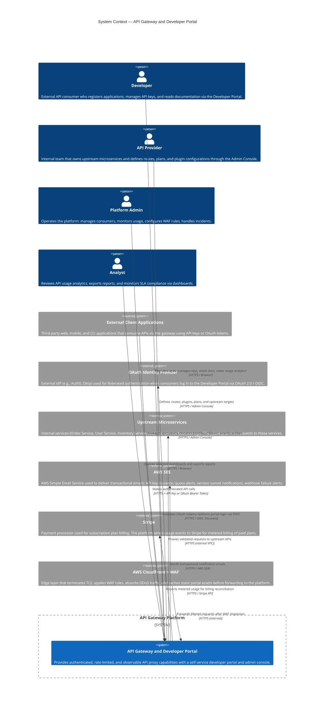

# C4 Model — Context and Container Diagrams

---

## Overview

This document presents the API Gateway and Developer Portal system using the C4 model at two levels of abstraction:

- **Level 1 (System Context)** shows the system as a black box and describes all people and external systems that interact with it.
- **Level 2 (Container Diagram)** opens the system boundary to reveal the major deployable units (containers), their technologies, and how they communicate.

The C4 model ensures that both technical and non-technical stakeholders can understand the system's scope, actors, and internal structure without needing to read source code.

---

## Level 1: System Context Diagram

The **API Gateway Platform** sits at the centre of the ecosystem. It serves as the single entry point for all API consumers, a self-service portal for developers, and an administrative control plane for operators.

### Context Diagram Notes

| Actor / System | Type | Integration Point | Notes |
|---|---|---|---|
| Developer | Person | Developer Portal UI | Self-service: registration, key management, docs, analytics |
| API Provider | Person | Admin Console | Defines the API catalogue and access policies |
| Platform Admin | Person | Admin Console + Grafana | Operations, incident response, policy enforcement |
| Analyst | Person | Grafana + Portal Analytics | Read-only access to usage and SLA dashboards |
| External Client Apps | External System | API Gateway (HTTPS) | Primary traffic source; uses API keys or OAuth tokens |
| OAuth Identity Provider | External System | OIDC / OAuth 2.0 endpoints | Portal SSO and token validation delegation |
| Upstream Microservices | External System | Gateway outbound proxy | Business logic owners; gateway is transparent to them |
| AWS SES | External System | AWS SDK | Outbound-only; no inbound calls to the platform |
| Stripe | External System | Stripe REST API | Usage-based billing metering; webhook callbacks for payment events |
| AWS CloudFront + WAF | External System | ALB / ECS ingress | Edge protection and CDN; transparent to portal and gateway |

---

## Level 2: Container Diagram

The system boundary is now opened to show the individual deployable containers, their technology stacks, and how they communicate.

```mermaid
C4Container
    title Container Diagram — API Gateway and Developer Portal

    Person(developer, "Developer", "Registers, manages keys, reads docs")
    Person(adminUser, "Admin / API Provider", "Manages routes, plans, consumers")
    Person_Ext(clientApp, "External Client App", "Calls APIs via gateway")

    System_Boundary(platform, "API Gateway Platform") {

        Container(gateway, "API Gateway", "Node.js 20 / Fastify 4, ECS Fargate", "Core request proxy. Executes plugin chain: Auth → Rate Limit → Transform → Route. Emits analytics events and OTel spans.")

        Container(portal, "Developer Portal", "Next.js 14 App Router / TypeScript, ECS Fargate", "Server-rendered portal for API docs, key self-service, usage dashboard, and subscription management.")

        Container(adminConsole, "Admin Console", "React SPA served via Next.js route, ECS Fargate", "Admin interface for route configuration, consumer management, plan management, and platform monitoring.")

        Container(configService, "Gateway Config Service", "Node.js 20 / Fastify, REST API, ECS Fargate", "CRUD API for routes, plugins, plans, consumers, and API keys. Publishes cache invalidation events to Redis on every write.")

        Container(authService, "Auth Service", "Node.js 20 / Fastify, ECS Fargate", "Issues and validates API keys (HMAC-SHA256), JWT access tokens, and OAuth 2.0 client credentials tokens. Manages OAuth client registrations.")

        Container(analyticsService, "Analytics Service", "Node.js 20 / BullMQ Consumer, ECS Fargate", "Consumes analytics events from BullMQ queue. Aggregates per-consumer and per-route metrics. Writes aggregates to PostgreSQL and raw events to S3.")

        Container(webhookWorker, "Webhook Dispatcher", "Node.js 20 Worker / BullMQ, ECS Fargate", "Dequeues webhook delivery jobs. Signs payload with HMAC-SHA256 secret. Delivers HTTP POST to subscriber endpoints. Implements exponential backoff retry with dead-letter queue.")

        ContainerDb(postgres, "PostgreSQL 15", "AWS RDS Multi-AZ + Read Replica", "System of record: consumers, applications, API keys, plans, routes, plugins, analytics aggregates, audit logs, webhook subscriptions and deliveries.")

        ContainerDb(redis, "Redis 7", "AWS ElastiCache Cluster Mode (3 shards)", "Rate-limit sliding-window counters, JWT/token cache, route config hot-path cache, BullMQ job broker, Pub/Sub for config cache invalidation.")

        ContainerDb(s3, "S3 Buckets", "AWS S3 — Standard + Intelligent Tiering", "API documentation source files (Markdown / OpenAPI YAML), raw analytics event archive (Parquet), static portal assets, audit log long-term archive.")

        Container(queue, "BullMQ / SQS", "BullMQ on Redis + AWS SQS overflow", "Three queues: analytics-events, webhook-deliveries, audit-logs. BullMQ handles high-throughput primary flow; SQS captures overflow for durability.")

    }

    System_Ext(oauthIdP, "OAuth Identity Provider", "Auth0 / Okta — external IdP for portal SSO")
    System_Ext(upstreamServices, "Upstream Microservices", "Internal business services proxied by gateway")
    System_Ext(awsSES, "AWS SES", "Transactional email delivery")
    System_Ext(stripe, "Stripe", "Subscription billing metering")
    System_Ext(otelCollector, "OTel Collector + Prometheus + Jaeger", "Observability stack receiving spans and metrics")

    %% External users to UI containers
    Rel(developer, portal, "Views docs, manages keys, views usage", "HTTPS / Browser")
    Rel(adminUser, adminConsole, "Manages routes, plans, consumers", "HTTPS / Browser")
    Rel(clientApp, gateway, "API calls with API Key or OAuth Bearer", "HTTPS")

    %% Gateway plugin dependencies
    Rel(gateway, authService, "Validates API keys and JWT tokens (cache miss)", "HTTP/2 — internal VPC")
    Rel(gateway, redis, "Rate-limit ZADD/ZCOUNT, token cache get, route config get", "Redis protocol — internal VPC")
    Rel(gateway, upstreamServices, "Proxies authenticated requests", "HTTPS — internal VPC")
    Rel(gateway, queue, "Enqueues analytics events and audit log entries", "BullMQ / Redis protocol")
    Rel(gateway, otelCollector, "Exports OTLP traces and metrics", "gRPC / OTLP")

    %% Portal dependencies
    Rel(portal, configService, "Reads routes, plans, docs metadata; manages keys", "HTTP/2 REST — internal VPC")
    Rel(portal, authService, "Portal user login/logout, OAuth PKCE flow", "HTTP/2 — internal VPC")
    Rel(portal, postgres, "Reads analytics aggregates for usage dashboard", "PostgreSQL wire protocol (read replica)")

    %% Admin Console dependencies
    Rel(adminConsole, configService, "CRUD for routes, plugins, plans, consumers", "HTTP/2 REST — internal VPC")
    Rel(adminConsole, authService, "Admin authentication (internal OAuth)", "HTTP/2 — internal VPC")

    %% Config Service dependencies
    Rel(configService, postgres, "Read/write system of record", "PostgreSQL wire protocol")
    Rel(configService, redis, "Publishes cache invalidation messages", "Redis Pub/Sub")
    Rel(configService, awsSES, "Sends key issuance and sunset notification emails", "HTTPS / AWS SDK")
    Rel(configService, stripe, "Reports plan subscription and usage events", "HTTPS / Stripe API")

    %% Auth Service dependencies
    Rel(authService, postgres, "Reads consumer, application, API key records", "PostgreSQL wire protocol")
    Rel(authService, redis, "Writes and reads JWT token cache (TTL-bound)", "Redis protocol")
    Rel(authService, oauthIdP, "Validates external OAuth tokens via introspection", "HTTPS / OAuth 2.0")

    %% Analytics Service dependencies
    Rel(analyticsService, queue, "Consumes analytics-events queue", "BullMQ / Redis protocol")
    Rel(analyticsService, postgres, "Writes per-consumer and per-route aggregates", "PostgreSQL wire protocol")
    Rel(analyticsService, s3, "Archives raw events as Parquet files", "HTTPS / AWS SDK")

    %% Webhook Dispatcher dependencies
    Rel(webhookWorker, queue, "Consumes webhook-deliveries queue", "BullMQ / Redis protocol")
    Rel(webhookWorker, postgres, "Reads webhook subscriptions, writes delivery records", "PostgreSQL wire protocol")
    Rel(webhookWorker, upstreamServices, "HTTP POST signed webhook payloads to subscriber endpoints", "HTTPS")

    %% Storage
    Rel(portal, s3, "Serves API docs and OpenAPI specs", "HTTPS / AWS SDK / CloudFront")
    Rel(configService, s3, "Stores uploaded OpenAPI YAML and Markdown docs", "HTTPS / AWS SDK")
```

---

## Container Responsibilities Table

| Container | Primary Responsibility | Technology | Team Owner |
|---|---|---|---|
| API Gateway | Authenticate, rate-limit, transform, and proxy all inbound API traffic | Node.js 20 + Fastify 4 + undici | Gateway Core Team |
| Developer Portal | Self-service UI for key management, API docs, usage analytics, plan subscription | Next.js 14 App Router + TypeScript | Portal Team |
| Admin Console | Administrative UI for route/plan/consumer/plugin management | React SPA (Next.js route) + TypeScript | Platform Team |
| Gateway Config Service | Authoritative configuration store for all gateway runtime entities | Node.js 20 + Fastify + Drizzle ORM | Platform Team |
| Auth Service | API key lifecycle, JWT issuance, OAuth 2.0 client credentials and PKCE flows | Node.js 20 + Fastify + jose library | Identity Team |
| Analytics Service | Event aggregation and persistence for per-consumer, per-route usage metrics | Node.js 20 + BullMQ consumer | Analytics Team |
| Webhook Dispatcher | Reliable delivery of signed webhook events to subscriber HTTP endpoints | Node.js 20 + BullMQ + exponential backoff | Platform Team |
| PostgreSQL 15 | Durable relational system of record for all domain entities | AWS RDS Multi-AZ PostgreSQL 15 | Platform/DBA |
| Redis 7 | High-speed ephemeral state: rate counters, token cache, route cache, queue broker | AWS ElastiCache Redis 7 Cluster | Platform/Infra |
| S3 Buckets | Durable object storage for docs, raw events, static assets, audit archives | AWS S3 | Platform/Infra |
| BullMQ / SQS Queue | Decoupled async job delivery for analytics, webhooks, and audit events | BullMQ on Redis + SQS | Platform Team |

---

## Inter-Container Communication

| Source | Destination | Protocol | Sync / Async | Auth Method | Notes |
|---|---|---|---|---|---|
| External Client App | API Gateway | HTTPS / HTTP2 | Sync | API Key (HMAC-SHA256) or OAuth Bearer JWT | TLS 1.3, WAF-filtered |
| Developer | Developer Portal | HTTPS | Sync | Session cookie (encrypted JWT) or OAuth PKCE | Managed by Auth Service |
| Admin / Provider | Admin Console | HTTPS | Sync | Internal OAuth 2.0 + JWT | Role-based scopes |
| API Gateway | Auth Service | HTTP/2 (internal) | Sync | mTLS + service API key | Cache miss path only; hot path uses Redis |
| API Gateway | Redis | Redis protocol (TLS) | Sync | Redis AUTH password | Rate-limit and token cache reads |
| API Gateway | Upstream Services | HTTPS (internal VPC) | Sync | Gateway-signed JWT (forwarded consumer identity) | Circuit breaker wraps each upstream |
| API Gateway | BullMQ Queue | Redis protocol (TLS) | Async (fire-and-forget) | Redis AUTH | Enqueues analytics and audit events post-response |
| API Gateway | OTel Collector | gRPC / OTLP | Async | No auth (VPC-internal) | Batch export every 5 s |
| Developer Portal | Config Service | HTTP/2 REST (internal) | Sync | JWT Bearer (portal user session) | Authorised per consumer role |
| Admin Console | Config Service | HTTP/2 REST (internal) | Sync | JWT Bearer (admin session) | Admin role required |
| Config Service | PostgreSQL | PostgreSQL wire (TLS) | Sync | DB user + password (Secrets Manager) | Connection pooling via PgBouncer |
| Config Service | Redis | Redis protocol (TLS) | Async (fire-forget) | Redis AUTH | Pub/Sub cache invalidation on writes |
| Config Service | AWS SES | HTTPS / AWS SDK | Async | IAM role | Sends emails via SES SMTP API |
| Config Service | Stripe | HTTPS / REST | Async | Stripe API secret key | Usage metering and subscription events |
| Auth Service | PostgreSQL | PostgreSQL wire (TLS) | Sync | DB user + password (Secrets Manager) | Reads consumer/key records |
| Auth Service | Redis | Redis protocol (TLS) | Sync | Redis AUTH | JWT token cache get/set with TTL |
| Auth Service | OAuth IdP | HTTPS / OAuth 2.0 | Sync | Client credentials | Token introspection for federated tokens |
| Analytics Service | BullMQ Queue | Redis protocol (TLS) | Async (consumer) | Redis AUTH | Pulls analytics-events jobs |
| Analytics Service | PostgreSQL | PostgreSQL wire (TLS) | Sync (batch write) | DB user + password | Writes aggregated stats every 30 s |
| Analytics Service | S3 | HTTPS / AWS SDK | Async | IAM role | Writes Parquet files partitioned by date/hour |
| Webhook Dispatcher | BullMQ Queue | Redis protocol (TLS) | Async (consumer) | Redis AUTH | Pulls webhook-deliveries jobs |
| Webhook Dispatcher | PostgreSQL | PostgreSQL wire (TLS) | Sync | DB user + password | Reads subscriptions, writes delivery records |
| Webhook Dispatcher | Subscriber Endpoint | HTTPS (external) | Sync (per delivery) | HMAC-SHA256 Signature header | Exponential backoff; DLQ after 5 failures |
| Developer Portal | S3 | HTTPS / CloudFront | Sync | Signed CloudFront URL | Serves OpenAPI specs and Markdown docs |
| Config Service | S3 | HTTPS / AWS SDK | Async | IAM role | Uploads provider-supplied OpenAPI YAML files |

---

## Container Deployment Summary

| Container | AWS Service | Fargate CPU | Fargate Memory | Min Tasks | Max Tasks | Multi-AZ |
|---|---|---|---|---|---|---|
| API Gateway | ECS Fargate | 1 vCPU | 2 GB | 2 | 50 | Yes (2+ AZs) |
| Developer Portal | ECS Fargate | 0.5 vCPU | 1 GB | 2 | 20 | Yes |
| Admin Console | ECS Fargate (co-located with Portal) | — | — | — | — | Yes |
| Gateway Config Service | ECS Fargate | 0.5 vCPU | 1 GB | 2 | 10 | Yes |
| Auth Service | ECS Fargate | 0.5 vCPU | 1 GB | 2 | 20 | Yes |
| Analytics Service | ECS Fargate | 1 vCPU | 2 GB | 1 | 20 | Yes |
| Webhook Dispatcher | ECS Fargate | 0.5 vCPU | 1 GB | 1 | 20 | Yes |
| PostgreSQL 15 | AWS RDS Multi-AZ | — | — | 1 primary + 1 replica | — | Yes |
| Redis 7 | AWS ElastiCache Cluster | — | — | 3 shards × 2 nodes | — | Yes |
| S3 | AWS S3 | — | — | — | — | Yes (global) |
| BullMQ Broker | Redis (ElastiCache) | — | — | — | — | Yes |
| SQS Overflow | AWS SQS Standard | — | — | — | — | Yes (global) |
| OTel Collector | ECS Fargate | 0.5 vCPU | 1 GB | 1 | 5 | Yes |
| Prometheus | ECS Fargate | 1 vCPU | 4 GB | 1 | 2 | Yes |
| Grafana | ECS Fargate | 0.5 vCPU | 1 GB | 1 | 2 | Yes |
| Jaeger | ECS Fargate | 1 vCPU | 4 GB | 1 | 2 | Yes |

All ECS services are deployed into private subnets across at least two availability zones. External access to the Gateway and Portal goes through an internet-facing Application Load Balancer in public subnets. The RDS and ElastiCache clusters are in isolated subnets with no internet route. S3 access from ECS tasks uses VPC gateway endpoints to avoid public internet traversal.
