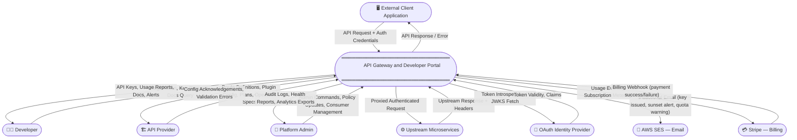
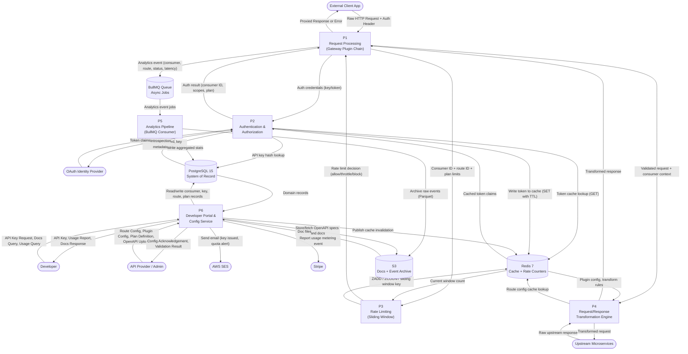
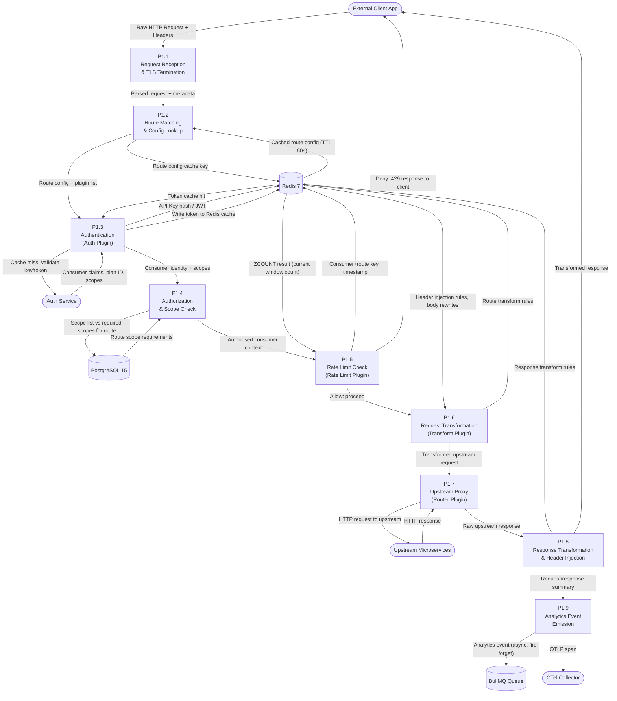
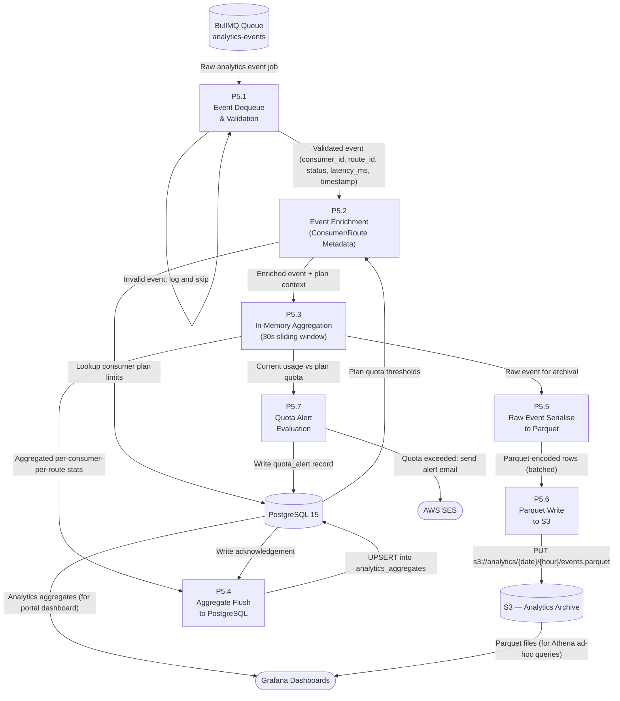

# Data Flow Diagram — API Gateway and Developer Portal

---

## Overview

This document describes all significant data flows within the API Gateway and Developer Portal platform using structured Data Flow Diagrams (DFDs). It covers three levels of decomposition:

- **Level 0 (Context DFD)** — The entire platform as a single process with external entities.
- **Level 1 DFD** — The platform decomposed into six major functional processes with all data stores.
- **Level 2 DFDs** — Two critical sub-processes (Request Processing and Analytics Pipeline) decomposed into their constituent steps.

All data flows are subsequently catalogued in a Data Flow Inventory with sensitivity classifications and volume estimates.

---

## Level 0 DFD (Context Level)

At context level, the platform is a single system. All external entities are shown with their data flows into and out of the system boundary.

---

## Level 1 DFD

The platform is decomposed into six major processes. Data stores and external entities are shared across processes.

---

## Level 2 DFD: Request Processing

This diagram decomposes P1 (Request Processing) into its plugin-chain sub-processes.

---

## Level 2 DFD: Analytics Pipeline

This diagram decomposes P5 (Analytics Pipeline) into its sub-processes.

---

## Data Flow Inventory

| Flow ID | Source | Destination | Data Type | Estimated Volume | Sensitivity |
|---|---|---|---|---|---|
| DF-001 | External Client App | API Gateway | HTTP Request (headers, body, auth token) | 10,000 req/s peak | Confidential |
| DF-002 | API Gateway | External Client App | HTTP Response (headers, body, status) | 10,000 res/s peak | Internal |
| DF-003 | API Gateway | Auth Service | API key hash or JWT (cache miss only) | ~200 req/s (5% miss rate) | Confidential |
| DF-004 | Auth Service | API Gateway | Consumer claims (consumer_id, plan_id, scopes, expires_at) | ~200 res/s | Confidential |
| DF-005 | API Gateway | Redis | ZADD/ZCOUNT rate-limit key + timestamp | 10,000 ops/s | Internal |
| DF-006 | Redis | API Gateway | Rate-limit window count | 10,000 ops/s | Internal |
| DF-007 | API Gateway | Redis | Token cache GET by key hash | 10,000 ops/s | Confidential |
| DF-008 | Redis | API Gateway | Cached token claims (JSON blob, TTL-bound) | 9,500 hits/s | Confidential |
| DF-009 | API Gateway | Upstream Services | Proxied request (transformed headers + body) | 10,000 req/s peak | Confidential |
| DF-010 | Upstream Services | API Gateway | Upstream response (headers + body) | 10,000 res/s peak | Internal/Confidential |
| DF-011 | API Gateway | BullMQ Queue | Analytics event JSON (consumer_id, route_id, method, status, latency_ms, timestamp) | 10,000 events/s | Internal |
| DF-012 | BullMQ Queue | Analytics Service | Analytics event job payload | 10,000 jobs/s | Internal |
| DF-013 | Analytics Service | PostgreSQL | Aggregated stats UPSERT (per-consumer, per-route, per-hour) | ~100 rows/s | Internal |
| DF-014 | Analytics Service | S3 | Raw event Parquet file (date-hour partitioned, batch) | ~500 MB/hour | Internal |
| DF-015 | Developer | Developer Portal | Key provision request, docs query, usage query (HTTP + session JWT) | ~50 req/s | Confidential |
| DF-016 | Developer Portal | Config Service | CRUD REST calls (key creation, route reads, plan reads) | ~50 req/s | Confidential |
| DF-017 | Config Service | PostgreSQL | Domain entity read/write (consumers, keys, routes, plans) | ~100 ops/s | Confidential |
| DF-018 | Config Service | Redis | Cache invalidation Pub/Sub message | ~10 events/s | Internal |
| DF-019 | Config Service | AWS SES | Email request JSON (recipient, template, parameters) | ~5 emails/s max | Confidential |
| DF-020 | Config Service | Stripe | Usage metering event (consumer_id, plan_id, quantity, timestamp) | ~10 events/min | Confidential |
| DF-021 | Auth Service | PostgreSQL | Consumer and API key record read | ~200 req/s | Confidential |
| DF-022 | Auth Service | Redis | Token cache write (SET with TTL) | ~200 ops/s | Confidential |
| DF-023 | Auth Service | OAuth Identity Provider | Token introspection request (Bearer token) | ~50 req/s | Confidential |
| DF-024 | Webhook Dispatcher | BullMQ Queue | Webhook delivery job dequeue | ~500 jobs/s peak | Internal |
| DF-025 | Webhook Dispatcher | Subscriber Endpoint | HTTP POST signed payload (event JSON + HMAC-SHA256 header) | ~500 req/s peak | Confidential |
| DF-026 | Webhook Dispatcher | PostgreSQL | Delivery record write (status, attempt count, timestamp) | ~500 ops/s | Internal |
| DF-027 | API Provider / Admin | Config Service | Route, plugin, plan, consumer CRUD requests | ~5 req/s | Restricted |
| DF-028 | Config Service | S3 | OpenAPI YAML / Markdown doc upload | ~1 upload/min | Internal |
| DF-029 | Developer Portal | S3 (via CloudFront) | OpenAPI YAML / Markdown doc fetch | ~100 req/s | Public |
| DF-030 | API Gateway | OTel Collector | OTLP spans (gRPC batch, every 5 s) | ~1 MB/s | Internal |

---

## Data Classification

| Data Type | Examples | Classification | Handling Requirements |
|---|---|---|---|
| API Keys (plaintext) | `gw_live_abc123...` — shown once at issuance | **Restricted** | Never stored; shown to developer once; hash stored only |
| API Key Hashes | HMAC-SHA256 hash of key + salt | **Confidential** | Stored in PostgreSQL; never logged; access restricted to Auth Service |
| OAuth Client Secrets | `cs_...` — issued at OAuth client registration | **Restricted** | Stored encrypted (AES-256) in PostgreSQL; rotatable; never in logs |
| JWT Access Tokens | Short-lived Bearer tokens (15 min TTL) | **Confidential** | Stored in Redis with TTL; never logged in full; truncated in traces |
| Consumer PII | Name, email, company | **Confidential** | Encrypted at rest in RDS; access-controlled; GDPR subject to deletion |
| Request Payloads | HTTP bodies proxied through gateway | **Confidential** | Not stored by default; logged only if debug mode enabled per route |
| Request Headers | Host, Authorization, X-Consumer-ID | **Confidential** | Authorization header redacted in all logs and traces |
| Analytics Aggregates | req_count, error_rate, avg_latency per route | **Internal** | Accessible to consumer for their own data; accessible to admin globally |
| Raw Analytics Events | consumer_id, route_id, status_code, latency_ms | **Internal** | No PII; archived to S3; accessible only to platform analytics team |
| Route Configuration | path, upstream_url, plugin list | **Internal** | Admin-managed; accessible to gateway instances; not publicly exposed |
| OpenAPI Specs | Public API documentation YAML | **Public** | Stored in S3; served via CloudFront; no auth required to read |
| Audit Logs | actor_id, action, resource, before/after state | **Restricted** | Immutable once written; accessible only to admin; retained 2 years |
| Webhook Payloads | Event JSON sent to subscriber endpoints | **Confidential** | Signed with HMAC-SHA256; encrypted in transit; stored in DB for 30 days |
| Billing/Metering Data | Usage events sent to Stripe | **Restricted** | Minimal PII; Stripe handles PCI compliance; not stored locally after transmission |
| Prometheus Metrics | Counters, histograms (no PII) | **Internal** | No PII; accessible to ops team; retained 30 days in Prometheus |
| Distributed Traces | Spans with route, status, latency | **Internal** | Auth header values redacted; trace IDs only; retained 7 days in Jaeger |

---

## Data Retention and Lineage

### Retention Policy

| Data Store | Data Type | Retention Period | Deletion Mechanism |
|---|---|---|---|
| PostgreSQL — consumers | Consumer, Application records | Duration of account + 90 days post-deletion | Soft delete, then scheduled hard delete |
| PostgreSQL — API keys | Key hash, prefix, metadata | Revoked keys retained 90 days for audit trail | Soft delete; purge on schedule |
| PostgreSQL — analytics aggregates | Per-consumer per-route hourly stats | 13 months (rolling) | Automated partition drop via pg_partman |
| PostgreSQL — audit logs | Admin and config change records | 24 months | Read-only partition; archived to S3 at 6 months |
| PostgreSQL — webhook deliveries | Delivery attempt records | 30 days | Automated purge job |
| Redis — token cache | JWT and API key token entries | TTL-bound (15 min for JWTs; 5 min for key cache) | Automatic Redis eviction |
| Redis — rate-limit counters | Sliding window ZSET entries | TTL-bound (window size + buffer) | Automatic Redis eviction |
| S3 — raw analytics events | Parquet files by date/hour | 90 days (Standard), then Intelligent Tiering | Lifecycle rule to Glacier at 90 days; delete at 2 years |
| S3 — API documentation | OpenAPI YAML, Markdown | Indefinite (versioned bucket) | Manual deletion by provider; versioned for rollback |
| S3 — audit log archive | JSON audit records | 7 years | S3 Object Lock (Compliance mode) |
| CloudWatch Logs | Structured application JSON logs | 30 days (operational), 1 year (security) | Automatic log group retention setting |
| Jaeger — traces | Distributed trace spans | 7 days | Automatic Elasticsearch index rotation |
| Prometheus — metrics | Time-series metrics | 30 days | Automatic TSDB compaction and retention |

### Data Lineage Summary

The critical data lineage for an API consumer request is:

1. **Ingest**: Raw HTTP request arrives at gateway; `consumer_id` resolved via auth.
2. **Emit**: Gateway emits an `AnalyticsEvent` to BullMQ (fire-and-forget, post-response).
3. **Enrich**: Analytics Service reads consumer plan from PostgreSQL to attach quota context.
4. **Aggregate**: Service aggregates events in memory by `(consumer_id, route_id, hour)` window.
5. **Persist**: Aggregates are upserted into `analytics_aggregates` table in PostgreSQL every 30 seconds.
6. **Archive**: Raw events are serialised as Parquet and uploaded to S3 hourly.
7. **Serve**: Developer Portal reads aggregates from PostgreSQL read replica; Athena queries S3 for historical analysis.
8. **Expire**: Aggregates older than 13 months are dropped by partition management; S3 events transition to Glacier at 90 days.

All data flowing through the system can be traced back to a `consumer_id` and a `traceId` (W3C trace context), enabling full audit lineage from a specific API call to its stored analytics record and delivery log.
