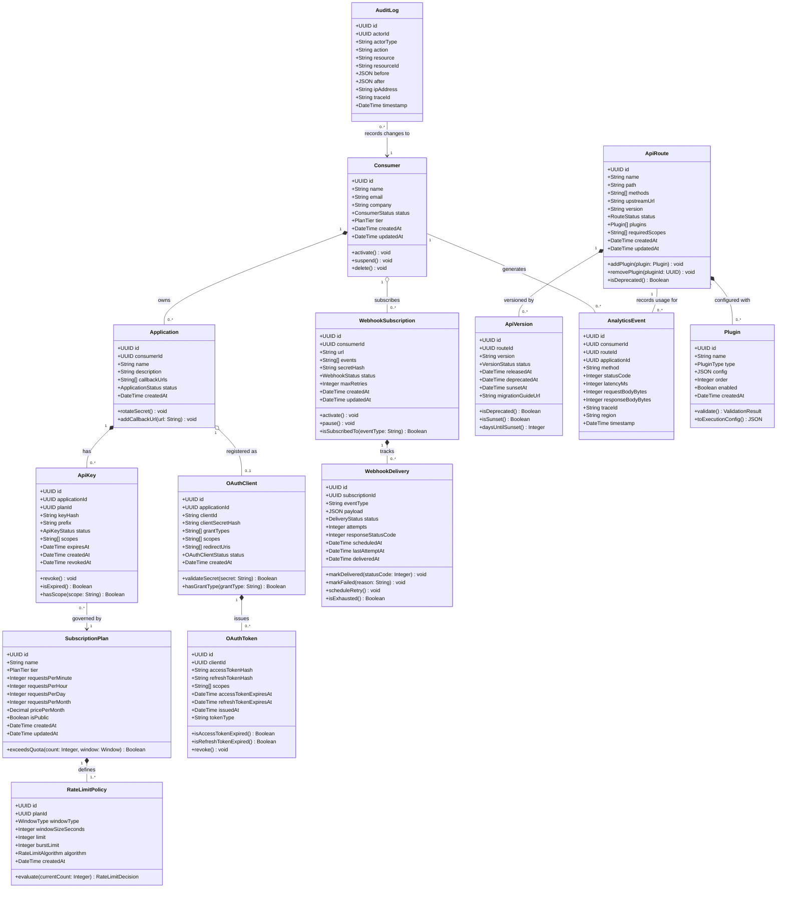

# Domain Model — API Gateway and Developer Portal

---

## Overview

The domain model for the API Gateway and Developer Portal is structured around Domain-Driven Design (DDD) principles. The system is partitioned into seven distinct bounded contexts, each with its own ubiquitous language, domain entities, aggregates, and published domain events. Context boundaries prevent model leakage and allow teams to evolve their domains independently.

The bounded contexts share integration through well-defined events (published to the BullMQ queue) and REST APIs between context-owning services. No bounded context accesses another context's database directly.

---

## Bounded Contexts

### 1. Gateway Core

**Purpose**: Handles the real-time request processing pipeline — route matching, plugin execution, upstream proxying, and circuit breaking.

**Owns**: `ApiRoute`, `Plugin`, `RateLimitPolicy`

**Team**: Gateway Core Team

**Key concern**: Latency and reliability of the hot path. All reads in this context are served from Redis cache (warm from PostgreSQL). This context does not perform any writes to PostgreSQL during a request; writes are deferred to the analytics pipeline.

---

### 2. Identity and Access

**Purpose**: Manages all authentication and authorisation concerns — API key lifecycle, OAuth 2.0 client registration, JWT issuance and validation, and scope enforcement.

**Owns**: `ApiKey`, `OAuthClient`, `OAuthToken`

**Team**: Identity Team

**Key concern**: Security of credentials. Keys are never stored in plaintext. OAuth tokens are short-lived. Token introspection results are cached in Redis to avoid redundant IdP calls.

---

### 3. Consumer Management

**Purpose**: Manages the lifecycle of API consumers (external developers and organisations) and their registered applications. Governs subscription plans and quota allocation.

**Owns**: `Consumer`, `Application`, `SubscriptionPlan`

**Team**: Portal Team

**Key concern**: Consumer onboarding, plan upgrades/downgrades, application registration, and key provisioning are all driven from this context. The Config Service owns the write path; the Developer Portal is the primary UI.

---

### 4. Analytics

**Purpose**: Captures, aggregates, and serves usage metrics for consumers, API providers, and admins.

**Owns**: `AnalyticsEvent`, `AnalyticsAggregate` (not modelled as a UML entity — it is a read model)

**Team**: Analytics Team

**Key concern**: High-throughput event ingestion (fire-and-forget from gateway), correct attribution to consumer and route, accurate quota accounting, and anomaly detection.

---

### 5. Portal

**Purpose**: Governs the self-service portal experience — API documentation publication, changelog management, and developer-facing notifications.

**Owns**: Documentation artefacts stored in S3; references `Consumer` and `ApiRoute` by ID.

**Team**: Portal Team

**Key concern**: Documentation is versioned and tied to `ApiVersion`. Changes to a route's documentation are propagated to the portal on each deployment.

---

### 6. Webhooks

**Purpose**: Manages subscriptions to platform-emitted events and reliable delivery of signed event payloads to subscriber endpoints.

**Owns**: `WebhookSubscription`, `WebhookDelivery`

**Team**: Platform Team

**Key concern**: At-least-once delivery with idempotent payloads. HMAC-SHA256 payload signing prevents spoofing. Exponential backoff and dead-letter handling ensure no permanent data loss on transient consumer endpoint failures.

---

### 7. Versioning

**Purpose**: Tracks the lifecycle of API routes across versions — including deprecation windows, sunset dates, and consumer migration notifications.

**Owns**: `ApiVersion`

**Team**: Platform / Gateway Core Team

**Key concern**: API consumers must have advance notice of deprecation. Sunset headers (`Sunset`, `Deprecation`) are injected by the Transform Plugin based on `ApiVersion` metadata.

---

## Domain Model Diagram

---

## Aggregate Boundaries

An **aggregate** is a cluster of domain objects treated as a unit for data changes. Each aggregate has a single root entity through which all modifications must pass.

| Aggregate | Root Entity | Member Entities | Invariants Enforced |
|---|---|---|---|
| Consumer Aggregate | `Consumer` | `Application`, `ApiKey` | A consumer must have at least one active application to hold active keys. Suspending a consumer must revoke all their keys. |
| Application Aggregate | `Application` | `ApiKey`, `OAuthClient` | An application may have at most one active `OAuthClient`. Keys are scoped to their owning application. |
| SubscriptionPlan Aggregate | `SubscriptionPlan` | `RateLimitPolicy` | A plan must have at least one `RateLimitPolicy` per window type (minute, hour, day). Plan deletion is blocked if any `ApiKey` references it. |
| ApiRoute Aggregate | `ApiRoute` | `Plugin`, `ApiVersion` | Plugin execution order must be contiguous (no gaps). A route in `deprecated` status must have an `ApiVersion` with a `sunsetAt` date. |
| OAuthClient Aggregate | `OAuthClient` | `OAuthToken` | Revoking the `OAuthClient` invalidates all issued `OAuthToken` records. Token refresh is blocked after client is suspended. |
| WebhookSubscription Aggregate | `WebhookSubscription` | `WebhookDelivery` | A delivery belongs to exactly one subscription. Pausing a subscription must halt further delivery scheduling. |
| AnalyticsEvent Aggregate | `AnalyticsEvent` | — | `AnalyticsEvent` is immutable once written. No deletes; only archival. |
| AuditLog Aggregate | `AuditLog` | — | `AuditLog` is append-only and immutable. Deletion is prohibited (enforced at DB level via role). |

---

## Domain Events

Domain events are published to the BullMQ `domain-events` queue and consumed by interested bounded contexts.

### Gateway Core

| Event | Trigger | Consumers |
|---|---|---|
| `ApiRequestProcessed` | Every successful API proxy completes | Analytics Service |
| `ApiRequestRateLimited` | Rate limit exceeded for a consumer+route | Analytics Service, Consumer Management (quota alert) |
| `ApiRequestAuthFailed` | Authentication fails for a request | Identity (anomaly detection), Analytics Service |
| `UpstreamCircuitOpened` | Circuit breaker trips for an upstream | Admin Console (alert), Observability |
| `UpstreamCircuitClosed` | Circuit breaker recovers | Admin Console (alert), Observability |

### Identity and Access

| Event | Trigger | Consumers |
|---|---|---|
| `ApiKeyIssued` | New API key created | Consumer Management (email notification), Audit |
| `ApiKeyRevoked` | API key revoked by consumer or admin | Gateway Core (cache invalidation), Audit |
| `ApiKeyExpired` | Key TTL reached | Consumer Management (expiry email), Audit |
| `OAuthTokenIssued` | OAuth access token granted | Analytics, Audit |
| `OAuthTokenRevoked` | OAuth token revoked | Gateway Core (cache invalidation), Audit |
| `SuspiciousAuthActivity` | Multiple consecutive auth failures | Admin Console (alert), Audit |

### Consumer Management

| Event | Trigger | Consumers |
|---|---|---|
| `ConsumerRegistered` | New consumer account created | Portal (welcome email via SES) |
| `ConsumerSuspended` | Consumer account suspended by admin | Identity (revoke all keys), Webhooks (deactivate subscriptions) |
| `ConsumerDeleted` | Consumer account deleted | Identity, Analytics, Webhooks, Audit |
| `PlanUpgraded` | Consumer changes to higher plan | Analytics (reset quotas), Gateway Core (update rate limits in Redis) |
| `PlanDowngraded` | Consumer moves to lower plan | Analytics (update quotas), Gateway Core (update rate limits) |
| `QuotaWarningThresholdReached` | Consumer reaches 80% of monthly quota | Portal → SES (email consumer) |
| `QuotaExceeded` | Consumer exceeds monthly quota | Gateway Core (block further requests), Portal → SES (email consumer) |

### Analytics

| Event | Trigger | Consumers |
|---|---|---|
| `AnalyticsAggregateReady` | Hourly aggregate written to PostgreSQL | Portal (refresh dashboard cache) |
| `AnomalyDetected` | Unusual traffic pattern detected | Admin Console (alert), Webhooks (notify provider) |

### Portal

| Event | Trigger | Consumers |
|---|---|---|
| `ApiDocumentationPublished` | New OpenAPI spec or Markdown uploaded | Portal (invalidate doc cache), Developer notifications |
| `ApiChangelogUpdated` | Provider adds changelog entry | Developer Portal (publish changelog notification) |

### Webhooks

| Event | Trigger | Consumers |
|---|---|---|
| `WebhookSubscriptionCreated` | Developer subscribes to event type | Audit |
| `WebhookDeliverySucceeded` | Payload delivered with 2xx response | Audit, Analytics |
| `WebhookDeliveryFailed` | All retry attempts exhausted | Consumer Management (email consumer), Audit |
| `WebhookSubscriptionPaused` | Auto-paused after repeated delivery failures | Consumer Management (email consumer) |

### Versioning

| Event | Trigger | Consumers |
|---|---|---|
| `ApiVersionDeprecated` | Admin marks version as deprecated | Portal (show deprecation banner), Webhooks (notify consumers) |
| `ApiVersionSunset` | Sunset date reached | Gateway Core (begin returning 410 Gone), Portal (remove docs) |
| `SunsetNotificationSent` | Advance sunset warning sent | Audit |

---

## Ubiquitous Language

### Gateway Core Context

| Term | Definition |
|---|---|
| **Route** | A configured mapping from an inbound path+method pattern to an upstream URL, with an ordered plugin chain. |
| **Plugin** | A discrete, composable unit of gateway middleware (e.g., Auth, RateLimit, Transform) executed in declared order per request. |
| **Plugin Chain** | The ordered sequence of plugins that executes for every request matching a given route. |
| **Upstream** | The backend microservice or API that the gateway proxies requests to after the plugin chain passes. |
| **Circuit Breaker** | A resilience pattern that stops forwarding traffic to a failing upstream after a configurable failure threshold, allowing the upstream to recover. |
| **Hot Path** | The latency-critical synchronous execution path from request receipt to upstream response delivery. |

### Identity and Access Context

| Term | Definition |
|---|---|
| **API Key** | A credential issued to an Application, used to authenticate API calls. Stored only as a HMAC-SHA256 hash. |
| **Prefix** | A short, non-secret identifier shown in dashboards to help consumers identify a key without exposing the secret. |
| **Scope** | A permission string (e.g., `orders:read`, `inventory:write`) that restricts what operations a key or token may perform. |
| **HMAC-SHA256 Signature** | A request authentication method where the client signs a canonical request string using the API secret as the HMAC key. |
| **OAuth Client** | A machine identity registered for OAuth 2.0 client credentials flow, associated with an Application. |
| **Token Introspection** | The process of validating an external OAuth token against the issuing Identity Provider. |

### Consumer Management Context

| Term | Definition |
|---|---|
| **Consumer** | An external developer or organisation that has registered for platform access. |
| **Application** | A logical grouping of API keys and OAuth clients belonging to a consumer, representing a distinct software system. |
| **Subscription Plan** | A named tier that defines rate limits, quotas, features, and pricing for API access. |
| **Quota** | The maximum number of API calls permitted within a defined time window (per minute, hour, day, or month). |
| **Tier** | The plan category: `free`, `starter`, `professional`, `enterprise`. |

### Analytics Context

| Term | Definition |
|---|---|
| **Analytics Event** | A single recorded API call with consumer, route, method, status code, and latency attributes. |
| **Aggregate** | A pre-computed summary of analytics events grouped by consumer, route, and time window. |
| **Quota Accounting** | The process of counting events against a consumer's plan quota window. |
| **Anomaly** | A statistical deviation from a consumer's or route's historical traffic pattern. |

### Webhooks Context

| Term | Definition |
|---|---|
| **Webhook Subscription** | A consumer's registration to receive HTTP push notifications for specific event types. |
| **Webhook Delivery** | A single attempt to deliver a signed event payload to the subscriber's endpoint. |
| **Dead Letter** | A delivery that has exhausted all retry attempts and is parked for manual inspection. |
| **Payload Signature** | An HMAC-SHA256 signature over the serialised event payload, sent as the `X-Webhook-Signature` header, enabling the subscriber to verify authenticity. |

### Versioning Context

| Term | Definition |
|---|---|
| **API Version** | A specific iteration of a route's interface contract, identified by a version string (e.g., `v1`, `v2`). |
| **Deprecation** | The status of an API version that is still operational but scheduled for removal. Consumers are notified and a `Deprecation` response header is injected. |
| **Sunset** | The date after which a deprecated API version stops accepting requests (returns `410 Gone`). Communicated via the `Sunset` response header. |
| **Migration Guide** | Documentation linked from the `ApiVersion` record that explains how consumers should transition to the replacement version. |

### Platform-Wide Terms

| Term | Definition |
|---|---|
| **Platform Admin** | A privileged operator who manages the platform configuration, consumer accounts, and security policies. |
| **API Provider** | An internal team that owns upstream microservices and defines route configurations, plans, and documentation. |
| **Gateway Cluster** | The set of horizontally-scaled, stateless gateway instances collectively serving API traffic. |
| **Cache Invalidation Event** | A Redis Pub/Sub message emitted by the Config Service when a route or plan changes, causing gateway instances to evict stale cache entries. |
| **Sliding Window** | The rate-limiting algorithm that counts requests in a continuously moving time window rather than fixed intervals, preventing burst exploitation at window boundaries. |
