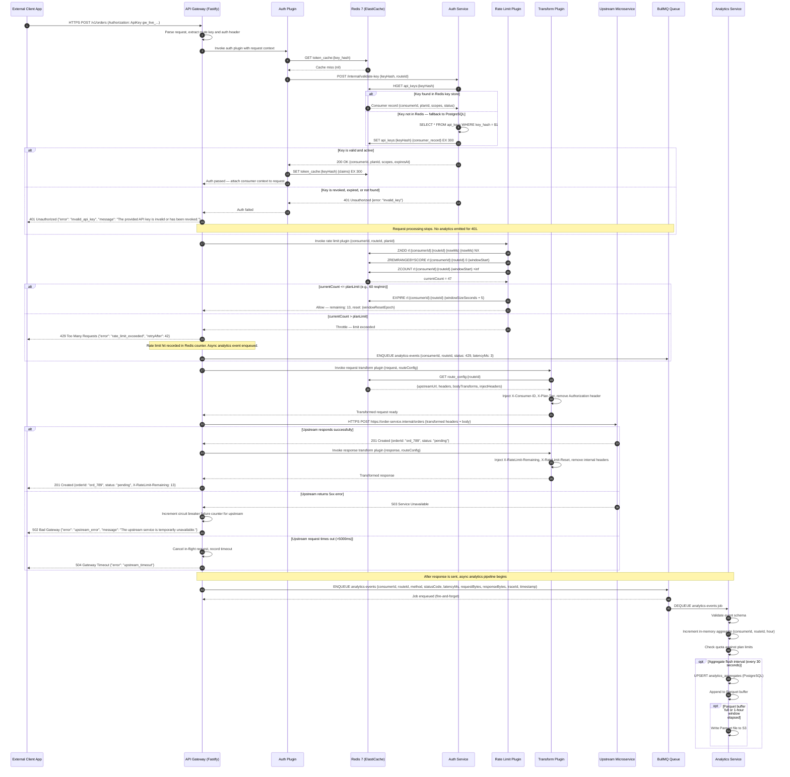
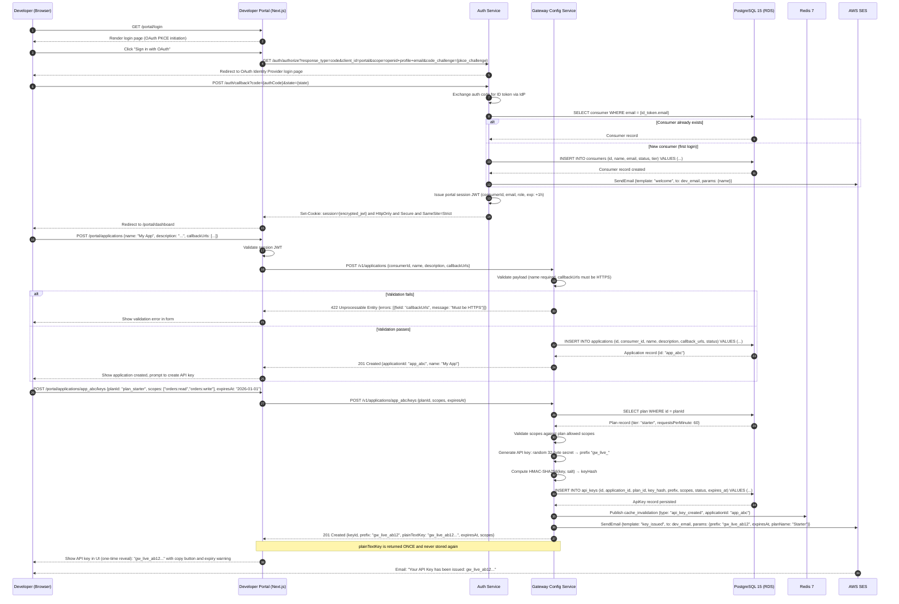
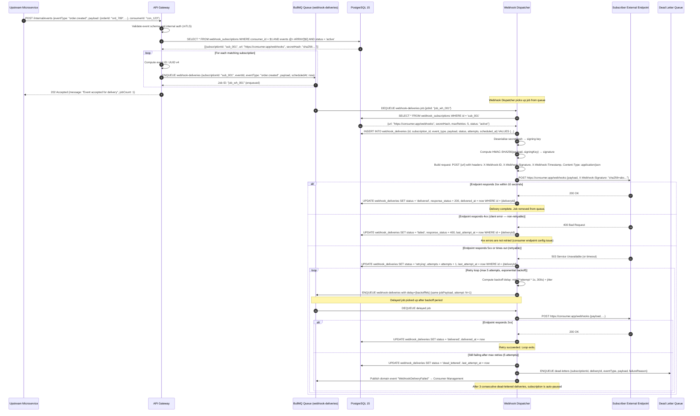

# System Sequence Diagrams — API Gateway and Developer Portal

---

## Overview

This document captures the key end-to-end interaction flows for the API Gateway and Developer Portal platform as System Sequence Diagrams (SSDs). Each SSD shows how actors and major system components collaborate to fulfil a specific use case.

Six primary flows are documented:

| SSD ID | Title | Primary Actor | Key Systems Involved |
|---|---|---|---|
| SSD-001 | Authenticated API Request Flow | External Client App | Gateway, Auth Service, Redis, Upstream Service, Analytics |
| SSD-002 | Developer Self-Service API Key Provisioning | Developer | Portal, Config Service, PostgreSQL, Email Service |
| SSD-003 | OAuth 2.0 Client Credentials Flow | Client Application | Auth Service, Redis, OAuth IdP, Gateway |
| SSD-004 | Webhook Event Delivery | Upstream Service | Gateway, BullMQ, Webhook Dispatcher, External Endpoint |
| SSD-005 | Rate Limit Enforcement with Redis Sliding Window | External Client App | Gateway, Rate Limit Plugin, Redis |
| SSD-006 | API Version Sunset Notification | Admin | Admin Console, Config Service, Notification Service, Developer |

Each diagram uses Mermaid `sequenceDiagram` syntax and includes `alt` / `opt` / `loop` blocks for conditional and repetitive logic.

---

## SSD-001: Authenticated API Request Flow

This is the primary hot-path flow. The gateway executes its plugin chain — authentication, rate limiting, transformation, and routing — before proxying the request to an upstream service. Analytics events are emitted asynchronously after the response is returned to the client.



---

## SSD-002: Developer Self-Service API Key Provisioning

A developer registers on the portal, creates an application, and provisions an API key. The portal delegates all writes to the Config Service, which is the single authoritative write path for domain entities.



---

## SSD-003: OAuth 2.0 Client Credentials Flow

A server-side application uses OAuth 2.0 Client Credentials grant to obtain a short-lived access token for calling APIs. The token is cached in Redis to avoid repeated token issuance for concurrent requests.

```mermaid
sequenceDiagram
    autonumber
    participant App as Client Application (Server-Side)
    participant GW as API Gateway
    participant AuthSvc as Auth Service
    participant Redis as Redis 7
    participant PG as PostgreSQL 15
    participant OAuthIdP as OAuth Identity Provider
    participant Upstream as Upstream Microservice

    Note over App: Application holds clientId and clientSecret from portal registration

    App->>AuthSvc: POST /oauth/token {grant_type: "client_credentials", client_id: "cli_xyz", client_secret: "cs_...", scope: "orders:read inventory:read"}

    AuthSvc->>AuthSvc: Parse Basic Auth or body credentials
    AuthSvc->>Redis: GET oauth_client:{clientId}

    alt Client record cached in Redis
        Redis-->>AuthSvc: Cached OAuthClient record {clientSecretHash, grantTypes, scopes, status}
    else Cache miss — load from PostgreSQL
        Redis-->>AuthSvc: nil
        AuthSvc->>PG: SELECT * FROM oauth_clients WHERE client_id = $1
        PG-->>AuthSvc: OAuthClient record
        AuthSvc->>Redis: SET oauth_client:{clientId} {record} EX 600
    end

    alt Client not found or status = suspended
        AuthSvc-->>App: 401 Unauthorized {"error": "invalid_client", "error_description": "Client not found or suspended."}
    else Client found
        AuthSvc->>AuthSvc: HMAC-SHA256(clientSecret, salt) == clientSecretHash?

        alt Secret mismatch
            AuthSvc-->>App: 401 Unauthorized {"error": "invalid_client", "error_description": "Invalid client credentials."}
        else Secret valid
            AuthSvc->>AuthSvc: Validate requested scopes subset of client allowed scopes
            alt Requested scopes exceed client allowed scopes
                AuthSvc-->>App: 400 Bad Request {"error": "invalid_scope"}
            else Scopes valid
                AuthSvc->>AuthSvc: Generate JWT access token {sub: clientId, iss: "api-gateway-platform", aud: "gateway", scope: "orders:read inventory:read", exp: now+900}
                AuthSvc->>AuthSvc: Sign JWT with RS256 private key
                AuthSvc->>Redis: SET oauth_token:{jti} {tokenMeta} EX 900
                AuthSvc-->>App: 200 OK {"access_token": "eyJ...", "token_type": "Bearer", "expires_in": 900, "scope": "orders:read inventory:read"}
            end
        end
    end

    Note over App,GW: Application uses the access token to call APIs through the gateway

    App->>GW: GET /v1/orders (Authorization: Bearer eyJ...)

    GW->>GW: Route match → Auth Plugin invoked
    GW->>Redis: GET token_cache:{jti from JWT}

    alt Token found in cache
        Redis-->>GW: Cached token claims {consumerId, scopes, exp}
        GW->>GW: Verify token not expired: exp > now
    else Cache miss
        Redis-->>GW: nil
        GW->>AuthSvc: POST /internal/validate-token {token: "eyJ..."}
        AuthSvc->>AuthSvc: Verify JWT signature using JWKS public key
        AuthSvc->>Redis: GET oauth_token:{jti} (revocation check)
        alt Token revoked
            Redis-->>AuthSvc: nil (revoked tokens removed from Redis)
            AuthSvc-->>GW: 401 Unauthorized {error: "token_revoked"}
            GW-->>App: 401 Unauthorized
        else Token valid
            Redis-->>AuthSvc: Token metadata (not revoked)
            AuthSvc-->>GW: 200 OK {consumerId, clientId, scopes, exp}
            GW->>Redis: SET token_cache:{jti} {claims} EX {remaining_ttl}
        end
    end

    GW->>GW: Rate Limit Plugin, Transform Plugin (as per SSD-001)
    GW->>Upstream: GET /orders (with X-Consumer-ID, X-Scopes injected)
    Upstream-->>GW: 200 OK [orders array]
    GW-->>App: 200 OK [orders array]

    Note over App,AuthSvc: Token refresh (client credentials tokens are not refreshable — re-issue at expiry)

    App->>App: Detect token expiry (exp - 60s buffer)
    App->>AuthSvc: POST /oauth/token {grant_type: "client_credentials", ...} (re-issue)
    Note over AuthSvc: Same flow repeats; new JWT issued; old JWT remains valid until exp
```

---

## SSD-004: Webhook Event Delivery

When an upstream service emits a business event, the gateway publishes a webhook job. The Webhook Dispatcher delivers it to subscriber endpoints with HMAC signing and implements exponential backoff retry logic.



---

## SSD-005: Rate Limit Enforcement with Redis Sliding Window

This diagram focuses specifically on the Redis sliding-window algorithm used by the Rate Limit Plugin. The algorithm uses a sorted set (ZSET) keyed by `{consumerId}:{routeId}` where each member and score is the request timestamp in milliseconds.

```mermaid
sequenceDiagram
    autonumber
    participant Client as External Client App
    participant GW as API Gateway (Rate Limit Plugin)
    participant Redis as Redis 7 (ElastiCache)
    participant Upstream as Upstream Microservice

    Client->>GW: GET /v1/products (Authorization: ApiKey gw_live_...)
    GW->>GW: Auth Plugin passes (consumer identified: con_456, plan: starter, limit: 60/min)

    Note over GW,Redis: Sliding window check for consumer con_456, route route_products_get

    GW->>Redis: MULTI (begin pipeline)
    GW->>Redis: ZADD rl:con_456:route_products_get {nowMs} {nowMs} (add current request)
    GW->>Redis: ZREMRANGEBYSCORE rl:con_456:route_products_get 0 {nowMs - 60000} (remove entries older than 60s)
    GW->>Redis: ZCOUNT rl:con_456:route_products_get {nowMs - 60000} +inf (count requests in last 60s)
    GW->>Redis: EXPIRE rl:con_456:route_products_get 65 (auto-expire key after window + buffer)
    GW->>Redis: EXEC

    Redis-->>GW: [1, 0, 47, 1] (results: added=1, removed=0, count=47, expire=OK)

    GW->>GW: currentCount = 47, limit = 60, remaining = 13

    alt currentCount <= limit (47 <= 60) — Request allowed
        GW->>GW: Set response headers: X-RateLimit-Limit: 60, X-RateLimit-Remaining: 13, X-RateLimit-Reset: {windowResetEpoch}
        GW->>Upstream: GET /products (proxied with consumer context)
        Upstream-->>GW: 200 OK [products array]
        GW-->>Client: 200 OK [products array] X-RateLimit-Remaining: 13 X-RateLimit-Reset: 1718000460
    else currentCount > limit — Request blocked
        GW->>GW: Compute Retry-After: {windowResetEpoch - nowSeconds}
        GW-->>Client: 429 Too Many Requests {"error": "rate_limit_exceeded", "message": "You have exceeded the rate limit for this plan.", "retryAfter": 42, "limit": 60, "window": "60s"}
        Note over GW,Redis: The ZADD already added the 429 request; it counts against the window to prevent retry storms
    end

    Note over GW,Redis: Burst limit check (optional — plan may define a burst allowance)

    alt Plan has burst limit defined (e.g., burst = 80 for 5-second window)
        GW->>Redis: ZCOUNT rl:con_456:route_products_get {nowMs - 5000} +inf
        Redis-->>GW: burstCount = 12

        alt burstCount <= burstLimit (12 <= 80)
            GW->>GW: Burst check passed
        else burstCount > burstLimit
            GW-->>Client: 429 Too Many Requests {"error": "burst_limit_exceeded", "retryAfter": 5}
        end
    end

    Note over Client,Redis: Subsequent request after rate limit window resets

    Client->>GW: GET /v1/products (60+ seconds later)
    GW->>Redis: MULTI ... ZADD ... ZREMRANGEBYSCORE ... ZCOUNT ... EXPIRE ... EXEC
    Redis-->>GW: [1, 47, 1, 1] (removed=47 old entries, count=1 after cleanup)
    GW->>GW: currentCount = 1 (window has reset), remaining = 59
    GW->>Upstream: GET /products
    Upstream-->>GW: 200 OK
    GW-->>Client: 200 OK X-RateLimit-Remaining: 59
```

---

## SSD-006: API Version Sunset Notification

An admin marks a route version as deprecated and sets a sunset date. The system notifies all affected consumers who have active API keys scoped to that route, and begins injecting deprecation headers into live responses.

```mermaid
sequenceDiagram
    autonumber
    participant Admin as Platform Admin
    participant AdminUI as Admin Console (React SPA)
    participant ConfigSvc as Gateway Config Service
    participant PG as PostgreSQL 15
    participant Redis as Redis 7
    participant GW as API Gateway (Transform Plugin)
    participant NotifSvc as Notification Service (within Config Service)
    participant Email as AWS SES
    participant Dev as Developer (Affected Consumer)
    participant Client as Client App (using deprecated version)

    Admin->>AdminUI: Navigate to Routes → v1/orders → Version Management
    AdminUI->>ConfigSvc: GET /v1/routes/route_orders/versions
    ConfigSvc->>PG: SELECT * FROM api_versions WHERE route_id = 'route_orders' ORDER BY released_at DESC
    PG-->>ConfigSvc: [{version: "v2", status: "active"}, {version: "v1", status: "active"}]
    ConfigSvc-->>AdminUI: [{version: "v2", status: "active"}, {version: "v1", status: "active"}]
    AdminUI-->>Admin: Display version list with management controls

    Admin->>AdminUI: Select v1 → "Deprecate" → Set sunset date: 2025-12-31 → Confirm
    AdminUI->>ConfigSvc: PATCH /v1/routes/route_orders/versions/v1 {status: "deprecated", sunsetAt: "2025-12-31T00:00:00Z", migrationGuideUrl: "https://docs.platform.io/migrate/v1-to-v2"}

    ConfigSvc->>ConfigSvc: Validate: sunsetAt must be at least 90 days from now
    ConfigSvc->>ConfigSvc: Validate: v2 must exist and be active before v1 can be deprecated

    alt Validation fails (e.g., sunset too soon)
        ConfigSvc-->>AdminUI: 422 Unprocessable Entity {"error": "sunset_too_soon", "minimumDays": 90}
        AdminUI-->>Admin: Show error: "Sunset date must be at least 90 days from today."
    else Validation passes
        ConfigSvc->>PG: UPDATE api_versions SET status = 'deprecated', deprecated_at = now(), sunset_at = '2025-12-31', migration_guide_url = $1 WHERE route_id = 'route_orders' AND version = 'v1'
        PG-->>ConfigSvc: Updated

        ConfigSvc->>Redis: SET route_config:route_orders_v1 {updated route config with deprecatedAt, sunsetAt} EX 60
        ConfigSvc->>Redis: PUBLISH cache_invalidation {"type": "route_updated", "routeId": "route_orders", "version": "v1"}
        Redis-->>GW: Cache invalidation message received

        GW->>GW: Evict route_config:route_orders_v1 from local cache
        GW->>Redis: GET route_config:route_orders_v1 (next request triggers fresh load)
        Redis-->>GW: Updated config with deprecatedAt: "2025-09-01", sunsetAt: "2025-12-31"

        ConfigSvc->>PG: INSERT INTO audit_logs (actor_id, action, resource, resource_id, before, after, timestamp) VALUES (...)

        ConfigSvc-->>AdminUI: 200 OK {versionId, status: "deprecated", deprecatedAt, sunsetAt, migrationGuideUrl}
        AdminUI-->>Admin: Show success: "v1 marked as deprecated. Sunset: 2025-12-31. Notifications being sent."

        Note over ConfigSvc,NotifSvc: Async: find all consumers with active keys on this route

        ConfigSvc->>NotifSvc: TRIGGER notify_sunset {routeId: "route_orders", version: "v1", sunsetAt: "2025-12-31", migrationGuideUrl}

        NotifSvc->>PG: SELECT DISTINCT c.email, c.name, c.id FROM consumers c JOIN applications a ON c.id = a.consumer_id JOIN api_keys k ON a.id = k.application_id WHERE k.status = 'active' AND route_orders_v1 IN (scope-matched routes)
        PG-->>NotifSvc: [List of affected consumers with emails]

        loop For each affected consumer
            NotifSvc->>Email: SendEmail {template: "api_version_deprecated", to: consumer.email, params: {name, version: "v1", sunsetAt: "2025-12-31", migrationGuideUrl, daysRemaining: 122}}
            Email-->>NotifSvc: 200 OK {messageId}
            NotifSvc->>PG: INSERT INTO sunset_notifications (consumer_id, route_id, version, sent_at, channel: 'email')
        end

        Email-->>Dev: Email: "Action Required — API v1/orders will be sunset on Dec 31, 2025. Please migrate to v2."
    end

    Note over GW,Client: From this point, every response to a v1/orders call includes deprecation headers

    Client->>GW: GET /v1/orders (Authorization: ApiKey)
    GW->>GW: Auth, Rate Limit pass as normal
    GW->>GW: Transform Plugin reads route config: status = deprecated
    GW->>GW: Inject response headers: Deprecation: "2025-09-01", Sunset: "Tue, 31 Dec 2025 00:00:00 GMT", Link: <https://docs.platform.io/migrate/v1-to-v2> and rel="successor-version"
    GW->>GW: Proxy to upstream as normal (v1 still operational until sunset date)
    GW-->>Client: 200 OK {orders data} + Deprecation, Sunset, Link headers

    Note over GW,Client: On or after sunset date (2025-12-31)

    Client->>GW: GET /v1/orders (post-sunset)
    GW->>GW: Transform Plugin reads route config: status = sunset (sunsetAt <= now)
    GW-->>Client: 410 Gone {"error": "api_version_sunset", "message": "API version v1 has been sunset as of 2025-12-31. Please migrate to v2.", "migrationGuide": "https://docs.platform.io/migrate/v1-to-v2"}
```



---

## Sequence Diagram Notes

| SSD ID | Title | Key Decision Points | Failure Modes Covered | Performance Notes |
|---|---|---|---|---|
| SSD-001 | Authenticated API Request Flow | Auth cache hit vs miss; rate limit allow vs throttle; upstream success vs 5xx vs timeout | 401 invalid key, 429 rate limit exceeded, 502 upstream error, 504 gateway timeout | Token cache hit avoids Auth Service round-trip (5ms vs 30ms). Analytics event is fire-and-forget post-response — zero impact on client latency. |
| SSD-002 | Developer Self-Service API Key Provisioning | New vs returning consumer; validation pass vs fail | 422 validation error on app or key creation; email delivery failure (non-blocking, retried by SES) | API key plaintext is generated in memory, returned once in response body, never written to DB. Failure after INSERT but before response returns an orphaned key that must be revoked manually or via admin tooling. |
| SSD-003 | OAuth 2.0 Client Credentials Flow | Client found in Redis cache vs PG fallback; secret valid vs invalid; scope subset vs overage; token revocation check | 401 invalid client, 401 invalid secret, 400 invalid scope, 401 token revoked | Token cache TTL is set to remaining token TTL to ensure cached tokens expire at same time as actual token. Concurrent requests all hit cache after first token issuance. |
| SSD-004 | Webhook Event Delivery | Matching subscriptions found vs none; 2xx delivery vs 4xx non-retryable vs 5xx retryable; all retries exhausted | 4xx permanent failure (no retry), 5xx retryable with exponential backoff, dead-letter after max retries, auto-pause on repeated dead-letters | Job is enqueued after gateway returns 202 — upstream never waits for delivery. BullMQ job visibility timeout prevents duplicate delivery on dispatcher crash. |
| SSD-005 | Rate Limit Enforcement with Redis Sliding Window | currentCount ≤ limit vs > limit; optional burst limit check; window reset path | 429 standard rate limit, 429 burst limit, X-RateLimit headers always returned | Redis pipeline (MULTI/EXEC) makes sliding window check atomic — no race conditions for concurrent requests from same consumer. ZADD adds the request before checking count, so a 429 still counts against the window. |
| SSD-006 | API Version Sunset Notification | Sunset date validation (≥ 90 days); replacement version must exist; consumer lookup for notifications; pre-sunset deprecation headers vs post-sunset 410 | 422 sunset too soon, 422 no active replacement version, email delivery failure (non-blocking) | Cache invalidation is synchronous within the Config Service write path — all gateway instances receive the invalidation pub/sub event and evict within 100 ms. Notification fan-out to consumers is async and non-blocking relative to the admin's response. |
