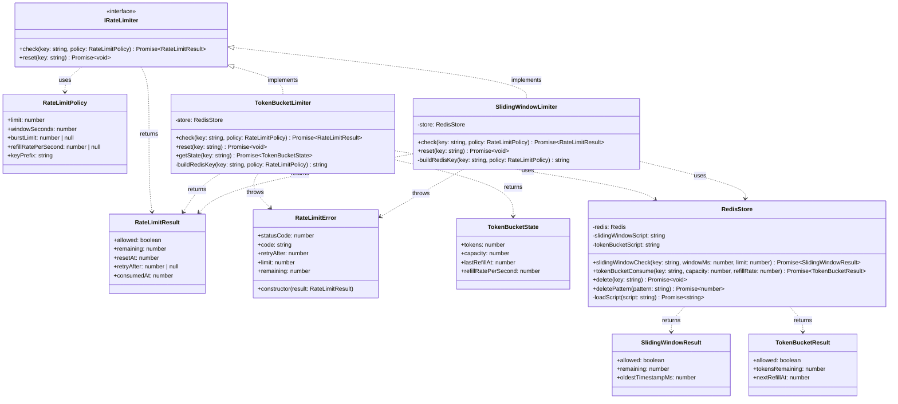
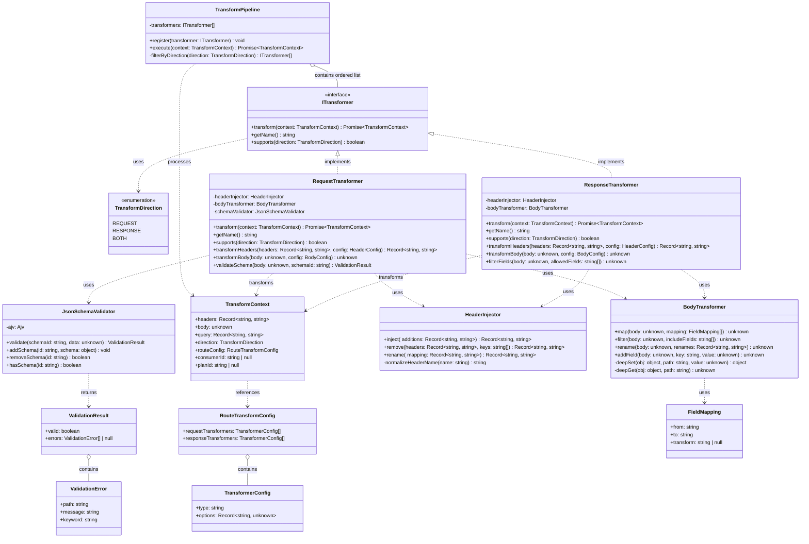
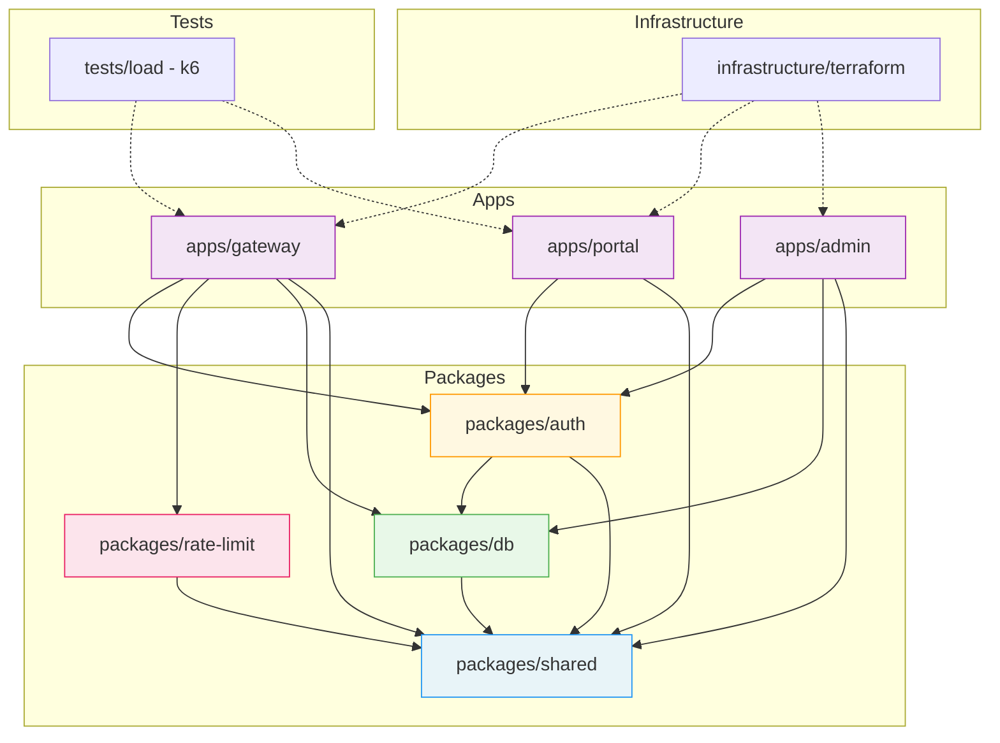

```mermaid
classDiagram
    direction TB

    class IAuthPlugin {
        <<interface>>
        +execute(request: FastifyRequest) Promise~AuthContext~
        +validate(config: RouteAuthConfig) boolean
        +getType() AuthPluginType
    }

    class AuthPluginType {
        <<enumeration>>
        API_KEY
        JWT
        OAUTH2
        MTLS
    }

    class AuthContext {
        +consumerId: string
        +keyId: string | null
        +scopes: string[]
        +sub: string | null
        +exp: number | null
    }

    class RouteAuthConfig {
        +type: AuthPluginType
        +requiredScopes: string[]
        +allowAnonymous: boolean
    }

    class ApiKeyAuthPlugin {
        -validator: ApiKeyValidator
        -tokenCache: TokenCache
        +execute(request: FastifyRequest) Promise~AuthContext~
        +validate(config: RouteAuthConfig) boolean
        +getType() AuthPluginType
        -extractKey(request: FastifyRequest) string
    }

    class JwtAuthPlugin {
        -validator: JwtValidator
        -tokenCache: TokenCache
        +execute(request: FastifyRequest) Promise~AuthContext~
        +validate(config: RouteAuthConfig) boolean
        +getType() AuthPluginType
        -extractBearerToken(request: FastifyRequest) string
        -checkScopes(payload: JwtPayload, required: string[]) boolean
    }

    class OAuthAuthPlugin {
        -tokenService: OAuthTokenService
        -tokenCache: TokenCache
        +execute(request: FastifyRequest) Promise~AuthContext~
        +validate(config: RouteAuthConfig) boolean
        +getType() AuthPluginType
        -introspect(token: string) Promise~OAuthIntrospectResult~
    }

    class ApiKeyValidator {
        -repo: ApiKeyRepository
        -hmac: HmacSha256
        +validate(rawKey: string) Promise~ApiKeyValidationResult~
        -parsePrefix(rawKey: string) string
        -computeHash(secret: string, prefix: string) string
    }

    class ApiKeyValidationResult {
        +valid: boolean
        +consumerId: string | null
        +keyId: string | null
        +scopes: string[]
    }

    class JwtValidator {
        -jwksClient: JwksClient
        +verify(token: string) Promise~JwtPayload~
        +decode(token: string) JwtPayload
        -getSigningKey(kid: string) Promise~string~
    }

    class JwtPayload {
        +sub: string
        +aud: string | string[]
        +iss: string
        +exp: number
        +iat: number
        +scopes: string[]
        +consumerId: string
    }

    class OAuthTokenService {
        -db: Pool
        -tokenCache: TokenCache
        -hmac: HmacSha256
        +generateToken(input: GenerateTokenInput) Promise~TokenPair~
        +validateToken(token: string) Promise~TokenValidationResult~
        +refreshToken(refreshToken: string) Promise~TokenPair~
        +revokeToken(token: string) Promise~void~
        -createAccessToken(claims: TokenClaims) string
        -hashToken(token: string) string
    }

    class TokenPair {
        +accessToken: string
        +refreshToken: string
        +expiresIn: number
        +tokenType: string
    }

    class HmacSha256 {
        -secret: string
        +sign(data: string) string
        +verify(data: string, signature: string) boolean
        +timingSafeCompare(a: string, b: string) boolean
        $hashSha256(input: string) string
    }

    class TokenCache {
        -redis: Redis
        -prefix: string
        +get(key: string) Promise~string | null~
        +set(key: string, value: string, ttlSeconds: number) Promise~void~
        +invalidate(key: string) Promise~void~
        +invalidatePattern(pattern: string) Promise~void~
        -buildKey(key: string) string
    }

    class AuthError {
        +statusCode: number
        +code: string
        +message: string
        +constructor(message: string, code: string, statusCode: number)
    }

    IAuthPlugin <|.. ApiKeyAuthPlugin : implements
    IAuthPlugin <|.. JwtAuthPlugin : implements
    IAuthPlugin <|.. OAuthAuthPlugin : implements

    ApiKeyAuthPlugin ..> ApiKeyValidator : uses
    ApiKeyAuthPlugin ..> TokenCache : uses
    ApiKeyAuthPlugin ..> AuthError : throws

    JwtAuthPlugin ..> JwtValidator : uses
    JwtAuthPlugin ..> TokenCache : uses
    JwtAuthPlugin ..> AuthError : throws

    OAuthAuthPlugin ..> OAuthTokenService : uses
    OAuthAuthPlugin ..> TokenCache : uses
    OAuthAuthPlugin ..> AuthError : throws

    ApiKeyValidator ..> HmacSha256 : uses
    ApiKeyValidator ..> ApiKeyValidationResult : returns

    JwtValidator ..> JwtPayload : returns

    OAuthTokenService ..> TokenPair : returns
    OAuthTokenService ..> HmacSha256 : uses
    OAuthTokenService ..> TokenCache : uses

    IAuthPlugin ..> AuthContext : returns
    IAuthPlugin ..> RouteAuthConfig : uses
    IAuthPlugin ..> AuthPluginType : uses
```

```mermaid
classDiagram
    direction TB

    class IRepository~T, ID~ {
        <<interface>>
        +findById(id: ID) Promise~T | null~
        +findMany(filter: Partial~T~) Promise~T[]~
        +create(data: Omit~T, id~) Promise~T~
        +update(id: ID, data: Partial~T~) Promise~T | null~
        +delete(id: ID) Promise~boolean~
    }

    class PostgresClient {
        -pool: Pool
        +query~T~(sql: string, params: unknown[]) Promise~QueryResult~T~~
        +transaction~T~(fn: (client: PoolClient) => Promise~T~) Promise~T~
        +getPool() Pool
        +end() Promise~void~
        -handleError(error: unknown) never
    }

    class ConsumerRepository {
        -db: Pool | PoolClient
        +findById(id: string) Promise~Consumer | null~
        +findMany(filter: Partial~Consumer~) Promise~Consumer[]~
        +create(data: CreateConsumerInput) Promise~Consumer~
        +update(id: string, data: Partial~Consumer~) Promise~Consumer | null~
        +delete(id: string) Promise~boolean~
        +findByEmail(email: string) Promise~Consumer | null~
        +findByApiKey(prefix: string) Promise~Consumer | null~
        +updatePlan(consumerId: string, planId: string) Promise~Consumer~
        +suspend(consumerId: string, reason: string) Promise~void~
        +search(query: string, cursor: string | null, limit: number) Promise~PagedResult~Consumer~~
    }

    class ApiKeyRepository {
        -db: Pool | PoolClient
        +findById(id: string) Promise~ApiKey | null~
        +findMany(filter: Partial~ApiKey~) Promise~ApiKey[]~
        +create(data: CreateApiKeyInput) Promise~ApiKey~
        +update(id: string, data: Partial~ApiKey~) Promise~ApiKey | null~
        +delete(id: string) Promise~boolean~
        +findByPrefix(prefix: string) Promise~ApiKey | null~
        +findByHash(hash: string) Promise~ApiKey | null~
        +revoke(id: string) Promise~void~
        +rotate(id: string, newHash: string, newPrefix: string) Promise~ApiKey~
        +findActiveByConsumer(consumerId: string) Promise~ApiKey[]~
    }

    class RouteRepository {
        -db: Pool | PoolClient
        +findById(id: string) Promise~Route | null~
        +findMany(filter: Partial~Route~) Promise~Route[]~
        +create(data: CreateRouteInput) Promise~Route~
        +update(id: string, data: Partial~Route~) Promise~Route | null~
        +delete(id: string) Promise~boolean~
        +findByPath(path: string, method: string) Promise~Route | null~
        +findActive() Promise~Route[]~
        +findByVersion(version: string) Promise~Route[]~
        +toggleActive(id: string, active: boolean) Promise~Route~
    }

    class AnalyticsRepository {
        -db: Pool | PoolClient
        +findById(id: string) Promise~AnalyticsEvent | null~
        +findMany(filter: Partial~AnalyticsEvent~) Promise~AnalyticsEvent[]~
        +create(data: CreateAnalyticsEventInput) Promise~AnalyticsEvent~
        +update(id: string, data: Partial~AnalyticsEvent~) Promise~AnalyticsEvent | null~
        +delete(id: string) Promise~boolean~
        +insertEvent(event: AnalyticsEventInput) Promise~void~
        +getAggregates(filter: AggregateFilter) Promise~UsageAggregate[]~
        +getByConsumer(consumerId: string, from: Date, to: Date) Promise~UsageAggregate[]~
        +getTopEndpoints(limit: number, from: Date) Promise~EndpointStat[]~
        +getErrorRates(from: Date, to: Date) Promise~ErrorRateStat[]~
    }

    class WebhookRepository {
        -db: Pool | PoolClient
        +findById(id: string) Promise~Webhook | null~
        +findMany(filter: Partial~Webhook~) Promise~Webhook[]~
        +create(data: CreateWebhookInput) Promise~Webhook~
        +update(id: string, data: Partial~Webhook~) Promise~Webhook | null~
        +delete(id: string) Promise~boolean~
        +findActive() Promise~Webhook[]~
        +findByConsumer(consumerId: string) Promise~Webhook[]~
        +recordDelivery(delivery: WebhookDeliveryInput) Promise~WebhookDelivery~
        +updateStatus(deliveryId: string, status: DeliveryStatus) Promise~void~
        +getDeliveryHistory(webhookId: string, limit: number) Promise~WebhookDelivery[]~
    }

    class PagedResult~T~ {
        +data: T[]
        +hasNextPage: boolean
        +nextCursor: string | null
        +total: number | null
    }

    class AggregateFilter {
        +consumerId: string | null
        +from: Date
        +to: Date
        +granularity: string
        +routeId: string | null
    }

    class UsageAggregate {
        +period: string
        +requestCount: number
        +errorCount: number
        +p50LatencyMs: number
        +p99LatencyMs: number
        +bytesTransferred: number
    }

    class DeliveryStatus {
        <<enumeration>>
        PENDING
        SUCCESS
        FAILED
        RETRYING
        DEAD_LETTER
    }

    IRepository~T, ID~ <|.. ConsumerRepository : implements
    IRepository~T, ID~ <|.. ApiKeyRepository : implements
    IRepository~T, ID~ <|.. RouteRepository : implements
    IRepository~T, ID~ <|.. AnalyticsRepository : implements
    IRepository~T, ID~ <|.. WebhookRepository : implements

    ConsumerRepository ..> PostgresClient : constructed with pool from
    ApiKeyRepository ..> PostgresClient : constructed with pool from
    RouteRepository ..> PostgresClient : constructed with pool from
    AnalyticsRepository ..> PostgresClient : constructed with pool from
    WebhookRepository ..> PostgresClient : constructed with pool from

    ConsumerRepository ..> PagedResult : returns
    AnalyticsRepository ..> UsageAggregate : returns
    AnalyticsRepository ..> AggregateFilter : uses
    WebhookRepository ..> DeliveryStatus : uses
```

# C4 Model — Code Diagrams (Level 4)

---

## Table of Contents

1. [Overview of Level 4 C4 Code Diagrams](#1-overview-of-level-4-c4-code-diagrams)
2. [Auth Plugin Code Diagram](#2-auth-plugin-code-diagram-packagesauth)
3. [Rate Limit Code Diagram](#3-rate-limit-code-diagram-packagesrate-limit)
4. [Request Transformation Code Diagram](#4-request-transformation-code-diagram)
5. [Repository Layer Code Diagram](#5-repository-layer-code-diagram-packagesdb)
6. [Key Code-Level Design Decisions](#6-key-code-level-design-decisions-adrs)
7. [Package Dependency Graph](#7-package-dependency-graph)

---

## 1. Overview of Level 4 C4 Code Diagrams

### What Level 4 Represents

C4 Level 4 (Code Diagrams) zoom into the internal structure of a single component to show the actual classes, interfaces, and their relationships. Where Level 3 (Component Diagrams) shows what logical components exist inside a container, Level 4 shows the code constructs that implement those components.

### When to Use Level 4 Diagrams

Level 4 diagrams are most valuable when:

- A component is complex enough that its internal design needs documenting for onboarding engineers.
- The component implements a non-trivial pattern (plugin interface hierarchy, repository abstraction, transformer pipeline) that is easy to misuse without understanding the full structure.
- An architectural decision has been made about the internal design that reviewers need to verify implementations against.
- You are defining the design contract before implementation begins (design-first).

Level 4 diagrams are **not** intended to be generated for every class in the system. They target the most architecturally significant components — specifically those listed in this document: the auth plugin package, rate limiting package, transformation pipeline, and repository layer.

### How to Read These Diagrams

- **Solid lines with closed arrowheads** (`--|>`) represent inheritance or interface implementation.
- **Dashed lines with open arrowheads** (`..>`) represent a usage/dependency relationship.
- **Solid lines with diamonds** (`o--`) represent aggregation (has-a).
- Methods are shown in the format `methodName(paramName: Type): ReturnType`.
- `+` prefix = public, `-` prefix = private, `#` prefix = protected.
- `<<interface>>` stereotype = TypeScript interface.
- `<<abstract>>` stereotype = abstract class.

---

## 2. Auth Plugin Code Diagram (`packages/auth/`)

### Description

The auth package implements a plugin strategy pattern. Every supported authentication mechanism (API Key, JWT, OAuth 2.0) implements the `IAuthPlugin` interface. The Fastify gateway plugin selects and invokes the correct `IAuthPlugin` based on route configuration. Validators, services, and utilities are intentionally separated from the plugin classes so they can be unit-tested independently.

### Class Diagram

---

## 3. Rate Limit Code Diagram (`packages/rate-limit/`)

### Description

The rate limiting package exposes two algorithm implementations behind a common `IRateLimiter` interface. The `SlidingWindowLimiter` is used for per-second and per-minute rate limits on API keys. The `TokenBucketLimiter` is used for burst-tolerant plans. Both implementations delegate their atomic counter operations to `RedisStore`, which executes Lua scripts to ensure atomicity. All state is stored in Redis — the limiters themselves are stateless.

### Class Diagram

---

## 4. Request Transformation Code Diagram

### Description

The transformation pipeline is a series of stateless transformer classes that the gateway applies to requests and responses before forwarding and after receiving from the upstream service. Each transformer implements `ITransformer` and is composed into a pipeline by the route configuration. Transformers are applied in registration order, making the pipeline deterministic and testable in isolation.

### Class Diagram

---

## 5. Repository Layer Code Diagram (`packages/db/`)

### Description

The repository layer provides a clean, typed abstraction over raw PostgreSQL queries. Every domain entity has its own repository class. All repositories extend the `IRepository` generic interface for standard CRUD. Complex queries specific to a domain (e.g., `findByApiKey`, `getAggregates`) are added as concrete methods on the respective repository. The `PostgresClient` wraps `pg.Pool` and provides a `transaction()` helper. Repositories accept either a `Pool` or a `PoolClient` so they can participate in transactions.

### Class Diagram

---

## 6. Key Code-Level Design Decisions (ADRs)

### ADR-001: Plugin Strategy Pattern for Auth

**Status:** Accepted

**Context:** The gateway needs to support multiple authentication mechanisms (API Key, JWT, OAuth 2.0, mTLS) and routes must be configurable to use any combination. The chosen mechanism must be swappable without modifying route handler code.

**Decision:** Implement the Strategy pattern via the `IAuthPlugin` interface. Each auth mechanism is a class implementing `IAuthPlugin`. The gateway plugin selects and invokes the correct strategy based on route-level configuration loaded from the database. New auth mechanisms can be added as new classes without modifying existing code (Open/Closed Principle).

**Consequences:**
- Adding a new auth type requires only implementing `IAuthPlugin` and registering the new class.
- The gateway plugin code never contains `if authType === 'jwt'` branches — it delegates entirely to the strategy.
- Test coverage requires one test suite per `IAuthPlugin` implementation rather than one monolithic test for all auth logic.

---

### ADR-002: Repository Pattern with Typed Queries Over ORM

**Status:** Accepted

**Context:** We need database access across multiple services. Options considered: Prisma ORM, TypeORM, raw `pg` with plain queries, and `pg` with the repository pattern.

**Decision:** Use `node-postgres` (`pg`) directly with hand-written parameterized SQL inside typed repository classes. No ORM.

**Rationale:**
- ORMs generate unpredictable SQL that is difficult to optimize for analytics queries (complex aggregations, window functions).
- Parameterized queries in repository methods make SQL injection prevention explicit and auditable.
- Repository classes provide the same abstraction boundary as an ORM's model layer without the magic.
- Migration tooling (`node-pg-migrate`) keeps schema changes in plain SQL, which is reviewable and testable.

**Consequences:**
- Developers must write SQL. This is intentional — SQL literacy is a team requirement.
- No automatic query generation. Complex queries must be written explicitly (this is a feature, not a limitation).
- Schema changes require a migration file rather than `prisma migrate dev`.

---

### ADR-003: Stateless Transformer Pipeline for Request/Response

**Status:** Accepted

**Context:** The gateway needs to mutate request headers, body, and query parameters before forwarding to upstreams, and mutate responses before returning to consumers. The number and type of transformations must be configurable per route.

**Decision:** Implement a pipeline of stateless `ITransformer` objects. Each transformer receives a `TransformContext`, mutates it immutably (returns a new context), and passes the result to the next transformer. Transformers are registered in order and executed sequentially. The pipeline itself is built from route configuration at startup.

**Consequences:**
- Each transformer is independently testable with a simple input/output unit test.
- Adding a transformer does not affect existing transformers (no shared mutable state).
- Transformer ordering is explicit and controlled by route configuration.
- Performance cost is one function call per transformer per request — acceptable for the transformation use case.

---

## 7. Package Dependency Graph

### Overview

The following flowchart shows how all internal packages and applications depend on each other. Arrows point from dependent to dependency (i.e., `A --> B` means A depends on B). External dependencies (npm packages) are omitted for clarity.

### Dependency Rules (Enforced by Turborepo and ESLint import plugin)

| Package            | May Depend On                               | Must NOT Depend On                    |
|--------------------|---------------------------------------------|---------------------------------------|
| `packages/shared`  | No internal packages                        | Anything internal                     |
| `packages/db`      | `packages/shared`                           | `packages/auth`, `packages/rate-limit`, any app |
| `packages/auth`    | `packages/shared`, `packages/db`            | `packages/rate-limit`, any app        |
| `packages/rate-limit` | `packages/shared`                        | `packages/db`, `packages/auth`, any app |
| `apps/gateway`     | All packages                                | Other apps (`apps/portal`, `apps/admin`) |
| `apps/portal`      | `packages/shared`, `packages/auth`          | `packages/db`, `packages/rate-limit`, other apps |
| `apps/admin`       | `packages/shared`, `packages/auth`, `packages/db` | `packages/rate-limit`, other apps |

### Circular Dependency Policy

Circular dependencies between packages are **forbidden** and enforced by the ESLint `import/no-cycle` rule applied in CI. If a circular dependency is detected, the build fails. The resolution is to extract the shared type or utility into `packages/shared`.

---

*Last updated: Architecture definition phase. Owned by Gateway Tech Lead. Diagrams must be updated before any significant refactor of the depicted components.*
