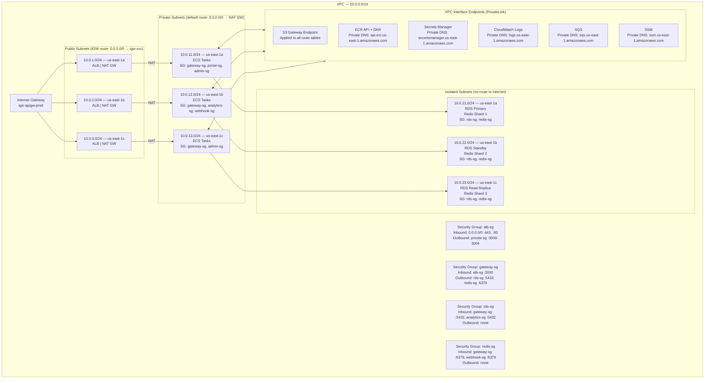
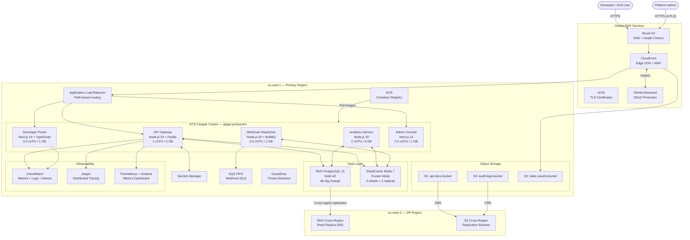

# Cloud Architecture — AWS

## Overview

The API Gateway and Developer Portal platform is deployed entirely on AWS, leveraging managed services wherever possible to reduce operational overhead. The architecture follows the AWS Well-Architected Framework pillars: Operational Excellence, Security, Reliability, Performance Efficiency, Cost Optimization, and Sustainability.

All workloads run in a single AWS Region (`us-east-1`) with multi-Availability Zone deployments to achieve an SLA target of 99.95% uptime. A secondary region (`us-west-2`) is provisioned for disaster recovery with an RTO of 4 hours and RPO of 15 minutes using cross-region RDS read replicas and S3 cross-region replication.

The architecture is fully Infrastructure-as-Code managed via AWS CDK (TypeScript), with all resources version-controlled and deployed through CI/CD pipelines in CodePipeline. No manual console changes are permitted in production environments.

---

## AWS Services Inventory

| Component | AWS Service | Purpose | Region | Redundancy |
|---|---|---|---|---|
| DNS | Route 53 | Public and private DNS, health-check routing | Global | Multi-region anycast |
| CDN | CloudFront | Edge caching, TLS termination, static asset delivery | Global (edge) | 450+ PoPs worldwide |
| Web Application Firewall | AWS WAF v2 | OWASP rule groups, rate limiting, geo-blocking | us-east-1 + CF edge | Replicated to edge |
| DDoS Protection | AWS Shield Advanced | Layer 3/4/7 DDoS mitigation, 24/7 DRT support | Global | Always-on |
| Load Balancing | Application Load Balancer (ALB) | HTTP/HTTPS routing, path-based rules, TLS offload | us-east-1 (3 AZs) | Cross-AZ |
| Container Orchestration | ECS Fargate | Serverless container execution for all microservices | us-east-1 (3 AZs) | Multi-AZ task placement |
| Container Registry | ECR | Private Docker image registry with image scanning | us-east-1 | Cross-region replication |
| Relational Database | RDS PostgreSQL 15 | Primary transactional data store | us-east-1 (Multi-AZ) | Synchronous standby + async read replica |
| In-Memory Cache / Queue | ElastiCache Redis 7 | Rate limiting, session cache, BullMQ job queues | us-east-1 (3 AZs) | Cluster mode, 3 shards × 2 replicas |
| Object Storage | S3 | API docs, audit logs, static assets, backups | us-east-1 | 11-nines durability (3+ AZ copies) |
| Message Queue | SQS (FIFO) | Dead-letter queue for webhook failures | us-east-1 | Multi-AZ |
| Secrets Management | Secrets Manager | API keys, DB credentials, OAuth client secrets | us-east-1 | Multi-AZ, cross-region replication |
| Certificate Management | ACM | TLS certificates, auto-renewal | us-east-1 + us-east-1 (CF) | Automatic renewal 60 days before expiry |
| Identity & Access | IAM | Roles, policies, OIDC federation for CI/CD | Global | N/A |
| Monitoring | CloudWatch | Metrics, logs, alarms, dashboards, Container Insights | us-east-1 | Multi-AZ |
| Distributed Tracing | X-Ray (+ OTEL) | Request tracing, service map | us-east-1 | Multi-AZ |
| Deployment Automation | CodeDeploy | Blue-green ECS deployments | us-east-1 | N/A |
| CI/CD Pipeline | CodePipeline + CodeBuild | Build, test, and deploy automation | us-east-1 | N/A |
| Threat Detection | GuardDuty | Anomaly detection, malicious IP identification | us-east-1 | Multi-AZ |
| Flow Logs | VPC Flow Logs → S3 | Network traffic visibility for security audit | us-east-1 | S3 multi-AZ durability |
| Parameter Store | SSM Parameter Store | Non-secret configuration, feature flags | us-east-1 | Multi-AZ |
| Cost Management | Cost Explorer + Budgets | Cost tracking and alerting | Global | N/A |
| Backup | AWS Backup | Centralized backup for RDS, ElastiCache | us-east-1 | Cross-AZ |

---

## VPC and Networking Design

### Address Space

| Subnet Tier | AZ | CIDR | Purpose |
|---|---|---|---|
| VPC | — | `10.0.0.0/16` | Entire VPC address space |
| Public | us-east-1a | `10.0.1.0/24` | Internet-facing ALB, NAT Gateway |
| Public | us-east-1b | `10.0.2.0/24` | Internet-facing ALB, NAT Gateway |
| Public | us-east-1c | `10.0.3.0/24` | Internet-facing ALB, NAT Gateway |
| Private | us-east-1a | `10.0.11.0/24` | ECS Fargate tasks |
| Private | us-east-1b | `10.0.12.0/24` | ECS Fargate tasks |
| Private | us-east-1c | `10.0.13.0/24` | ECS Fargate tasks |
| Isolated | us-east-1a | `10.0.21.0/24` | RDS PostgreSQL, ElastiCache Redis |
| Isolated | us-east-1b | `10.0.22.0/24` | RDS PostgreSQL standby, Redis replicas |
| Isolated | us-east-1c | `10.0.23.0/24` | RDS read replica, Redis shard 3 |

### VPC Layout Diagram



---

## ECS Fargate Configuration

### Task Definitions

Each microservice is defined as an ECS task definition with the following structure:

#### API Gateway Service

```json
{
  "family": "apigw-gateway",
  "requiresCompatibilities": ["FARGATE"],
  "networkMode": "awsvpc",
  "cpu": "1024",
  "memory": "2048",
  "executionRoleArn": "arn:aws:iam::ACCOUNT:role/ecsTaskExecutionRole-gateway",
  "taskRoleArn": "arn:aws:iam::ACCOUNT:role/ecsTaskRole-gateway",
  "containerDefinitions": [
    {
      "name": "gateway",
      "image": "ACCOUNT.dkr.ecr.us-east-1.amazonaws.com/apigw-gateway:latest",
      "portMappings": [{"containerPort": 3000, "protocol": "tcp"}],
      "environment": [
        {"name": "NODE_ENV", "value": "production"},
        {"name": "PORT", "value": "3000"},
        {"name": "LOG_LEVEL", "value": "info"}
      ],
      "secrets": [
        {"name": "DATABASE_URL", "valueFrom": "arn:aws:secretsmanager:us-east-1:ACCOUNT:secret:apigw/db-url"},
        {"name": "REDIS_URL", "valueFrom": "arn:aws:secretsmanager:us-east-1:ACCOUNT:secret:apigw/redis-url"},
        {"name": "JWT_SECRET", "valueFrom": "arn:aws:secretsmanager:us-east-1:ACCOUNT:secret:apigw/jwt-secret"}
      ],
      "logConfiguration": {
        "logDriver": "awslogs",
        "options": {
          "awslogs-group": "/ecs/apigw-gateway",
          "awslogs-region": "us-east-1",
          "awslogs-stream-prefix": "ecs"
        }
      },
      "healthCheck": {
        "command": ["CMD-SHELL", "curl -sf http://localhost:3000/health || exit 1"],
        "interval": 15,
        "timeout": 5,
        "retries": 3,
        "startPeriod": 30
      }
    },
    {
      "name": "otel-collector",
      "image": "otel/opentelemetry-collector-contrib:0.95.0",
      "cpu": 128,
      "memory": 256,
      "portMappings": [{"containerPort": 4317, "protocol": "tcp"}],
      "essential": false
    }
  ]
}
```

#### Developer Portal Service

| Parameter | Value |
|---|---|
| Family | `apigw-portal` |
| CPU | `512` (0.5 vCPU) |
| Memory | `1024` MB |
| Container port | `3001` |
| Image | `ACCOUNT.dkr.ecr.us-east-1.amazonaws.com/apigw-portal:latest` |
| Task role | `ecsTaskRole-portal` |

#### Analytics Service

| Parameter | Value |
|---|---|
| Family | `apigw-analytics` |
| CPU | `2048` (2 vCPU) |
| Memory | `4096` MB |
| Container port | `3003` |
| Image | `ACCOUNT.dkr.ecr.us-east-1.amazonaws.com/apigw-analytics:latest` |
| Task role | `ecsTaskRole-analytics` |

#### Webhook Dispatcher Service

| Parameter | Value |
|---|---|
| Family | `apigw-webhook` |
| CPU | `512` (0.5 vCPU) |
| Memory | `1024` MB |
| Container port | `3004` |
| Image | `ACCOUNT.dkr.ecr.us-east-1.amazonaws.com/apigw-webhook:latest` |
| Task role | `ecsTaskRole-webhook` |

### Auto-Scaling Policies

All ECS services use Application Auto Scaling with the following policies:

#### CPU-Based Target Tracking (all services)

```json
{
  "TargetValue": 70.0,
  "PredefinedMetricSpecification": {
    "PredefinedMetricType": "ECSServiceAverageCPUUtilization"
  },
  "ScaleOutCooldown": 60,
  "ScaleInCooldown": 300
}
```

#### ALB Request Count Tracking (API Gateway only)

```json
{
  "TargetValue": 1000.0,
  "PredefinedMetricSpecification": {
    "PredefinedMetricType": "ALBRequestCountPerTarget",
    "ResourceLabel": "app/apigw-alb/xxxx/targetgroup/apigw-gateway/yyyy"
  },
  "ScaleOutCooldown": 30,
  "ScaleInCooldown": 300
}
```

#### BullMQ Queue Depth (Webhook Dispatcher — custom metric)

```json
{
  "TargetValue": 500.0,
  "CustomizedMetricSpecification": {
    "MetricName": "BullMQQueueDepth",
    "Namespace": "APIGW/Webhooks",
    "Statistic": "Average",
    "Unit": "Count"
  },
  "ScaleOutCooldown": 30,
  "ScaleInCooldown": 120
}
```

### Task Placement Strategy

```json
{
  "placementStrategy": [
    {"type": "spread", "field": "attribute:ecs.availability-zone"},
    {"type": "spread", "field": "instanceId"}
  ],
  "placementConstraints": [
    {"type": "distinctInstance"}
  ]
}
```

This ensures tasks are spread evenly across AZs first, then across distinct instances, providing maximum fault tolerance.

---

## RDS PostgreSQL Configuration

### Instance Specification

| Parameter | Value |
|---|---|
| Engine | PostgreSQL 15.4 |
| Instance class | `db.r6g.2xlarge` (8 vCPU, 64 GB RAM) |
| Storage type | `gp3` with 3000 IOPS provisioned |
| Allocated storage | 500 GB (auto-scaling to 2000 GB) |
| Multi-AZ | Enabled (synchronous standby in us-east-1b) |
| Read replica | 1 × `db.r6g.xlarge` in us-east-1c |
| Encryption | AES-256 using AWS KMS CMK |
| Enhanced Monitoring | Enabled, 5-second intervals |
| Performance Insights | Enabled, 7-day retention |
| Deletion protection | Enabled |
| Publicly accessible | No |

### Parameter Group Settings

A custom parameter group `apigw-pg15-params` overrides the following defaults for production performance:

| Parameter | Value | Rationale |
|---|---|---|
| `shared_buffers` | `16GB` (25% of RAM) | Buffer cache for frequently accessed data |
| `effective_cache_size` | `48GB` (75% of RAM) | Query planner estimate for OS + PG cache |
| `work_mem` | `64MB` | Sort and hash operations per connection |
| `maintenance_work_mem` | `2GB` | VACUUM, CREATE INDEX operations |
| `max_connections` | `500` | Connection pool via PgBouncer |
| `wal_level` | `replica` | Enables streaming replication |
| `max_wal_senders` | `10` | Concurrent replication slots |
| `checkpoint_completion_target` | `0.9` | Spread checkpoint writes over 90% of interval |
| `log_min_duration_statement` | `1000` | Log queries slower than 1 second |
| `idle_in_transaction_session_timeout` | `30000` | Kill transactions idle > 30s |
| `statement_timeout` | `60000` | Kill statements running > 60s |
| `autovacuum_vacuum_scale_factor` | `0.05` | Trigger vacuum at 5% dead tuples |
| `autovacuum_analyze_scale_factor` | `0.02` | Trigger analyze at 2% changed rows |

### Backup and Recovery

- **Automated backups:** Enabled, 7-day retention window, 02:00–03:00 UTC backup window
- **Point-in-time recovery:** Enabled (WAL archived to S3, 5-minute granularity)
- **Manual snapshots:** Weekly snapshot via AWS Backup, 30-day retention
- **Cross-region backup:** Weekly snapshot copied to `us-west-2` for DR
- **Recovery testing:** Monthly automated restore test to isolated VPC via Lambda

### Connection Pooling

PgBouncer runs as an ECS sidecar on each API Gateway task, pooling connections to RDS:

- **Pool mode:** Transaction pooling
- **Max client connections:** 200 per task
- **Max server connections:** 25 per task (limits total connections to RDS ≤ 500)
- **Query wait timeout:** 5 seconds

---

## ElastiCache Redis Configuration

### Cluster Specification

| Parameter | Value |
|---|---|
| Engine | Redis 7.2 |
| Cluster mode | Enabled |
| Number of shards | 3 |
| Replicas per shard | 2 (total nodes: 9) |
| Node type | `cache.r6g.xlarge` (4 vCPU, 26.32 GB) |
| Total memory | ~237 GB across cluster |
| Encryption in-transit | TLS 1.2+ enabled |
| Encryption at rest | AES-256 via AWS KMS CMK |
| Auth token | Enabled (rotated every 90 days via Secrets Manager) |
| Automatic failover | Enabled on all shards |
| Backup | Daily snapshot, 7-day retention |
| Maintenance window | Sun 04:00–05:00 UTC |

### Key Space Design

| Key Pattern | Purpose | TTL | Shard Affinity |
|---|---|---|---|
| `rate:{api_key}:{window}` | Rate limiting counters (sliding window) | 60 s | Hash on api_key |
| `token:blacklist:{jti}` | JWT revocation list | Token expiry | Hash on jti |
| `cache:response:{hash}` | API response cache | 30–300 s (per route config) | Hash on URL hash |
| `session:{user_id}` | Developer Portal sessions | 24 h | Hash on user_id |
| `bull:webhook:{queue}` | BullMQ job queue data | No TTL (managed by BullMQ) | Dedicated shard |
| `metrics:{service}:{metric}` | Real-time metrics counters | 5 min | Hash on service |
| `lock:{resource}` | Distributed locks (Redlock) | 10 s | Hash on resource |

### Redis Cluster Topology

- **Shard 1:** Primary in us-east-1a, replicas in us-east-1b and us-east-1c
- **Shard 2:** Primary in us-east-1b, replicas in us-east-1a and us-east-1c
- **Shard 3:** Primary in us-east-1c, replicas in us-east-1a and us-east-1b

Client uses `ioredis` in cluster mode, which automatically routes reads to replicas and writes to primaries using the Redis cluster protocol (RESP3).

---

## CloudFront Configuration

### Distribution Settings

| Parameter | Value |
|---|---|
| Domain | `apigw.example.com` (ALIAS to CF distribution) |
| SSL Certificate | ACM `*.example.com` in us-east-1 |
| Minimum TLS version | TLSv1.2_2021 (TLS 1.3 preferred) |
| HTTP version | HTTP/2 and HTTP/3 (QUIC) |
| IPv6 | Enabled |
| Price class | `PriceClass_All` (global edge coverage) |
| WAF Web ACL | `apigw-waf-prod` (see WAF section) |
| Compress | Enabled (Gzip + Brotli) |
| Access logs | Enabled → `apigw-audit-logs-bucket/cloudfront/` |

### Cache Behaviors

| Path Pattern | Origin | Cache Policy | TTL | Query String | Headers Forwarded |
|---|---|---|---|---|---|
| `/api/*` | ALB (API Gateway) | `CachingDisabled` | 0 s | All | `Authorization`, `X-Api-Key`, `X-Request-ID` |
| `/_next/static/*` | S3 (static-assets-bucket) | `CachingOptimized` | 31,536,000 s (1 yr) | None | None |
| `/docs/*` | S3 (api-docs-bucket) | `CachingOptimized` | 86,400 s (24 hr) | None | None |
| `/admin/*` | ALB (Admin Console) | `CachingDisabled` | 0 s | All | All |
| `/*` | ALB (Developer Portal) | `CachingOptimized-UncompressedObjects` | 60 s | Ignored | `CloudFront-Viewer-Country` |

### WAF Rules on CloudFront

| Rule Group | Type | Action | Priority |
|---|---|---|---|
| `AWS-AWSManagedRulesCommonRuleSet` | Managed | Block | 1 |
| `AWS-AWSManagedRulesKnownBadInputsRuleSet` | Managed | Block | 2 |
| `AWS-AWSManagedRulesSQLiRuleSet` | Managed | Block | 3 |
| `AWS-AWSManagedRulesAmazonIpReputationList` | Managed | Block | 4 |
| `RateLimitRule` | Custom | Block | 10 |
| `GeoBlockRule` | Custom | Block (OFAC list) | 20 |

#### Rate Limit Rule

```json
{
  "Name": "RateLimitRule",
  "Statement": {
    "RateBasedStatement": {
      "Limit": 500,
      "AggregateKeyType": "IP",
      "EvaluationWindowSec": 300
    }
  },
  "Action": {"Block": {"CustomResponse": {"ResponseCode": 429}}},
  "VisibilityConfig": {
    "MetricName": "RateLimitRule",
    "CloudWatchMetricsEnabled": true,
    "SampledRequestsEnabled": true
  }
}
```

---

## IAM Roles and Policies

All IAM policies follow the principle of least privilege. No wildcard (`*`) resource ARNs are used in production policies.

### ECS Task Execution Role

```json
{
  "RoleName": "ecsTaskExecutionRole",
  "ManagedPolicies": ["AmazonECSTaskExecutionRolePolicy"],
  "InlinePolicies": {
    "SecretsAccess": {
      "Effect": "Allow",
      "Action": ["secretsmanager:GetSecretValue"],
      "Resource": "arn:aws:secretsmanager:us-east-1:ACCOUNT:secret:apigw/*"
    },
    "ECRAccess": {
      "Effect": "Allow",
      "Action": ["ecr:GetDownloadUrlForLayer", "ecr:BatchGetImage", "ecr:GetAuthorizationToken"],
      "Resource": "arn:aws:ecr:us-east-1:ACCOUNT:repository/apigw-*"
    }
  }
}
```

### ECS Task Role — API Gateway

```json
{
  "RoleName": "ecsTaskRole-gateway",
  "InlinePolicies": {
    "S3Access": {
      "Effect": "Allow",
      "Action": ["s3:GetObject", "s3:PutObject"],
      "Resource": "arn:aws:s3:::apigw-api-docs-bucket/*"
    },
    "CloudWatchAccess": {
      "Effect": "Allow",
      "Action": ["cloudwatch:PutMetricData"],
      "Resource": "*",
      "Condition": {"StringEquals": {"cloudwatch:namespace": "APIGW/Gateway"}}
    },
    "SSMAccess": {
      "Effect": "Allow",
      "Action": ["ssm:GetParameter", "ssm:GetParametersByPath"],
      "Resource": "arn:aws:ssm:us-east-1:ACCOUNT:parameter/apigw/gateway/*"
    }
  }
}
```

### Service Roles Summary

| Role | Service | Key Permissions |
|---|---|---|
| `ecsTaskRole-gateway` | API Gateway ECS tasks | S3 docs read/write, CloudWatch metrics, SSM parameters |
| `ecsTaskRole-portal` | Developer Portal ECS tasks | S3 assets read, CloudWatch metrics |
| `ecsTaskRole-analytics` | Analytics Service ECS tasks | S3 audit logs write, CloudWatch metrics, Athena query |
| `ecsTaskRole-webhook` | Webhook Dispatcher ECS tasks | SQS send/receive/delete, CloudWatch metrics |
| `ecsTaskRole-admin` | Admin Console ECS tasks | Secrets Manager read (limited), CloudWatch metrics |
| `codepipelineRole` | CodePipeline | ECR push, ECS register task def, CodeDeploy deploy |
| `codebuildRole` | CodeBuild | ECR push, S3 artifact read/write, Secrets read |

---

## Secrets Manager

All sensitive configuration values are stored in AWS Secrets Manager and automatically rotated where applicable. ECS tasks retrieve secrets at container startup via the `secrets` field in the task definition.

| Secret Path | Contents | Rotation | Rotation Lambda |
|---|---|---|---|
| `apigw/db-url` | RDS connection string with credentials | 30 days | `SecretsManagerRDSPostgreSQLRotationSingleUser` |
| `apigw/db-readonly-url` | Read replica connection string | 30 days | `SecretsManagerRDSPostgreSQLRotationSingleUser` |
| `apigw/redis-url` | ElastiCache connection string + auth token | 90 days | Custom Lambda |
| `apigw/jwt-secret` | JWT signing secret (HS256) | 90 days | Custom Lambda |
| `apigw/oauth-client-secret` | OAuth 2.0 client secret (GitHub, Google) | Manual | N/A |
| `apigw/hmac-signing-key` | API Key HMAC-SHA256 signing key | 90 days | Custom Lambda |
| `apigw/webhook-signing-secret` | Webhook payload signing key | 90 days | Custom Lambda |
| `apigw/admin-api-tls-key` | mTLS private key for Admin API | Manual | N/A |

Secrets are replicated to `us-west-2` for DR access. All secrets are encrypted with a customer-managed KMS key (`apigw/secrets-key`) with automatic annual key rotation.

---

## Cost Optimization

### Reserved Instances and Savings Plans

Based on 12-month baseline workload projections:

| Resource | Current Cost (On-Demand) | Recommended Commitment | Estimated Savings |
|---|---|---|---|
| RDS `db.r6g.2xlarge` (Multi-AZ) | ~$1,312/month | 1-year Reserved, no upfront | ~$862/month (34% saving) |
| RDS `db.r6g.xlarge` (read replica) | ~$328/month | 1-year Reserved, no upfront | ~$216/month (34% saving) |
| ElastiCache `cache.r6g.xlarge` × 9 | ~$2,196/month | 1-year Reserved, no upfront | ~$1,402/month (36% saving) |
| ECS Fargate (API Gateway, 8 avg tasks) | ~$480/month | Compute Savings Plan (1yr) | ~$336/month (30% saving) |
| ECS Fargate (all services, SPOT for non-critical) | ~$600/month | FARGATE_SPOT for portal/webhook | ~$360/month (40% saving) |

**Total estimated monthly savings: ~$2,756/month (~$33,000/year)**

### Additional Cost Controls

- **S3 Intelligent-Tiering:** Enabled on `apigw-audit-logs-bucket` to automatically move infrequently accessed logs to cheaper storage tiers.
- **CloudWatch Logs Retention:** Set to 30 days for application logs (longer retention sent to S3 via export).
- **ECR Lifecycle Policies:** Retain only the 10 most recent untagged images per repository.
- **NAT Gateway Data Transfer:** VPC Interface Endpoints for ECR, S3, Secrets Manager, SQS, and CloudWatch reduce NAT Gateway data-transfer costs by ~60%.
- **CloudFront Cache Hit Ratio Target:** Maintain > 85% cache hit ratio for static assets to minimize origin data transfer costs.
- **AWS Budgets Alerts:** Budget alarm at 80% and 100% of monthly target, notifying via SNS → Slack.

---

## Architecture Overview Diagram


