# Deployment Diagram

## Overview

This document describes the AWS deployment topology for the API Gateway and Developer Portal platform. The system is deployed across multiple Availability Zones (AZs) within the `us-east-1` region to ensure high availability, fault tolerance, and zero-downtime deployments. All compute workloads run as containerized tasks on AWS ECS Fargate, eliminating the need to manage underlying EC2 instances. Traffic enters through Route 53 and CloudFront, passes through an Application Load Balancer, and is distributed to ECS tasks in private subnets. Persistent state is stored in a Multi-AZ RDS PostgreSQL cluster and an ElastiCache Redis cluster with cluster mode enabled.

The platform supports five distinct services: the API Gateway (core proxy and policy enforcement), the Developer Portal (public-facing Next.js UI), the Admin Console (internal management UI), the Analytics Service (real-time metrics aggregation), and the Webhook Dispatcher (async event delivery). Each service has its own ECS service definition, auto-scaling policy, and health check configuration.

---

## Multi-AZ Architecture Diagram

```mermaid
flowchart TD
    INTERNET(["🌐 Internet"])

    subgraph DNS["AWS Route 53 — DNS with Health Checks"]
        R53["Route 53\nHosted Zone: apigw.example.com\nHealth checks on ALB endpoints\nFailover + Latency routing policies"]
    end

    subgraph CDN["AWS CloudFront — Edge CDN"]
        CF["CloudFront Distribution\nOrigins: ALB (dynamic) + S3 (static)\nCustom domain: apigw.example.com\nHTTPS-only, TLS 1.3\nOWASP Managed Rules\nRate limit: 500 req / 5 min per IP"]
        WAF["AWS WAF v2\nSQL Injection rule group\nXSS rule group\nAWS Managed Common Rules\nIP-based rate limiting\nGeo-blocking rules"]
    end

    subgraph VPC["AWS VPC — 10.0.0.0/16 — us-east-1"]

        subgraph PUBLIC_1A["Public Subnet — us-east-1a — 10.0.1.0/24"]
            ALB_1A["Application Load Balancer\nListener: 443 HTTPS\nListener: 80 HTTP → redirect\nTarget groups per service"]
            NGW_1A["NAT Gateway 1A\nEIP: auto-assigned"]
        end

        subgraph PUBLIC_1B["Public Subnet — us-east-1b — 10.0.2.0/24"]
            ALB_1B["Application Load Balancer\n(Cross-AZ load balancing)"]
            NGW_1B["NAT Gateway 1B\nEIP: auto-assigned"]
        end

        subgraph PUBLIC_1C["Public Subnet — us-east-1c — 10.0.3.0/24"]
            ALB_1C["Application Load Balancer\n(Cross-AZ load balancing)"]
            NGW_1C["NAT Gateway 1C\nEIP: auto-assigned"]
        end

        subgraph PRIVATE_1A["Private Subnet — us-east-1a — 10.0.11.0/24"]
            GW_1A["ECS Fargate\nAPI Gateway Service\nTask CPU: 1 vCPU | Mem: 2 GB\nMin: 3 tasks | Max: 20 tasks\nPort: 3000\nAuto-scale: CPU > 70%"]
            PORTAL_1A["ECS Fargate\nDeveloper Portal Service\nTask CPU: 0.5 vCPU | Mem: 1 GB\nMin: 2 tasks | Max: 8 tasks\nPort: 3001"]
            ADMIN_1A["ECS Fargate\nAdmin Console Service\nTask CPU: 0.5 vCPU | Mem: 1 GB\nMin: 1 task | Max: 4 tasks\nPort: 3002"]
            ANALYTICS_1A["ECS Fargate\nAnalytics Service\nTask CPU: 2 vCPU | Mem: 4 GB\nMin: 2 tasks | Max: 10 tasks\nPort: 3003"]
            WEBHOOK_1A["ECS Fargate\nWebhook Dispatcher Service\nTask CPU: 0.5 vCPU | Mem: 1 GB\nMin: 2 tasks | Max: 12 tasks\nPort: 3004"]
        end

        subgraph PRIVATE_1B["Private Subnet — us-east-1b — 10.0.12.0/24"]
            GW_1B["ECS Fargate\nAPI Gateway Service\n(replica tasks)"]
            PORTAL_1B["ECS Fargate\nDeveloper Portal Service\n(replica tasks)"]
            ANALYTICS_1B["ECS Fargate\nAnalytics Service\n(replica tasks)"]
            WEBHOOK_1B["ECS Fargate\nWebhook Dispatcher\n(replica tasks)"]
        end

        subgraph PRIVATE_1C["Private Subnet — us-east-1c — 10.0.13.0/24"]
            GW_1C["ECS Fargate\nAPI Gateway Service\n(replica tasks)"]
            ADMIN_1C["ECS Fargate\nAdmin Console\n(replica tasks)"]
        end

        subgraph ISOLATED_1A["Isolated Subnet — us-east-1a — 10.0.21.0/24"]
            RDS_PRIMARY["RDS PostgreSQL 15\nPrimary Instance\ndb.r6g.2xlarge\nMulti-AZ enabled\nStorage: 500 GB gp3\nEncryption: AES-256"]
            REDIS_1A["ElastiCache Redis 7\nShard 1 Primary\ncache.r6g.xlarge\nCluster mode enabled"]
        end

        subgraph ISOLATED_1B["Isolated Subnet — us-east-1b — 10.0.22.0/24"]
            RDS_STANDBY["RDS PostgreSQL 15\nStandby Instance\n(synchronous replication)\nAuto-failover: < 60 s"]
            REDIS_1B["ElastiCache Redis 7\nShard 1 Replica\nShard 2 Primary"]
        end

        subgraph ISOLATED_1C["Isolated Subnet — us-east-1c — 10.0.23.0/24"]
            RDS_READ["RDS Read Replica\ndb.r6g.xlarge\nAsync replication\nRead-only endpoint"]
            REDIS_1C["ElastiCache Redis 7\nShard 2 Replica\nShard 3 Primary + Replica"]
        end

        subgraph ENDPOINTS["VPC Endpoints — PrivateLink"]
            EP_S3["S3 Gateway Endpoint\nNo data transfer charges"]
            EP_SQS["SQS Interface Endpoint\nPrivate DNS enabled"]
            EP_ECR["ECR Interface Endpoint\napi.ecr + dkr.ecr"]
            EP_SM["Secrets Manager\nInterface Endpoint"]
            EP_CW["CloudWatch Logs\nInterface Endpoint"]
        end

        subgraph S3_BUCKETS["AWS S3 Buckets"]
            S3_DOCS["apigw-api-docs-bucket\nOpenAPI specs, SDKs\nVersioning: enabled\nPublic read via CloudFront"]
            S3_AUDIT["apigw-audit-logs-bucket\nAudit trail, VPC Flow Logs\nLifecycle: 90d → Glacier\nSSE-S3 encryption"]
            S3_ASSETS["apigw-static-assets-bucket\nPortal static files, icons\nOrigin for CloudFront\nSSE-S3 encryption"]
        end

    end

    INTERNET -->|"HTTPS :443"| R53
    R53 -->|"CNAME to distribution"| CF
    CF <-->|"WAF inspect + filter"| WAF
    CF -->|"Forward to origin ALB\n/api/* → Gateway ALB\n/* → Portal ALB"| ALB_1A
    CF -->|"Static assets"| S3_ASSETS

    ALB_1A -->|"Target group routing"| GW_1A
    ALB_1A -->|"Target group routing"| PORTAL_1A
    ALB_1A -->|"Target group routing"| ADMIN_1A
    ALB_1A -->|"Target group routing"| ANALYTICS_1A
    ALB_1A -->|"Cross-AZ"| GW_1B
    ALB_1A -->|"Cross-AZ"| GW_1C

    GW_1A <-->|"Port 5432 (TLS)"| RDS_PRIMARY
    GW_1A <-->|"Port 6379 (TLS)"| REDIS_1A
    GW_1A -->|"Read queries"| RDS_READ
    ANALYTICS_1A <-->|"Port 5432 (TLS)"| RDS_PRIMARY
    ANALYTICS_1A <-->|"Port 6379 (TLS)"| REDIS_1A
    WEBHOOK_1A -->|"BullMQ jobs via Redis"| REDIS_1A
    PORTAL_1A <-->|"Internal API calls"| GW_1A

    RDS_PRIMARY <-->|"Synchronous replication"| RDS_STANDBY
    RDS_PRIMARY -->|"Async replication"| RDS_READ

    GW_1A <-->|"Private DNS"| EP_S3
    GW_1A <-->|"Private DNS"| EP_SM
    GW_1A <-->|"Private DNS"| EP_CW
    WEBHOOK_1A <-->|"Private DNS"| EP_SQS

    PRIVATE_1A -->|"Outbound internet\nvia NAT"| NGW_1A
    PRIVATE_1B -->|"Outbound internet\nvia NAT"| NGW_1B
    PRIVATE_1C -->|"Outbound internet\nvia NAT"| NGW_1C
```



---

## Deployment Specifications

| Service | ECS Launch Type | Task CPU | Task Memory | Min Tasks | Max Tasks | Auto-Scale Trigger | Deployment Type |
|---|---|---|---|---|---|---|---|
| API Gateway | Fargate | 1024 (1 vCPU) | 2048 MB | 3 | 20 | CPU > 70% OR ALB req > 1000/task/min | Rolling (Blue-Green) |
| Developer Portal | Fargate | 512 (0.5 vCPU) | 1024 MB | 2 | 8 | CPU > 60% OR ALB req > 500/task/min | Rolling |
| Admin Console | Fargate | 512 (0.5 vCPU) | 1024 MB | 1 | 4 | CPU > 70% | Rolling |
| Analytics Service | Fargate | 2048 (2 vCPU) | 4096 MB | 2 | 10 | CPU > 65% OR memory > 75% | Rolling |
| Webhook Dispatcher | Fargate | 512 (0.5 vCPU) | 1024 MB | 2 | 12 | BullMQ queue depth > 500 jobs | Rolling |

### ECS Cluster Configuration

- **Cluster name:** `apigw-production`
- **Capacity provider:** `FARGATE` and `FARGATE_SPOT` (non-critical services use SPOT at 40% cost savings)
- **Container Insights:** Enabled (CloudWatch Container Insights)
- **Execute Command:** Enabled for debugging (restricted by IAM policy)
- **Namespace:** AWS Cloud Map `apigw.local` for service-to-service discovery

---

## Network Flow

### Inbound Traffic Path (Internet → Service)

```
1. Client DNS Resolution
   └── Client queries apigw.example.com
   └── Route 53 returns CloudFront distribution DNS (CNAME)
   └── Health check verifies ALB is healthy in target AZ

2. Edge Processing — CloudFront
   └── TLS termination at edge PoP (TLS 1.3)
   └── HTTP/2 + QUIC support at edge
   └── WAF evaluation: IP reputation, rate limit, OWASP rules
   └── Cache check: HIT → serve from edge cache
   └── Cache MISS → forward to ALB origin

3. Load Balancing — Application Load Balancer
   └── Listener rule evaluation (path-based routing)
       ├── /api/* → API Gateway target group
       ├── /portal/* → Developer Portal target group
       ├── /admin/* → Admin Console target group (IP allowlist)
       └── /_health → health check target group
   └── Sticky sessions: disabled (stateless services)
   └── Cross-AZ load balancing: enabled (even distribution)

4. ECS Task — API Gateway Service (Node.js 20 + Fastify)
   └── Container receives request on port 3000
   └── Fastify middleware chain:
       ├── Rate limit check (Redis sliding window)
       ├── API key / JWT / OAuth 2.0 authentication
       ├── Request validation (JSON Schema)
       ├── Upstream routing (reverse proxy)
       └── Response transformation + caching
   └── OpenTelemetry trace spans emitted to Jaeger collector

5. Data Layer
   └── PostgreSQL (RDS Primary): writes, transactional queries
   └── PostgreSQL (Read Replica): analytics read queries
   └── Redis (ElastiCache): rate limiting counters, JWT blacklist, response cache
   └── S3 (via VPC endpoint): API spec uploads, audit log writes

6. Outbound Response
   └── ECS task → ALB → CloudFront → Client (TLS-encrypted)
   └── CloudFront caches response if Cache-Control headers permit
```

### Internal Service Communication

All internal service-to-service traffic uses private DNS names registered in AWS Cloud Map and never leaves the VPC:

| Caller | Callee | Internal DNS Name | Port | Protocol |
|---|---|---|---|---|
| Developer Portal | API Gateway | `gateway.apigw.local` | 3000 | HTTP/2 (plain, inside VPC) |
| Admin Console | API Gateway | `gateway.apigw.local` | 3000 | HTTP/2 |
| Analytics Service | API Gateway | `gateway.apigw.local` | 3000 | HTTP/2 |
| Webhook Dispatcher | Redis | `redis.apigw.local` | 6379 | Redis RESP3 + TLS |
| All Services | PostgreSQL | `postgres.apigw.local` | 5432 | PostgreSQL wire protocol + TLS |

---

## Blue-Green Deployment Strategy

Zero-downtime deployments are achieved using the CodeDeploy Blue-Green strategy integrated with ECS and ALB.

### Deployment Workflow

```
1. PREPARATION
   └── CI/CD pipeline builds new Docker image, pushes to ECR
   └── Image tagged with Git SHA: 123abc456def
   └── CodeDeploy deployment created with new task definition revision

2. GREEN ENVIRONMENT PROVISIONING
   └── ECS creates new task set (Green) alongside existing (Blue)
   └── Green tasks start with new image version
   └── Container health checks must pass before traffic shift begins
   └── ALB test listener (:8080) routes to Green for smoke testing

3. CANARY TRAFFIC SHIFT
   └── Stage 1 (canary):  5% traffic → Green, 95% → Blue (5 minutes)
   └── CloudWatch alarms monitor: 5xx error rate, P99 latency, task health
   └── Automatic rollback triggered if: error rate > 1% OR P99 > 2000ms

4. LINEAR TRAFFIC SHIFT
   └── Every 10 minutes: shift additional 10% to Green
   └── Continues until 100% traffic on Green

5. BLUE ENVIRONMENT TEARDOWN
   └── Blue task set retained for 15 minutes post-cutover (instant rollback window)
   └── After 15 minutes: Blue tasks drained and terminated
   └── Old task definition revision retained in history (rollback available)

6. ROLLBACK PROCEDURE (automatic or manual)
   └── CodeDeploy detects alarm breach → shifts 100% traffic back to Blue immediately
   └── Green task set terminated
   └── Engineers notified via PagerDuty + Slack
```

### Deployment Configuration per Service

| Service | Strategy | Canary % | Interval | Rollback Alarms |
|---|---|---|---|---|
| API Gateway | `CodeDeployDefault.ECSCanary10Percent5Minutes` | 10% | 5 min | 5xx > 0.5%, P99 > 1500ms |
| Developer Portal | `CodeDeployDefault.ECSLinear10PercentEvery1Minutes` | 10% | 1 min | 5xx > 1%, P99 > 3000ms |
| Admin Console | `CodeDeployDefault.ECSAllAtOnce` | 100% | immediate | 5xx > 2% |
| Analytics Service | `CodeDeployDefault.ECSLinear10PercentEvery3Minutes` | 10% | 3 min | 5xx > 1%, task health < 50% |
| Webhook Dispatcher | `CodeDeployDefault.ECSLinear10PercentEvery1Minutes` | 10% | 1 min | 5xx > 1%, queue depth spike > 2000 |

---

## Health Check Configuration

### ALB Target Group Health Checks

| Service | Health Check Path | Healthy Threshold | Unhealthy Threshold | Timeout | Interval | Expected HTTP Codes |
|---|---|---|---|---|---|---|
| API Gateway | `GET /health` | 2 consecutive 200s | 3 consecutive failures | 5 s | 10 s | `200` |
| Developer Portal | `GET /api/health` | 2 | 3 | 5 s | 15 s | `200` |
| Admin Console | `GET /health` | 2 | 3 | 5 s | 15 s | `200` |
| Analytics Service | `GET /health/ready` | 2 | 3 | 5 s | 10 s | `200` |
| Webhook Dispatcher | `GET /health` | 2 | 5 | 5 s | 10 s | `200` |

### ECS Container Health Checks (task-level)

Health checks defined in ECS task definitions ensure containers are healthy before receiving ALB traffic:

```json
{
  "healthCheck": {
    "command": ["CMD-SHELL", "curl -sf http://localhost:3000/health || exit 1"],
    "interval": 15,
    "timeout": 5,
    "retries": 3,
    "startPeriod": 30
  }
}
```

The `startPeriod` of 30 seconds gives the Node.js process time to warm up database connection pools and Redis connections before being considered unhealthy.

### Route 53 Health Checks

Route 53 health checks monitor the ALB endpoints independently of ECS health checks:

| Health Check Target | Protocol | Port | Path | Failure Threshold | Evaluation Period |
|---|---|---|---|---|---|
| `alb-1a.apigw.example.com` | HTTPS | 443 | `/health` | 3 failures | 30 s |
| `alb-1b.apigw.example.com` | HTTPS | 443 | `/health` | 3 failures | 30 s |
| `alb-1c.apigw.example.com` | HTTPS | 443 | `/health` | 3 failures | 30 s |

When an ALB health check fails, Route 53 weighted routing automatically shifts all traffic to healthy ALBs. CloudWatch alarms notify on-call engineers via PagerDuty when any health check transitions to UNHEALTHY state.

### RDS Health Monitoring

- **Enhanced Monitoring:** Enabled at 5-second granularity (OS-level metrics)
- **Performance Insights:** Enabled, 7-day retention
- **CloudWatch Alarms:** CPU > 80%, Free storage < 20 GB, Connection count > 400, Replication lag > 30 s
- **Multi-AZ failover:** Automatic, typically completes within 60 seconds; DNS endpoint updated by AWS

### ElastiCache Redis Health Monitoring

- **Automatic failover:** Enabled on all shards
- **CloudWatch Alarms:** CPU > 70%, Evictions > 100/min, ReplicationLag > 5 s, CacheMisses > 30%
- **Backup:** Daily automatic snapshots, 7-day retention, stored in S3

---

## Observability Stack Integration

All ECS tasks emit telemetry data to a centralized observability stack:

| Signal Type | Source | Collector | Storage | Visualization |
|---|---|---|---|---|
| Traces | OpenTelemetry SDK (Node.js) | OTEL Collector sidecar | Jaeger (self-hosted on ECS) | Jaeger UI |
| Metrics | Prometheus client (Node.js) | Prometheus scrape | Prometheus TSDB | Grafana |
| Logs | stdout/stderr → CloudWatch Agent | CloudWatch Logs | CloudWatch Log Groups | CloudWatch Insights + Grafana |
| Events | AWS CloudTrail | CloudTrail → S3 | S3 + Athena | Grafana + Athena |

The OpenTelemetry Collector runs as a sidecar container in each ECS task definition, receiving traces on `localhost:4317` (gRPC) and forwarding to the Jaeger collector endpoint at `jaeger.apigw.local:14250`.

---

## Capacity Planning

Based on projected load of 10,000 requests per second at peak, the following task counts are estimated:

| Service | RPS per Task | Peak RPS | Required Tasks | Configured Max |
|---|---|---|---|---|
| API Gateway | 500 | 10,000 | 20 | 20 |
| Developer Portal | 200 | 2,000 | 10 | 8 (scale up if needed) |
| Admin Console | 50 | 200 | 4 | 4 |
| Analytics Service | 100 (writes) | 1,000 | 10 | 10 |
| Webhook Dispatcher | 300 (jobs/s) | 3,000 | 10 | 12 |

All capacity estimates include a 20% headroom buffer. Auto-scaling policies are configured to begin scaling out when utilization reaches 70%, ensuring new tasks are available before saturation occurs.

---

## Deployment Checklist

The following checklist must be completed before any production deployment is executed:

- [ ] Docker image passes ECR image scanning (0 CRITICAL CVEs allowed)
- [ ] All unit and integration tests pass in CodeBuild
- [ ] Load test (k6) executed against staging with target peak RPS
- [ ] Database migrations validated on staging (idempotent, backward-compatible)
- [ ] Secrets Manager secrets updated if required by new release
- [ ] CloudWatch dashboards reviewed for baseline metric anomalies
- [ ] Rollback plan confirmed with release engineer
- [ ] Change ticket approved in ServiceNow (for production changes)
- [ ] PagerDuty on-call notified of deployment window
- [ ] Post-deployment smoke tests automated in CodeDeploy AppSpec hooks
