# Network Infrastructure

## Overview

This document specifies the complete network infrastructure for the API Gateway and Developer Portal platform. The network design follows a defense-in-depth model with multiple layers of security controls applied at the edge, the load balancer, the application subnet, and the data layer.

### Design Principles

1. **Least Privilege Networking:** No ingress or egress rule is defined unless explicitly required. All deny-by-default.
2. **Defense in Depth:** Traffic passes through Route 53 → CloudFront + WAF → Shield → ALB → Security Group → NACL → ECS task, with controls applied at every layer.
3. **Zero Trust:** Inter-service traffic is authenticated even inside the VPC (mTLS for Admin API, JWT for service-to-service where applicable).
4. **Private by Default:** ECS tasks and databases are in private/isolated subnets with no direct internet route. Outbound internet access is via NAT Gateway only.
5. **Encrypted Everywhere:** All traffic in-transit is encrypted (TLS 1.2+ for external, TLS 1.2+ optional for internal, enforced for database connections). All data at rest is encrypted with AWS KMS CMKs.
6. **Audit Everything:** VPC Flow Logs, CloudTrail, ALB access logs, and WAF logs are all enabled and shipped to S3 and CloudWatch Logs for 90-day hot retention and 365-day archive.
7. **Resilience:** All network components (ALB, NAT Gateway, VPC endpoints) are deployed in all three Availability Zones. No single AZ failure can affect service availability.

---

## Network Topology Diagram

```mermaid
flowchart TD
    INTERNET(["🌐 Internet"])
    CORP(["Corporate Network\n(VPN / Direct Connect)"])

    subgraph EDGE["AWS Edge Network"]
        R53["Route 53\nPublic Hosted Zone: apigw.example.com\nPrivate Hosted Zone: apigw.local\nHealth checks on ALB\nFailover + Weighted routing"]
        CF["CloudFront Distribution\nPOP: 450+ edge locations\nHTTPS only, TLS 1.3\nHTTP/2 + HTTP/3"]
        WAF["AWS WAF v2\nOWASP Common Rules\nSQL Injection rules\nXSS rules\nRate limiting: 500 req/5min/IP\nGeo-blocking (OFAC list)\nBot Control"]
        SHIELD["AWS Shield Advanced\nL3/L4 DDoS protection\n24/7 DRT access\nAutomated mitigation"]
    end

    subgraph VPC["AWS VPC — 10.0.0.0/16 — us-east-1"]

        IGW["Internet Gateway\nigw-apigw-prod\nHA: AWS-managed"]

        subgraph PUBLIC["Public Subnets — NACL: public-nacl"]
            PUB1A["10.0.1.0/24 — AZ: us-east-1a\nALB Node\nNAT Gateway + EIP"]
            PUB1B["10.0.2.0/24 — AZ: us-east-1b\nALB Node\nNAT Gateway + EIP"]
            PUB1C["10.0.3.0/24 — AZ: us-east-1c\nALB Node\nNAT Gateway + EIP"]
        end

        ALB["Application Load Balancer\nalb-sg\nListeners: :443 HTTPS, :80 → 301\nPath-based routing rules\nAccess logs → S3"]

        subgraph PRIVATE["Private Subnets — NACL: private-nacl"]
            PRI1A["10.0.11.0/24 — AZ: us-east-1a\nECS Fargate tasks\nSG: gateway-sg, portal-sg, admin-sg"]
            PRI1B["10.0.12.0/24 — AZ: us-east-1b\nECS Fargate tasks\nSG: gateway-sg, analytics-sg, webhook-sg"]
            PRI1C["10.0.13.0/24 — AZ: us-east-1c\nECS Fargate tasks\nSG: gateway-sg, admin-sg"]
        end

        subgraph ISOLATED["Isolated Subnets — NACL: isolated-nacl"]
            ISO1A["10.0.21.0/24 — AZ: us-east-1a\nRDS Primary + ElastiCache Shard 1\nSG: rds-sg, redis-sg"]
            ISO1B["10.0.22.0/24 — AZ: us-east-1b\nRDS Standby + ElastiCache Shard 2\nSG: rds-sg, redis-sg"]
            ISO1C["10.0.23.0/24 — AZ: us-east-1c\nRDS Read Replica + ElastiCache Shard 3\nSG: rds-sg, redis-sg"]
        end

        subgraph VPCE["VPC Endpoints — PrivateLink — SG: vpce-sg"]
            EP_S3["S3 Gateway Endpoint\nRoute table entries: all private + isolated"]
            EP_ECR1["ECR API Endpoint\ncom.amazonaws.us-east-1.ecr.api"]
            EP_ECR2["ECR DKR Endpoint\ncom.amazonaws.us-east-1.ecr.dkr"]
            EP_SM["Secrets Manager Endpoint\ncom.amazonaws.us-east-1.secretsmanager"]
            EP_CWL["CloudWatch Logs Endpoint\ncom.amazonaws.us-east-1.logs"]
            EP_SQS["SQS Endpoint\ncom.amazonaws.us-east-1.sqs"]
            EP_SSM["SSM Endpoint\ncom.amazonaws.us-east-1.ssm"]
        end

        VGW["Virtual Private Gateway\nVPN / Direct Connect attachment\nfor corporate admin access"]

    end

    subgraph ONPREM["On-Premises / Corporate"]
        ADMINS["Platform Admins\nVPN / Direct Connect → Admin Console"]
    end

    INTERNET -->|"HTTPS :443"| R53
    R53 -->|"CNAME alias"| CF
    R53 -->|"Private zone A records"| VPC
    CF <-->|"filter all requests"| WAF
    CF <-->|"protect against DDoS"| SHIELD
    CF -->|"Origin: dynamic"| ALB
    CF -->|"Origin: static assets\napi-docs, static-assets S3 buckets"| EP_S3

    ALB --> PRI1A
    ALB --> PRI1B
    ALB --> PRI1C

    PRI1A <-->|"outbound internet\n0.0.0.0/0 → NAT GW"| PUB1A
    PRI1B <-->|"outbound internet"| PUB1B
    PRI1C <-->|"outbound internet"| PUB1C

    PUB1A <-->|"NAT → IGW"| IGW
    PUB1B <-->|"NAT → IGW"| IGW
    PUB1C <-->|"NAT → IGW"| IGW
    IGW <-->|"Internet"| INTERNET

    PRI1A <-->|"Port 5432 TLS"| ISO1A
    PRI1A <-->|"Port 6379 TLS"| ISO1A
    PRI1B <-->|"Port 5432 TLS"| ISO1B
    PRI1B <-->|"Port 6379 TLS"| ISO1B

    PRI1A <--> VPCE
    PRI1B <--> VPCE
    PRI1C <--> VPCE

    CORP -->|"IPSec VPN or DirectConnect"| VGW
    VGW -->|"Internal routing"| PRIVATE
    ADMINS --> CORP
```



---

## Security Groups

### Security Group: `alb-sg` — Application Load Balancer

| Direction | Port | Protocol | Source / Destination | Description |
|---|---|---|---|---|
| Inbound | 443 | TCP | `0.0.0.0/0, ::/0` | HTTPS from internet (all IPs handled by WAF at CF) |
| Inbound | 80 | TCP | `0.0.0.0/0, ::/0` | HTTP from internet (ALB redirects to HTTPS) |
| Outbound | 3000 | TCP | `gateway-sg` | Forward to API Gateway containers |
| Outbound | 3001 | TCP | `portal-sg` | Forward to Developer Portal containers |
| Outbound | 3002 | TCP | `admin-sg` | Forward to Admin Console containers |
| Outbound | 3003 | TCP | `analytics-sg` | Forward to Analytics Service containers |
| Outbound | 3004 | TCP | `webhook-sg` | Forward to Webhook Dispatcher containers |

### Security Group: `gateway-sg` — API Gateway ECS Tasks

| Direction | Port | Protocol | Source / Destination | Description |
|---|---|---|---|---|
| Inbound | 3000 | TCP | `alb-sg` | API requests from ALB |
| Inbound | 4317 | TCP | `self (gateway-sg)` | OTEL collector gRPC sidecar (internal) |
| Outbound | 5432 | TCP | `rds-sg` | PostgreSQL primary (read/write) |
| Outbound | 6379 | TCP | `redis-sg` | Redis cluster (rate limiting, cache) |
| Outbound | 443 | TCP | `vpce-sg` | AWS service endpoints (Secrets Manager, ECR, SSM, CWL) |
| Outbound | 443 | TCP | `0.0.0.0/0` | Outbound HTTPS via NAT (upstream API calls, OAuth token validation) |

### Security Group: `portal-sg` — Developer Portal ECS Tasks

| Direction | Port | Protocol | Source / Destination | Description |
|---|---|---|---|---|
| Inbound | 3001 | TCP | `alb-sg` | Next.js SSR requests from ALB |
| Inbound | 4317 | TCP | `self (portal-sg)` | OTEL collector gRPC sidecar |
| Outbound | 3000 | TCP | `gateway-sg` | Internal API calls to API Gateway |
| Outbound | 443 | TCP | `vpce-sg` | AWS service endpoints |
| Outbound | 443 | TCP | `0.0.0.0/0` | OAuth 2.0 provider callbacks (GitHub, Google) via NAT |

### Security Group: `admin-sg` — Admin Console ECS Tasks

| Direction | Port | Protocol | Source / Destination | Description |
|---|---|---|---|---|
| Inbound | 3002 | TCP | `alb-sg` | Admin UI requests (ALB IP allowlist rule applied) |
| Outbound | 3000 | TCP | `gateway-sg` | Admin API calls to API Gateway |
| Outbound | 443 | TCP | `vpce-sg` | AWS service endpoints |
| Outbound | 443 | TCP | `0.0.0.0/0` | Outbound via NAT |

### Security Group: `analytics-sg` — Analytics Service ECS Tasks

| Direction | Port | Protocol | Source / Destination | Description |
|---|---|---|---|---|
| Inbound | 3003 | TCP | `alb-sg` | Analytics API requests from ALB |
| Inbound | 4317 | TCP | `self (analytics-sg)` | OTEL collector sidecar |
| Outbound | 5432 | TCP | `rds-sg` | PostgreSQL (time-series query writes and reads) |
| Outbound | 6379 | TCP | `redis-sg` | Redis (metrics counters, aggregation buffers) |
| Outbound | 443 | TCP | `vpce-sg` | AWS service endpoints |

### Security Group: `webhook-sg` — Webhook Dispatcher ECS Tasks

| Direction | Port | Protocol | Source / Destination | Description |
|---|---|---|---|---|
| Inbound | 3004 | TCP | `alb-sg` | Webhook management API |
| Outbound | 6379 | TCP | `redis-sg` | BullMQ job queue via Redis cluster |
| Outbound | 443 | TCP | `vpce-sg` | SQS dead-letter queue, Secrets Manager |
| Outbound | 443 | TCP | `0.0.0.0/0` | Outbound HTTP(S) to customer webhook endpoints via NAT |

### Security Group: `rds-sg` — RDS PostgreSQL

| Direction | Port | Protocol | Source / Destination | Description |
|---|---|---|---|---|
| Inbound | 5432 | TCP | `gateway-sg` | Connections from API Gateway service |
| Inbound | 5432 | TCP | `analytics-sg` | Connections from Analytics service |
| Inbound | 5432 | TCP | `admin-sg` | Connections from Admin Console (limited) |
| Outbound | — | — | None | No outbound rules (RDS does not initiate connections) |

### Security Group: `redis-sg` — ElastiCache Redis

| Direction | Port | Protocol | Source / Destination | Description |
|---|---|---|---|---|
| Inbound | 6379 | TCP | `gateway-sg` | Connections from API Gateway |
| Inbound | 6379 | TCP | `analytics-sg` | Connections from Analytics service |
| Inbound | 6379 | TCP | `webhook-sg` | BullMQ connections from Webhook Dispatcher |
| Inbound | 6379 | TCP | `portal-sg` | Session cache connections from Developer Portal |
| Outbound | — | — | None | No outbound rules |

### Security Group: `vpce-sg` — VPC Interface Endpoints

| Direction | Port | Protocol | Source / Destination | Description |
|---|---|---|---|---|
| Inbound | 443 | TCP | `10.0.0.0/16` | All VPC traffic to AWS service endpoints |
| Outbound | 443 | TCP | `10.0.0.0/16` | Responses back to VPC resources |

---

## Network ACL Rules

NACLs provide a stateless layer of subnet-level traffic control. They complement but do not replace security groups.

### Public Subnet NACL (`public-nacl`) — Subnets: 10.0.1–3.0/24

| Rule # | Direction | Port / Range | Protocol | Source / Destination | Action | Description |
|---|---|---|---|---|---|---|
| 100 | Inbound | 443 | TCP | `0.0.0.0/0` | ALLOW | HTTPS from internet |
| 110 | Inbound | 80 | TCP | `0.0.0.0/0` | ALLOW | HTTP from internet (ALB redirects) |
| 120 | Inbound | 1024–65535 | TCP | `0.0.0.0/0` | ALLOW | Ephemeral ports (response traffic for outbound) |
| 130 | Inbound | 1024–65535 | TCP | `10.0.11.0/22` | ALLOW | Ephemeral return traffic from private subnets |
| 200 | Inbound | ALL | ALL | `0.0.0.0/0` | DENY | Default deny all other inbound |
| 100 | Outbound | 443 | TCP | `10.0.11.0/22` | ALLOW | HTTPS to private subnet ALB targets |
| 110 | Outbound | 3000–3004 | TCP | `10.0.11.0/22` | ALLOW | Application ports to private subnets |
| 120 | Outbound | 1024–65535 | TCP | `0.0.0.0/0` | ALLOW | Ephemeral ports back to internet |
| 130 | Outbound | 443 | TCP | `0.0.0.0/0` | ALLOW | HTTPS for internet-bound responses |
| 200 | Outbound | ALL | ALL | `0.0.0.0/0` | DENY | Default deny all other outbound |

### Private Subnet NACL (`private-nacl`) — Subnets: 10.0.11–13.0/24

| Rule # | Direction | Port / Range | Protocol | Source / Destination | Action | Description |
|---|---|---|---|---|---|---|
| 100 | Inbound | 3000–3004 | TCP | `10.0.1.0/22` | ALLOW | Application traffic from ALB (public subnets) |
| 110 | Inbound | 1024–65535 | TCP | `10.0.0.0/16` | ALLOW | Ephemeral return traffic from all VPC resources |
| 120 | Inbound | 1024–65535 | TCP | `0.0.0.0/0` | ALLOW | Ephemeral ports for internet responses (NAT return) |
| 130 | Inbound | 22 | TCP | `10.0.0.0/16` | DENY | Explicitly deny SSH (no bastion, use SSM) |
| 200 | Inbound | ALL | ALL | `0.0.0.0/0` | DENY | Default deny all other inbound |
| 100 | Outbound | 5432 | TCP | `10.0.21.0/22` | ALLOW | PostgreSQL to isolated subnets |
| 110 | Outbound | 6379 | TCP | `10.0.21.0/22` | ALLOW | Redis to isolated subnets |
| 120 | Outbound | 443 | TCP | `0.0.0.0/0` | ALLOW | HTTPS outbound (NAT for external, VPCE for AWS) |
| 130 | Outbound | 1024–65535 | TCP | `10.0.0.0/16` | ALLOW | Ephemeral return traffic to VPC |
| 140 | Outbound | 1024–65535 | TCP | `0.0.0.0/0` | ALLOW | Ephemeral ports for ALB responses |
| 200 | Outbound | ALL | ALL | `0.0.0.0/0` | DENY | Default deny all other outbound |

### Isolated Subnet NACL (`isolated-nacl`) — Subnets: 10.0.21–23.0/24

| Rule # | Direction | Port / Range | Protocol | Source / Destination | Action | Description |
|---|---|---|---|---|---|---|
| 100 | Inbound | 5432 | TCP | `10.0.11.0/22` | ALLOW | PostgreSQL from private subnets only |
| 110 | Inbound | 6379 | TCP | `10.0.11.0/22` | ALLOW | Redis from private subnets only |
| 120 | Inbound | 1024–65535 | TCP | `10.0.21.0/22` | ALLOW | Intra-isolated (RDS replication between AZs) |
| 200 | Inbound | ALL | ALL | `0.0.0.0/0` | DENY | Deny all other — no internet access |
| 100 | Outbound | 1024–65535 | TCP | `10.0.11.0/22` | ALLOW | Ephemeral response ports back to private subnets |
| 110 | Outbound | 5432 | TCP | `10.0.21.0/22` | ALLOW | RDS replication traffic between isolated AZ subnets |
| 120 | Outbound | 6379 | TCP | `10.0.21.0/22` | ALLOW | Redis cluster bus traffic (cross-shard) |
| 200 | Outbound | ALL | ALL | `0.0.0.0/0` | DENY | Default deny all other outbound |

---

## DNS Architecture

### Route 53 Hosted Zones

| Zone Name | Type | Purpose |
|---|---|---|
| `apigw.example.com` | Public | Internet-facing DNS for all external endpoints |
| `apigw.local` | Private (VPC-associated) | Internal service discovery within VPC |

### Public DNS Records

| Record Name | Type | Value | TTL | Routing Policy |
|---|---|---|---|---|
| `apigw.example.com` | A (ALIAS) | CloudFront distribution domain | 60 s | Latency-based |
| `api.apigw.example.com` | A (ALIAS) | CloudFront distribution domain | 60 s | Latency-based |
| `portal.apigw.example.com` | A (ALIAS) | CloudFront distribution domain | 60 s | Simple |
| `docs.apigw.example.com` | CNAME | CloudFront distribution domain | 300 s | Simple |
| `admin.apigw.example.com` | A (ALIAS) | ALB DNS name (direct, not via CF) | 60 s | Failover (primary) |
| `admin.apigw.example.com` | A (ALIAS) | ALB DNS in us-west-2 (DR) | 60 s | Failover (secondary) |
| `status.apigw.example.com` | CNAME | statuspage.io domain | 300 s | Simple |

### Health-Check Routing Policies

Route 53 health checks are configured for critical endpoints:

| Health Check | Target | Protocol | Failure Threshold | Alarm SNS Topic |
|---|---|---|---|---|
| `hc-gateway-1a` | `10.0.1.10:443/health` (ALB 1a) | HTTPS | 3 × 30s | `apigw-oncall-alerts` |
| `hc-gateway-1b` | `10.0.2.10:443/health` (ALB 1b) | HTTPS | 3 × 30s | `apigw-oncall-alerts` |
| `hc-gateway-1c` | `10.0.3.10:443/health` (ALB 1c) | HTTPS | 3 × 30s | `apigw-oncall-alerts` |
| `hc-portal` | `portal.apigw.example.com/api/health` | HTTPS | 3 × 30s | `apigw-oncall-alerts` |

Failover records are configured so that if all primary health checks fail, Route 53 serves a static maintenance page hosted on S3 as the secondary failover target.

### Private DNS Records (apigw.local)

| Record Name | Type | Value | Description |
|---|---|---|---|
| `gateway.apigw.local` | A | ECS service IP (Cloud Map) | API Gateway internal endpoint |
| `portal.apigw.local` | A | ECS service IP (Cloud Map) | Developer Portal internal |
| `analytics.apigw.local` | A | ECS service IP (Cloud Map) | Analytics Service internal |
| `webhook.apigw.local` | A | ECS service IP (Cloud Map) | Webhook Dispatcher internal |
| `postgres.apigw.local` | CNAME | RDS cluster endpoint DNS | PostgreSQL primary writer |
| `postgres-ro.apigw.local` | CNAME | RDS read endpoint DNS | PostgreSQL read replica |
| `redis.apigw.local` | CNAME | ElastiCache cluster endpoint | Redis cluster configuration endpoint |
| `jaeger.apigw.local` | A | Jaeger collector ECS task IP | OTEL trace collector |
| `prometheus.apigw.local` | A | Prometheus ECS task IP | Prometheus scrape target |

AWS Cloud Map (`apigw.local` namespace) automatically registers and deregisters ECS task IPs as tasks start and stop, maintaining an accurate service registry with health-check integration.

---

## TLS / SSL Configuration

### ACM Certificates

| Certificate | Domains Covered | Region | Renewal |
|---|---|---|---|
| `apigw-example-com` | `*.apigw.example.com`, `apigw.example.com` | us-east-1 | Auto (ACM) 60 days before expiry |
| `apigw-cf-cert` | `*.apigw.example.com`, `apigw.example.com` | us-east-1 (CloudFront requires us-east-1) | Auto (ACM) |
| `apigw-internal-ca` | Internal services (mTLS Admin API) | us-east-1 | Private CA via ACM PCA, 1-year validity |

### External TLS Configuration (CloudFront + ALB)

```
Minimum TLS protocol:  TLSv1.2 (client-facing: prefer TLS 1.3)
Cipher suites (preferred order):
  1. TLS_AES_256_GCM_SHA384 (TLS 1.3)
  2. TLS_CHACHA20_POLY1305_SHA256 (TLS 1.3)
  3. TLS_AES_128_GCM_SHA256 (TLS 1.3)
  4. ECDHE-RSA-AES256-GCM-SHA384 (TLS 1.2 fallback)
  5. ECDHE-RSA-AES128-GCM-SHA256 (TLS 1.2 fallback)

HSTS: max-age=63072000; includeSubDomains; preload
OCSP Stapling: enabled
Certificate Transparency: enabled (logged to public CT logs)
```

ALB uses the `ELBSecurityPolicy-TLS13-1-2-2021-06` security policy, which enforces TLS 1.2 as the minimum and supports TLS 1.3.

### Internal TLS Configuration (ECS → RDS / Redis)

All connections from ECS tasks to RDS and ElastiCache use TLS:

- **RDS:** `sslmode=verify-full` with AWS RDS CA certificate bundle (`rds-ca-2019-root.pem`)
- **ElastiCache:** TLS enabled, auth token required, `ioredis` configured with `tls: { rejectUnauthorized: true }`

### mTLS Configuration — Admin API

The Admin Console service communicates with the API Gateway Admin API using mutual TLS (mTLS) to ensure only the authorized Admin Console can invoke admin-level operations:

```
CA:            ACM Private Certificate Authority (apigw-internal-ca)
Server cert:   Issued to gateway.apigw.local (API Gateway)
Client cert:   Issued to admin.apigw.local (Admin Console)
Validation:    Gateway validates client cert against ACM PCA CRL
Revocation:    Online Certificate Status Protocol (OCSP) via ACM PCA
Key algorithm: RSA 4096-bit
Rotation:      Client cert rotated every 90 days (automated via Secrets Manager)
```

### Certificate Pinning — Internal Services

For internal service-to-service calls, certificate pinning is configured in the Node.js HTTP client:

```javascript
// Pinning the RDS CA certificate fingerprint
const rdsTlsOptions = {
  checkServerIdentity: (host, cert) => {
    const fingerprint = cert.fingerprint256;
    if (!ALLOWED_RDS_FINGERPRINTS.includes(fingerprint)) {
      throw new Error(`TLS certificate fingerprint mismatch for ${host}`);
    }
  },
  ca: fs.readFileSync('/etc/ssl/certs/rds-ca-2019-root.pem')
};
```

The `ALLOWED_RDS_FINGERPRINTS` list is stored in SSM Parameter Store and updated ahead of each certificate rotation event.

---

## Network Security

### AWS WAF v2 Rules

| Rule Group | Rule Name | Statement | Action | Priority |
|---|---|---|---|---|
| Managed | `AWSManagedRulesCommonRuleSet` | AWS managed OWASP Top 10 rules | Block | 1 |
| Managed | `AWSManagedRulesKnownBadInputsRuleSet` | Log4J, Spring4Shell, etc. | Block | 2 |
| Managed | `AWSManagedRulesSQLiRuleSet` | SQL injection patterns in body/URI/headers | Block | 3 |
| Managed | `AWSManagedRulesAmazonIpReputationList` | Known malicious IPs, botnets, TOR exits | Block | 4 |
| Managed | `AWSManagedRulesBotControlRuleSet` | Scraper bots, bad bots (allow search engines) | Challenge | 5 |
| Custom | `ApiKeyHeaderRequired` | Requests to `/api/*` missing `X-Api-Key` header | Block (return 401) | 10 |
| Custom | `RateLimitPerIP` | > 500 requests per IP in any 5-minute window | Block (return 429) | 11 |
| Custom | `RateLimitPerApiKey` | > 10,000 requests per API key in 1-minute window | Block (return 429) | 12 |
| Custom | `GeoBlockOFAC` | Requests from sanctioned countries (OFAC list) | Block (return 403) | 20 |
| Custom | `AdminPathIPAllowlist` | `/admin/*` paths from IPs outside corporate CIDR | Block (return 403) | 30 |
| Custom | `LargeBodyBlock` | Request body > 10 MB | Block | 40 |

WAF logs are streamed to Kinesis Data Firehose → S3 (`apigw-audit-logs-bucket/waf-logs/`) and are indexed in CloudWatch Logs Insights for real-time querying.

### AWS Shield Advanced

Shield Advanced is enabled at the account level and associated with the following resources:

- CloudFront distribution
- Route 53 hosted zone
- Application Load Balancers (all 3 AZ nodes)
- Elastic IPs on NAT Gateways

Shield Advanced provides:
- Automatic L3/L4 DDoS mitigation (always-on traffic baseline + anomaly detection)
- L7 DDoS mitigation for CloudFront (automatic rule creation based on baselines)
- DRT (DDoS Response Team) 24/7 access with `AWS_SHIELD_ADVANCED_DRT` IAM role
- Cost protection for scaling charges incurred during a DDoS event
- Proactive engagement: AWS contacts operations team when a DDoS event is detected

### VPC Flow Logs

VPC Flow Logs are enabled at the VPC level (all ENIs):

| Setting | Value |
|---|---|
| Traffic type | ALL (accepted + rejected) |
| Destination | S3 (`apigw-audit-logs-bucket/vpc-flow-logs/`) + CloudWatch Logs (`/vpc/apigw-prod`) |
| Format | Custom: `${version} ${account-id} ${interface-id} ${srcaddr} ${dstaddr} ${srcport} ${dstport} ${protocol} ${packets} ${bytes} ${windowstart} ${windowend} ${action} ${tcp-flags} ${type} ${pkt-srcaddr} ${pkt-dstaddr}` |
| Aggregation interval | 1 minute |
| S3 lifecycle | 90 days standard → 365 days Glacier → expire |

CloudWatch Metric Filters are applied to the VPC flow log group to detect and alarm on:
- Port scans (high unique destination port count from single source IP in 5 minutes)
- Rejected connection spikes (> 1000 REJECT actions/minute from single IP)
- SSH/RDP attempts to private subnets

### AWS GuardDuty

GuardDuty is enabled in all regions with the following data sources:

| Data Source | Status | Purpose |
|---|---|---|
| CloudTrail (Management Events) | Enabled | Detect unusual API calls, privilege escalation |
| CloudTrail (S3 Data Events) | Enabled | Detect data exfiltration from S3 buckets |
| VPC Flow Logs | Enabled | Detect port scans, C2 communication, crypto mining |
| DNS Logs | Enabled | Detect DNS tunneling, malware C2 over DNS |
| EKS Audit Logs | N/A | Not used (ECS Fargate only) |
| RDS Login Activity | Enabled | Detect brute-force attacks on RDS |
| Lambda Network Activity | N/A | Not applicable |

GuardDuty findings → EventBridge → SNS topic `apigw-security-alerts` → PagerDuty + Slack `#security-alerts` channel. HIGH and CRITICAL severity findings page on-call.

---

## Service Discovery

### AWS Cloud Map Configuration

Namespace: `apigw.local` (private DNS, VPC-associated)

| Service Name | DNS Record Type | TTL | Health Check | Port |
|---|---|---|---|---|
| `gateway` | A, SRV | 15 s | HTTP `GET /health` | 3000 |
| `portal` | A, SRV | 30 s | HTTP `GET /api/health` | 3001 |
| `admin` | A, SRV | 30 s | HTTP `GET /health` | 3002 |
| `analytics` | A, SRV | 15 s | HTTP `GET /health/ready` | 3003 |
| `webhook` | A, SRV | 15 s | HTTP `GET /health` | 3004 |
| `jaeger` | A | 60 s | TCP port check | 14250 |
| `prometheus` | A | 60 s | HTTP `GET /-/healthy` | 9090 |

ECS services are configured with `serviceRegistries` pointing to their Cloud Map service. When a Fargate task becomes healthy (passes ALB health checks), ECS automatically registers its private IP with Cloud Map. When a task is deregistered (stopped or replaced during deployment), Cloud Map removes the record within the TTL window.

### Internal DNS Names

Applications use the following short-form DNS names for service-to-service communication:

| Internal DNS Name | Resolves To | Port | TLS |
|---|---|---|---|
| `gateway.apigw.local` | API Gateway Cloud Map IPs | 3000 | Optional (plain in VPC) |
| `portal.apigw.local` | Developer Portal Cloud Map IPs | 3001 | Optional |
| `analytics.apigw.local` | Analytics Service Cloud Map IPs | 3003 | Optional |
| `webhook.apigw.local` | Webhook Dispatcher Cloud Map IPs | 3004 | Optional |
| `postgres.apigw.local` | RDS cluster endpoint | 5432 | **Required** (`sslmode=verify-full`) |
| `postgres-ro.apigw.local` | RDS read endpoint | 5432 | **Required** |
| `redis.apigw.local` | ElastiCache configuration endpoint | 6379 | **Required** (TLS + auth) |
| `jaeger.apigw.local` | Jaeger OTEL collector | 4317 (gRPC), 14250 | Optional |
| `prometheus.apigw.local` | Prometheus scrape endpoint | 9090 | Optional |

---

## Bandwidth and Throughput Planning

### Estimated Traffic Volumes

| Scenario | API Gateway RPS | ALB Requests/min | CloudFront Requests/min | Outbound Bandwidth |
|---|---|---|---|---|
| Baseline (business hours) | 2,000 | 120,000 | 180,000 | ~200 Mbps |
| Peak (launch event) | 10,000 | 600,000 | 900,000 | ~1 Gbps |
| DDoS stress (mitigated by Shield) | >100,000 | Absorbed by Shield/WAF | Absorbed at edge | Mitigated at edge |

### NAT Gateway Capacity

Each NAT Gateway supports up to 100 Gbps bandwidth. With 3 AZs and typical outbound traffic of ~100 Mbps per AZ, NAT Gateways are well within capacity. Data transfer charges are minimized by routing AWS service traffic (ECR, S3, Secrets Manager, SQS, CloudWatch) via VPC endpoints.

### ALB Capacity

ALBs scale automatically and support up to 100 Gbps and millions of requests per second per ALB. No manual pre-warming is required for gradual load increases. For sudden spikes (e.g., expected launch events), contact AWS support in advance to pre-warm the ALB.

### RDS Connection Limits

With `db.r6g.2xlarge` (64 GB RAM), the PostgreSQL `max_connections` formula yields ~500 maximum connections. With PgBouncer transaction-mode pooling running as a sidecar on each ECS task, effective application connections are reduced to 25 per task. At peak with 20 API Gateway tasks and 10 Analytics tasks, total server connections = (20 × 25) + (10 × 25) = 750, which exceeds the limit. Therefore:

- API Gateway tasks: 15 PgBouncer connections each → 20 × 15 = 300
- Analytics tasks: 10 PgBouncer connections each → 10 × 10 = 100
- Admin + Portal + other: 5 connections each → 10 × 5 = 50
- **Total: 450 connections** (within 500 limit with headroom)

---

## Disaster Recovery Network Failover

### Failover Scenario: Single AZ Failure

In the event that `us-east-1a` becomes unavailable:

1. **ALB:** Automatically stops routing to unhealthy targets in the failed AZ. Remaining AZs (`1b`, `1c`) absorb traffic (cross-AZ load balancing enabled).
2. **ECS:** Tasks in `us-east-1a` are marked STOPPED. ECS scheduler places replacement tasks in `us-east-1b` and `us-east-1c` to maintain desired count.
3. **RDS:** If primary is in `us-east-1a`, Multi-AZ standby in `us-east-1b` promotes automatically (60–120 second failover). DNS endpoint (`postgres.apigw.local`) updates to point to new primary.
4. **ElastiCache:** Shard primaries in `us-east-1a` trigger automatic failover. Replica in `us-east-1b` or `us-east-1c` is elected primary (15–30 seconds).
5. **NAT Gateway:** Traffic in `us-east-1a` private subnet is lost. ECS tasks rescheduled to other AZs use their own AZ's NAT Gateway.

**Estimated RTO for single AZ failure: < 3 minutes (automated)**

### Failover Scenario: Full Region Failure (us-east-1 → us-west-2)

1. **Detection:** CloudWatch + Route 53 health checks detect all ALB endpoints are UNHEALTHY.
2. **Route 53 Failover:** DNS automatically switches from primary (us-east-1) to secondary (us-west-2) records within 2 health check cycles (60 seconds).
3. **DR Region Activation:**
   - ECS services in `us-west-2` are scaled from 0 to minimum desired count (pre-provisioned but idle).
   - RDS cross-region read replica in `us-west-2` is manually promoted to standalone writeable instance.
   - ElastiCache cluster in `us-west-2` (warm standby) is switched to active mode.
   - Secrets Manager replication in `us-west-2` is already current.
4. **DNS Update:** Operations team confirms DR readiness; Route 53 health check in `us-west-2` passes automatically.

**Estimated RTO for full region failure: 4 hours (requires manual RDS promotion)**
**Estimated RPO: 15 minutes (RDS replication lag target)**

### DR Runbook Network Checklist

- [ ] Verify Route 53 failover records are pointing to `us-west-2` ALB
- [ ] Confirm `apigw-dr` VPC in `us-west-2` has valid Internet Gateway and NAT Gateways in all 3 AZs
- [ ] Promote RDS cross-region read replica: `aws rds promote-read-replica-db-cluster --db-cluster-identifier apigw-dr`
- [ ] Update `apigw/db-url` Secrets Manager secret in `us-west-2` to promoted RDS endpoint
- [ ] Scale ECS services in `us-west-2` to minimum task counts
- [ ] Verify CloudFront origin failover group switches to `us-west-2` ALB origin
- [ ] Update `redis.apigw.local` private DNS to point to `us-west-2` ElastiCache cluster endpoint
- [ ] Notify stakeholders via status page (`status.apigw.example.com`) of ongoing incident
- [ ] Confirm VPC Flow Logs, GuardDuty, and WAF are active in `us-west-2`
- [ ] After recovery: validate data consistency between DR database and repaired primary region
