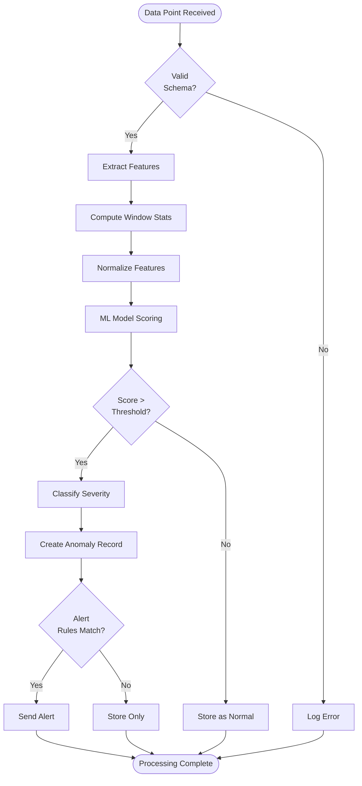
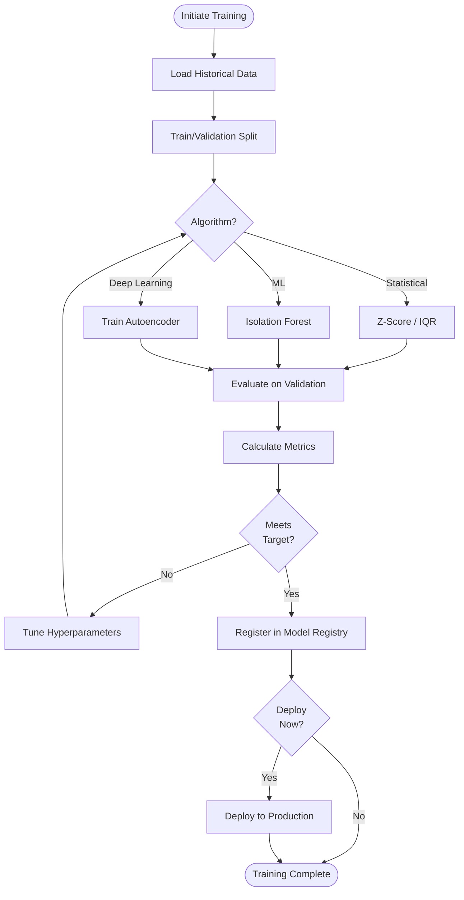
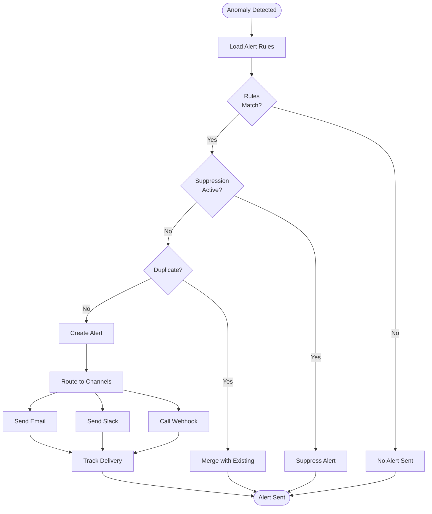

# Activity Diagram - Anomaly Detection System

## 1. Real-Time Detection Pipeline

```mermaid
flowchart TD
    Start([Data Point Received]) --> Validate{Valid<br/>Schema?}
    Validate -->|No| Log[Log Error]
    Validate -->|Yes| Extract[Extract Features]
    
    Extract --> Window[Compute Window Stats]
    Window --> Normalize[Normalize Features]
    
    Normalize --> Score[ML Model Scoring]
    Score --> Threshold{Score ><br/>Threshold?}
    
    Threshold -->|No| Store[Store as Normal]
    Threshold -->|Yes| Classify[Classify Severity]
    
    Classify --> CreateAnomaly[Create Anomaly Record]
    CreateAnomaly --> CheckRules{Alert<br/>Rules Match?}
    
    CheckRules -->|Yes| SendAlert[Send Alert]
    CheckRules -->|No| StoreOnly[Store Only]
    
    SendAlert --> End([Processing Complete])
    StoreOnly --> End
    Store --> End
    Log --> End
```

---

## 2. Model Training Workflow

```mermaid
flowchart TD
    Start([Initiate Training]) --> LoadData[Load Historical Data]
    LoadData --> Split[Train/Validation Split]
    
    Split --> SelectAlgo{Algorithm?}
    
    SelectAlgo -->|Statistical| ZScore[Z-Score / IQR]
    SelectAlgo -->|ML| IsolationForest[Isolation Forest]
    SelectAlgo -->|Deep Learning| Autoencoder[Train Autoencoder]
    
    ZScore --> Evaluate[Evaluate on Validation]
    IsolationForest --> Evaluate
    Autoencoder --> Evaluate
    
    Evaluate --> Metrics[Calculate Metrics]
    Metrics --> Acceptable{Meets<br/>Target?}
    
    Acceptable -->|No| Tune[Tune Hyperparameters]
    Tune --> SelectAlgo
    
    Acceptable -->|Yes| Register[Register in Model Registry]
    Register --> Deploy{Deploy<br/>Now?}
    
    Deploy -->|Yes| Production[Deploy to Production]
    Deploy -->|No| End([Training Complete])
    Production --> End
```

---

## 3. Alert Processing Flow

```mermaid
flowchart TD
    Start([Anomaly Detected]) --> LoadRules[Load Alert Rules]
    LoadRules --> MatchRules{Rules<br/>Match?}
    
    MatchRules -->|No| NoAlert[No Alert Sent]
    MatchRules -->|Yes| CheckSuppression{Suppression<br/>Active?}
    
    CheckSuppression -->|Yes| Suppress[Suppress Alert]
    CheckSuppression -->|No| Dedup{Duplicate?}
    
    Dedup -->|Yes| Merge[Merge with Existing]
    Dedup -->|No| CreateAlert[Create Alert]
    
    CreateAlert --> Route[Route to Channels]
    Route --> Email[Send Email]
    Route --> Slack[Send Slack]
    Route --> Webhook[Call Webhook]
    
    Email --> TrackDelivery[Track Delivery]
    Slack --> TrackDelivery
    Webhook --> TrackDelivery
    
    TrackDelivery --> End([Alert Sent])
    Merge --> End
    Suppress --> End
    NoAlert --> End
```
