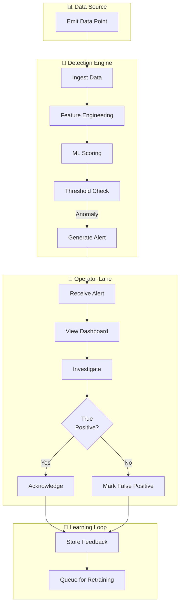
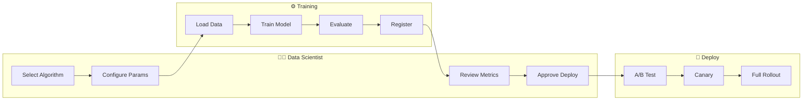

# BPMN / Swimlane Diagram - Anomaly Detection System

## End-to-End Anomaly Handling

---

## Model Training & Deployment

## Purpose and Scope
Defines cross-team handoffs across automation, analyst operations, compliance, and customer communication.

## Assumptions and Constraints
- Swimlanes map to real teams with 24x7 ownership routing.
- Handoff timers are contractual and alertable.
- Compensation steps are required for partial failures.

### End-to-End Example with Realistic Data
For high-value transfer `TR-5541`, automation lane applies hold, analyst lane verifies identity, compliance lane approves/denies release, and customer ops lane sends notification. If compliance unavailable >15 min, escalation lane pages duty manager.

## Decision Rationale and Alternatives Considered
- Used BPMN events for timer/escalation clarity across teams.
- Rejected informal checklist because it lacked handoff observability.
- Included compensation path for mistaken holds to minimize customer harm.

## Failure Modes and Recovery Behaviors
- Analyst queue saturation -> overflow routing to secondary region team.
- Compliance API unavailable -> queue decision task with SLA countdown visible to ops.

## Security and Compliance Implications
- Inter-lane artifacts include least-privilege evidence views by lane.
- Customer notifications avoid sensitive reason-code disclosure.

## Operational Runbooks and Observability Notes
- Lane SLA dashboard highlights bottleneck owner in real time.
- Runbook specifies manual continuity mode per lane during tool outages.
