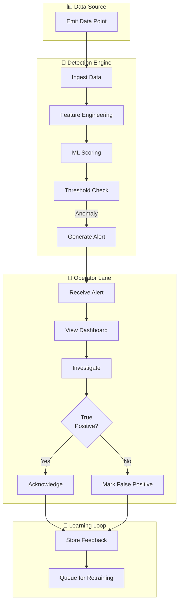
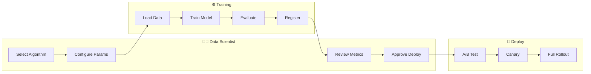

# BPMN / Swimlane Diagram - Anomaly Detection System

## End-to-End Anomaly Handling

```mermaid
flowchart TB
    subgraph Source["📊 Data Source"]
        S1[Emit Data Point]
    end
    
    subgraph System["🤖 Detection Engine"]
        SYS1[Ingest Data]
        SYS2[Feature Engineering]
        SYS3[ML Scoring]
        SYS4[Threshold Check]
        SYS5[Generate Alert]
    end
    
    subgraph Operator["👤 Operator Lane"]
        OP1[Receive Alert]
        OP2[View Dashboard]
        OP3[Investigate]
        OP4{True<br/>Positive?}
        OP5[Acknowledge]
        OP6[Mark False Positive]
    end
    
    subgraph Feedback["🔄 Learning Loop"]
        FB1[Store Feedback]
        FB2[Queue for Retraining]
    end
    
    S1 --> SYS1
    SYS1 --> SYS2
    SYS2 --> SYS3
    SYS3 --> SYS4
    SYS4 -->|Anomaly| SYS5
    SYS5 --> OP1
    
    OP1 --> OP2
    OP2 --> OP3
    OP3 --> OP4
    OP4 -->|Yes| OP5
    OP4 -->|No| OP6
    
    OP5 --> FB1
    OP6 --> FB1
    FB1 --> FB2
```

---

## Model Training & Deployment

```mermaid
flowchart LR
    subgraph DS["👨‍💻 Data Scientist"]
        DS1[Select Algorithm]
        DS2[Configure Params]
        DS3[Review Metrics]
        DS4[Approve Deploy]
    end
    
    subgraph Train["⚙️ Training"]
        T1[Load Data]
        T2[Train Model]
        T3[Evaluate]
        T4[Register]
    end
    
    subgraph Deploy["🚀 Deploy"]
        D1[A/B Test]
        D2[Canary]
        D3[Full Rollout]
    end
    
    DS1 --> DS2
    DS2 --> T1
    T1 --> T2
    T2 --> T3
    T3 --> T4
    T4 --> DS3
    DS3 --> DS4
    DS4 --> D1
    D1 --> D2
    D2 --> D3
```
