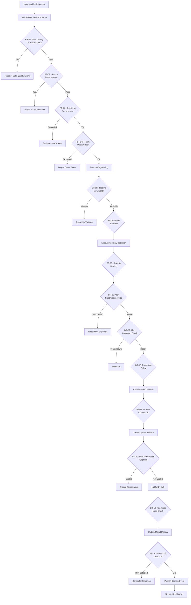

# Business Rules — Anomaly Detection System

**Version:** 1.0  
**Status:** Approved  
**Last Updated:** 2025-01-01  

---

## Table of Contents

1. [Overview](#1-overview)
2. [Rule Evaluation Pipeline](#2-rule-evaluation-pipeline)
3. [Enforceable Rules](#3-enforceable-rules)
4. [Exception and Override Handling](#4-exception-and-override-handling)
5. [Rule Precedence Matrix](#5-rule-precedence-matrix)
6. [Traceability Table](#6-traceability-table)

---

## 1. Overview

This document defines the enforceable business rules governing the Anomaly Detection System's behavior. These rules are platform-level invariants that apply across all detection models, data sources, and alert channels. Rules are evaluated at specific pipeline stages (data ingestion, feature engineering, model scoring, alert generation, incident management) and are enforced by designated services.

**Purpose and Scope:**
Business rules provide deterministic policy-based decision making that augments, constrains, or overrides machine learning model outputs. Rules ensure compliance with SLAs, regulatory requirements, operational safety constraints, and business continuity requirements.

**Assumptions and Constraints:**
- Rules are versioned artifacts stored in Git with approval workflow and rollback capability
- Rule engine supports full explainability by emitting matched conditions and precedence chain
- Rules can short-circuit model scoring for known high-confidence scenarios
- Rules are tenant-scoped with capability for global platform-level overrides
- Rule evaluation latency must not exceed 5ms per data point

---

## 2. Rule Evaluation Pipeline



---

## 3. Enforceable Rules

---

### BR-01 — Data Quality Threshold Enforcement

**Category:** Data Validation  
**Enforcer:** Ingestion Service / Stream Processor  
**Priority:** P0 (Mandatory)

Every incoming metric data point MUST pass schema validation and data quality checks before entering the detection pipeline. Data points with missing required fields (timestamp, metric_name, value, source_id), malformed timestamps, non-numeric values for numeric metrics, or values outside configured physical bounds are rejected immediately.

**Rule Logic:**
```python
REJECT if:
  - timestamp is null OR not ISO-8601 UTC format
  - metric_value is null OR not parseable as float64
  - metric_name is empty OR not in registered metric catalog
  - source_id is empty OR not registered
  - metric_value < physical_min_bound OR metric_value > physical_max_bound
  - data_point_latency > max_acceptable_latency (default: 5 minutes)

ALLOW otherwise and proceed to feature engineering
```

**Exceptions:** 
- Platform health metrics bypass physical bounds validation
- Backfill operations accept data points up to 90 days old

**Audit:** Every rejected data point is logged with rejection reason to `data_quality_violations` table for analysis.

**Example:**
Data point `{timestamp: "2025-01-15T10:30:00Z", metric: "cpu.utilization", value: 150.5, source: "srv-001"}` is rejected because CPU utilization cannot exceed 100%. Ingestion service emits `DataQualityViolation` event with reason code `VALUE_EXCEEDS_PHYSICAL_BOUND`.

---

### BR-02 — Data Source Authentication

**Category:** Security  
**Enforcer:** API Gateway / Auth Service  
**Priority:** P0 (Mandatory)

Every data source MUST authenticate using a valid API key or JWT token scoped to the specific project and environment. Unauthenticated requests are rejected with HTTP 401. Tokens with expired validity, revoked status, or insufficient capability scope are rejected with HTTP 403.

**Rule Logic:**
```python
ALLOW if:
  - api_key.tenant_id == request.tenant_id
  - api_key.project_id == request.project_id
  - api_key.environment_id == request.environment_id
  - api_key.capabilities includes "metrics:write"
  - api_key.status == "active"
  - api_key.expires_at > now() OR api_key.expires_at is null

DENY with HTTP 403 otherwise and emit SecurityAuditEvent
```

**Exceptions:** Platform system metrics from internal monitoring agents use service account credentials with `platform:monitor` scope.

**Audit:** Every authentication failure is logged to security audit log with source IP, attempted resource, and failure reason.

---

### BR-03 — Rate Limit Enforcement

**Category:** Resilience  
**Enforcer:** API Gateway / Rate Limiter  
**Priority:** P1 (High)

Data sources are subject to rate limits based on their subscription tier and configured quotas. Rate limits are enforced per source per minute using token bucket algorithm. When rate limit is exceeded, requests receive HTTP 429 with `Retry-After` header.

**Rule Logic:**
```python
Buckets per source:
  - Free tier: 100 data points/minute
  - Starter tier: 1,000 data points/minute
  - Pro tier: 10,000 data points/minute
  - Enterprise tier: 100,000 data points/minute (configurable)

ALLOW if:
  - token_bucket[source_id].consume(1) succeeds

REJECT with HTTP 429 and backpressure signal if bucket exhausted
```

**Exceptions:** 
- Burst allowance of 2x rate for up to 10 seconds
- Platform-critical metrics bypass rate limits

**Recovery:** Token buckets refill at constant rate; clients implement exponential backoff.

---

### BR-04 — Tenant Quota Enforcement

**Category:** Resource Management  
**Enforcer:** Quota Service  
**Priority:** P1 (High)

Each tenant has allocated quotas for storage (time-series data retention), compute (model training hours), and alerts (notifications per month). When a quota dimension is exceeded, the system applies graceful degradation: oldest data is archived, new training jobs are queued, and alert delivery is throttled.

**Rule Logic:**
```python
Check before operation:
  - storage_used + new_data_size <= storage_quota
  - training_hours_used_this_month + estimated_hours <= training_quota
  - alerts_sent_this_month + 1 <= alert_quota

If quota exceeded:
  - Storage: Archive data older than retention_policy (30/60/90 days)
  - Training: Queue job with priority based on criticality
  - Alerts: Apply alert sampling (critical only)

Emit QuotaExceededEvent for billing and notification
```

**Exceptions:** 
- Enterprise tier has unlimited quotas (soft limits with alert)
- Critical alerts bypass alert quota for first 24 hours of incident

---

### BR-05 — Baseline Availability Check

**Category:** Model Readiness  
**Enforcer:** Detection Engine  
**Priority:** P1 (High)

Anomaly detection requires a trained baseline representing normal behavior. If no baseline exists for a metric stream, or if the baseline is stale (older than 7 days without update), the system must either queue the metric for baseline training or use a generic fallback model.

**Rule Logic:**
```python
For each metric stream:
  baseline = get_latest_baseline(metric_stream_id)
  
  if baseline is null:
    - Queue metric stream for baseline training
    - Use rule-based anomaly detection (z-score threshold)
    - Emit BaselineMissingEvent
  
  elif baseline.updated_at < now() - 7 days:
    - Schedule baseline refresh
    - Continue using existing baseline with staleness warning
    - Emit BaselineStaleEvent
  
  else:
    - Proceed with model-based detection
```

**Exceptions:** 
- Metrics with `no_baseline_required` flag use rule-based detection only
- New metric streams get 7-day grace period before baseline enforcement

---

### BR-06 — Model Selection Strategy

**Category:** Detection Logic  
**Enforcer:** Model Router  
**Priority:** P2 (Medium)

Different anomaly types require different detection algorithms. The system selects the appropriate model based on metric characteristics (seasonality, trend, volatility, cardinality) and configured model preferences.

**Rule Logic:**
```python
Select model based on metric profile:

if metric.has_strong_seasonality and metric.seasonal_period_known:
  - Use Prophet or STL decomposition
  
elif metric.is_high_cardinality (>1000 unique series):
  - Use Isolation Forest or LSTM autoencoder
  
elif metric.is_volatile (coefficient_of_variation > 0.5):
  - Use robust statistics (MAD, IQR)
  
elif metric.requires_real_time (latency_sla < 1s):
  - Use Z-score or moving percentile
  
else:
  - Use ensemble approach (combine Z-score + Isolation Forest)

Tenant can override with model_preference configuration
```

**Exceptions:** 
- User can force specific model via API parameter `?model=prophet`
- A/B testing mode runs multiple models in parallel

---

### BR-07 — Severity Scoring and Threshold Classification

**Category:** Alert Prioritization  
**Enforcer:** Scoring Service  
**Priority:** P0 (Mandatory)

Every detected anomaly is assigned a severity score (0.0–1.0) based on deviation magnitude, business impact, and historical context. Severity scores are mapped to alert levels: Critical (≥0.9), High (0.7–0.89), Medium (0.5–0.69), Low (<0.5).

**Rule Logic:**
```python
Calculate severity score:
  base_score = min(abs(z_score) / 10.0, 1.0)
  
  # Adjust for business context
  if metric.is_business_critical:
    base_score *= 1.2
  
  if metric.has_recent_incidents (last 24h):
    base_score *= 1.1
  
  if deviation_duration > 5 minutes:
    base_score *= 1.1
  
  severity_score = min(base_score, 1.0)
  
  # Map to alert level
  if severity_score >= 0.9:
    alert_level = "CRITICAL"
  elif severity_score >= 0.7:
    alert_level = "HIGH"
  elif severity_score >= 0.5:
    alert_level = "MEDIUM"
  else:
    alert_level = "LOW"
```

**Exceptions:** 
- User-defined custom scoring functions override default calculation
- Regulatory metrics (compliance, security) auto-escalate to HIGH minimum

**Example:**
Metric `payment.success_rate` drops from 99.5% to 85% (z-score = -4.8). Base score = 0.48. Business critical multiplier (1.2) → 0.576. Recent incident multiplier (1.1) → 0.634. Final severity = 0.634 → MEDIUM alert. However, payment metrics have custom scoring that escalates to CRITICAL when success rate < 90%, so final alert level = CRITICAL.

---

### BR-08 — Alert Suppression Rules

**Category:** Alert Fatigue Prevention  
**Enforcer:** Alert Manager  
**Priority:** P1 (High)

Alerts can be suppressed during planned maintenance windows, non-business hours (for non-critical alerts), or when matching specific suppression rules. Suppressed alerts are still recorded but do not trigger notifications.

**Rule Logic:**
```python
Suppress alert if:
  - Current time is within active maintenance window
  - Alert level is LOW or MEDIUM and current time is outside business hours
  - Alert matches active alert suppression rule (regex on metric name, tag, or source)
  - Duplicate alert for same metric+source within deduplication window (5 minutes)
  - Source is in "learning mode" (first 24 hours after activation)
  
Record suppressed alert with suppression_reason:
  - Store in anomaly_events table with is_suppressed=true
  - Do NOT create Alert record
  - Do NOT send notifications
  - DO increment suppression metrics for dashboard
```

**Exceptions:** 
- CRITICAL alerts are never suppressed by business hours rules
- Security and compliance alerts bypass all suppression rules

---

### BR-09 — Alert Cooldown Period

**Category:** Alert Fatigue Prevention  
**Enforcer:** Alert Manager  
**Priority:** P1 (High)

After an alert is sent for a specific metric+source combination, subsequent anomalies within the cooldown period do not trigger additional alerts unless severity increases by 2+ levels. Cooldown prevents alert storms during persistent anomaly conditions.

**Rule Logic:**
```python
Cooldown periods by alert level:
  - CRITICAL: 5 minutes
  - HIGH: 15 minutes
  - MEDIUM: 30 minutes
  - LOW: 60 minutes

For new anomaly:
  last_alert = get_last_alert(metric_id, source_id)
  
  if last_alert exists:
    time_since_last = now() - last_alert.sent_at
    
    if time_since_last < cooldown_period(last_alert.level):
      # Check for severity escalation
      if new_severity_level - last_severity_level >= 2:
        SEND alert with note "Escalated from {last_level}"
      else:
        SKIP alert and increment anomaly counter on existing alert
    else:
      SEND alert (cooldown expired)
  else:
    SEND alert (first alert for this metric+source)
```

**Exceptions:** 
- Cooldown can be disabled per metric via configuration flag
- Alert recovery notifications (anomaly resolved) bypass cooldown

---

### BR-10 — Escalation Policy Execution

**Category:** Incident Response  
**Enforcer:** Escalation Service  
**Priority:** P0 (Mandatory)

Alert escalation follows configured escalation chains. If an alert is not acknowledged within the escalation timeout, it is automatically escalated to the next level of the escalation chain (e.g., team → manager → executive).

**Rule Logic:**
```python
For each alert:
  escalation_chain = get_escalation_policy(alert.metric.team)
  
  escalation_levels = [
    {role: "on_call_engineer", timeout: 5 minutes},
    {role: "team_lead", timeout: 10 minutes},
    {role: "engineering_manager", timeout: 15 minutes},
    {role: "vp_engineering", timeout: 30 minutes}
  ]
  
  current_level = 0
  
  while alert.status != "acknowledged" and current_level < len(escalation_levels):
    notify(escalation_levels[current_level].role)
    wait(escalation_levels[current_level].timeout)
    
    if alert.status == "acknowledged":
      break
    
    current_level += 1
    emit_escalation_event(current_level)
  
  if alert.status != "acknowledged" after final level:
    emit_critical_escalation_failure_event()
```

**Exceptions:** 
- User can manually escalate to specific role
- After-hours escalations may skip first level and go directly to on-call

---

### BR-11 — Incident Correlation and Grouping

**Category:** Incident Management  
**Enforcer:** Incident Service  
**Priority:** P2 (Medium)

Multiple related anomalies should be grouped into a single incident to provide unified context and prevent duplicate response efforts. Correlation is based on temporal proximity, shared tags, dependency graphs, and metric correlation.

**Rule Logic:**
```python
For new anomaly:
  candidate_incidents = get_open_incidents(
    time_window=15 minutes,
    same_tenant=true
  )
  
  for incident in candidate_incidents:
    correlation_score = 0
    
    # Temporal correlation
    if abs(anomaly.timestamp - incident.first_anomaly_timestamp) < 5 minutes:
      correlation_score += 0.3
    
    # Tag overlap
    tag_overlap = len(anomaly.tags & incident.tags) / len(anomaly.tags | incident.tags)
    correlation_score += tag_overlap * 0.3
    
    # Dependency graph
    if anomaly.source in incident.dependency_graph:
      correlation_score += 0.4
    
    if correlation_score >= 0.6:
      ADD anomaly to existing incident
      UPDATE incident.severity = max(incident.severity, anomaly.severity)
      EMIT IncidentUpdated event
      RETURN
  
  # No correlation found
  CREATE new incident from anomaly
```

**Exceptions:** 
- User can manually merge or split incidents
- Security incidents never auto-correlate with non-security incidents

---

### BR-12 — Auto-Remediation Eligibility

**Category:** Automation  
**Enforcer:** Remediation Service  
**Priority:** P3 (Low)

Certain well-understood anomaly patterns can trigger automated remediation actions (e.g., auto-scaling, cache clearing, service restart). Auto-remediation is only enabled for pre-approved runbooks with safety guardrails.

**Rule Logic:**
```python
Auto-remediation allowed if:
  - Anomaly matches approved runbook pattern
  - Remediation action has been tested in staging
  - No manual intervention in last 1 hour (prevent flapping)
  - Blast radius is contained (affects <10% of fleet)
  - Tenant has auto_remediation_enabled=true
  - Current time is within auto_remediation_window
  
If eligible:
  - Create remediation task with approval status
  - Execute remediation action
  - Monitor for success/failure
  - Emit RemediationExecuted event
  
If not eligible:
  - Escalate to on-call for manual intervention
```

**Exceptions:** 
- Production environment requires dual approval for new runbooks
- Critical alerts (severity ≥0.9) skip auto-remediation

---

### BR-13 — Feedback Loop Integration

**Category:** Model Improvement  
**Enforcer:** Feedback Service  
**Priority:** P2 (Medium)

User feedback on anomaly accuracy (true positive vs. false positive) is captured and used to retrain models and adjust detection thresholds. Feedback collection is mandatory for all acknowledged alerts.

**Rule Logic:**
```python
When alert is acknowledged:
  PROMPT user for feedback:
    - Is this a true anomaly? (yes/no)
    - What was the root cause? (free text)
    - Should we adjust sensitivity? (higher/lower/no change)
  
  Store feedback:
    - Link to anomaly_event_id
    - Record user_id, timestamp, classification
    - Add to model training dataset
  
  If feedback indicates false positive:
    - Increment false_positive_count for metric+model
    - If false_positive_rate > 0.15:
      - Schedule threshold adjustment
      - Emit ModelDriftAlert
  
  If feedback indicates missed anomaly:
    - Record as training example
    - Lower detection threshold by 5%
```

**Exceptions:** 
- Feedback is optional for LOW severity alerts
- System-generated feedback from auto-remediation outcomes

---

### BR-14 — Model Drift Detection and Retraining Trigger

**Category:** Model Governance  
**Enforcer:** Model Monitor Service  
**Priority:** P1 (High)

Model performance degrades over time due to data drift and concept drift. The system continuously monitors model accuracy metrics and triggers retraining when performance drops below acceptable thresholds.

**Rule Logic:**
```python
For each model version:
  Calculate performance metrics (rolling 7-day window):
    - True positive rate
    - False positive rate
    - Precision, Recall, F1 score
    - Detection latency
  
  Compare to baseline performance:
    baseline = model.baseline_performance
    current = calculate_current_performance()
    
    drift_score = 0
    
    if current.true_positive_rate < baseline.true_positive_rate * 0.85:
      drift_score += 0.4
    
    if current.false_positive_rate > baseline.false_positive_rate * 1.3:
      drift_score += 0.4
    
    if current.f1_score < baseline.f1_score * 0.9:
      drift_score += 0.2
    
    if drift_score >= 0.5:
      SCHEDULE model retraining
      EMIT ModelDriftDetected event
      MARK model version as "degraded"
      
      if drift_score >= 0.8:
        ROLLBACK to previous model version
        EMIT CriticalModelDrift event
```

**Exceptions:** 
- New models (< 7 days old) are exempt from drift detection
- User can manually trigger retraining regardless of drift score

---

### BR-15 — Multi-Tenant Isolation

**Category:** Security  
**Enforcer:** All Services  
**Priority:** P0 (Mandatory)

All data, models, baselines, alerts, and incidents are strictly isolated by tenant_id. No API response, dashboard, or background job can access or leak data across tenant boundaries.

**Rule Logic:**
```python
All database queries MUST include:
  WHERE tenant_id = :authenticated_tenant_id

All cache keys MUST be prefixed with:
  {tenant_id}:{resource_type}:{resource_id}

All message queue topics MUST be partitioned by:
  tenant_id

All model training jobs MUST:
  - Use only data from single tenant
  - Store model artifacts in tenant-scoped storage
  - Apply tenant-specific configuration overrides
```

**Violations:** 
- Any cross-tenant data access is logged as security incident
- Immediate alert to security team
- Automatic service suspension pending investigation

---

## 4. Exception and Override Handling

**Override Authorization:**
- Overrides require `platform:admin` or `tenant:admin` role
- Every override creates audit log entry with: user_id, timestamp, reason, affected_resource
- Overrides are temporary with mandatory expiration (max 72 hours)
- Persistent overrides require change request approval

**Exception Categories:**
1. **Platform Maintenance:** Bypass rate limits and quota enforcement during platform maintenance windows
2. **Emergency Response:** Skip cooldown periods and suppression rules during active incidents
3. **Testing and Validation:** Use separate test mode flag to bypass production safeguards
4. **Regulatory Compliance:** Override certain rules when required by legal/compliance mandates

**Override Process:**
```python
def request_rule_override(rule_id, reason, duration_hours):
  if not user.has_permission("rule:override"):
    raise PermissionDenied
  
  if duration_hours > 72:
    require_approval_workflow()
  
  override = create_override(
    rule_id=rule_id,
    requested_by=user.id,
    reason=reason,
    expires_at=now() + duration_hours,
    status="active"
  )
  
  emit_audit_event("RuleOverrideCreated", override)
  
  # Auto-expire override
  schedule_task(override.expires_at, revoke_override, override.id)
  
  return override
```

**Monitoring:**
- Dashboard showing active overrides by rule and user
- Alert when override count exceeds threshold (>5 concurrent)
- Weekly report of override patterns for rule refinement

---

## 5. Rule Precedence Matrix

When multiple rules apply to the same event, precedence is determined by:

| Priority | Rule Category | Example Rules | Override Allowed |
|----------|---------------|---------------|------------------|
| 1 (Highest) | Security | BR-02, BR-15 | No |
| 2 | Data Quality | BR-01 | Yes (with approval) |
| 3 | Safety Constraints | BR-04, BR-12 | Yes (emergency only) |
| 4 | Detection Logic | BR-05, BR-06, BR-07 | Yes (tenant admin) |
| 5 | Alert Management | BR-08, BR-09, BR-10 | Yes (user preference) |
| 6 | Optimization | BR-11, BR-13 | Yes (user preference) |

**Conflict Resolution:**
- Higher priority rule always wins
- Within same priority, most restrictive rule wins
- Tenant-specific rules override global defaults
- User preferences override system defaults (within safety bounds)

---

## 6. Traceability Table

| Rule ID | Related Requirements | Related Use Cases | Test Cases |
|---------|---------------------|-------------------|------------|
| BR-01 | REQ-DATA-001, REQ-QUAL-002 | UC-01, UC-02 | TC-VAL-001 to TC-VAL-015 |
| BR-02 | REQ-SEC-001, REQ-AUTH-001 | UC-03 | TC-SEC-001 to TC-SEC-010 |
| BR-03 | REQ-PERF-001, REQ-RES-001 | UC-01 | TC-RATE-001 to TC-RATE-005 |
| BR-04 | REQ-QUOTA-001, REQ-BILL-001 | UC-12 | TC-QUOTA-001 to TC-QUOTA-008 |
| BR-05 | REQ-MODEL-001, REQ-TRAIN-001 | UC-05 | TC-BASE-001 to TC-BASE-006 |
| BR-06 | REQ-DETECT-001, REQ-ALG-001 | UC-04, UC-05 | TC-MODEL-001 to TC-MODEL-012 |
| BR-07 | REQ-ALERT-001, REQ-SEV-001 | UC-06 | TC-SEV-001 to TC-SEV-010 |
| BR-08 | REQ-ALERT-002, REQ-FATIGUE-001 | UC-07 | TC-SUPP-001 to TC-SUPP-007 |
| BR-09 | REQ-ALERT-003, REQ-FATIGUE-002 | UC-07 | TC-COOL-001 to TC-COOL-005 |
| BR-10 | REQ-ESC-001, REQ-INCIDENT-001 | UC-08 | TC-ESC-001 to TC-ESC-008 |
| BR-11 | REQ-INCIDENT-002, REQ-CORR-001 | UC-09 | TC-CORR-001 to TC-CORR-006 |
| BR-12 | REQ-AUTO-001, REQ-REMEDIATE-001 | UC-10 | TC-REM-001 to TC-REM-005 |
| BR-13 | REQ-FEEDBACK-001, REQ-IMPROVE-001 | UC-11 | TC-FEED-001 to TC-FEED-004 |
| BR-14 | REQ-MODEL-002, REQ-DRIFT-001 | UC-05 | TC-DRIFT-001 to TC-DRIFT-007 |
| BR-15 | REQ-SEC-002, REQ-TENANT-001 | All | TC-ISO-001 to TC-ISO-012 |

---

## 7. Rule Versioning and Lifecycle

**Version Control:**
- All rules are stored in Git repository with semantic versioning
- Rule changes follow GitOps workflow: PR → Review → Approval → Deploy
- Rule deployment uses blue-green strategy with automated rollback

**Testing Requirements:**
- Unit tests for each rule's logic implementation
- Integration tests for rule combinations and precedence
- Chaos testing for rule evaluation under failure conditions
- Performance tests to ensure <5ms evaluation latency

**Rollback Procedures:**
```bash
# Emergency rule rollback
./scripts/rollback-rules.sh --version=v1.2.3 --reason="High false positive rate"

# Gradual rollout (canary deployment)
./scripts/deploy-rules.sh --version=v1.3.0 --canary=10%
```

**Deprecation Policy:**
- Rules marked for deprecation get 90-day sunset period
- Deprecation warnings logged for affected tenants
- Migration guide provided for rule replacements

---

## 8. Operational Runbooks and Observability

**Key Metrics:**
- `rule_evaluation_latency_p99`: 99th percentile rule evaluation time (target: <5ms)
- `rule_match_rate`: Percentage of events matching each rule
- `rule_override_count`: Number of active overrides by rule
- `rule_conflict_count`: Number of rule conflicts detected
- `false_positive_rate_by_rule`: False positive attributable to each rule

**Dashboards:**
- **Rule Performance Dashboard:** Evaluation latency, match rates, execution counts
- **Override Management Dashboard:** Active overrides, override history, approval status
- **Rule Effectiveness Dashboard:** Impact on alert quality, false positive reduction

**Alerts:**
- `RuleEvaluationLatencyHigh`: P99 latency >10ms for 5 minutes
- `RuleMatchRateAnomaly`: Sudden spike/drop in rule match rate
- `TooManyActiveOverrides`: >10 concurrent overrides active
- `RuleConflictDetected`: Conflicting rules triggered simultaneously

**Runbooks:**
- **RB-RULE-01:** High rule evaluation latency → Scale rule engine, optimize rule logic
- **RB-RULE-02:** Rule conflict detected → Review precedence matrix, consolidate rules
- **RB-RULE-03:** Override abuse detected → Audit user activity, review permissions

---

**Document Approval:**
- **Author:** Platform Architecture Team
- **Reviewers:** Security Team, ML Engineering, Operations
- **Approved By:** VP Engineering
- **Next Review:** 2025-04-01
