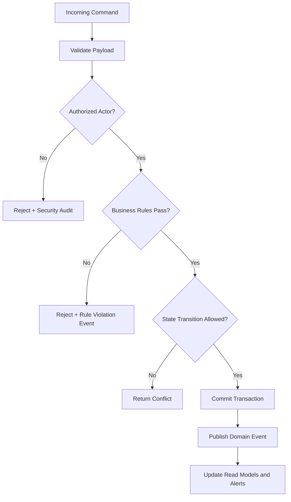

# Business Rules

This document defines enforceable policy rules for **Anomaly Detection System** so command processing, asynchronous jobs, and operational actions behave consistently under normal and exceptional conditions.

## Context
- Domain focus: anomaly detection workflows.
- Rule categories: lifecycle transitions, authorization, compliance, and resilience.
- Enforcement points: APIs, workflow/state engines, background processors, and administrative consoles.

## Enforceable Rules
1. Every state-changing command must pass authentication, authorization, and schema validation before processing.
2. Lifecycle transitions must follow the configured state graph; invalid transitions are rejected with explicit reason codes.
3. High-impact operations (financial, security, or regulated data actions) require additional approval evidence.
4. Manual overrides must include approver identity, rationale, and expiration timestamp.
5. Retries and compensations must be idempotent and must not create duplicate business effects.

## Rule Evaluation Pipeline

## Exception and Override Handling
- Overrides are restricted to approved exception classes and require dual logging (business + security audit).
- Override windows automatically expire and trigger follow-up verification tasks.
- Repeated override patterns are reviewed for policy redesign and automation improvements.

## Purpose and Scope
Documents deterministic policy rules and precedence used before/after model scoring.

## Assumptions and Constraints
- Rules are versioned artifacts with approval workflow and rollback plan.
- Rule engine supports explainability by emitting matched conditions and precedence chain.
- Rules can short-circuit model scoring for known high-confidence outcomes.

### End-to-End Example with Realistic Data
Rule `BR-07`: if `velocity_5m > 10` and `z_score_amount > 4.5`, set priority P1. `txn_98217` (`velocity_5m=13`, `z=5.8`) triggers immediate escalation and payout hold for 30 minutes pending analyst review.

## Decision Rationale and Alternatives Considered
- Kept rules for high-confidence scenarios to reduce model-only blind spots.
- Rejected globally static thresholds; adopted tenant-specific overrides with guardrails.
- Implemented precedence matrix to prevent contradictory actions.

## Failure Modes and Recovery Behaviors
- Rule collision between tenant override and global default -> precedence matrix resolves and logs conflict.
- Rule churn causes alert noise -> revert to previous rule bundle and enable sampled review.

## Security and Compliance Implications
- High-impact rules require dual approval (Risk + Compliance) before activation.
- Rule changes are signed and immutable for forensic replay.

## Operational Runbooks and Observability Notes
- Rule evaluation latency and match rates are first-class dashboard metrics.
- Runbook includes hotfix rollback of last known-good rule bundle.
