# Event Catalog

This catalog defines stable event contracts for **Anomaly Detection System** to support event-driven integrations, auditability, and analytics across anomaly detection workflows.

## Contract Conventions
- Event naming: `<domain>.<aggregate>.<action>.v1`.
- Required metadata: `event_id`, `occurred_at`, `correlation_id`, `producer`, `schema_version`, `tenant_context`.
- Delivery mode: at-least-once with mandatory consumer idempotency.
- Ordering guarantee: per aggregate key; no global ordering assumption.

## Domain Events
| Event Name | Payload Highlights | Typical Consumers |
|---|---|---|
| `domain.record.created.v1` | record_id, actor_id, initial_state, occurred_at | orchestration, analytics |
| `domain.record.state_changed.v1` | record_id, old_state, new_state, reason_code | notifications, reporting |
| `domain.record.validation_failed.v1` | record_id, violated_rules, correlation_id | operations, quality dashboards |
| `domain.record.override_applied.v1` | record_id, override_type, approver_id, expires_at | compliance, audit |
| `domain.record.closed.v1` | record_id, terminal_state, closed_at | billing/settlement, archives |

## Publish and Consumption Sequence

```mermaid
sequenceDiagram
    participant API as Command Service
    participant DB as Transaction Store
    participant Outbox as Outbox Relay
    participant Bus as Event Bus
    participant Consumer as Downstream Consumer
    API->>DB: Persist state change + outbox row
    Outbox->>DB: Poll committed rows
    Outbox->>Bus: Publish event
    Bus-->>Consumer: Deliver event
    Consumer->>Consumer: Idempotency check + process
    alt Consumer failure
        Consumer->>Bus: NACK
        Bus-->>Consumer: Retry then DLQ
    end
```

## Operational SLOs
- P95 commit-to-publish latency below 5 seconds for tier-1 events.
- DLQ triage acknowledgement within 15 minutes for production incidents.
- Schema changes remain backward compatible within the same major version.

## Purpose and Scope
Catalogs domain events, versions, payload contracts, producers, consumers, and lifecycle policies.

## Assumptions and Constraints
- Event names are stable and semantically meaningful.
- Versioning uses additive-first strategy with deprecation windows.
- Each event lists idempotency and ordering expectations.

### End-to-End Example with Realistic Data
`anomaly.detected.v1` producer `scoring-service`, consumers `case-service`, `notification-service`; payload includes `score`, `severity`, `reason_codes`, `trace_id`; expected consumer ack p95 < 500 ms.

## Decision Rationale and Alternatives Considered
- Formalized producer/consumer ownership to reduce orphan topics.
- Rejected silent payload changes; mandated schema evolution policy.
- Included replay and backfill semantics per event type.

## Failure Modes and Recovery Behaviors
- Consumer lag exceeds threshold -> autoscale consumer group and optionally pause non-critical producers.
- Unknown event version observed -> route to compatibility handler and alert integration owner.

## Security and Compliance Implications
- Catalog marks which events can contain regulated identifiers.
- Cross-border event routing constraints documented per topic.

## Operational Runbooks and Observability Notes
- Kafka lag, retry, and DLQ metrics are grouped by event contract ID.
- Runbook includes safe reprocessing steps by event type.
