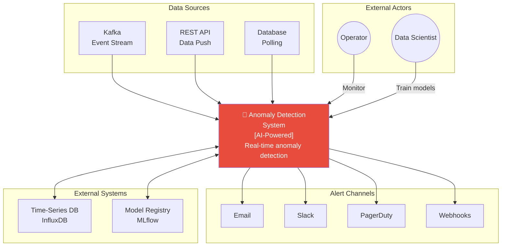

# System Context Diagram - Anomaly Detection System

## System Boundaries

### Inside the System
- Data ingestion & processing
- Feature engineering
- Anomaly detection (ML models)
- Alert generation & routing
- Dashboard & visualization
- Model training & deployment

### Outside the System
- Data source management
- Root cause remediation
- User authentication (SSO)
- Third-party integrations
