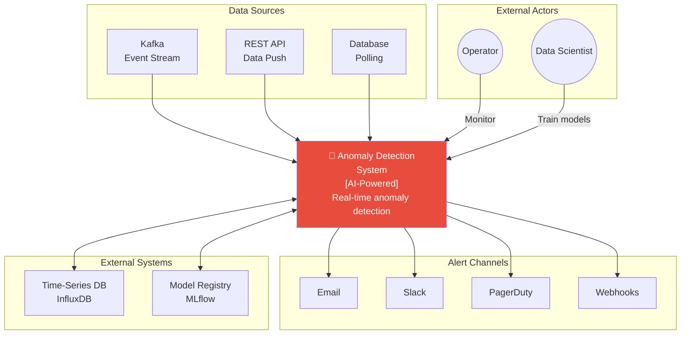

# System Context Diagram - Anomaly Detection System

```mermaid
graph TB
    subgraph "External Actors"
        OP((Operator))
        DS((Data Scientist))
    end
    
    ADS["🚨 Anomaly Detection<br/>System<br/>[AI-Powered]<br/>Real-time anomaly detection"]
    
    subgraph "Data Sources"
        KAFKA[Kafka<br/>Event Stream]
        API_SRC[REST API<br/>Data Push]
        DB_SRC[Database<br/>Polling]
    end
    
    subgraph "Alert Channels"
        EMAIL[Email]
        SLACK[Slack]
        PAGER[PagerDuty]
        WEBHOOK[Webhooks]
    end
    
    subgraph "External Systems"
        TS_DB[Time-Series DB<br/>InfluxDB]
        MODEL_REG[Model Registry<br/>MLflow]
    end
    
    KAFKA --> ADS
    API_SRC --> ADS
    DB_SRC --> ADS
    
    OP -->|Monitor| ADS
    DS -->|Train models| ADS
    
    ADS --> EMAIL
    ADS --> SLACK
    ADS --> PAGER
    ADS --> WEBHOOK
    
    ADS <--> TS_DB
    ADS <--> MODEL_REG
    
    style ADS fill:#e74c3c,color:#fff
```

## System Boundaries

### Inside the System
- Data ingestion & processing
- Feature engineering
- Anomaly detection (ML models)
- Alert generation & routing
- Dashboard & visualization
- Model training & deployment

### Outside the System
- Data source management
- Root cause remediation
- User authentication (SSO)
- Third-party integrations

## Purpose and Scope
Clarifies system boundary, external actors, and integration contracts at enterprise level.

## Assumptions and Constraints
- Every external integration has a contract owner and compatibility policy.
- Inbound domains are treated untrusted until schema+auth pass.
- Outbound integrations are async unless strict sync needed.

### End-to-End Example with Realistic Data
SIEM sends `login_failed` events and payment gateway sends settlement events into ingestion boundary; anomaly platform emits incidents to ticketing and SOC webhook endpoints with trace correlation IDs.

## Decision Rationale and Alternatives Considered
- Separated trust boundaries explicitly to guide network/IAM policy.
- Rejected direct producer-to-model coupling; enforced ingress gateway pattern.
- Kept context minimal while referencing deeper container docs for internals.

## Failure Modes and Recovery Behaviors
- Third-party partner sends malformed payload burst -> routed to quarantine topic with producer-level error budget alert.
- Ticketing webhook failure -> durable retry queue with dead-letter escalation.

## Security and Compliance Implications
- Context edges annotate authentication mode (mTLS/OAuth/service account).
- Data residency constraints are represented on outbound edges by region.

## Operational Runbooks and Observability Notes
- Integration health board tracks per-partner success/error rates.
- Runbook includes contract freeze and compatibility rollback steps.
