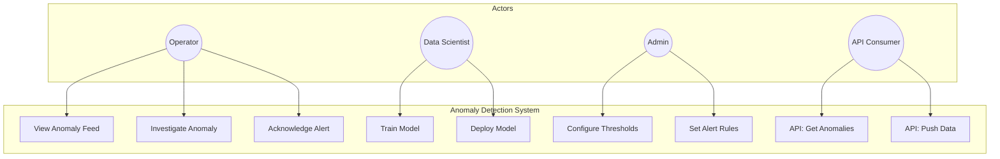

# Use Case Diagram - Anomaly Detection System

## Actor Summary

| Actor | Primary Actions |
|-------|----------------|
| Operator | Monitor anomalies, acknowledge alerts |
| Data Scientist | Train and deploy ML models |
| System Admin | Configure thresholds, alert routing |
| API Consumer | Integrate via REST API |
