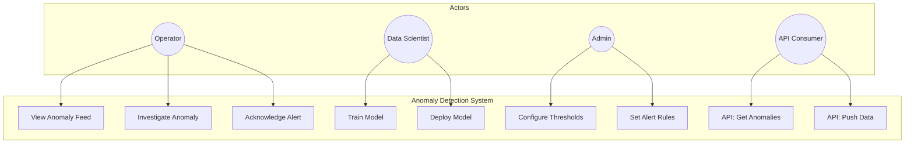

# Use Case Diagram - Anomaly Detection System

```mermaid
graph TB
    subgraph Actors
        OP((Operator))
        DS((Data Scientist))
        ADMIN((Admin))
        API((API Consumer))
    end
    
    subgraph "Anomaly Detection System"
        UC1[View Anomaly Feed]
        UC2[Investigate Anomaly]
        UC3[Acknowledge Alert]
        UC4[Train Model]
        UC5[Deploy Model]
        UC6[Configure Thresholds]
        UC7[Set Alert Rules]
        UC8[API: Get Anomalies]
        UC9[API: Push Data]
    end
    
    OP --> UC1
    OP --> UC2
    OP --> UC3
    DS --> UC4
    DS --> UC5
    ADMIN --> UC6
    ADMIN --> UC7
    API --> UC8
    API --> UC9
```

## Actor Summary

| Actor | Primary Actions |
|-------|----------------|
| Operator | Monitor anomalies, acknowledge alerts |
| Data Scientist | Train and deploy ML models |
| System Admin | Configure thresholds, alert routing |
| API Consumer | Integrate via REST API |

## Purpose and Scope
Summarizes actor goals and top-level system capabilities for anomaly workflows.

## Assumptions and Constraints
- Actor set is complete for current release scope.
- Each use case links to one detailed description file section.
- System responsibilities are separated from human responsibilities.

### End-to-End Example with Realistic Data
Actor “Event Source” triggers `Detect Anomaly`; actor “Risk Analyst” performs `Investigate Alert`; actor “Compliance Officer” performs `Approve/Reject Regulatory Hold`; actor “ML Engineer” performs `Review Drift`.

## Decision Rationale and Alternatives Considered
- Kept use-case boundary strict to avoid implementation leakage.
- Rejected combining admin and analyst roles to preserve least-privilege semantics.
- Added include/extend relationships for escalation and re-open scenarios.

## Failure Modes and Recovery Behaviors
- Missing actor for operational override -> use-case model update required before release.
- Ambiguous include relationship -> corrected in review to prevent mis-scoped implementations.

## Security and Compliance Implications
- Use-case actions requiring privileged data are annotated with role constraints.
- Audit checkpoints are attached to high-risk use cases.

## Operational Runbooks and Observability Notes
- Coverage matrix checks each use case has owning team and SLA.
- Runbook references use-case IDs for incident communication clarity.
