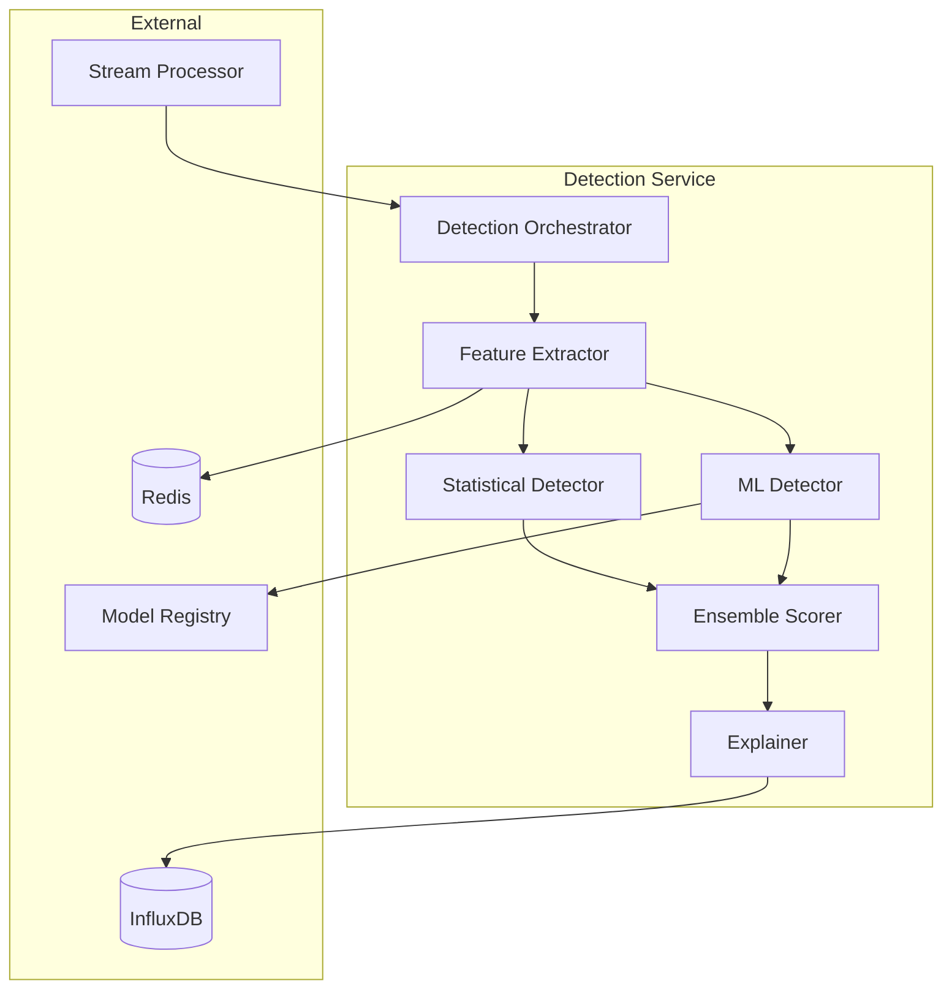
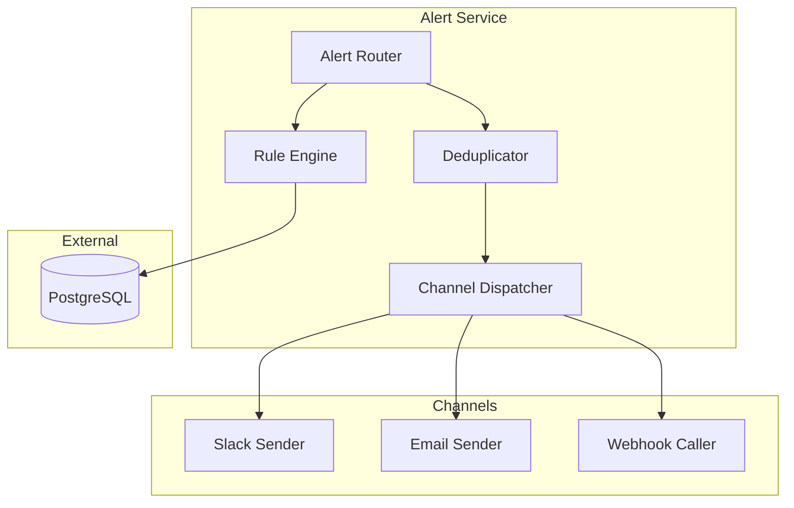

# C4 Component Diagram - Anomaly Detection System

## Detection Service Components

## Alert Service Components

**Component Descriptions**:
- **Detection Orchestrator**: Coordinate detection pipeline
- **Feature Extractor**: Compute statistical features
- **Statistical Detector**: Z-score, IQR-based detection
- **ML Detector**: Isolation Forest, Autoencoder
- **Ensemble Scorer**: Combine multiple model scores
- **Explainer**: Generate human-readable explanations
- **Alert Router**: Match anomalies to rules
- **Rule Engine**: Evaluate alert conditions
- **Deduplicator**: Prevent duplicate alerts
