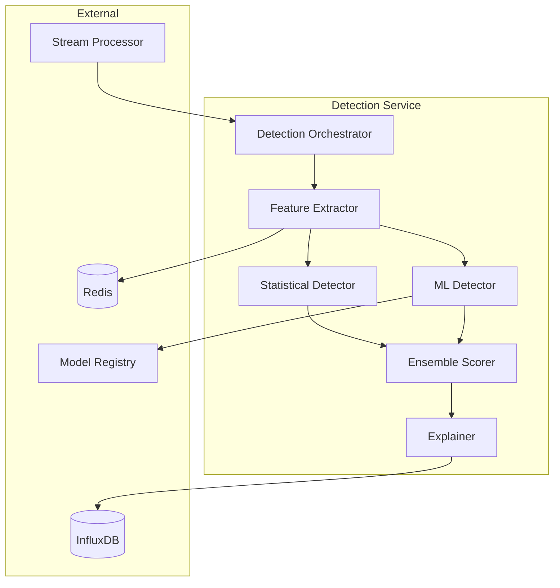
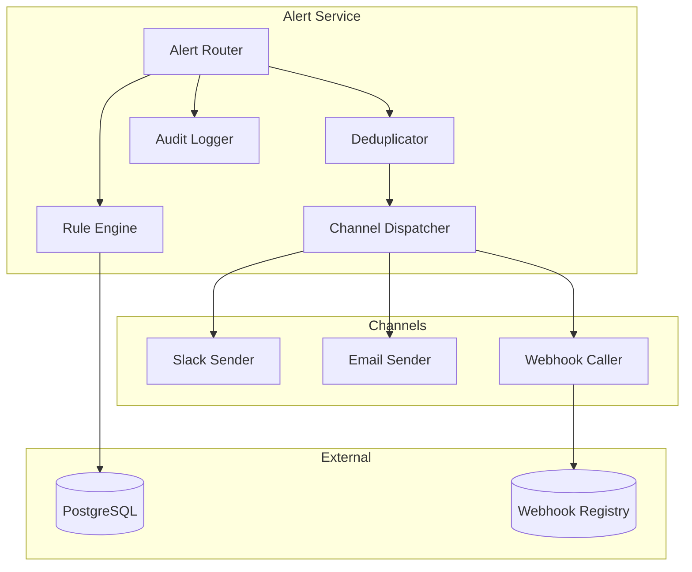

# C4 Component Diagram - Anomaly Detection System

## Detection Service Components

```mermaid
graph TB
    subgraph "Detection Service"
        ORCH[Detection Orchestrator]
        FEATURE[Feature Extractor]
        STAT[Statistical Detector]
        ML[ML Detector]
        ENSEMBLE[Ensemble Scorer]
        EXPLAIN[Explainer]
    end
    
    subgraph "External"
        STREAM[Stream Processor]
        CACHE[(Redis)]
        MODELS[Model Registry]
        DB[(InfluxDB)]
    end
    
    STREAM --> ORCH
    ORCH --> FEATURE
    FEATURE --> CACHE
    FEATURE --> STAT
    FEATURE --> ML
    STAT --> ENSEMBLE
    ML --> ENSEMBLE
    ML --> MODELS
    ENSEMBLE --> EXPLAIN
    EXPLAIN --> DB
```

## Alert Service Components

```mermaid
graph TB
    subgraph "Alert Service"
        ROUTER[Alert Router]
        RULES[Rule Engine]
        DEDUP[Deduplicator]
        CHANNELS[Channel Dispatcher]
        AUDIT[Audit Logger]
    end
    
    subgraph "Channels"
        SLACK[Slack Sender]
        EMAIL[Email Sender]
        WEBHOOK[Webhook Caller]
    end
    
    subgraph "External"
        DB[(PostgreSQL)]
        WH_REG[(Webhook Registry)]
    end
    
    ROUTER --> RULES
    ROUTER --> DEDUP
    DEDUP --> CHANNELS
    CHANNELS --> SLACK
    CHANNELS --> EMAIL
    CHANNELS --> WEBHOOK
    RULES --> DB
    ROUTER --> AUDIT
    WEBHOOK --> WH_REG
```

**Component Descriptions**:
- **Detection Orchestrator**: Coordinate detection pipeline
- **Feature Extractor**: Compute statistical features
- **Statistical Detector**: Z-score, IQR-based detection
- **ML Detector**: Isolation Forest, Autoencoder
- **Ensemble Scorer**: Combine multiple model scores
- **Explainer**: Generate human-readable explanations
- **Alert Router**: Match anomalies to rules
- **Rule Engine**: Evaluate alert conditions
- **Deduplicator**: Prevent duplicate alerts
- **Audit Logger**: Record alert actions for compliance

## Purpose and Scope
Shows component-level architecture within the container, including interfaces and responsibilities.

## Assumptions and Constraints
- Each component publishes health and dependency metrics.
- Cross-component communication uses typed contracts.
- Shared libraries are limited to cross-cutting concerns.

### End-to-End Example with Realistic Data
Inside Detection API container: `AuthFilter` validates token, `InputValidator` enforces schema, `ScoringAdapter` executes model call, `AuditLogger` persists signed decision context.

## Decision Rationale and Alternatives Considered
- Separated auth/validation/scoring/audit to isolate failure domains.
- Rejected combined middleware stack that obscured accountability.
- Introduced adapter boundaries to support model backend swaps.

## Failure Modes and Recovery Behaviors
- Auth provider latency spike -> short-lived token cache + circuit-breaker around introspection endpoint.
- Audit sink backpressure -> durable local queue with flush worker.

## Security and Compliance Implications
- Component data contracts label sensitive fields and allowed consumers.
- Audit component uses append-only storage with key rotation.

## Operational Runbooks and Observability Notes
- Component-level dashboards include saturation and error budget burn.
- Runbook contains component restart order and safe-degradation matrix.
