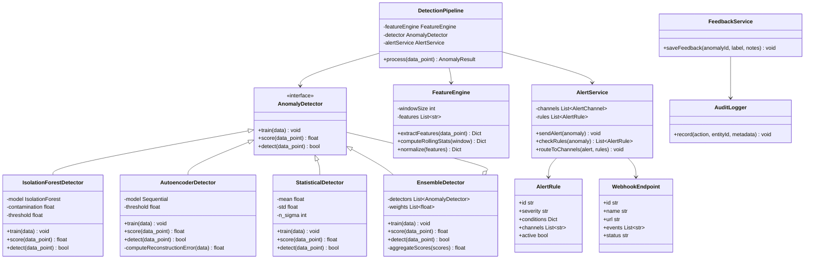
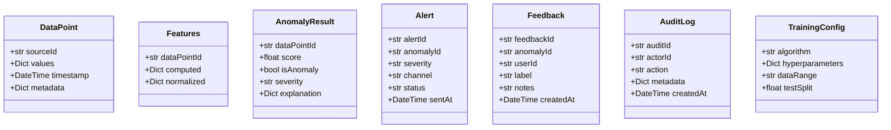

# Class Diagram - Anomaly Detection System

## Python ML Classes

## Data Classes

## Purpose and Scope
Details class-level responsibilities, composition, and invariants inside core scoring and policy modules.

## Assumptions and Constraints
- Domain classes are immutable where possible.
- Service classes coordinate, domain classes decide.
- No cyclic dependencies across packages.

### End-to-End Example with Realistic Data
`AnomalyScorer` composes `FeatureAssembler` and `PolicyEvaluator`; `ScoreResult` value object carries normalized score, reasons, and confidence; `CaseCommandFactory` translates decision to workflow action.

## Decision Rationale and Alternatives Considered
- Used value objects for score/reason payload to reduce primitive obsession.
- Rejected inheritance-heavy hierarchy; favored composition for maintainability.
- Kept policy evaluation separate to allow independent testing and versioning.

## Failure Modes and Recovery Behaviors
- Null/invalid feature set -> `FeatureAssembler` emits typed validation error.
- Rule-policy mismatch -> `PolicyEvaluator` returns deterministic fallback action.

## Security and Compliance Implications
- Class design restricts exposure of sensitive fields via typed wrappers.
- Audit event classes are append-only and signed before persistence.

## Operational Runbooks and Observability Notes
- Coverage report requires branch coverage on policy decision classes.
- Runbook for class-level bugs references owning package and rollback strategy.
