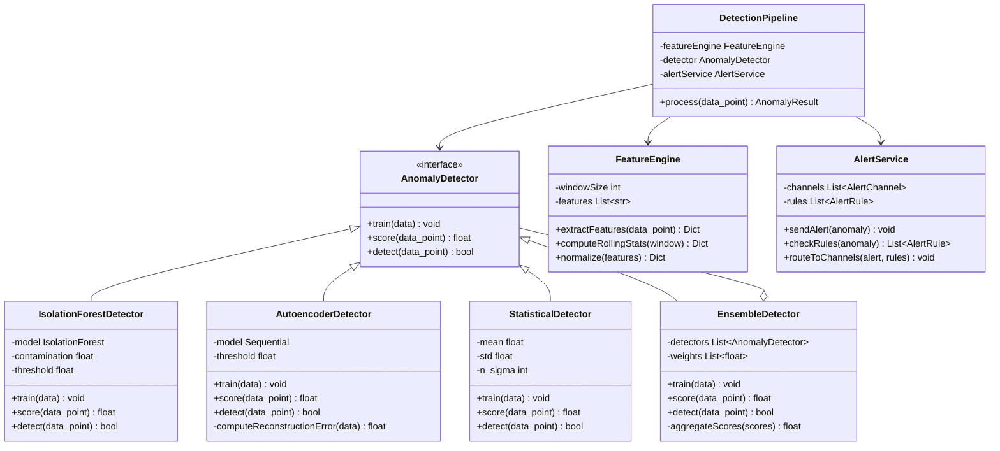
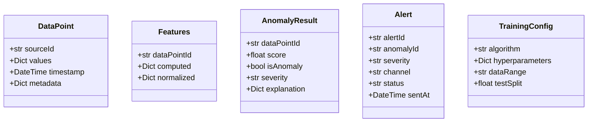

# Class Diagram - Anomaly Detection System

## Python ML Classes

```mermaid
classDiagram
    class AnomalyDetector {
        <<interface>>
        +train(data) void
        +score(data_point) float
        +detect(data_point) bool
    }
    
    class IsolationForestDetector {
        -model IsolationForest
        -contamination float
        -threshold float
        +train(data) void
        +score(data_point) float
        +detect(data_point) bool
    }
    
    class AutoencoderDetector {
        -model Sequential
        -threshold float
        +train(data) void
        +score(data_point) float
        +detect(data_point) bool
        -computeReconstructionError(data) float
    }
    
    class StatisticalDetector {
        -mean float
        -std float
        -n_sigma int
        +train(data) void
        +score(data_point) float
        +detect(data_point) bool
    }
    
    class EnsembleDetector {
        -detectors List~AnomalyDetector~
        -weights List~float~
        +train(data) void
        +score(data_point) float
        +detect(data_point) bool
        -aggregateScores(scores) float
    }
    
    class FeatureEngine {
        -windowSize int
        -features List~str~
        +extractFeatures(data_point) Dict
        +computeRollingStats(window) Dict
        +normalize(features) Dict
    }
    
    class AlertService {
        -channels List~AlertChannel~
        -rules List~AlertRule~
        +sendAlert(anomaly) void
        +checkRules(anomaly) List~AlertRule~
        +routeToChannels(alert, rules) void
    }
    
    class DetectionPipeline {
        -featureEngine FeatureEngine
        -detector AnomalyDetector
        -alertService AlertService
        +process(data_point) AnomalyResult
    }
    
    AnomalyDetector <|-- IsolationForestDetector
    AnomalyDetector <|-- AutoencoderDetector
    AnomalyDetector <|-- StatisticalDetector
    AnomalyDetector <|-- EnsembleDetector
    EnsembleDetector o-- AnomalyDetector
    DetectionPipeline --> FeatureEngine
    DetectionPipeline --> AnomalyDetector
    DetectionPipeline --> AlertService
```

## Data Classes

```mermaid
classDiagram
    class DataPoint {
        +str sourceId
        +Dict values
        +DateTime timestamp
        +Dict metadata
    }
    
    class Features {
        +str dataPointId
        +Dict computed
        +Dict normalized
    }
    
    class AnomalyResult {
        +str dataPointId
        +float score
        +bool isAnomaly
        +str severity
        +Dict explanation
    }
    
    class Alert {
        +str alertId
        +str anomalyId
        +str severity
        +str channel
        +str status
        +DateTime sentAt
    }
    
    class TrainingConfig {
        +str algorithm
        +Dict hyperparameters
        +str dataRange
        +float testSplit
    }
```
