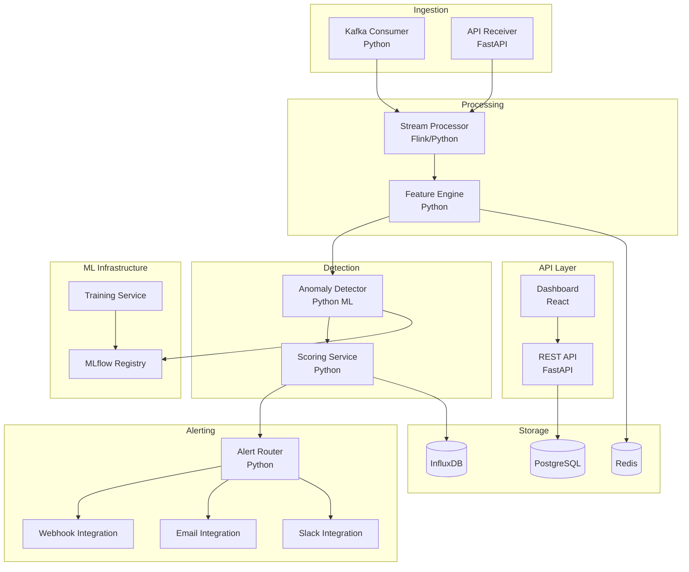

# Component Diagram - Anomaly Detection System

## Component Responsibilities

| Component | Technology | Purpose |
|-----------|------------|---------|
| Kafka Consumer | Python | Consume data streams |
| Stream Processor | Flink/Python | Process streaming data |
| Feature Engine | Python | Compute features |
| Anomaly Detector | scikit-learn, TF | ML inference |
| Alert Router | Python | Route alerts to channels |
| Training Service | Python, MLflow | Train ML models |
| InfluxDB | Time-Series | Store metrics and anomalies |
| PostgreSQL | Database | Store metadata, config |
| Redis | Cache | Cache features, recent data |
