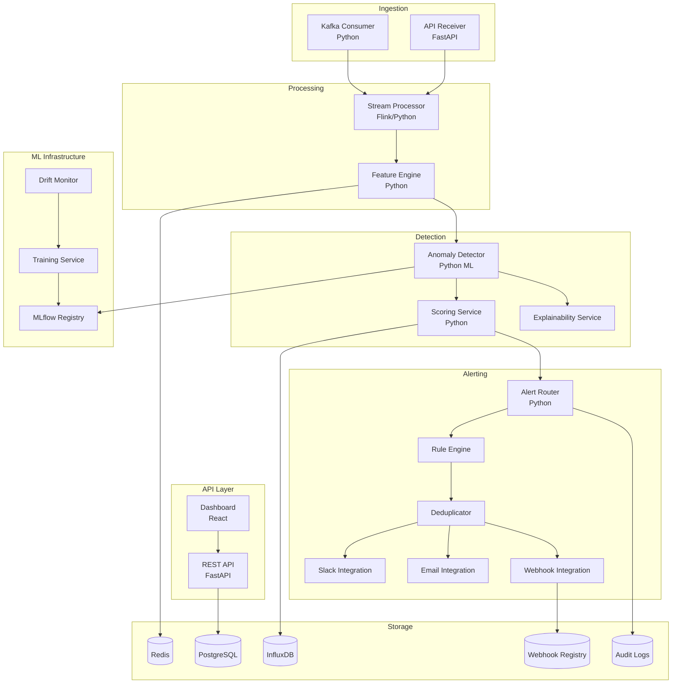

# Component Diagram - Anomaly Detection System

```mermaid
graph TB
    subgraph "API Layer"
        API[REST API<br/>FastAPI]
        DASH[Dashboard<br/>React]
    end
    
    subgraph "Ingestion"
        KAFKA_CONS[Kafka Consumer<br/>Python]
        API_RECV[API Receiver<br/>FastAPI]
    end
    
    subgraph "Processing"
        STREAM[Stream Processor<br/>Flink/Python]
        FEATURE[Feature Engine<br/>Python]
    end
    
    subgraph "Detection"
        DETECTOR[Anomaly Detector<br/>Python ML]
        SCORER[Scoring Service<br/>Python]
        EXPLAIN[Explainability Service]
    end
    
    subgraph "Alerting"
        ROUTER[Alert Router<br/>Python]
        RULES[Rule Engine]
        DEDUP[Deduplicator]
        SLACK_INT[Slack Integration]
        EMAIL_INT[Email Integration]
        WEBHOOK_INT[Webhook Integration]
    end
    
    subgraph "Storage"
        INFLUX[(InfluxDB)]
        PG[(PostgreSQL)]
        REDIS[(Redis)]
        AUDIT[(Audit Logs)]
        WH_REG[(Webhook Registry)]
    end
    
    subgraph "ML Infrastructure"
        MLFLOW[MLflow Registry]
        TRAINER[Training Service]
        MONITOR[Drift Monitor]
    end
    
    KAFKA_CONS --> STREAM
    API_RECV --> STREAM
    STREAM --> FEATURE
    FEATURE --> REDIS
    FEATURE --> DETECTOR
    
    DETECTOR --> MLFLOW
    DETECTOR --> SCORER
    DETECTOR --> EXPLAIN
    SCORER --> INFLUX
    SCORER --> ROUTER
    
    ROUTER --> RULES
    RULES --> DEDUP
    DEDUP --> SLACK_INT
    DEDUP --> EMAIL_INT
    DEDUP --> WEBHOOK_INT
    
    TRAINER --> MLFLOW
    MONITOR --> TRAINER
    API --> PG
    DASH --> API
    ROUTER --> AUDIT
    WEBHOOK_INT --> WH_REG
```

## Component Responsibilities

| Component | Technology | Purpose |
|-----------|------------|---------|
| Kafka Consumer | Python | Consume data streams |
| Stream Processor | Flink/Python | Process streaming data |
| Feature Engine | Python | Compute features |
| Anomaly Detector | scikit-learn, TF | ML inference |
| Alert Router | Python | Route alerts to channels |
| Rule Engine | Python | Match alert rules |
| Deduplicator | Python | Suppress duplicate alerts |
| Training Service | Python, MLflow | Train ML models |
| Drift Monitor | Python | Detect data/model drift |
| InfluxDB | Time-Series | Store metrics and anomalies |
| PostgreSQL | Database | Store metadata, config |
| Redis | Cache | Cache features, recent data |
| Audit Logs | Database | Compliance event records |

## Purpose and Scope
Defines internal components and interactions within detection service boundary.

## Assumptions and Constraints
- Components communicate through clear interfaces and avoid shared mutable state.
- Resilience patterns (retry/circuit breaker) are owned at boundary components.
- Component ownership maps to team ownership.

### End-to-End Example with Realistic Data
`SchemaValidator` -> `EnrichmentAdapter` -> `ScoringAdapter` -> `DecisionPublisher`; malformed event `evt_bad_01` is diverted to DLQ with producer tag and validation code.

## Decision Rationale and Alternatives Considered
- Placed validation at ingress to fail fast and protect downstream capacity.
- Rejected central mega-component to preserve testability and fault isolation.
- Added audit writer as dedicated component to keep evidence immutable.

## Failure Modes and Recovery Behaviors
- Enrichment adapter timeout -> component returns partial profile + risk flag.
- Decision publisher failure -> local outbox persists event for retry.

## Security and Compliance Implications
- Component interfaces define allowed data classes and redaction obligations.
- Secrets access is isolated to specific adapters only.

## Operational Runbooks and Observability Notes
- Component dependency graph is used for blast-radius during incidents.
- Runbook maps alerts directly to component owner and mitigation steps.

## SLA / SLO and Alerting Matrix (Component-Tied)

| Component | SLA | SLO Target | Primary Alerts | Severity/Action |
|---|---|---|---|---|
| Kafka Consumer | 99.9% monthly availability | consumer lag < 60s p95 | lag > 120s (10m), rebalance thrash | Sev2 page data platform |
| Stream Processor | 99.9% | event processing latency < 150ms p95 | checkpoint failures, backlog growth | Sev2 page + autoscale |
| Feature Engine | 99.95% | feature freshness < 120s for 99% | freshness breach, null-rate spike | Sev2 if sustained >15m |
| Anomaly Detector | 99.95% | scoring latency < 180ms p95, error rate < 0.5% | timeout >1%, 5xx burst | Sev1 page ML on-call |
| Scoring Service | 99.95% | end-to-end detect path < 400ms p95 | queue saturation, SLA breach risk | Sev1 if >15m |
| Alert Router/Rule Engine | 99.9% | alert dispatch start < 30s p95 | dispatch backlog, dedup failure | Sev2 page app on-call |
| Channel Integrations | 99.9% | successful delivery ack > 99% | provider error > 3%, retries exhausted | Sev2 + failover channel |
| MLflow Registry | 99.5% | model fetch latency < 200ms p95 | registry unreachability | Sev2; freeze deployments |
| Training Service | 99.5% | scheduled training completion > 98% | failed job ratio > 10% | Sev3 ticket unless active incident |
| Drift Monitor | 99.9% | drift checks complete within 30m cadence | missed drift run x2 | Sev2 page ML ops |
| InfluxDB | 99.95% | write success > 99.9%, query p95 < 250ms | replication lag, write failures | Sev1 if persistent write loss |
| PostgreSQL | 99.95% | commit latency < 50ms p95 | replication lag > 30s, failover event | Sev1 DBA page |
| Redis | 99.95% | cache read p95 < 15ms, hit ratio > 92% | eviction storm, cluster failover | Sev2 page platform |
| Audit Logs | 99.99% durability | ingest loss = 0 | append failures, checksum mismatch | Sev1 compliance incident |

### Alert Routing Policy
- **Sev1**: page immediately, incident commander assigned within 5 minutes.
- **Sev2**: page on-call owning team, acknowledge within 15 minutes.
- **Sev3**: ticket + business-hours triage unless user impact crosses threshold.

### Error Budget Policy
- If a component burns >25% of monthly error budget in 24h, freeze non-critical deployments for that owner team.
- If >50% burn, require reliability review and mitigation plan before any model promotion.
