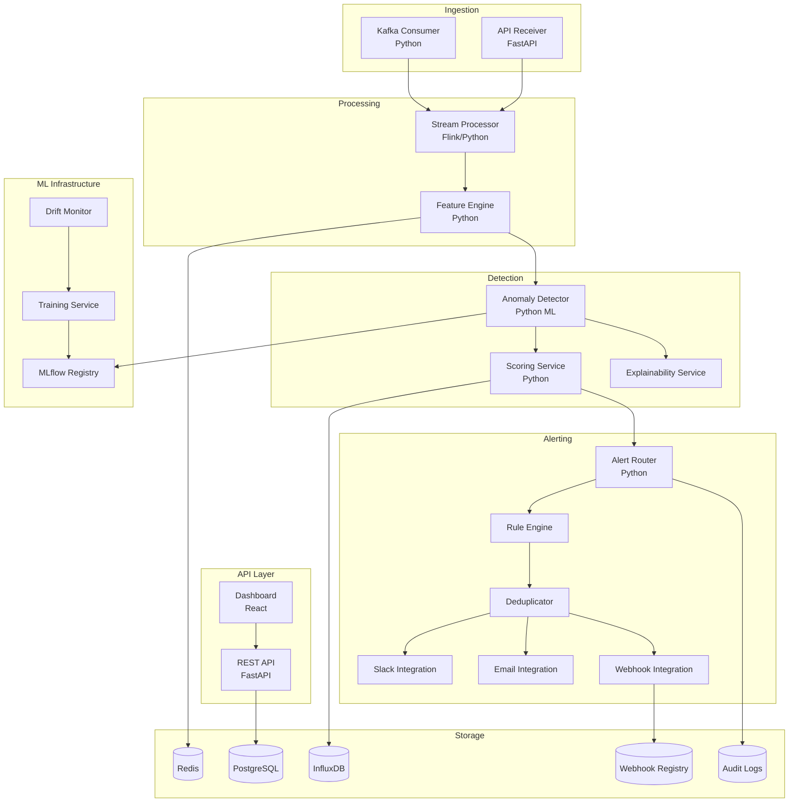

# Component Diagram - Anomaly Detection System

```mermaid
graph TB
    subgraph "API Layer"
        API[REST API<br/>FastAPI]
        DASH[Dashboard<br/>React]
    end
    
    subgraph "Ingestion"
        KAFKA_CONS[Kafka Consumer<br/>Python]
        API_RECV[API Receiver<br/>FastAPI]
    end
    
    subgraph "Processing"
        STREAM[Stream Processor<br/>Flink/Python]
        FEATURE[Feature Engine<br/>Python]
    end
    
    subgraph "Detection"
        DETECTOR[Anomaly Detector<br/>Python ML]
        SCORER[Scoring Service<br/>Python]
        EXPLAIN[Explainability Service]
    end
    
    subgraph "Alerting"
        ROUTER[Alert Router<br/>Python]
        RULES[Rule Engine]
        DEDUP[Deduplicator]
        SLACK_INT[Slack Integration]
        EMAIL_INT[Email Integration]
        WEBHOOK_INT[Webhook Integration]
    end
    
    subgraph "Storage"
        INFLUX[(InfluxDB)]
        PG[(PostgreSQL)]
        REDIS[(Redis)]
        AUDIT[(Audit Logs)]
        WH_REG[(Webhook Registry)]
    end
    
    subgraph "ML Infrastructure"
        MLFLOW[MLflow Registry]
        TRAINER[Training Service]
        MONITOR[Drift Monitor]
    end
    
    KAFKA_CONS --> STREAM
    API_RECV --> STREAM
    STREAM --> FEATURE
    FEATURE --> REDIS
    FEATURE --> DETECTOR
    
    DETECTOR --> MLFLOW
    DETECTOR --> SCORER
    DETECTOR --> EXPLAIN
    SCORER --> INFLUX
    SCORER --> ROUTER
    
    ROUTER --> RULES
    RULES --> DEDUP
    DEDUP --> SLACK_INT
    DEDUP --> EMAIL_INT
    DEDUP --> WEBHOOK_INT
    
    TRAINER --> MLFLOW
    MONITOR --> TRAINER
    API --> PG
    DASH --> API
    ROUTER --> AUDIT
    WEBHOOK_INT --> WH_REG
```

## Component Responsibilities

| Component | Technology | Purpose |
|-----------|------------|---------|
| Kafka Consumer | Python | Consume data streams |
| Stream Processor | Flink/Python | Process streaming data |
| Feature Engine | Python | Compute features |
| Anomaly Detector | scikit-learn, TF | ML inference |
| Alert Router | Python | Route alerts to channels |
| Rule Engine | Python | Match alert rules |
| Deduplicator | Python | Suppress duplicate alerts |
| Training Service | Python, MLflow | Train ML models |
| Drift Monitor | Python | Detect data/model drift |
| InfluxDB | Time-Series | Store metrics and anomalies |
| PostgreSQL | Database | Store metadata, config |
| Redis | Cache | Cache features, recent data |
| Audit Logs | Database | Compliance event records |

## Purpose and Scope
Defines internal components and interactions within detection service boundary.

## Assumptions and Constraints
- Components communicate through clear interfaces and avoid shared mutable state.
- Resilience patterns (retry/circuit breaker) are owned at boundary components.
- Component ownership maps to team ownership.

### End-to-End Example with Realistic Data
`SchemaValidator` -> `EnrichmentAdapter` -> `ScoringAdapter` -> `DecisionPublisher`; malformed event `evt_bad_01` is diverted to DLQ with producer tag and validation code.

## Decision Rationale and Alternatives Considered
- Placed validation at ingress to fail fast and protect downstream capacity.
- Rejected central mega-component to preserve testability and fault isolation.
- Added audit writer as dedicated component to keep evidence immutable.

## Failure Modes and Recovery Behaviors
- Enrichment adapter timeout -> component returns partial profile + risk flag.
- Decision publisher failure -> local outbox persists event for retry.

## Security and Compliance Implications
- Component interfaces define allowed data classes and redaction obligations.
- Secrets access is isolated to specific adapters only.

## Operational Runbooks and Observability Notes
- Component dependency graph is used for blast-radius during incidents.
- Runbook maps alerts directly to component owner and mitigation steps.
