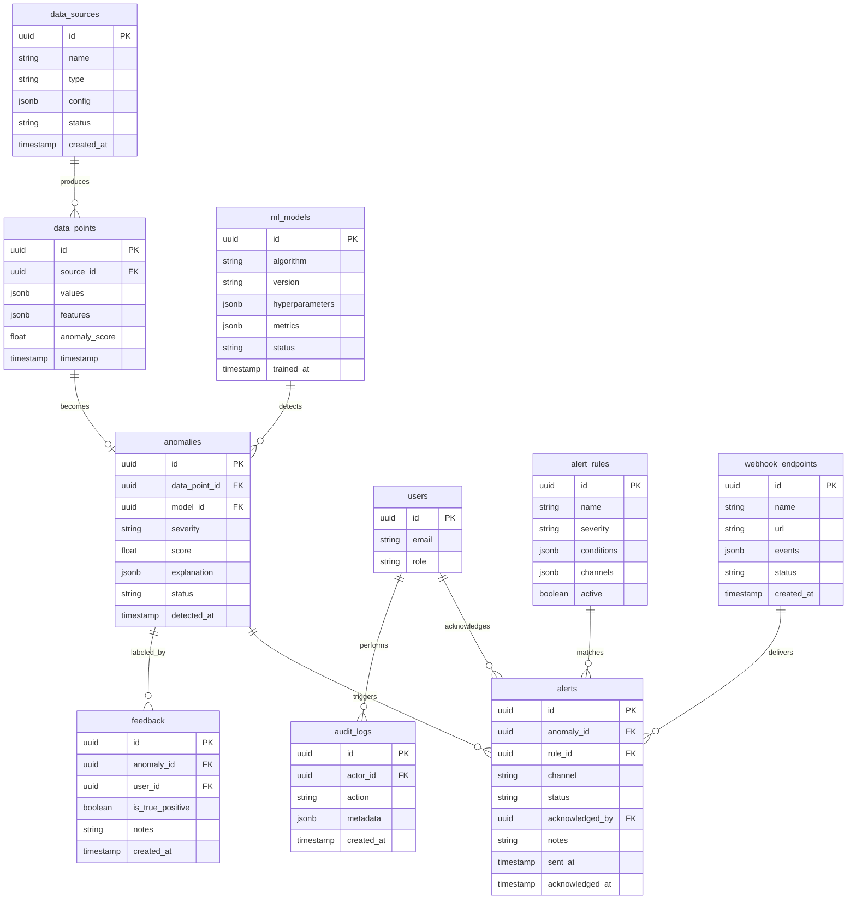

# ERD / Database Schema - Anomaly Detection System


```mermaid
erDiagram
    data_sources ||--o{ data_points : produces
    data_points ||--o| anomalies : becomes
    anomalies ||--o{ alerts : triggers
    ml_models ||--o{ anomalies : detects
    users ||--o{ alerts : acknowledges
    alert_rules ||--o{ alerts : matches
    anomalies ||--o{ feedback : labeled_by
    webhook_endpoints ||--o{ alerts : delivers
    users ||--o{ audit_logs : performs
    
    data_sources {
        uuid id PK
        string name
        string type
        jsonb config
        string status
        timestamp created_at
    }
    
    data_points {
        uuid id PK
        uuid source_id FK
        jsonb values
        jsonb features
        float anomaly_score
        timestamp timestamp
    }
    
    anomalies {
        uuid id PK
        uuid data_point_id FK
        uuid model_id FK
        string severity
        float score
        jsonb explanation
        string status
        timestamp detected_at
    }
    
    ml_models {
        uuid id PK
        string algorithm
        string version
        jsonb hyperparameters
        jsonb metrics
        string status
        timestamp trained_at
    }
    
    alerts {
        uuid id PK
        uuid anomaly_id FK
        uuid rule_id FK
        string channel
        string status
        uuid acknowledged_by FK
        string notes
        timestamp sent_at
        timestamp acknowledged_at
    }
    
    alert_rules {
        uuid id PK
        string name
        string severity
        jsonb conditions
        jsonb channels
        boolean active
    }
    
    users {
        uuid id PK
        string email
        string role
    }
    
    feedback {
        uuid id PK
        uuid anomaly_id FK
        uuid user_id FK
        boolean is_true_positive
        string notes
        timestamp created_at
    }

    webhook_endpoints {
        uuid id PK
        string name
        string url
        jsonb events
        string status
        timestamp created_at
    }

    audit_logs {
        uuid id PK
        uuid actor_id FK
        string action
        jsonb metadata
        timestamp created_at
    }
```

## Table Definitions

### data_points (Time-Series - InfluxDB)
```sql
-- InfluxDB measurement
-- Tags: source_id, metric_name
-- Fields: value, anomaly_score
-- Timestamp: timestamp
```

### anomalies
```sql
CREATE TABLE anomalies (
    id UUID PRIMARY KEY DEFAULT gen_random_uuid(),
    data_point_id UUID NOT NULL,
    model_id UUID REFERENCES ml_models(id),
    severity VARCHAR(20) NOT NULL,  -- 'low', 'medium', 'high', 'critical'
    score FLOAT NOT NULL,
    explanation JSONB,
    status VARCHAR(20) DEFAULT 'detected',
    detected_at TIMESTAMP DEFAULT NOW(),
    INDEX idx_severity_time (severity, detected_at DESC),
    INDEX idx_status (status)
);
```

### alerts
```sql
CREATE TABLE alerts (
    id UUID PRIMARY KEY DEFAULT gen_random_uuid(),
    anomaly_id UUID NOT NULL REFERENCES anomalies(id),
    rule_id UUID REFERENCES alert_rules(id),
    channel VARCHAR(50) NOT NULL,  -- 'email', 'slack', 'webhook'
    status VARCHAR(20) DEFAULT 'pending',
    acknowledged_by UUID REFERENCES users(id),
    notes TEXT,
    sent_at TIMESTAMP,
    acknowledged_at TIMESTAMP,
    INDEX idx_status_time (status, sent_at DESC)
);
```

### ml_models
```sql
CREATE TABLE ml_models (
    id UUID PRIMARY KEY DEFAULT gen_random_uuid(),
    algorithm VARCHAR(100) NOT NULL,
    version VARCHAR(50) NOT NULL,
    hyperparameters JSONB,
    metrics JSONB,  -- {precision, recall, f1, auc}
    status VARCHAR(20) DEFAULT 'training',
    trained_at TIMESTAMP DEFAULT NOW(),
    UNIQUE(algorithm, version)
);
```

### webhook_endpoints
```sql
CREATE TABLE webhook_endpoints (
    id UUID PRIMARY KEY DEFAULT gen_random_uuid(),
    name VARCHAR(100) NOT NULL,
    url TEXT NOT NULL,
    events JSONB NOT NULL,
    status VARCHAR(20) DEFAULT 'active',
    created_at TIMESTAMP DEFAULT NOW()
);
```

### audit_logs
```sql
CREATE TABLE audit_logs (
    id UUID PRIMARY KEY DEFAULT gen_random_uuid(),
    actor_id UUID REFERENCES users(id),
    action VARCHAR(100) NOT NULL,
    metadata JSONB,
    created_at TIMESTAMP DEFAULT NOW()
);
```

## Enum Definitions

| Enum | Values |
|------|--------|
| severity | low, medium, high, critical |
| anomaly_status | detected, acknowledged, resolved, false_positive |
| alert_status | pending, sent, acknowledged, escalated, resolved |
| model_status | training, evaluating, registered, production, deprecated |
| channel_type | email, slack, pagerduty, webhook |

## Purpose and Scope
Defines physical schema, relationships, indexes, partitioning, and data-retention behaviors.

## Assumptions and Constraints
- Write-heavy event tables are time-partitioned.
- Foreign keys enforce case-event-audit integrity.
- Migrations are backward compatible and reversible.

### End-to-End Example with Realistic Data
`anomaly_event(evt_77123)` references `detection_case(CASE-99231)`; `case_audit` stores immutable action log with actor and timestamp. Partitions rotate daily with 400-day hot retention.

## Decision Rationale and Alternatives Considered
- Normalized core entities to guarantee referential integrity.
- Rejected denormalized audit writes due forensic incompleteness risk.
- Added selective indexes for analyst search patterns.

## Failure Modes and Recovery Behaviors
- Migration introduces lock contention -> use online migration plan and phased index build.
- Partition prune failure -> emergency retention job and query guardrails.

## Security and Compliance Implications
- Column-level encryption for sensitive evidence fields.
- DB roles separate read-only analytics from write-capable workflows.

## Operational Runbooks and Observability Notes
- DB dashboards track query latency, bloat, dead tuples, and replication lag.
- Runbook defines point-in-time restore and data-consistency verification.
