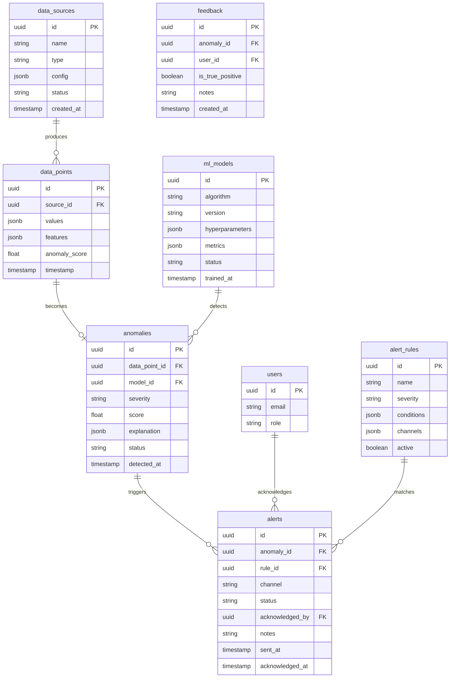

# ERD / Database Schema - Anomaly Detection System



## Table Definitions

### data_points (Time-Series - InfluxDB)
```sql
-- InfluxDB measurement
-- Tags: source_id, metric_name
-- Fields: value, anomaly_score
-- Timestamp: timestamp
```

### anomalies
```sql
CREATE TABLE anomalies (
    id UUID PRIMARY KEY DEFAULT gen_random_uuid(),
    data_point_id UUID NOT NULL,
    model_id UUID REFERENCES ml_models(id),
    severity VARCHAR(20) NOT NULL,  -- 'low', 'medium', 'high', 'critical'
    score FLOAT NOT NULL,
    explanation JSONB,
    status VARCHAR(20) DEFAULT 'detected',
    detected_at TIMESTAMP DEFAULT NOW(),
    INDEX idx_severity_time (severity, detected_at DESC),
    INDEX idx_status (status)
);
```

### alerts
```sql
CREATE TABLE alerts (
    id UUID PRIMARY KEY DEFAULT gen_random_uuid(),
    anomaly_id UUID NOT NULL REFERENCES anomalies(id),
    rule_id UUID REFERENCES alert_rules(id),
    channel VARCHAR(50) NOT NULL,  -- 'email', 'slack', 'webhook'
    status VARCHAR(20) DEFAULT 'pending',
    acknowledged_by UUID REFERENCES users(id),
    notes TEXT,
    sent_at TIMESTAMP,
    acknowledged_at TIMESTAMP,
    INDEX idx_status_time (status, sent_at DESC)
);
```

### ml_models
```sql
CREATE TABLE ml_models (
    id UUID PRIMARY KEY DEFAULT gen_random_uuid(),
    algorithm VARCHAR(100) NOT NULL,
    version VARCHAR(50) NOT NULL,
    hyperparameters JSONB,
    metrics JSONB,  -- {precision, recall, f1, auc}
    status VARCHAR(20) DEFAULT 'training',
    trained_at TIMESTAMP DEFAULT NOW(),
    UNIQUE(algorithm, version)
);
```

## Enum Definitions

| Enum | Values |
|------|--------|
| severity | low, medium, high, critical |
| anomaly_status | detected, acknowledged, resolved, false_positive |
| alert_status | pending, sent, acknowledged, escalated, resolved |
| model_status | training, evaluating, registered, production, deprecated |
| channel_type | email, slack, pagerduty, webhook |
