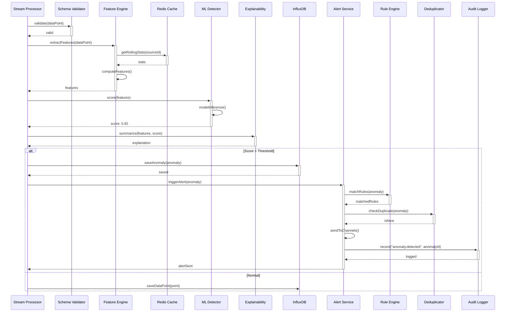
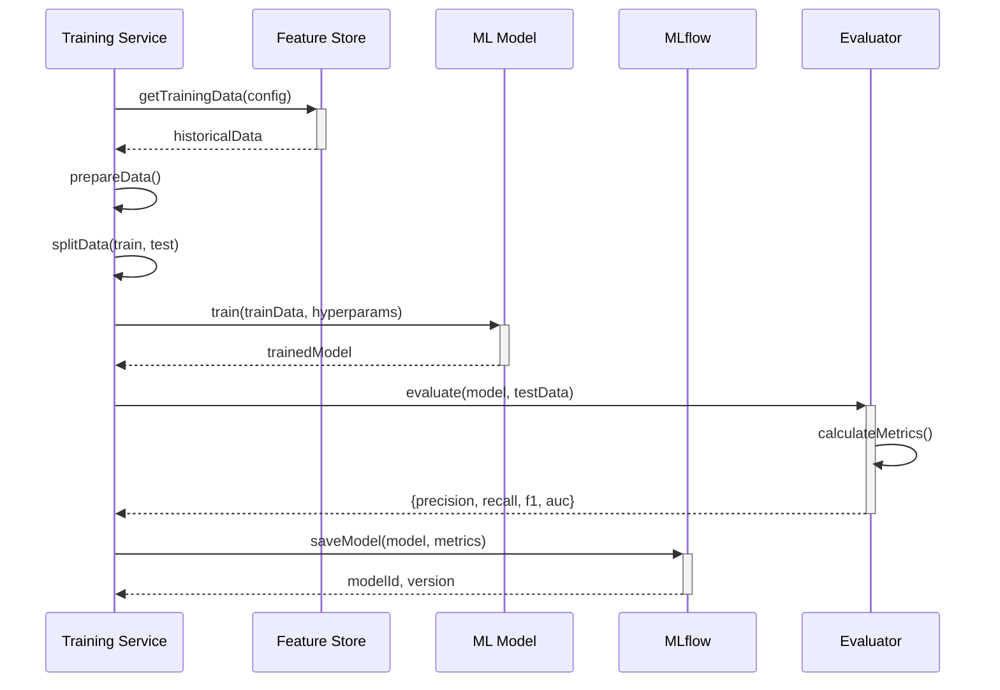
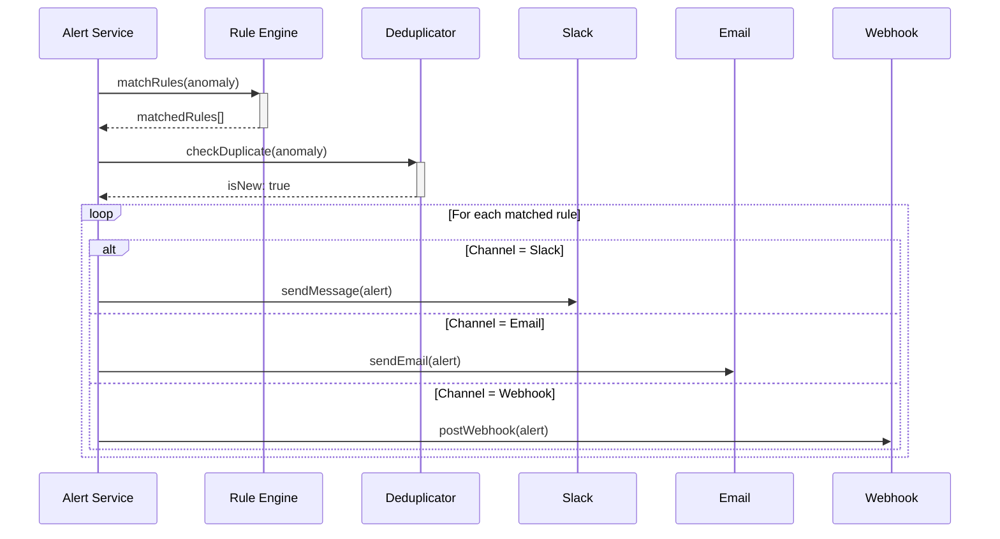
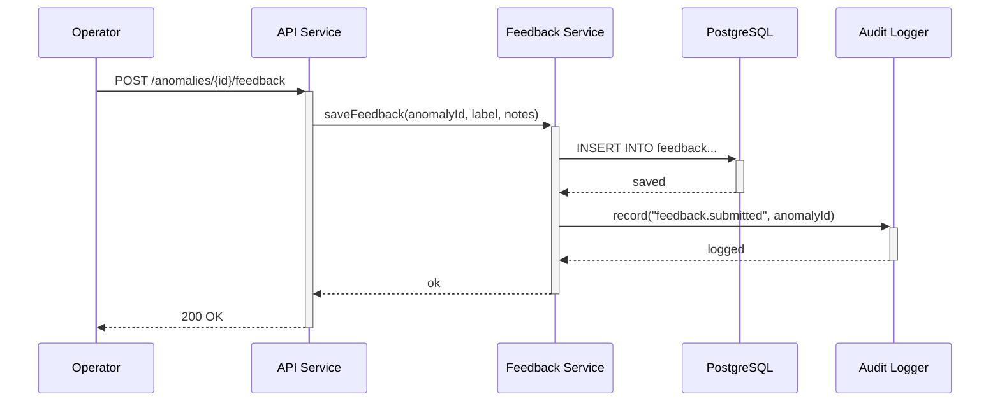

# Sequence Diagram - Anomaly Detection System

## SD-01: Real-Time Detection

## SD-02: Model Training

## SD-03: Alert Routing

## SD-04: Submit Feedback Label

## Purpose and Scope
Provides method-level interaction timing and retry boundaries for detailed execution path.

## Assumptions and Constraints
- Each call has explicit timeout/retry policy.
- Fallback path is non-blocking for primary case creation.
- Correlation context survives retries and async hops.

### End-to-End Example with Realistic Data
Model RPC timeout at 120 ms triggers fallback scorer call (40 ms budget), response marked degraded, and async enrichment scheduled for later evidence expansion.

## Decision Rationale and Alternatives Considered
- Kept retries near callers to localize failure handling.
- Rejected deep nested sync chains that increase tail latency.
- Included outbox pattern for reliable downstream publication.

## Failure Modes and Recovery Behaviors
- Retry storm risk -> exponential backoff and jitter at caller boundary.
- Fallback scorer unavailable -> escalate to manual review queue with reason code.

## Security and Compliance Implications
- Sequence includes token propagation and least-privilege service identities.
- Sensitive attributes excluded from non-essential calls.

## Operational Runbooks and Observability Notes
- Span timing histogram tied to diagram step names for quick diagnosis.
- Runbook includes per-call synthetic probe commands.
