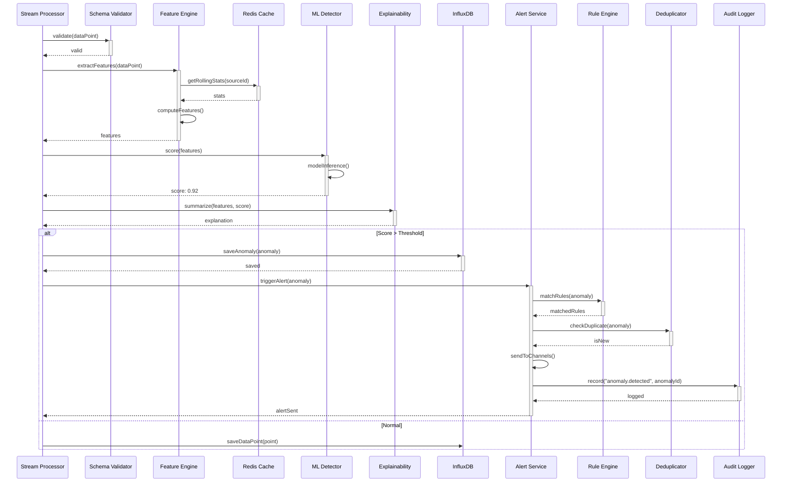
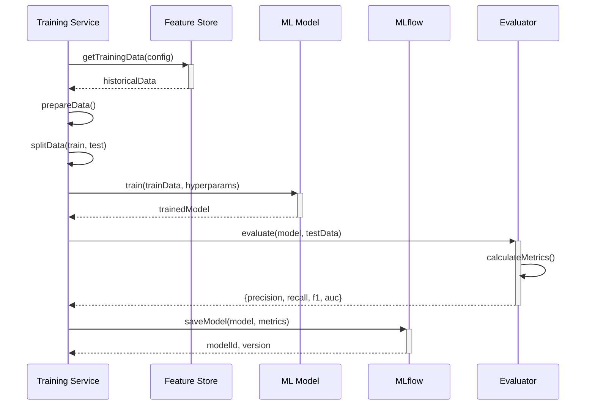
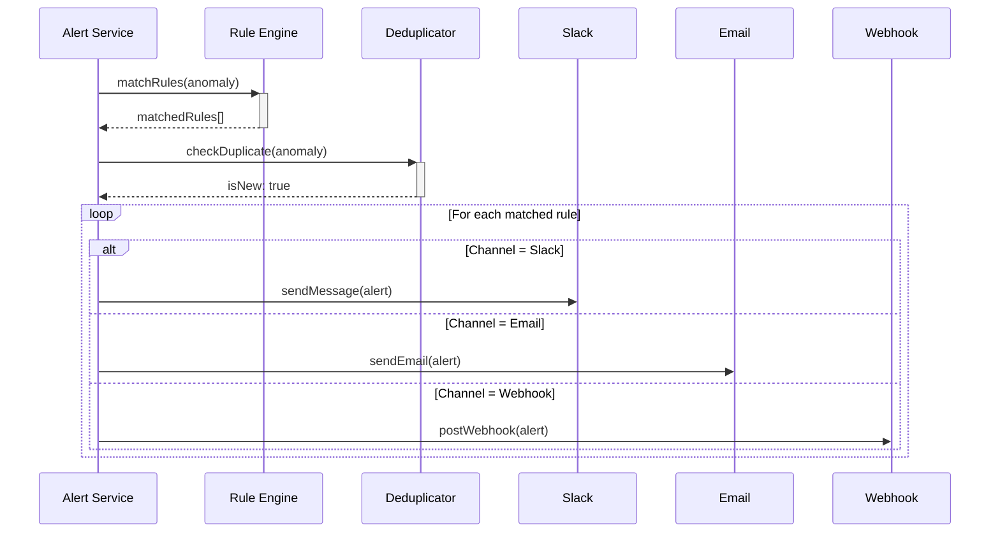
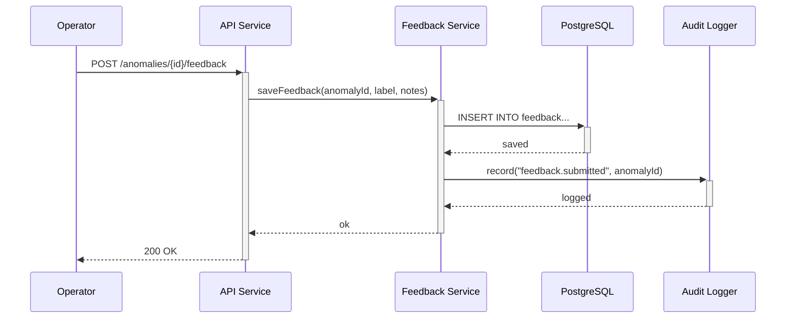

# Sequence Diagram - Anomaly Detection System

## SD-01: Real-Time Detection

```mermaid
sequenceDiagram
    participant Stream as Stream Processor
    participant Validator as Schema Validator
    participant Feature as Feature Engine
    participant Cache as Redis Cache
    participant Detector as ML Detector
    participant Explain as Explainability
    participant DB as InfluxDB
    participant Alert as Alert Service
    participant Rules as Rule Engine
    participant Dedup as Deduplicator
    participant Audit as Audit Logger
    
    Stream->>+Validator: validate(dataPoint)
    Validator-->>-Stream: valid
    Stream->>+Feature: extractFeatures(dataPoint)
    Feature->>+Cache: getRollingStats(sourceId)
    Cache-->>-Feature: stats
    Feature->>Feature: computeFeatures()
    Feature-->>-Stream: features
    
    Stream->>+Detector: score(features)
    Detector->>Detector: modelInference()
    Detector-->>-Stream: score: 0.92
    Stream->>+Explain: summarize(features, score)
    Explain-->>-Stream: explanation
    
    alt Score > Threshold
        Stream->>+DB: saveAnomaly(anomaly)
        DB-->>-Stream: saved
        Stream->>+Alert: triggerAlert(anomaly)
        Alert->>+Rules: matchRules(anomaly)
        Rules-->>-Alert: matchedRules
        Alert->>+Dedup: checkDuplicate(anomaly)
        Dedup-->>-Alert: isNew
        Alert->>Alert: sendToChannels()
        Alert->>+Audit: record("anomaly.detected", anomalyId)
        Audit-->>-Alert: logged
        Alert-->>-Stream: alertSent
    else Normal
        Stream->>DB: saveDataPoint(point)
    end
```

## SD-02: Model Training

```mermaid
sequenceDiagram
    participant Trainer as Training Service
    participant Store as Feature Store
    participant Model as ML Model
    participant Registry as MLflow
    participant Eval as Evaluator
    
    Trainer->>+Store: getTrainingData(config)
    Store-->>-Trainer: historicalData
    
    Trainer->>Trainer: prepareData()
    Trainer->>Trainer: splitData(train, test)
    
    Trainer->>+Model: train(trainData, hyperparams)
    Model-->>-Trainer: trainedModel
    
    Trainer->>+Eval: evaluate(model, testData)
    Eval->>Eval: calculateMetrics()
    Eval-->>-Trainer: {precision, recall, f1, auc}
    
    Trainer->>+Registry: saveModel(model, metrics)
    Registry-->>-Trainer: modelId, version
```

## SD-03: Alert Routing

```mermaid
sequenceDiagram
    participant Alert as Alert Service
    participant Rules as Rule Engine
    participant Dedup as Deduplicator
    participant Slack
    participant Email
    participant Webhook
    
    Alert->>+Rules: matchRules(anomaly)
    Rules-->>-Alert: matchedRules[]
    
    Alert->>+Dedup: checkDuplicate(anomaly)
    Dedup-->>-Alert: isNew: true
    
    loop For each matched rule
        alt Channel = Slack
            Alert->>Slack: sendMessage(alert)
        else Channel = Email
            Alert->>Email: sendEmail(alert)
        else Channel = Webhook
            Alert->>Webhook: postWebhook(alert)
        end
    end
```

## SD-04: Submit Feedback Label

```mermaid
sequenceDiagram
    participant U as Operator
    participant API as API Service
    participant FB as Feedback Service
    participant DB as PostgreSQL
    participant Audit as Audit Logger
    
    U->>+API: POST /anomalies/{id}/feedback
    API->>+FB: saveFeedback(anomalyId, label, notes)
    FB->>+DB: INSERT INTO feedback...
    DB-->>-FB: saved
    FB->>+Audit: record("feedback.submitted", anomalyId)
    Audit-->>-FB: logged
    FB-->>-API: ok
    API-->>-U: 200 OK
```
