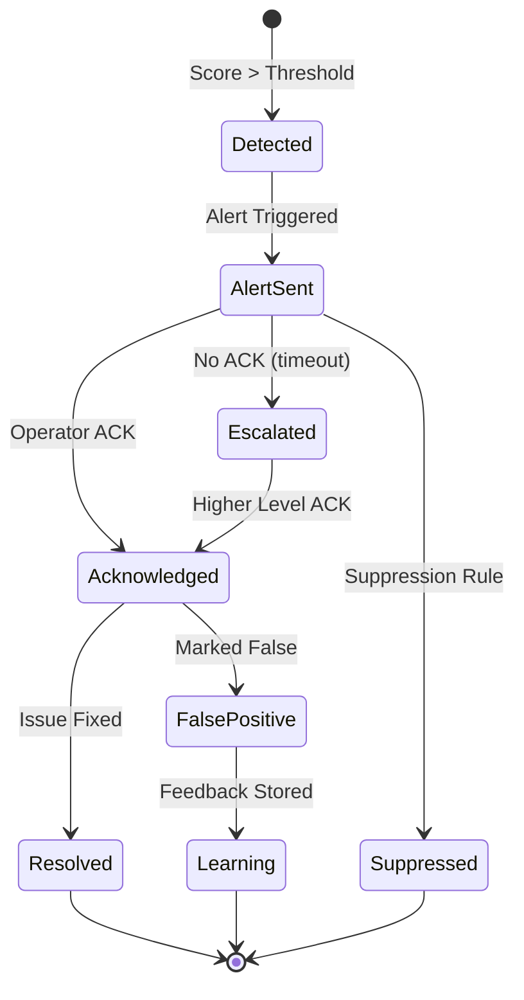
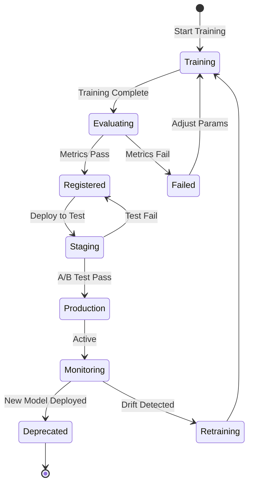
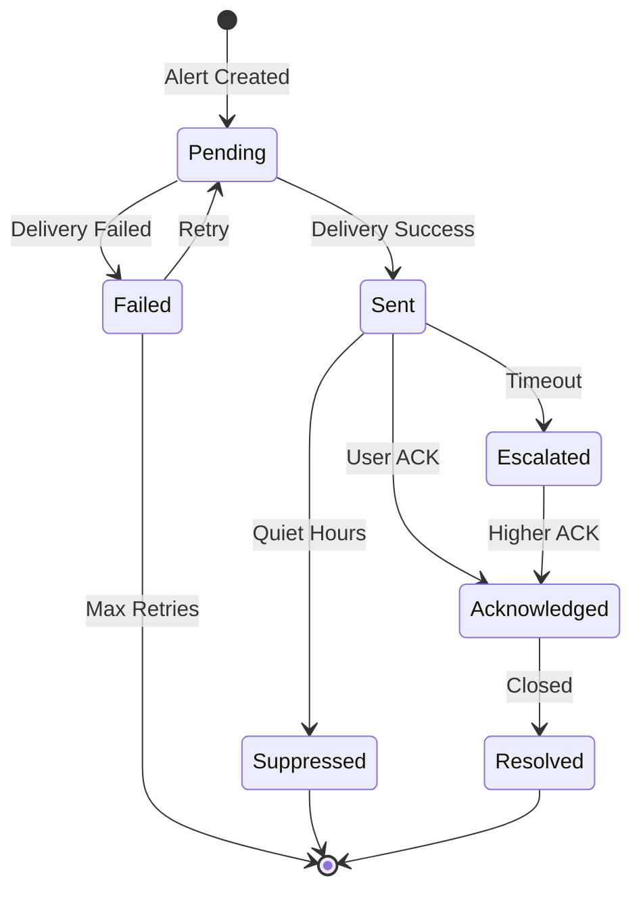
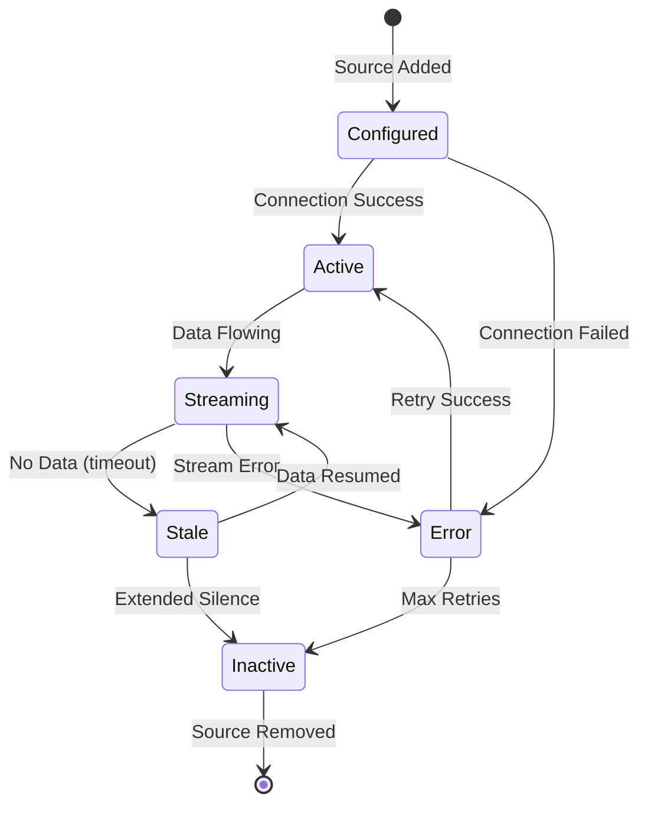

# State Machine Diagram - Anomaly Detection System

## 1. Anomaly Lifecycle

```mermaid
stateDiagram-v2
    [*] --> Detected: Score > Threshold
    Detected --> AlertSent: Alert Triggered
    AlertSent --> Acknowledged: Operator ACK
    AlertSent --> Escalated: No ACK (timeout)
    AlertSent --> Suppressed: Suppression Rule
    
    Acknowledged --> Resolved: Issue Fixed
    Acknowledged --> FalsePositive: Marked False
    Escalated --> Acknowledged: Higher Level ACK
    
    Resolved --> [*]
    FalsePositive --> Learning: Feedback Stored
    Learning --> [*]
    Suppressed --> [*]
```

## 2. ML Model Lifecycle

```mermaid
stateDiagram-v2
    [*] --> Training: Start Training
    Training --> Evaluating: Training Complete
    Evaluating --> Registered: Metrics Pass
    Evaluating --> Failed: Metrics Fail
    
    Failed --> Training: Adjust Params
    
    Registered --> Staging: Deploy to Test
    Staging --> Production: A/B Test Pass
    Staging --> Registered: Test Fail
    
    Production --> Monitoring: Active
    Monitoring --> Deprecated: New Model Deployed
    Monitoring --> Retraining: Drift Detected
    
    Retraining --> Training
    Deprecated --> [*]
```

## 3. Alert Status

```mermaid
stateDiagram-v2
    [*] --> Pending: Alert Created
    Pending --> Sent: Delivery Success
    Pending --> Failed: Delivery Failed
    
    Failed --> Pending: Retry
    Failed --> [*]: Max Retries
    
    Sent --> Acknowledged: User ACK
    Sent --> Escalated: Timeout
    Sent --> Suppressed: Quiet Hours
    
    Acknowledged --> Resolved: Closed
    Escalated --> Acknowledged: Higher ACK
    Suppressed --> [*]
    
    Resolved --> [*]
```

## 4. Data Source Status

```mermaid
stateDiagram-v2
    [*] --> Configured: Source Added
    Configured --> Active: Connection Success
    Configured --> Error: Connection Failed
    
    Active --> Streaming: Data Flowing
    Streaming --> Stale: No Data (timeout)
    Streaming --> Error: Stream Error
    
    Stale --> Streaming: Data Resumed
    Stale --> Inactive: Extended Silence
    
    Error --> Active: Retry Success
    Error --> Inactive: Max Retries
    
    Inactive --> [*]: Source Removed
```
