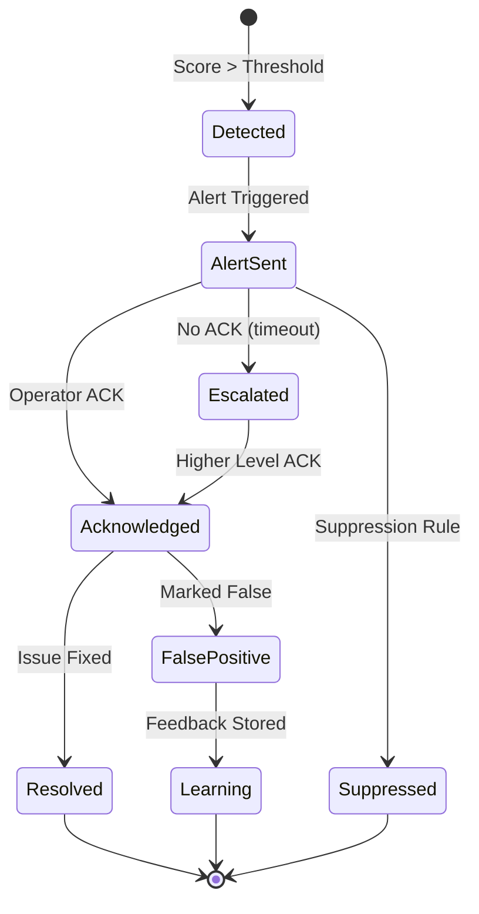
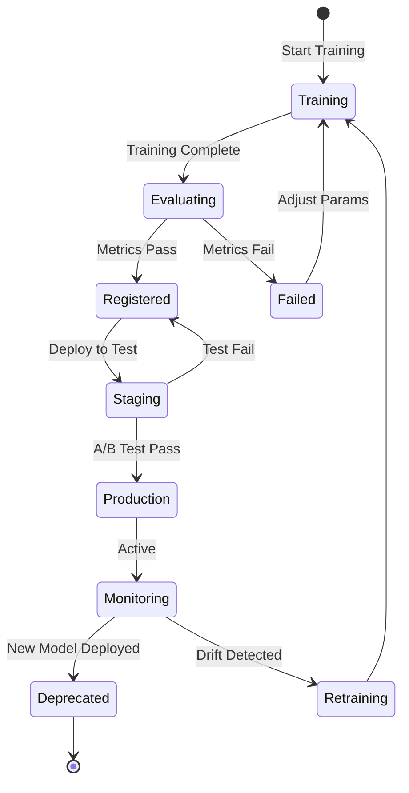
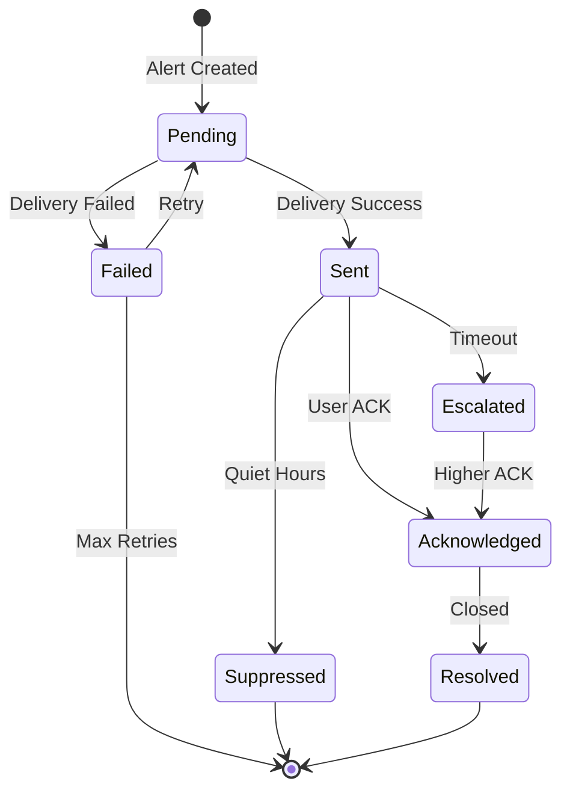
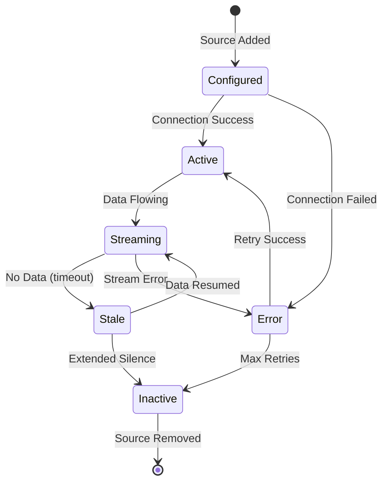

# State Machine Diagram - Anomaly Detection System

## 1. Anomaly Lifecycle

## 2. ML Model Lifecycle

## 3. Alert Status

## 4. Data Source Status

## Purpose and Scope
Defines alert and case state transitions, timers, and forbidden paths.

## Assumptions and Constraints
- All transitions are event-driven and auditable.
- Timer events are persisted and replay-safe.
- Forbidden transitions are enforced in code and DB constraints.

### End-to-End Example with Realistic Data
`AL-8831` transitions `New->Triaged->Investigating->Resolved`; if no action for 15 minutes, timer emits `Escalate` leading to `Escalated` state and on-call page.

## Decision Rationale and Alternatives Considered
- Modeled reopen path explicitly to avoid ad-hoc manual edits.
- Rejected implicit “any-to-any” transitions due audit risk.
- Added timeout-triggered escalation for operational safety.

## Failure Modes and Recovery Behaviors
- Timer service delay -> reconciliation worker replays pending timers from durable store.
- Out-of-order transition event -> ignored with conflict audit entry.

## Security and Compliance Implications
- State changes that expose evidence require privileged role check.
- All transition events include actor/service identity.

## Operational Runbooks and Observability Notes
- State stuck-duration metric alerts workflow owner.
- Runbook includes manual transition repair with audit annotation.
