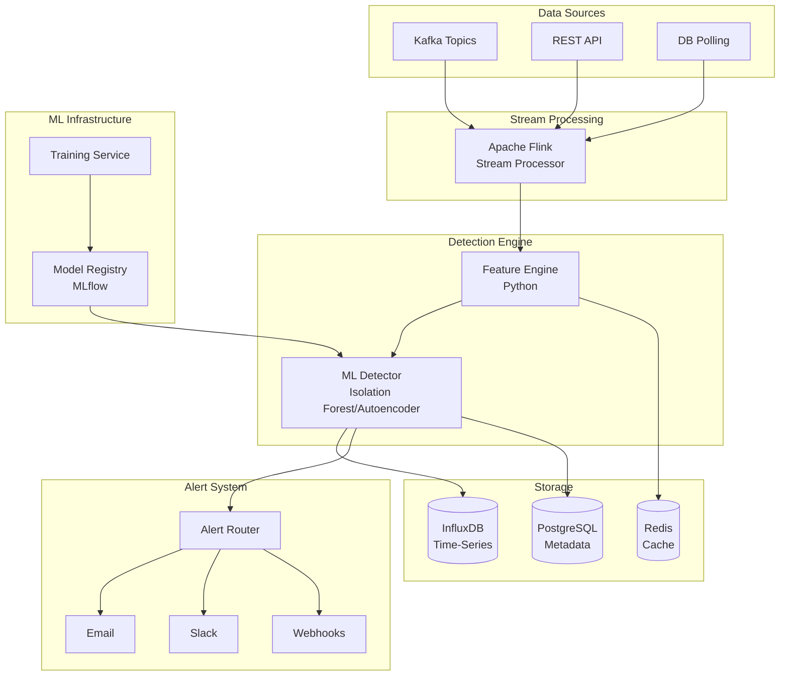

# Architecture Diagram - Anomaly Detection System

## Stream Processing Architecture



## Layered Architecture

```
┌─────────────────────────────────────────┐
│      Presentation Layer                 │
│  (Dashboard, REST API)                  │
└───────────────┬─────────────────────────┘
                │
┌───────────────▼─────────────────────────┐
│      Processing Layer                   │
│  (Stream Processing, Feature Eng)       │
└───────────────┬─────────────────────────┘
                │
┌───────────────▼─────────────────────────┐
│      Detection Layer                    │
│  (ML Models, Scoring, Thresholds)       │
└───────────────┬─────────────────────────┘
                │
┌───────────────▼─────────────────────────┐
│      Alert Layer                        │
│  (Routing, Channels, Escalation)        │
└───────────────┬─────────────────────────┘
                │
┌───────────────▼─────────────────────────┐
│      Data Layer                         │
│  (Time-Series DB, Metadata, Cache)      │
└─────────────────────────────────────────┘
```

## Technology Recommendations

| Component | Technology Options |
|-----------|-------------------|
| Stream Processing | Apache Flink, Kafka Streams, Spark Streaming |
| Detection | scikit-learn (Isolation Forest), TensorFlow (Autoencoder) |
| Time-Series DB | InfluxDB, TimescaleDB, Prometheus |
| API | FastAPI |
| Queue | Kafka, RabbitMQ |
| Alerting | PagerDuty, Slack, Custom webhooks |
