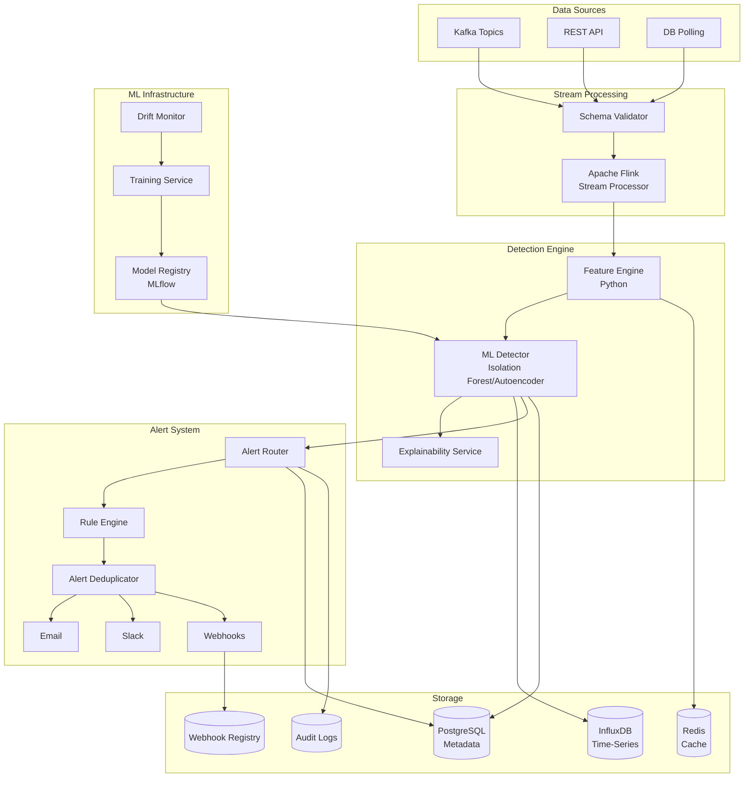

# Architecture Diagram - Anomaly Detection System

## Stream Processing Architecture


```mermaid
graph TB
    subgraph "Data Sources"
        KAFKA[Kafka Topics]
        API_IN[REST API]
        POLL[DB Polling]
    end
    
    subgraph "Stream Processing"
        FLINK[Apache Flink<br/>Stream Processor]
        VALIDATOR[Schema Validator]
    end
    
    subgraph "Detection Engine"
        FEATURE[Feature Engine<br/>Python]
        DETECTOR[ML Detector<br/>Isolation Forest/Autoencoder]
        EXPLAIN[Explainability Service]
    end
    
    subgraph "Alert System"
        ROUTER[Alert Router]
        RULES[Rule Engine]
        DEDUP[Alert Deduplicator]
        EMAIL[Email]
        SLACK[Slack]
        WEBHOOK[Webhooks]
    end
    
    subgraph "Storage"
        TS_DB[(InfluxDB<br/>Time-Series)]
        PG[(PostgreSQL<br/>Metadata)]
        REDIS[(Redis<br/>Cache)]
        AUDIT[(Audit Logs)]
        WH_REG[(Webhook Registry)]
    end
    
    subgraph "ML Infrastructure"
        REGISTRY[Model Registry<br/>MLflow]
        TRAINING[Training Service]
        MONITOR[Drift Monitor]
    end
    
    KAFKA --> VALIDATOR
    API_IN --> VALIDATOR
    POLL --> VALIDATOR
    VALIDATOR --> FLINK
    
    FLINK --> FEATURE
    FEATURE --> DETECTOR
    DETECTOR --> EXPLAIN
    DETECTOR --> TS_DB
    DETECTOR --> ROUTER
    
    ROUTER --> RULES
    RULES --> DEDUP
    DEDUP --> EMAIL
    DEDUP --> SLACK
    DEDUP --> WEBHOOK
    
    REGISTRY --> DETECTOR
    TRAINING --> REGISTRY
    MONITOR --> TRAINING
    
    DETECTOR --> PG
    FEATURE --> REDIS
    ROUTER --> PG
    ROUTER --> AUDIT
    WEBHOOK --> WH_REG
```

## Layered Architecture

```
┌─────────────────────────────────────────┐
│      Presentation Layer                 │
│  (Dashboard, REST API)                  │
└───────────────┬─────────────────────────┘
                │
┌───────────────▼─────────────────────────┐
│      Processing Layer                   │
│  (Stream Processing, Feature Eng)       │
└───────────────┬─────────────────────────┘
                │
┌───────────────▼─────────────────────────┐
│      Detection Layer                    │
│  (ML Models, Scoring, Thresholds)       │
└───────────────┬─────────────────────────┘
                │
┌───────────────▼─────────────────────────┐
│      Alert Layer                        │
│  (Routing, Channels, Escalation)        │
└───────────────┬─────────────────────────┘
                │
┌───────────────▼─────────────────────────┐
│      Data Layer                         │
│  (Time-Series DB, Metadata, Cache)      │
└─────────────────────────────────────────┘
```

## Technology Recommendations

| Component | Technology Options |
|-----------|-------------------|
| Stream Processing | Apache Flink, Kafka Streams, Spark Streaming |
| Detection | scikit-learn (Isolation Forest), TensorFlow (Autoencoder) |
| Time-Series DB | InfluxDB, TimescaleDB, Prometheus |
| API | FastAPI |
| Queue | Kafka, RabbitMQ |
| Alerting | PagerDuty, Slack, Custom webhooks |

## Purpose and Scope
Presents macro architecture of ingestion, feature, scoring, policy, case orchestration, and governance planes.

## Assumptions and Constraints
- Control plane and data plane are isolated with separate failure domains.
- Critical path dependencies have explicit latency budgets.
- Architecture supports tenant isolation and regional failover.

### End-to-End Example with Realistic Data
`AL-44021` path: ingress gateway -> stream bus -> online feature store -> scoring service -> policy engine -> case service -> alert fanout. Budget: 50+40+60+30+30 ms.

## Decision Rationale and Alternatives Considered
- Chose event-driven backbone to decouple ingestion and downstream consumers.
- Rejected synchronous enrichment on critical path due latency risk.
- Introduced dedicated governance plane for model audit and drift controls.

## Failure Modes and Recovery Behaviors
- Feature-store region degradation -> route read traffic to replica with stale tolerance policy.
- Case-service outage -> buffer decisions and reconcile once service restored.

## Security and Compliance Implications
- Trust zones are explicit between ingress, compute, and evidence storage.
- Architecture documents cryptographic boundary for audit-evidence writes.

## Operational Runbooks and Observability Notes
- Architecture-level SLO board aggregates service SLOs into business impact view.
- Runbook includes dependency isolation sequence for cascading failures.
