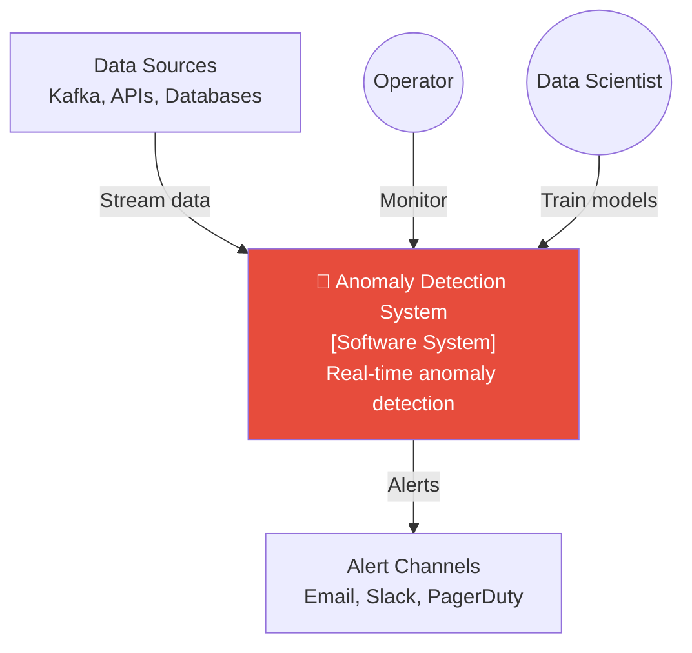
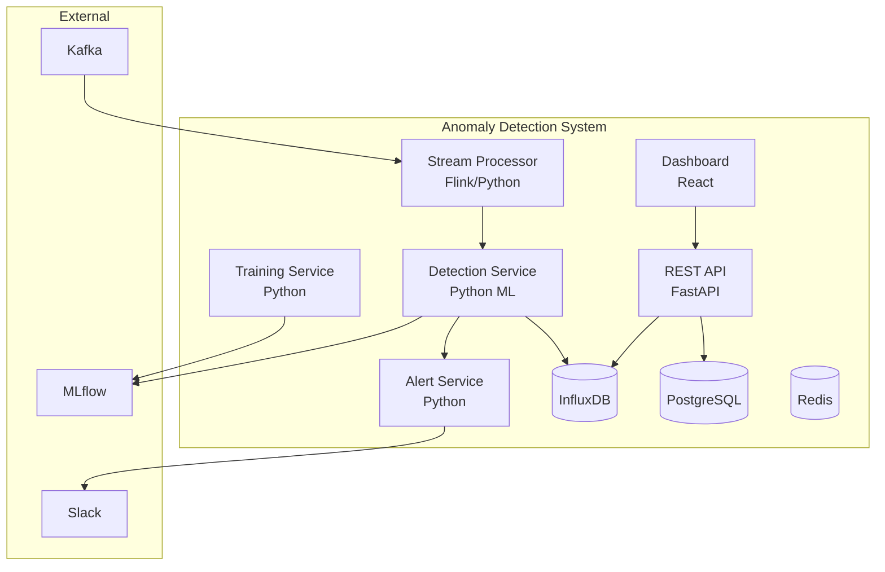

# C4 Context & Container - Anomaly Detection System

## Level 1: System Context

```mermaid
graph TB
    OP((Operator))
    DS((Data Scientist))
    
    ADS["🚨 Anomaly Detection System<br/>[Software System]<br/>Real-time anomaly detection"]
    
    SOURCES[Data Sources<br/>Kafka, APIs, Databases]
    ALERTS[Alert Channels<br/>Email, Slack, PagerDuty]
    
    SOURCES -->|Stream data| ADS
    ADS -->|Alerts| ALERTS
    OP -->|Monitor| ADS
    DS -->|Train models| ADS
    
    style ADS fill:#e74c3c,color:#fff
```

## Level 2: Container Diagram

```mermaid
graph TB
    subgraph "Anomaly Detection System"
        API[REST API<br/>FastAPI]
        DASH[Dashboard<br/>React]
        STREAM[Stream Processor<br/>Flink/Python]
        DETECTOR[Detection Service<br/>Python ML]
        ALERT_SVC[Alert Service<br/>Python]
        TRAINER[Training Service<br/>Python]
        
        TS_DB[(InfluxDB)]
        PG[(PostgreSQL)]
        REDIS[(Redis)]
    end
    
    subgraph "External"
        KAFKA[Kafka]
        REGISTRY[MLflow]
        SLACK[Slack]
    end
    
    KAFKA --> STREAM
    STREAM --> DETECTOR
    DETECTOR --> TS_DB
    DETECTOR --> ALERT_SVC
    ALERT_SVC --> SLACK
    
    TRAINER --> REGISTRY
    DETECTOR --> REGISTRY
    
    API --> PG
    API --> TS_DB
    DASH --> API
```

## Container Descriptions

| Container | Technology | Purpose |
|-----------|------------|---------|
| REST API | FastAPI | External API access |
| Dashboard | React | Real-time visualization |
| Stream Processor | Flink/Python | Process data streams |
| Detection Service | Python ML | Run anomaly detection |
| Alert Service | Python | Route and send alerts |
| Training Service | Python | Train ML models |
| InfluxDB | Time-Series DB | Store metrics and anomalies |
| PostgreSQL | Database | Store metadata, config |
| Redis | Cache | Feature caching |

## Purpose and Scope
Breaks context into deployable containers and interaction contracts.

## Assumptions and Constraints
- Each container has a single primary responsibility.
- Container interactions are observable via distributed tracing.
- State ownership is explicit to avoid split-brain writes.

### End-to-End Example with Realistic Data
`Real-time Scoring` container reads features from `Online Feature Store`, calls `Policy Engine`, emits decisions to `Case Orchestrator`; `Batch Trainer` consumes offline lake and never blocks online path.

## Decision Rationale and Alternatives Considered
- Container split mirrors team boundaries and scaling profiles.
- Rejected monolith because update cadence differs by domain module.
- Introduced adapter container for partner-specific protocol translation.

## Failure Modes and Recovery Behaviors
- Adapter container fails schema conversion -> message diverted to quarantine with partner-specific alert.
- Policy engine spike -> queue backpressure and graceful degradation policy.

## Security and Compliance Implications
- Container diagram marks secrets boundary and key-management scope per container.
- Inter-container auth method documented (service identity + mTLS).

## Operational Runbooks and Observability Notes
- Per-container RED metrics with ownership tags drive paging.
- Runbook includes container-level restart/rollback blast-radius guidance.
