# C4 Context & Container - Anomaly Detection System

## Level 1: System Context

```mermaid
graph TB
    OP((Operator))
    DS((Data Scientist))
    
    ADS["🚨 Anomaly Detection System<br/>[Software System]<br/>Real-time anomaly detection"]
    
    SOURCES[Data Sources<br/>Kafka, APIs, Databases]
    ALERTS[Alert Channels<br/>Email, Slack, PagerDuty]
    
    SOURCES -->|Stream data| ADS
    ADS -->|Alerts| ALERTS
    OP -->|Monitor| ADS
    DS -->|Train models| ADS
    
    style ADS fill:#e74c3c,color:#fff
```

## Level 2: Container Diagram

## Container Descriptions

| Container | Technology | Purpose |
|-----------|------------|---------|
| REST API | FastAPI | External API access |
| Dashboard | React | Real-time visualization |
| Stream Processor | Flink/Python | Process data streams |
| Detection Service | Python ML | Run anomaly detection |
| Alert Service | Python | Route and send alerts |
| Training Service | Python | Train ML models |
| InfluxDB | Time-Series DB | Store metrics and anomalies |
| PostgreSQL | Database | Store metadata, config |
| Redis | Cache | Feature caching |
