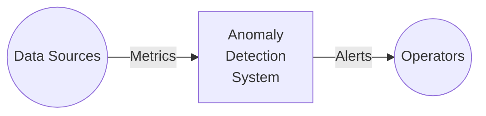
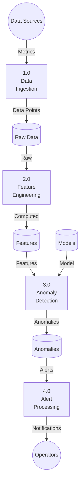
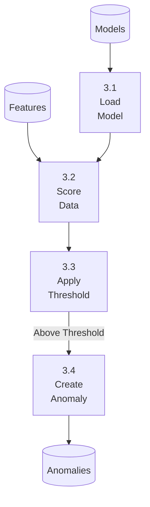

# Data Flow Diagram - Anomaly Detection System

## Level 0: Context

```mermaid
flowchart LR
    SOURCE((Data Sources)) -->|Metrics| ADS[Anomaly<br/>Detection<br/>System]
    ADS -->|Alerts| USERS((Operators))
```

## Level 1: Main Processes

```mermaid
flowchart TB
    SOURCE((Data Sources))
    USERS((Operators))
    
    P1[1.0<br/>Data<br/>Ingestion]
    P2[2.0<br/>Feature<br/>Engineering]
    P3[3.0<br/>Anomaly<br/>Detection]
    P4[4.0<br/>Alert<br/>Processing]
    
    D1[(Raw Data)]
    D2[(Features)]
    D3[(Anomalies)]
    D4[(Models)]
    
    SOURCE -->|Metrics| P1
    P1 -->|Data Points| D1
    D1 -->|Raw| P2
    P2 -->|Computed| D2
    D2 -->|Features| P3
    D4 -->|Model| P3
    P3 -->|Anomalies| D3
    D3 -->|Alerts| P4
    P4 -->|Notifications| USERS
```

## Level 2: Anomaly Detection (3.0)

```mermaid
flowchart TB
    P3_1[3.1<br/>Load<br/>Model]
    P3_2[3.2<br/>Score<br/>Data]
    P3_3[3.3<br/>Apply<br/>Threshold]
    P3_4[3.4<br/>Create<br/>Anomaly]
    
    D2[(Features)]
    D3[(Anomalies)]
    D4[(Models)]
    
    D2 --> P3_2
    D4 --> P3_1
    P3_1 --> P3_2
    P3_2 --> P3_3
    P3_3 -->|Above Threshold| P3_4
    P3_4 --> D3
```
