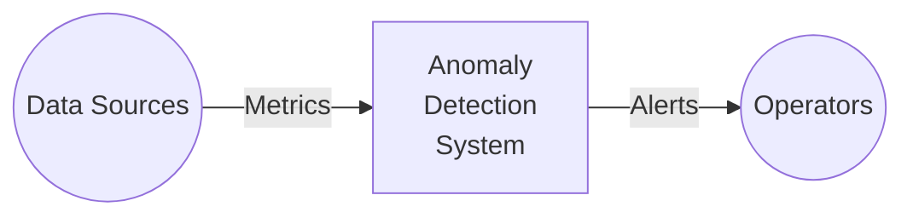
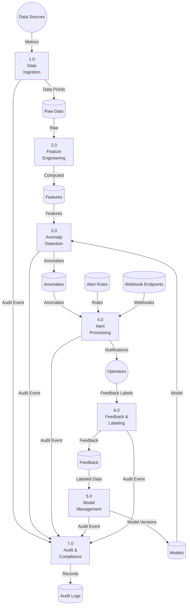
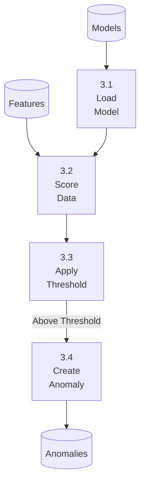

# Data Flow Diagram - Anomaly Detection System

## Level 0: Context

## Level 1: Main Processes

## Level 2: Anomaly Detection (3.0)

## Purpose and Scope
Describes data lineage, trust boundaries, and transformation stages from raw events to analyst-facing artifacts.

## Assumptions and Constraints
- Raw payload retention differs from derived feature retention.
- PII tokenization happens before model-serving zone.
- Every transform stage emits lineage metadata.

### End-to-End Example with Realistic Data
Raw event with `email`/`device_id` enters restricted zone, tokenization service outputs hashed IDs, feature builder computes aggregates, scoring consumes derived features only, case UI retrieves redacted evidence.

## Decision Rationale and Alternatives Considered
- Chose dual-zone data design for security and performance.
- Rejected direct UI access to raw data store.
- Lineage IDs propagated end-to-end for replay and audit.

## Failure Modes and Recovery Behaviors
- Tokenization service outage -> hold high-sensitivity flows; allow low-sensitivity flows with policy exceptions disabled.
- Lineage metadata loss -> block downstream promotion until restored.

## Security and Compliance Implications
- DFD annotates data-classification transitions at each edge.
- Retention/deletion obligations are attached to sink nodes.

## Operational Runbooks and Observability Notes
- Lineage completeness and tokenization error rate are on compliance dashboards.
- Runbook covers replay with lineage integrity checks.
